# PT06-US02 Commission Business E2E

Executed 2026-09-20T17:20:03.758Z. Result: **PASS (scoped cases only)**.

Sources: PT06-US02 Main Flow, AF-01/02/03, field specification and exceptions; Product Spec commission ownership/snapshot rules; QTV-W15-US02 MF7-9 for cash payout. Backend source-ready confirmed by user after Pascal validation.

Scope: own unpaid reconciliation, real QTV cash payout, PAID snapshot source mutations, legacy NULL warning, empty period, real SQL-induced API error/retry, missing config, forbidden APIs and two PTs/two branches. No source edits, shared DB writes, response mocks or full-US claim. Mesh inboxes read; receipt/skill/report-archive writes outside explicitly owned paths were not made.

## Source Action Verification

### 1. open-overview

- Action/Input: Click PT06 overview
- Expected Result: PT06-US02 Trigger: own commission card visible
- Actual Result: Thù lao & hoa hồng
Hoa hồng ước tính tháng này
80.000 VNĐ
Chờ chi trả
25% hoa hồng
- Status: **PASS**

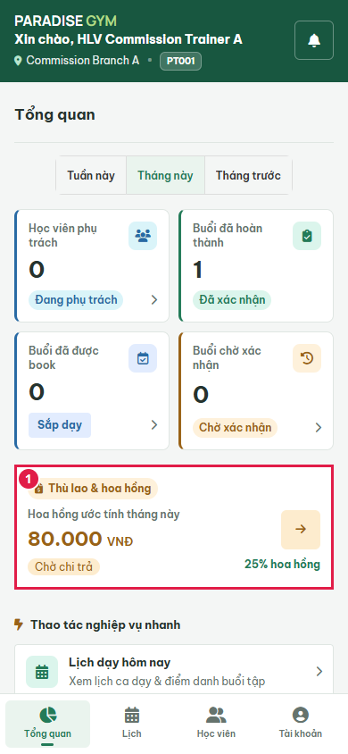

### 2. unpaid-summary

- Action/Input: Open current unpaid statement
- Expected Result: Main Flow 4 / reconciliation: two completed sessions, PT base 320000, commission 80000 at 25%; exclude Combo Gym 400000, cancelled/booked and other PT
- Actual Result: {"commTotalAmount":"80.000 VNĐ","commSessionsCount":"2 buổi","commBaseRevenue":"320.000 đ","commStatusBadge":"Chờ chi trả"}
- Status: **PASS**

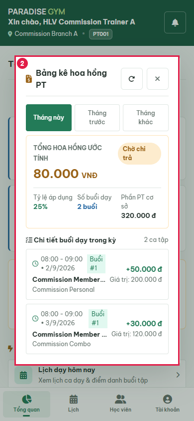

### 3. unpaid-session-details

- Action/Input: Inspect full two-row list
- Expected Result: Main Flow 5: same member, package, date/time, PT values and per-session commissions
- Actual Result: 08:00 - 09:00 • 2/9/2026
Buổi #1
Commission Member A (HV001)
Commission Personal
+50.000 đ
Giá trị: 200.000 đ
08:00 - 09:00 • 3/9/2026
Buổi #1
Commission Member A (HV001)
Commission Combo
+30.000 đ
Giá trị: 120.000 đ
- Status: **PASS**

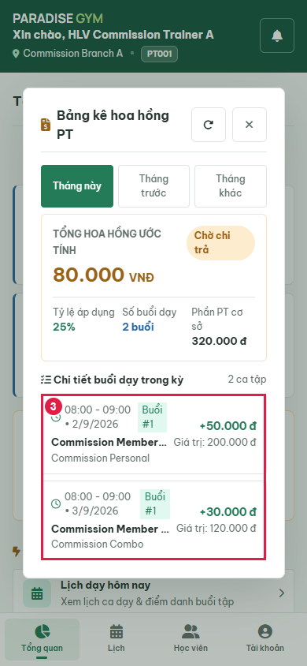

### 4. qtv-same-pt-unpaid

- Action/Input: Open QTV W15 on Branch A
- Expected Result: QTV-W15-US02 MF4/7: same PT row and positive unpaid payout action
- Actual Result: Commission Trainer A
PT001 · 0909000020
	Commission Branch A	2	320.000 ₫	25%	80.000 ₫	Chờ chi trả	
- Status: **PASS**

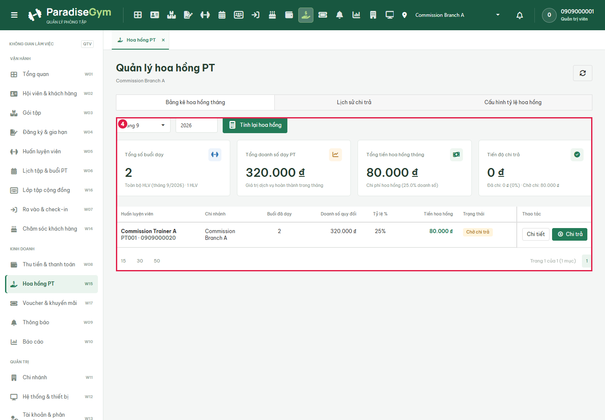

### 5. qtv-payout-modal

- Action/Input: Click payout on same PT
- Expected Result: QTV-W15-US02 MF8: payout form shows same PT and amount
- Actual Result: Commission Trainer A (PT001) · Commission Branch A
Kỳ tháng 9/2026
Số buổi: 2 · Doanh số: 320.000 ₫ · Tỷ lệ: 25%
Số tiền chi trả: 80.000 ₫
Hình thức chi trả *
Tài khoản ngân hàng thụ hưởng
Ngân hàng *
Số tài khoản *
Tên chủ tài khoản
Mã giao dịch ngân hàng (tùy chọn)
Ngày chi trả
Ghi chú
MÃ VIETQR
Quét mã để chuyển khoản nhanh
- Status: **PASS**

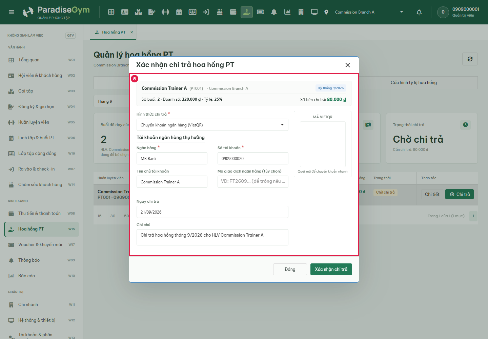

### 6. qtv-method-options

- Action/Input: Open payout method choices
- Expected Result: QTV-W15-US02 MF8: bank or cash choice
- Actual Result: Chuyển khoản ngân hàng (VietQR)
Tiền mặt tại quầy
- Status: **PASS**

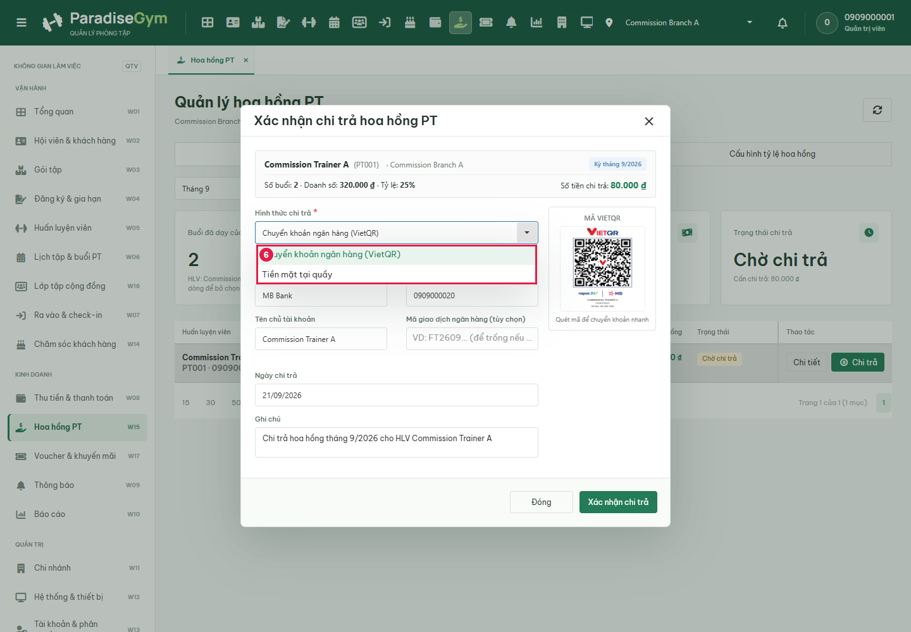

### 7. qtv-cash-fields

- Action/Input: Select cash payout
- Expected Result: QTV-W15-US02 conditional fields: cash receipt shown, bank account hidden
- Actual Result: Cash receipt field visible; bank account field hidden
- Status: **PASS**

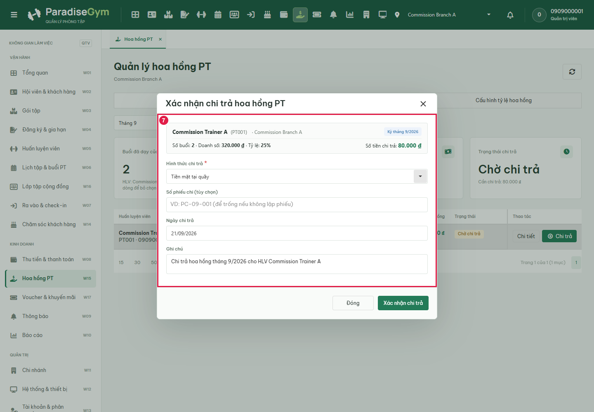

### 8. qtv-cash-input-before-submit

- Action/Input: Enter cash reference E2E-COMMISSION-CASH before submit
- Expected Result: Input captured before payout
- Actual Result: E2E-COMMISSION-CASH
- Status: **PASS**

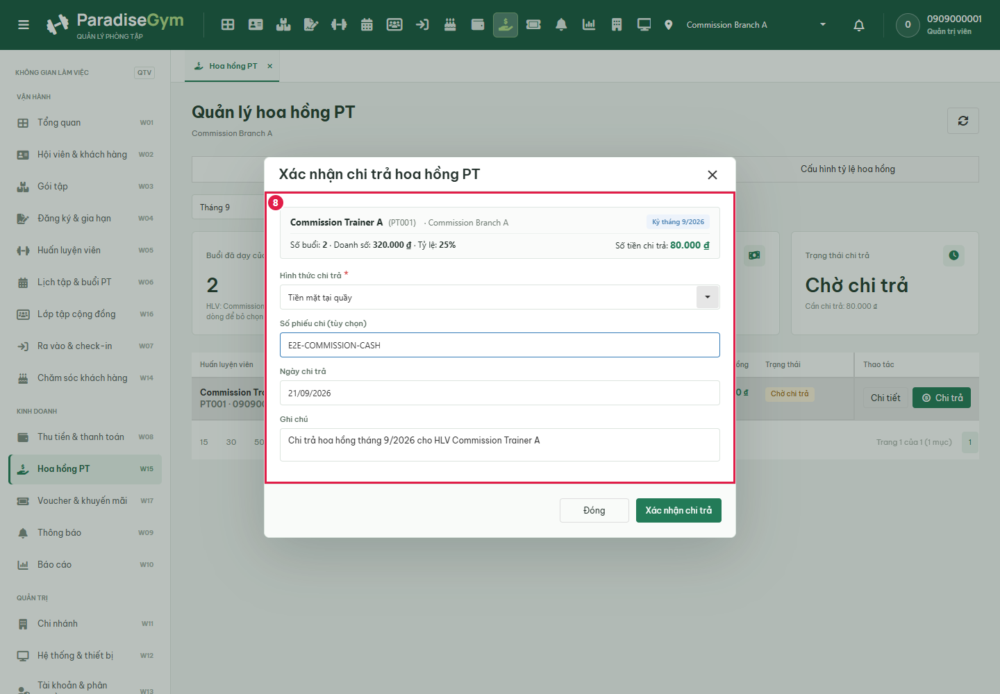

### 9. qtv-paid-result

- Action/Input: Confirm cash payout
- Expected Result: QTV-W15-US02 MF9: same row PAID and payout action removed
- Actual Result: Commission Trainer A
PT001 · 0909000020
	Commission Branch A	2	320.000 ₫	25%	80.000 ₫	Đã chi trả	
- Status: **PASS**

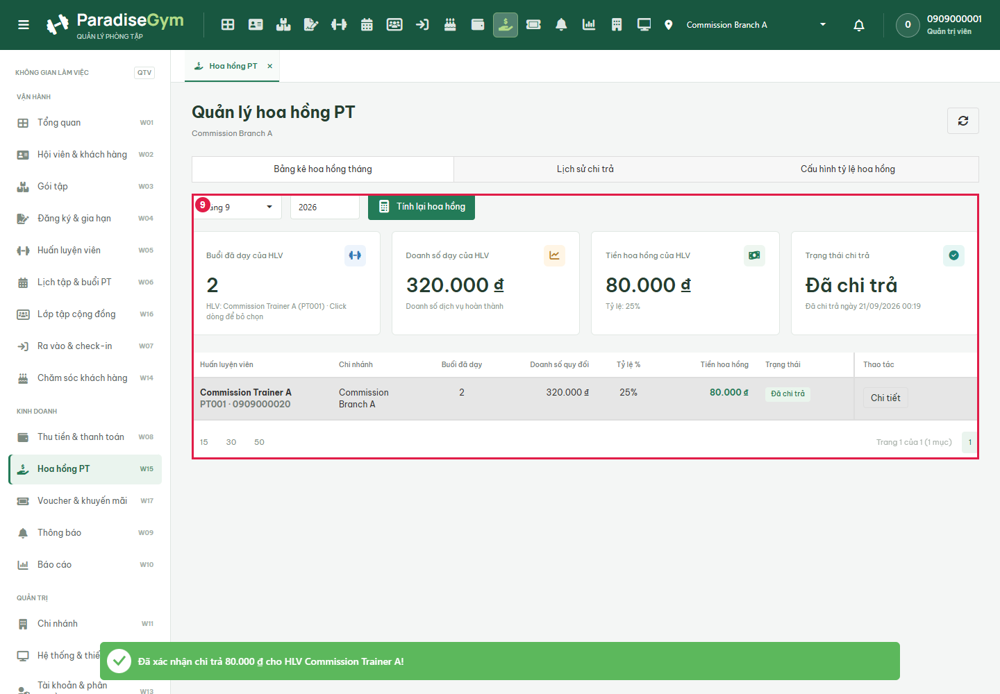

### 12. paid-pull-touch-refresh

- Action/Input: Browser CDP touch swipe down 100px from modal scrollTop=0
- Expected Result: MF6 / AF-02: gesture issues a real same-period request and keeps PAID snapshot unchanged
- Actual Result: {"commTotalAmount":"80.000 VNĐ","commSessionsCount":"2 buổi","commBaseRevenue":"320.000 đ","commStatusBadge":"Đã chi trả","transport":"CDP touch input; no direct handler invocation"}
- Status: **PASS**

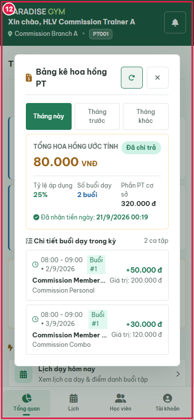

### 13. legacy-paid-null-warning

- Action/Input: Choose previous month with legacy PAID NULL snapshot
- Expected Result: AF-03: preserve 7 sessions / 1400000 base / 350000 history; warning, not empty-month text
- Actual Result: {"commTotalAmount":"350.000 VNĐ","commSessionsCount":"7 buổi","commBaseRevenue":"1.400.000 đ","commStatusBadge":"Đã chi trả","warning":"Bảng kê này đã chi trả trước khi hệ thống lưu chi tiết từng buổi. Số tổng đã chốt được giữ nguyên; không có bản chốt chi tiết để đối chiếu."}
- Status: **PASS**

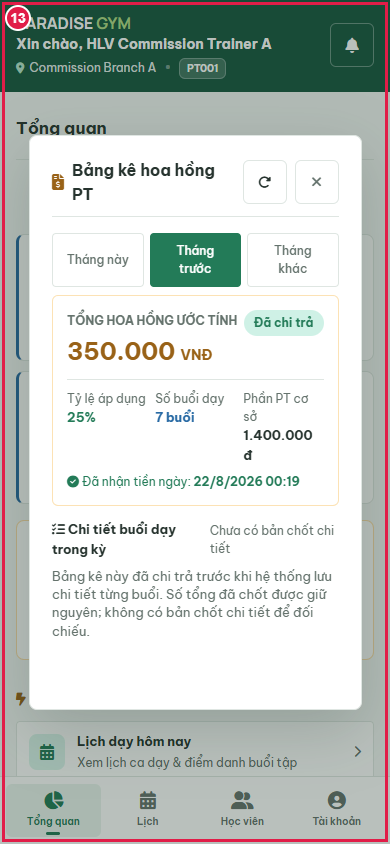

### 14. show-month-input

- Action/Input: Choose custom month
- Expected Result: AF-01: month input becomes visible
- Actual Result: 2026-08
- Status: **PASS**

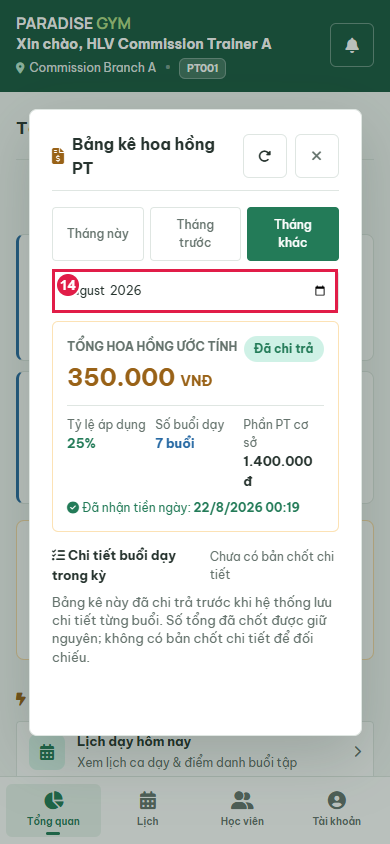

### 15. no-completed-entries

- Action/Input: Select empty period 2026-01
- Expected Result: Exception Flow: no completed sessions, zero totals, unpaid, no paid timestamp
- Actual Result: {"commTotalAmount":"0 VNĐ","commSessionsCount":"0 buổi","commBaseRevenue":"0 đ","commStatusBadge":"Chờ chi trả","empty":"Bạn chưa có buổi dạy hoàn thành nào trong tháng này. Hãy tiếp tục cố gắng!"}
- Status: **PASS**

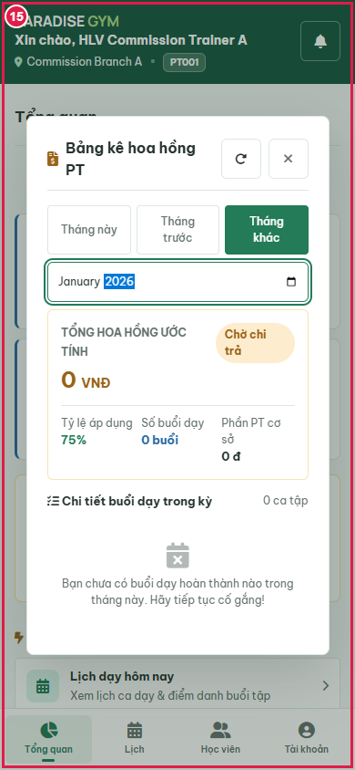

### 16. real-api-error

- Action/Input: Refresh while isolated PostgreSQL commission table is temporarily unavailable
- Expected Result: Exception Flow: real API error; no fabricated zero/other PT statement; retry available
- Actual Result: Không thể tải bảng kê. Vui lòng bấm Làm mới để thử lại.
- Status: **PASS**

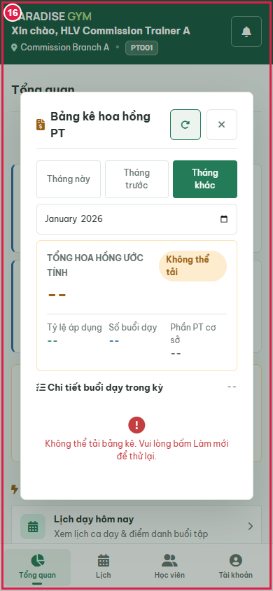

### 17. real-api-retry-success

- Action/Input: Restore SQL table; click refresh
- Expected Result: Exception recovery: real API returns selected empty period again
- Actual Result: {"commTotalAmount":"0 VNĐ","commSessionsCount":"0 buổi","commBaseRevenue":"0 đ","commStatusBadge":"Chờ chi trả"}
- Status: **PASS**

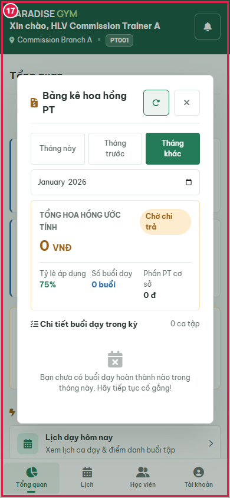

### 18. paid-with-missing-current-config

- Action/Input: Disable rate history fixture and select PAID current month
- Expected Result: Snapshot rule: missing new configuration cannot hide existing PAID
- Actual Result: {"commTotalAmount":"80.000 VNĐ","commSessionsCount":"2 buổi","commBaseRevenue":"320.000 đ","commStatusBadge":"Đã chi trả"}
- Status: **PASS**

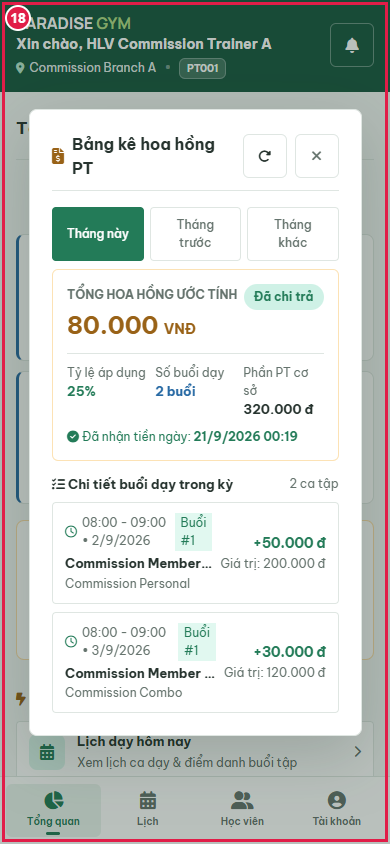

### 19. show-month-input

- Action/Input: Choose custom month
- Expected Result: AF-01: month input becomes visible
- Actual Result: 2026-09
- Status: **PASS**

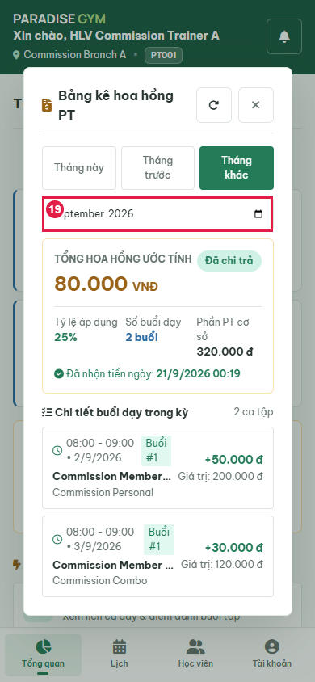

### 20. missing-config-warning

- Action/Input: Choose unpaid period without active commission config
- Expected Result: Exception Flow: explain missing commission config and contact QTV
- Actual Result: Chưa có cấu hình tỷ lệ hoa hồng từ quản lý. Vui lòng liên hệ QTV.
- Status: **PASS**

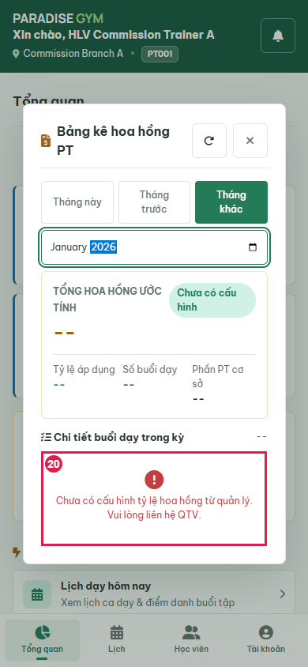

### 21. own-ui-after-forbidden-api

- Action/Input: Attempt forbidden other-PT/detail/admin APIs with same real PT session, then refresh own UI
- Expected Result: Own scope: forbidden calls expose no other-PT data and own UI remains intact
- Actual Result: {"forbiddenCount":5,"commTotalAmount":"80.000 VNĐ","commSessionsCount":"2 buổi","commBaseRevenue":"320.000 đ","commStatusBadge":"Đã chi trả"}
- Status: **PASS**

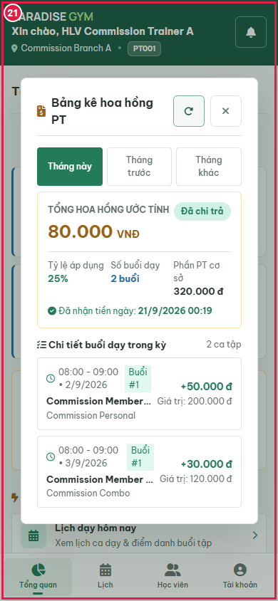

### 22. open-overview

- Action/Input: Click PT06 overview
- Expected Result: PT06-US02 Trigger: own commission card visible
- Actual Result: Thù lao & hoa hồng
Hoa hồng ước tính tháng này
50.000 VNĐ
Chờ chi trả
25% hoa hồng
- Status: **PASS**

### 24. zero-rate-with-completed-entry

- Action/Input: Set real Branch B fixture rate to 0%; refresh PT B
- Expected Result: Main Flow 4/5: zero commission does not imply empty teaching history; preserve one row and PT base
- Actual Result: {"commTotalAmount":"0 VNĐ","commSessionsCount":"1 buổi","commBaseRevenue":"200.000 đ","commStatusBadge":"Chờ chi trả"}
- Status: **PASS**

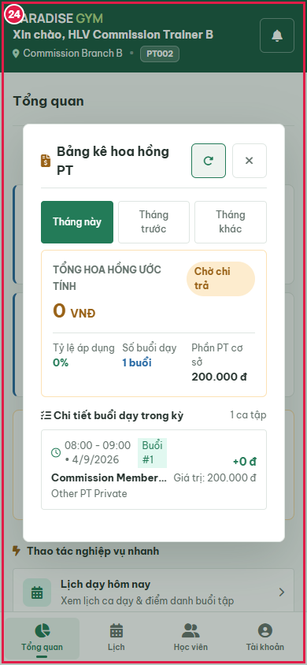

### 25. paid-responsive-360

- Action/Input: Resize paid statement to 360px
- Expected Result: Paid content remains visible; no horizontal document overflow
- Actual Result: {"width":360,"scroll":360,"commTotalAmount":"80.000 VNĐ","commSessionsCount":"2 buổi","commBaseRevenue":"320.000 đ","commStatusBadge":"Đã chi trả"}
- Status: **PASS**

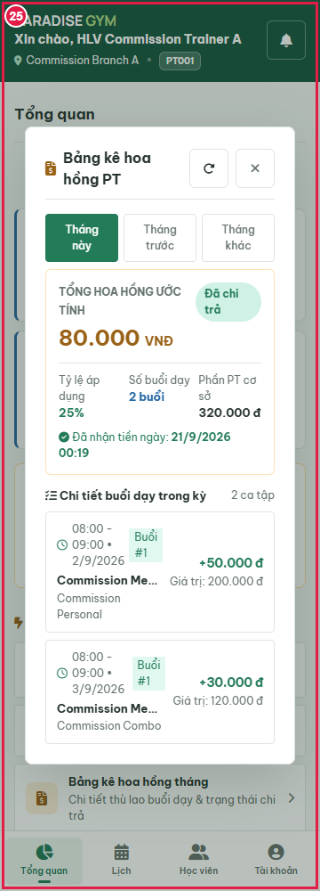

### 26. paid-responsive-768

- Action/Input: Resize paid statement to 768px
- Expected Result: Paid content remains visible; no horizontal document overflow
- Actual Result: {"width":768,"scroll":768,"commTotalAmount":"80.000 VNĐ","commSessionsCount":"2 buổi","commBaseRevenue":"320.000 đ","commStatusBadge":"Đã chi trả"}
- Status: **PASS**

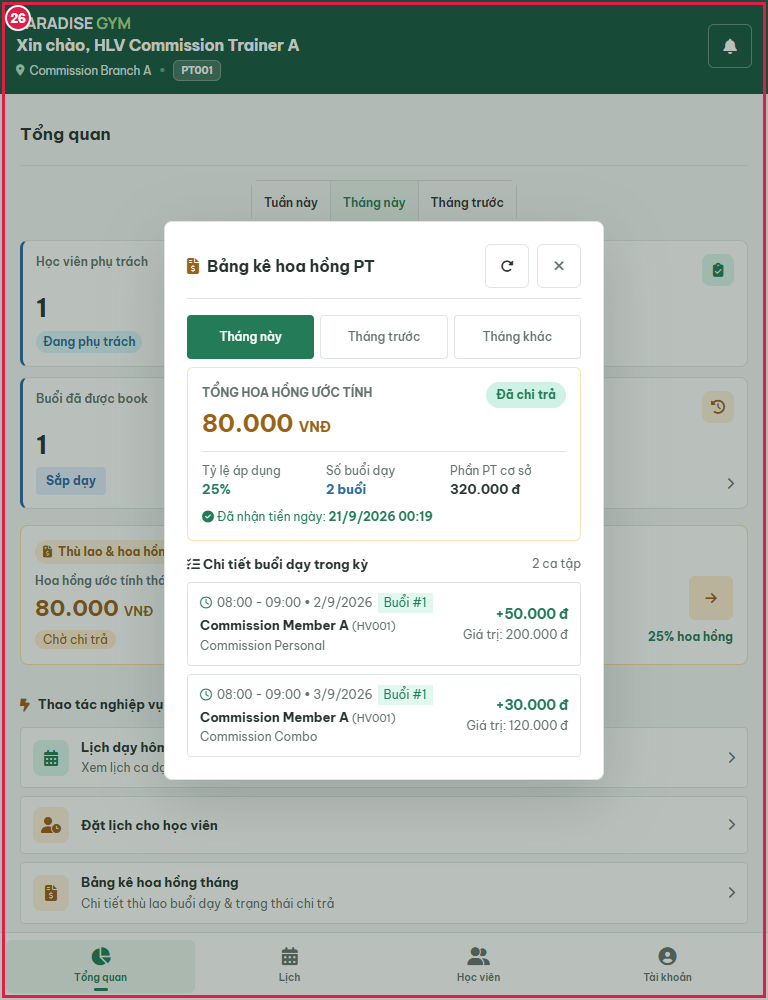

### 27. paid-responsive-1440

- Action/Input: Resize paid statement to 1440px
- Expected Result: Paid content remains visible; no horizontal document overflow
- Actual Result: {"width":1440,"scroll":1440,"commTotalAmount":"80.000 VNĐ","commSessionsCount":"2 buổi","commBaseRevenue":"320.000 đ","commStatusBadge":"Đã chi trả"}
- Status: **PASS**

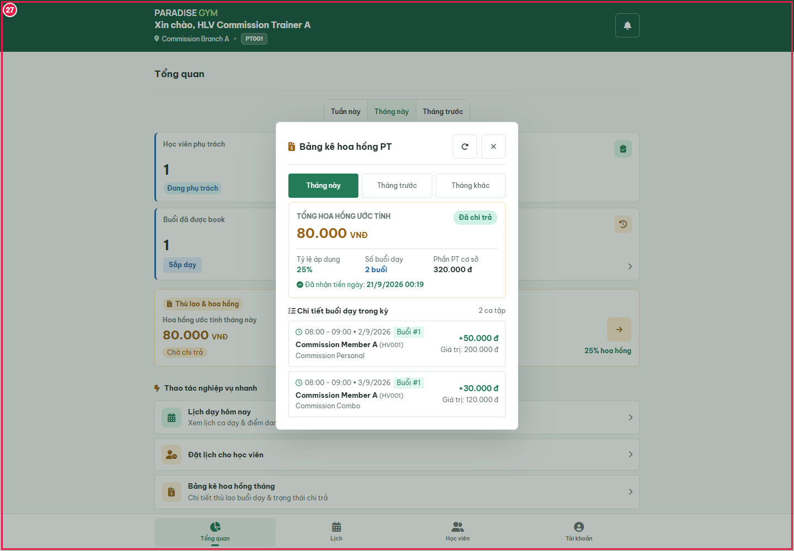

## State Verification

Isolated PostgreSQL: paradise_test_2156_1789924776772. All 13 on-disk SQL migrations applied, including 012/013 when present. Real password/OTP auth sessions. localhost:3000 served checkout checked; route.continue redirected API to ephemeral backend. SQL historical fixtures and post-payout mutations are explicitly setup, not simulated responses. Request routes, source/migration hashes, SQL/API assertions and cleanup are in results.json.

Cleanup: {"browserClosed":true,"serverClosed":true,"connectionsClosed":true,"databaseDropped":true}.

## Cross-Role / Downstream Verification

### 10. pt-paid-after-qtv-payout

- Action/Input: Refresh same PT after QTV payout
- Expected Result: PT06-US02 PAID: totals, two frozen rows and paid timestamp visible
- Actual Result: {"commTotalAmount":"80.000 VNĐ","commSessionsCount":"2 buổi","commBaseRevenue":"320.000 đ","commStatusBadge":"Đã chi trả","paidDate":"21/9/2026 00:19"}
- Status: **PASS**

### 11. paid-frozen-after-sql-changes

- Action/Input: Refresh PAID after real SQL member/package/booking/rate edits
- Expected Result: Approved snapshot rule: all historical rows and amounts stay frozen
- Actual Result: {"commTotalAmount":"80.000 VNĐ","commSessionsCount":"2 buổi","commBaseRevenue":"320.000 đ","commStatusBadge":"Đã chi trả","rows":"08:00 - 09:00 • 2/9/2026\nBuổi #1\nCommission Member A (HV001)\nCommission Personal\n+50.000 đ\nGiá trị: 200.000 đ\n08:00 - 09:00 • 3/9/2026\nBuổi #1\nCommission Member A (HV001)\nCommission Combo\n+30.000 đ\nGiá trị: 120.000 đ"}
- Status: **PASS**

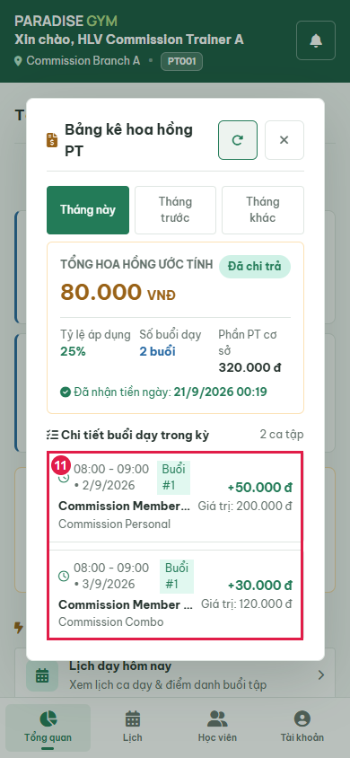

### 23. branch-b-own-pt-only

- Action/Input: Open real PT B session in Branch B
- Expected Result: Own-scope rule: B sees only B one session / 200000 base / 50000; no A historical statement
- Actual Result: {"commTotalAmount":"50.000 VNĐ","commSessionsCount":"1 buổi","commBaseRevenue":"200.000 đ","commStatusBadge":"Chờ chi trả"}
- Status: **PASS**

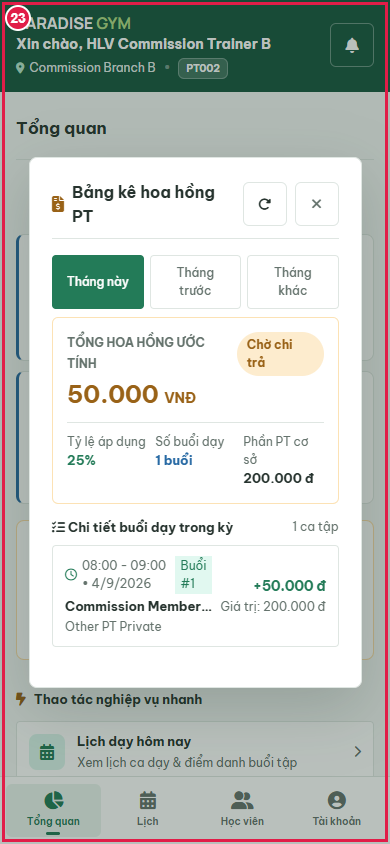

Same PT/commission ID checked between QTV cash payout and PT detail. Other-PT security checks use real second account in Branch B; API-only denial evidence is supplemental and is not mislabeled as a UI error state.

## Issues Found

No issues found in executed cases.

## Final Result

**PASS (scoped cases only)**; 27 PASS, 0 FAIL recorded UI steps.

Limits: this is not whole PT06-US02 acceptance. Browser CDP touch pull-to-refresh was verified. No physical-device gesture validation, approval legacy state, group commission, multiple-rate/rounding policy, payout races/transaction rollback, all QTV payout validation/bank transfer, or full member/LT regression covered. Failure blocks dependent steps only; independent cases continue. Missing-config behavior is judged against PT06 exception text, not inferred from generic HTTP error. Frontend/backend sources are never modified by this runner.

Final artifact review: inspected annotated QTV, frozen PAID detail, legacy warning and missing-configuration screenshots. They match recorded DOM results. All 27 screenshot hashes are distinct; no browser page errors recorded. Three watched source files remained unchanged throughout the final run. Earlier runner attempts required fixture/DevExtreme locator corrections; their screenshots are not evidence for this final result. Backend-wide validation was reported by the user and is not counted as UI evidence here.
