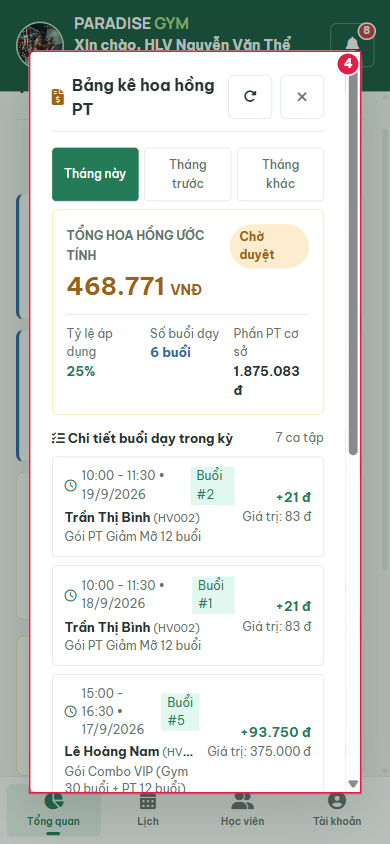
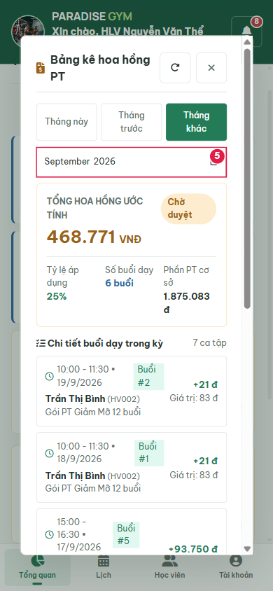

# PT06-US02 - PT Visual Smoke

Ngày: 20/09/2026. Role PT, dữ liệu PostgreSQL hiện có. Chỉ kiểm tra giao diện/tương tác không ghi dữ liệu, không phải toàn bộ US.
Nguồn: [US](<E:/Desktop/para/docs/user-stories/pt/PT06-Tổng quan/PT06-US02-Xem bảng kê hoa hồng tháng.md>), [kế hoạch](<E:/Desktop/para/docs/reports/tab3-mobile-pt/2026-09-20-visual-alignment-implementation-plan.md>).

## Source Action Verification

### Step 1: step-01-commission-dialog

Action/Input: Bảng kê hiển thị trong dialog riêng, không nằm trong popup hồ sơ bị ẩn.
Expected: Bảng kê hiển thị trong dialog riêng, không nằm trong popup hồ sơ bị ẩn. Kỳ vọng chỉ thuộc phạm vi visual smoke, không thay thế AC chưa chạy.
Actual: phần tử mục tiêu hiện trên DOM; viewport 390 x 844px; document rộng 390px. 
Result: PASS trong phạm vi kiểm tra trên.

### Step 2: step-02-custom-month

Action/Input: Ô chọn tháng xuất hiện sau TRIGGER Tháng khác.
Expected: Ô chọn tháng xuất hiện sau TRIGGER Tháng khác. Kỳ vọng chỉ thuộc phạm vi visual smoke, không thay thế AC chưa chạy.
Actual: phần tử mục tiêu hiện trên DOM; viewport 390 x 844px; document rộng 390px. 
Result: PASS trong phạm vi kiểm tra trên.

## State Verification

Không seed/migrate. API nghiệp vụ vẫn đọc dữ liệu thật. Browser chặn request mutation; lượt cuối ghi nhận 0 request mutation. 0 lỗi JavaScript, 0 API HTTP >=400. Riêng PT06 chủ động ngắt một request thống kê để thử lỗi mạng, sau đó khôi phục.

## Cross-Role / Downstream Verification

Không áp dụng: không tạo/sửa trạng thái nghiệp vụ. QTV/LT/HV chỉ được kiểm tra độc lập, không được coi là bằng chứng downstream của một mutation.

## Issues Found

- Các lệch nghiệp vụ còn giữ nguyên được liệt kê trong [walkthrough](<E:/Desktop/para/docs/reports/tab3-mobile-pt/2026-09-20-visual-alignment-walkthrough.md>).
- Summary sáu buổi và danh sách bảy ca trên dữ liệu hiện tại chưa khớp. Không đánh dấu phép tính hoa hồng PASS.
- Chưa kiểm thử ghi dữ liệu, toàn bộ nhánh nghiệp vụ, xác nhận kép, phân quyền đa chi nhánh hoặc thiết bị vật lý.
- Các lượt chạy nháp bị gián đoạn do selector popup đang đóng và toast chuyển động; lượt cuối đã dùng selector nội dung riêng và chờ đúng trạng thái. Không dùng lượt nháp để báo PASS.

## Final Result

Visual smoke PASS trong phạm vi các bước trên; toàn bộ US: PARTIAL / NOT FULLY TESTED. [Kết quả máy đọc](../../visual-20260920-results.json).

