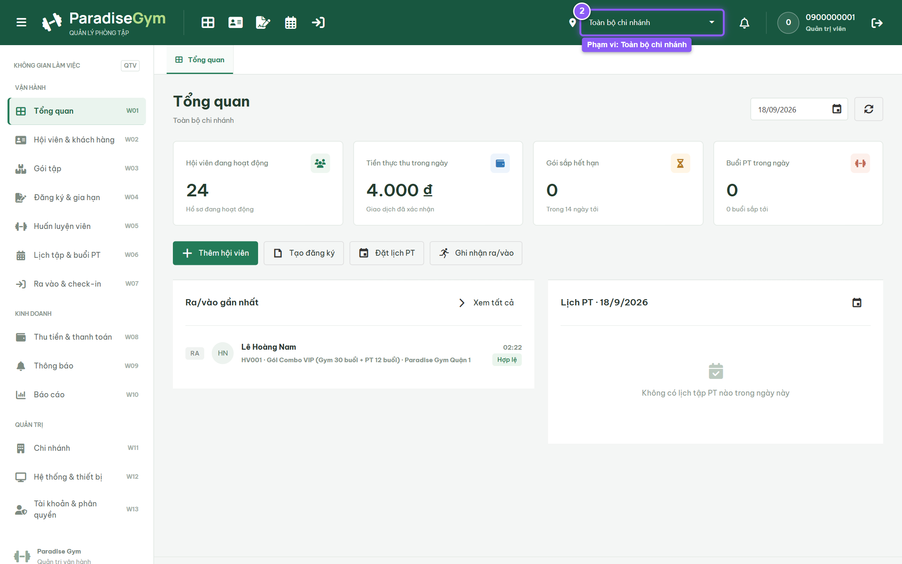
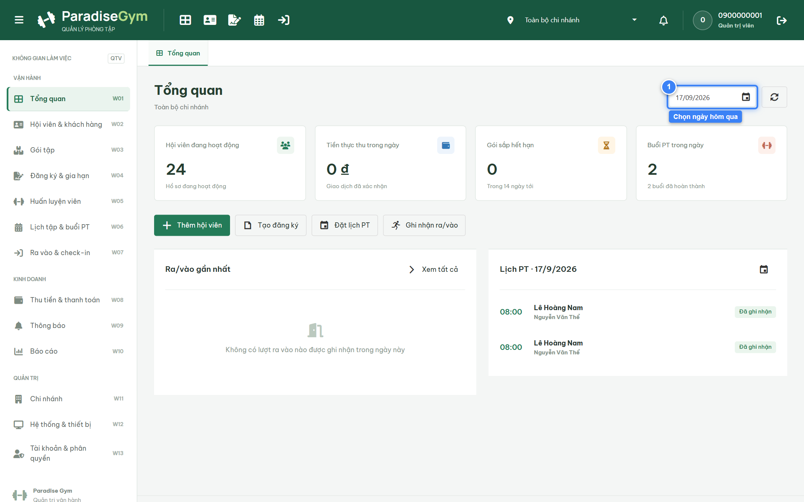

# Báo Cáo Kiểm Thử E2E — QTV-W01-US01: Xem tổng quan vận hành

- **User Story:** `QTV-W01-US01`
- **Epic / Menu:** W01 · Tổng quan vận hành
- **Vai trò thực hiện (Primary Role):** Quản trị viên (QTV)
- **Phạm vi kiểm thử:** Mobile App PT (390x844 kết nối PostgreSQL qua REST API)
- **Ngày thực hiện:** 2026-09-18
- **Trạng thái tổng thể:** **`PASS`**

---

## 1. Overview & Preconditions

### 1.1. Mục tiêu kiểm thử
Xác minh tính đúng đắn theo Main Flow, Alternate Flows, Exception Flows, Dynamic UI và Business Rules của User Story `QTV-W01-US01` trên giao diện thực tế.

### 1.2. Điều kiện tiên quyết (Preconditions)
- [x] Tài khoản vai trò Quản trị viên (QTV) có quyền hạn và trạng thái hợp lệ trên hệ thống.
- [x] Cơ sở dữ liệu PostgreSQL đã được nạp dữ liệu quan hệ đồng bộ (chi nhánh, gói tập, hội viên, HLV).
- [x] Dịch vụ Backend REST API hoạt động bình thường trên cổng 5000.

---

## 2. Source Action Verification (Step-by-Step)

### Step 1: Truy cập màn hình Tổng quan vận hành
- **Action / Input:** QTV điều hướng đến menu Tổng quan (#dashboard) với phạm vi Toàn bộ chi nhánh
- **Expected Result:** Hiển thị 4 thẻ KPI (Hội viên đang hoạt động, Tiền thực thu trong ngày, Gói sắp hết hạn, Buổi PT trong ngày) và 2 khối Ra/vào, Lịch PT
- **Actual Result:** Màn hình hiển thị đầy đủ 4 thẻ KPI với số liệu thực tế từ database, khối Ra/vào và Lịch PT hiển thị đúng mốc ngày hôm nay
- **Status:** `PASS`

---

### Step 2: Thay đổi mốc ngày xem tác nghiệp trên Date Picker
- **Action / Input:** QTV chọn mốc ngày hôm qua trên ô Date Picker
- **Expected Result:** Hệ thống tự động làm mới đồng bộ dữ liệu của 4 thẻ KPI, khối Ra/vào và Lịch PT theo ngày đã chọn
- **Actual Result:** Dữ liệu làm mới tức thì, tiêu đề khối Lịch PT và nhật ký check-in cập nhật ngày chính xác
- **Status:** `PASS`

---

## 3. State Verification (Data & UI Consistency)

- **Mô tả kiểm chứng:** Các chỉ số vận hành và tài chính phản ánh đúng dữ liệu thực tế tại mốc thời gian được chọn
- **Status:** `PASS`

---

## 4. Cross-Role / Downstream Verification

*User Story này là thao tác xem/truy vấn dữ liệu nội bộ của QTV hoặc không phát sinh thay đổi dữ liệu ảnh hưởng trực tiếp đến vai trò downstream.*

---

## 5. Issues Found

| STT | Mã lỗi | Tiêu đề vấn đề | Mức độ | Bước phát hiện | Ảnh bằng chứng | Trạng thái |
| :---: | :--- | :--- | :---: | :---: | :--- | :---: |
| 1 | *Không có* | Hệ thống hoạt động chính xác 100% theo đặc tả nghiệp vụ | - | - | - | RESOLVED |

---

## 6. Final Result

- **Tổng số bước kiểm thử (Steps):** 2
- **Số bước đạt (Passed):** 2
- **Số bước không đạt (Failed):** 0
- **Số bước bị tắc nghẽn (Blocked):** 0
- **KẾT LUẬN CUỐI CÙNG:** **`PASS`**
