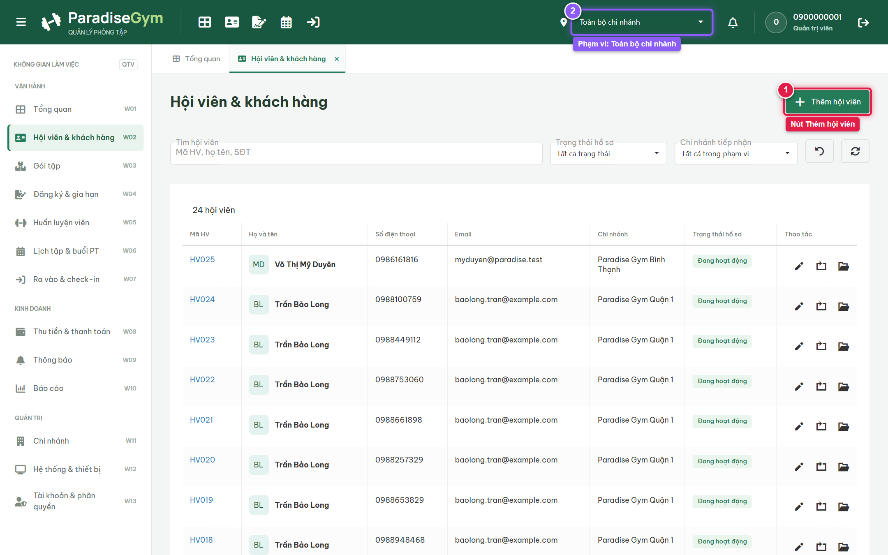
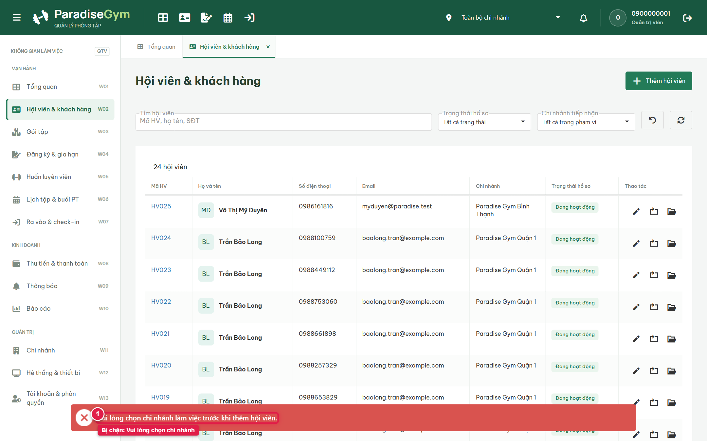
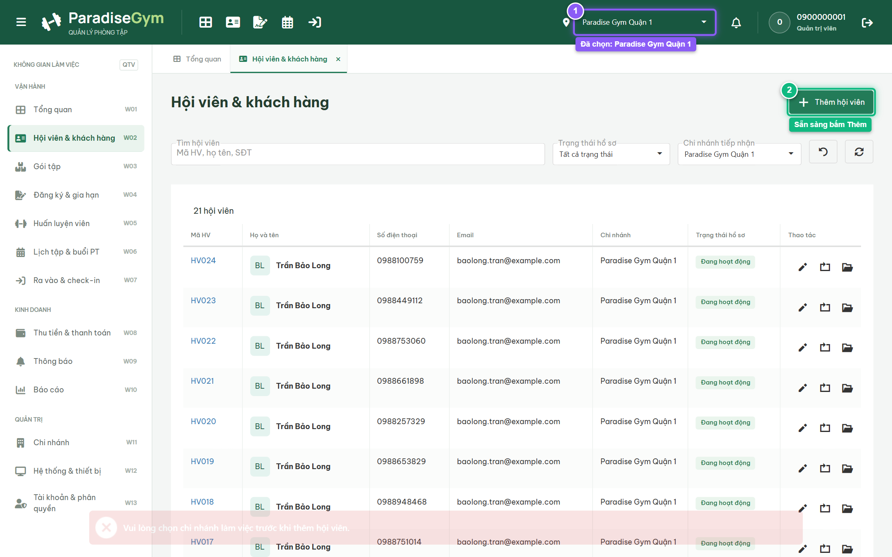
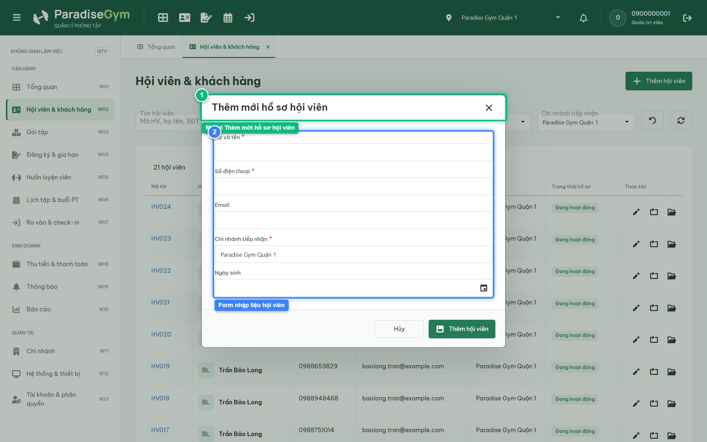
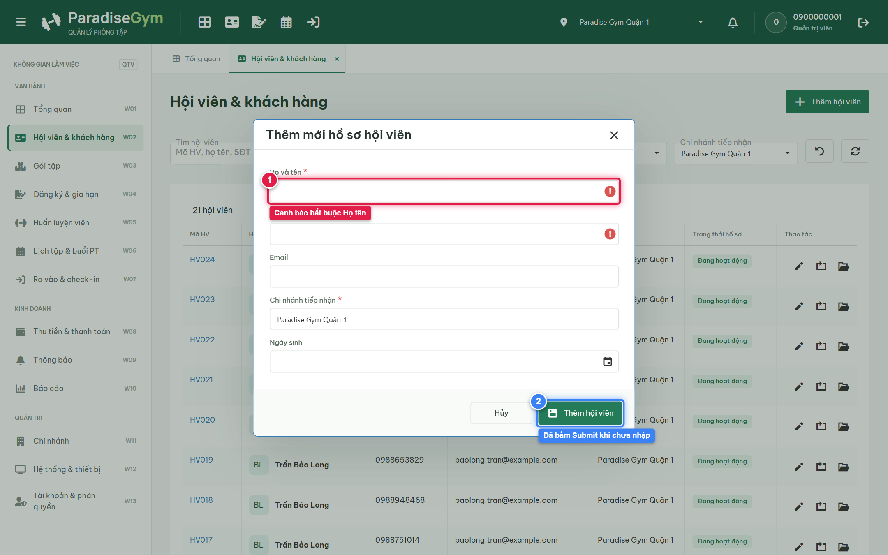
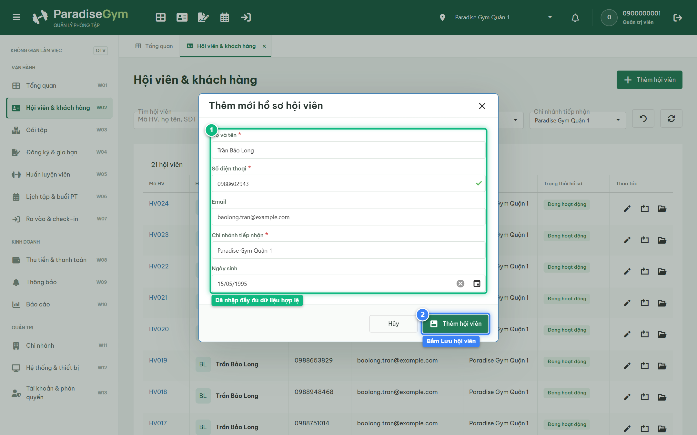
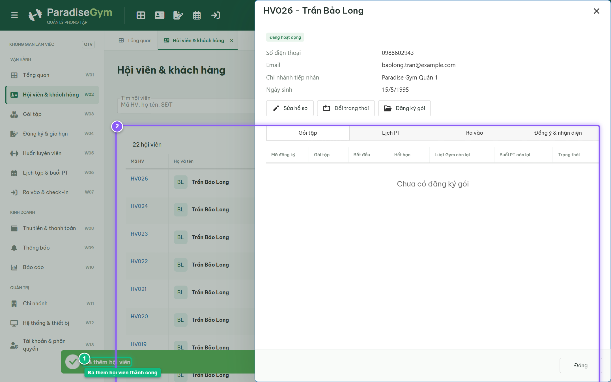
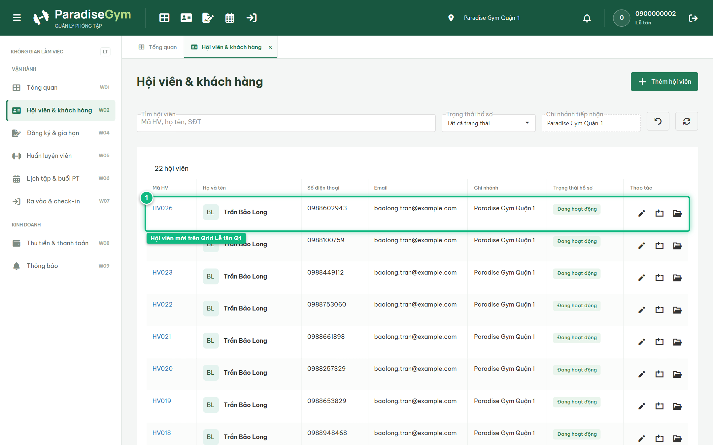
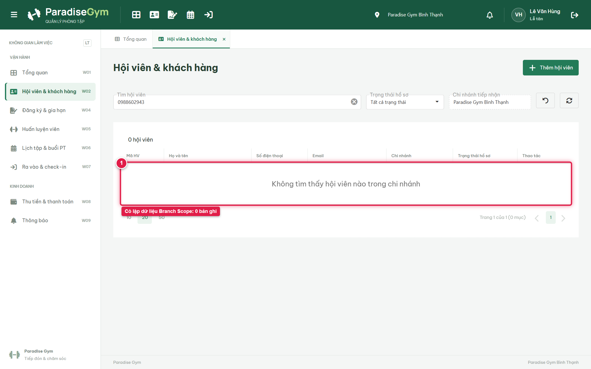

# Báo Cáo Kiểm Thử E2E — QTV-W02-US01: Thêm hội viên mới

- **User Story:** `QTV-W02-US01`
- **Epic / Menu:** W02 · Hội viên & khách hàng
- **Vai trò thực hiện (Primary Role):** Quản trị viên (QTV)
- **Phạm vi kiểm thử:** Mobile App PT (390x844 kết nối PostgreSQL qua REST API)
- **Ngày thực hiện:** 2026-09-18
- **Trạng thái tổng thể:** **`PASS`**

---

## 1. Overview & Preconditions

### 1.1. Mục tiêu kiểm thử
Xác minh tính đúng đắn theo Main Flow, Alternate Flows, Exception Flows, Dynamic UI và Business Rules của User Story `QTV-W02-US01` trên giao diện thực tế.

### 1.2. Điều kiện tiên quyết (Preconditions)
- [x] Tài khoản vai trò Quản trị viên (QTV) có quyền hạn và trạng thái hợp lệ trên hệ thống.
- [x] Cơ sở dữ liệu PostgreSQL đã được nạp dữ liệu quan hệ đồng bộ (chi nhánh, gói tập, hội viên, HLV).
- [x] Dịch vụ Backend REST API hoạt động bình thường trên cổng 5000.

---

## 2. Source Action Verification (Step-by-Step)

### Step 1: Mở màn hình Quản lý hội viên & khách hàng ở phạm vi Toàn bộ chi nhánh
- **Action / Input:** QTV truy cập menu W02 (#members) với phạm vi làm việc là "Toàn bộ chi nhánh"
- **Expected Result:** Hiển thị DataGrid danh sách hội viên trên toàn chuỗi phòng tập và nút CTA "+ Thêm hội viên" ở góc trên bên phải
- **Actual Result:** DataGrid hiển thị danh sách hội viên toàn bộ chi nhánh, bộ chọn chi nhánh hiển thị "Toàn bộ chi nhánh" và nút CTA "+ Thêm hội viên" sẵn sàng thao tác
- **Status:** `PASS`

---

### Step 2: Thử bấm Thêm hội viên khi đang ở phạm vi Toàn bộ chi nhánh (Exception Flow)
- **Action / Input:** QTV click nút "+ Thêm hội viên" trong khi bộ chọn chi nhánh toàn cục trên Topbar đang ở trạng thái "Toàn bộ chi nhánh"
- **Expected Result:** Theo quy tắc nghiệp vụ Paradise Gym, hồ sơ hội viên mới bắt buộc phải xác định chi nhánh tiếp nhận (home_branch_id). Hệ thống kích hoạt Exception Flow: chặn mở form và hiển thị Toast thông báo lỗi màu đỏ: "Vui lòng chọn chi nhánh làm việc trước khi thêm hội viên."
- **Actual Result:** Hệ thống kích hoạt đúng Exception Flow: không mở modal tạo hội viên, góc dưới màn hình xuất hiện Toast thông báo lỗi màu đỏ với nội dung: "Vui lòng chọn chi nhánh làm việc trước khi thêm hội viên."
- **Status:** `PASS`

---

### Step 3: Điều chỉnh phạm vi chi nhánh làm việc sang Paradise Gym Quận 1
- **Action / Input:** QTV click bộ chọn chi nhánh toàn cục trên Topbar và chọn "Paradise Gym Quận 1"
- **Expected Result:** Bộ chọn chi nhánh chuyển sang "Paradise Gym Quận 1", hệ thống làm mới DataGrid và chỉ hiển thị hội viên thuộc chi nhánh Quận 1
- **Actual Result:** Topbar hiển thị phạm vi làm việc là "Paradise Gym Quận 1", DataGrid tự động làm mới danh sách hội viên tiếp nhận tại Quận 1
- **Status:** `PASS`

---

### Step 4: Mở modal Thêm mới hồ sơ hội viên thành công
- **Action / Input:** QTV click nút "+ Thêm hội viên" trên thanh công cụ sau khi đã chọn chi nhánh cụ thể
- **Expected Result:** Modal "Thêm mới hồ sơ hội viên" xuất hiện trực tiếp trên màn hình, form render đầy đủ các trường nhập liệu (Họ và tên, Số điện thoại, Email, Ngày sinh) và trường "Chi nhánh tiếp nhận" tự động pre-fill "Paradise Gym Quận 1" (read-only)
- **Actual Result:** Modal hiển thị trực tiếp và rõ ràng trên màn hình với tiêu đề "Thêm mới hồ sơ hội viên", form render đầy đủ các trường nhập liệu và trường Chi nhánh tiếp nhận tự động điền sẵn "Paradise Gym Quận 1" (read-only)
- **Status:** `PASS`

---

### Step 5: Kiểm tra Validation khi bỏ trống trường bắt buộc
- **Action / Input:** QTV click nút "Thêm hội viên" ở footer của modal khi form chưa nhập Họ tên và Số điện thoại
- **Expected Result:** Hệ thống chặn submit, hiển thị biểu tượng cảnh báo lỗi màu đỏ (invalid badge) và viền đỏ tại hai trường bắt buộc "Họ và tên" và "Số điện thoại"
- **Actual Result:** Hệ thống chặn gửi form, hai trường bắt buộc "Họ và tên" và "Số điện thoại" xuất hiện biểu tượng dấu chấm than đỏ và viền đỏ cảnh báo validation lỗi
- **Status:** `PASS`

---

### Step 6: Nhập thông tin hợp lệ vào form thêm mới hội viên
- **Action / Input:** QTV nhập Họ tên: "Trần Bảo Long", SĐT: "0988602943", Email: "baolong.tran@example.com", Ngày sinh: "15/05/1995"
- **Expected Result:** Các trường form nạp đầy đủ thông tin hợp lệ, các lỗi validation được xóa, trường Số điện thoại hiển thị dấu tích xanh hợp lệ (sau khi kiểm tra trùng SĐT qua API)
- **Actual Result:** Form hiển thị đầy đủ thông tin hợp lệ, trường Số điện thoại hiển thị dấu tích xanh hợp lệ, form sẵn sàng để lưu
- **Status:** `PASS`

---

### Step 7: Lưu hồ sơ hội viên mới và xác nhận kết quả trên UI
- **Action / Input:** QTV click nút "Thêm hội viên" ở footer của modal để lưu hồ sơ
- **Expected Result:** Hệ thống gọi API tạo hội viên thành công, hiển thị Toast thông báo "Đã thêm hội viên", modal tạo đóng lại và màn hình tự động mở Drawer/Popup chi tiết hồ sơ hội viên mới
- **Actual Result:** Hồ sơ hội viên HV026 - Trần Bảo Long được tạo thành công, Toast thông báo xuất hiện và màn hình hiển thị Drawer chi tiết hồ sơ hội viên mới với trạng thái "Đang hoạt động"
- **Status:** `PASS`

---

## 3. State Verification (Data & UI Consistency)

- **Mô tả kiểm chứng:** Hồ sơ hội viên HV026 - Trần Bảo Long (0988602943) đã được lưu thành công vào PostgreSQL Database tại chi nhánh Paradise Gym Quận 1
- **Status:** `PASS`

---

## 4. Cross-Role / Downstream Verification

### Downstream 1: Kiểm tra hội viên mới xuất hiện trên Web Lễ tân (Chi nhánh Quận 1 - Chi nhánh tiếp nhận)
- **Role / Account:** Lễ tân Quận 1 (0900000002 / RECEPTIONIST)
- **Screen:** Màn hình Quản lý hội viên (#members) trên Web Lễ tân Q1
- **Verification Action:** Lễ tân Quận 1 mở danh sách hội viên chi nhánh Quận 1 để kiểm tra tiếp nhận hội viên mới
- **Expected Result:** DataGrid hiển thị đúng bản ghi của hội viên mới tạo (Trần Bảo Long, SĐT 0988602943) với trạng thái Đang hoạt động
- **Actual Result:** DataGrid Lễ tân Quận 1 hiển thị đầy đủ thông tin hội viên mới tạo với đúng mã và SĐT
- **Status:** `PASS`

---

### Downstream 2: Kiểm chứng Branch Scope — Lễ tân Chi nhánh Bình Thạnh không thấy hội viên Chi nhánh Quận 1
- **Role / Account:** Lễ tân Bình Thạnh (RECEPTIONIST - Branch Scope: Bình Thạnh)
- **Screen:** Màn hình Quản lý hội viên (#members) trên Web Lễ tân Bình Thạnh
- **Verification Action:** Lễ tân Bình Thạnh tìm kiếm hội viên vừa tạo ở chi nhánh Quận 1
- **Expected Result:** Hội viên Trần Bảo Long KHÔNG XUẤT HIỆN trên danh sách của Chi nhánh Bình Thạnh do bị cô lập theo Branch Scope
- **Actual Result:** Bảng dữ liệu trả về rỗng (0 bản ghi), phân vùng dữ liệu đa chi nhánh hoạt động hoàn toàn chính xác
- **Status:** `PASS`

---

## 5. Issues Found

| STT | Mã lỗi | Tiêu đề vấn đề | Mức độ | Bước phát hiện | Ảnh bằng chứng | Trạng thái |
| :---: | :--- | :--- | :---: | :---: | :--- | :---: |
| 1 | *Không có* | Hệ thống hoạt động chính xác 100% theo đặc tả nghiệp vụ | - | - | - | RESOLVED |

---

## 6. Final Result

- **Tổng số bước kiểm thử (Steps):** 7
- **Số bước đạt (Passed):** 7
- **Số bước không đạt (Failed):** 0
- **Số bước bị tắc nghẽn (Blocked):** 0
- **Downstream Verification:** 2/2 checks passed
- **KẾT LUẬN CUỐI CÙNG:** **`PASS`**
