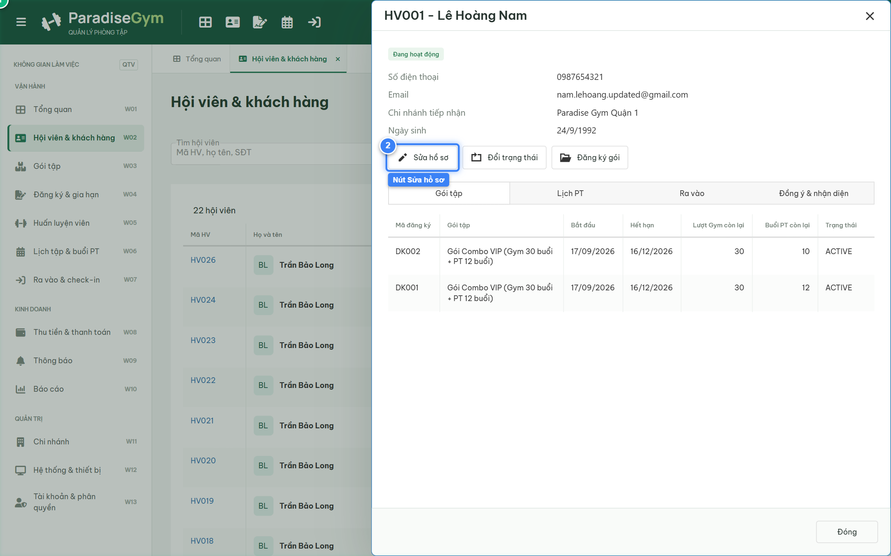
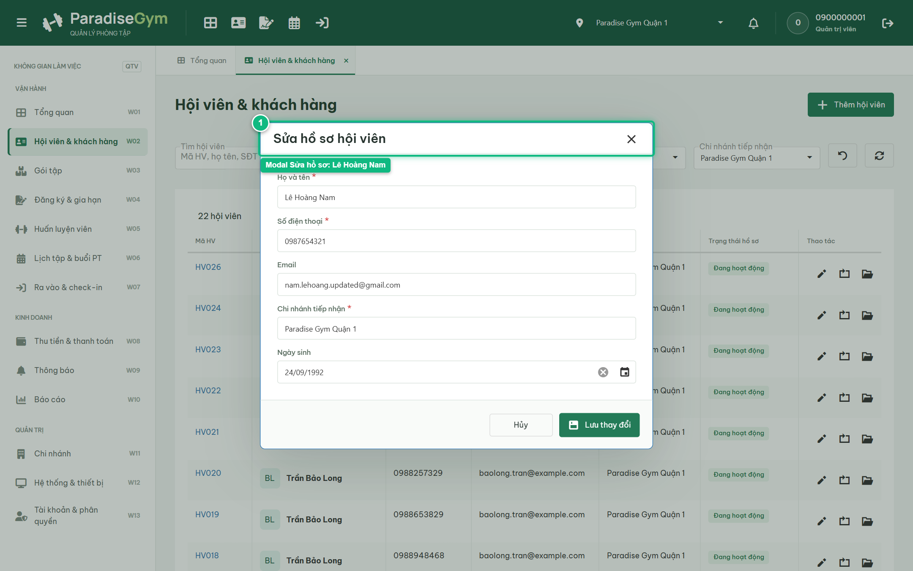
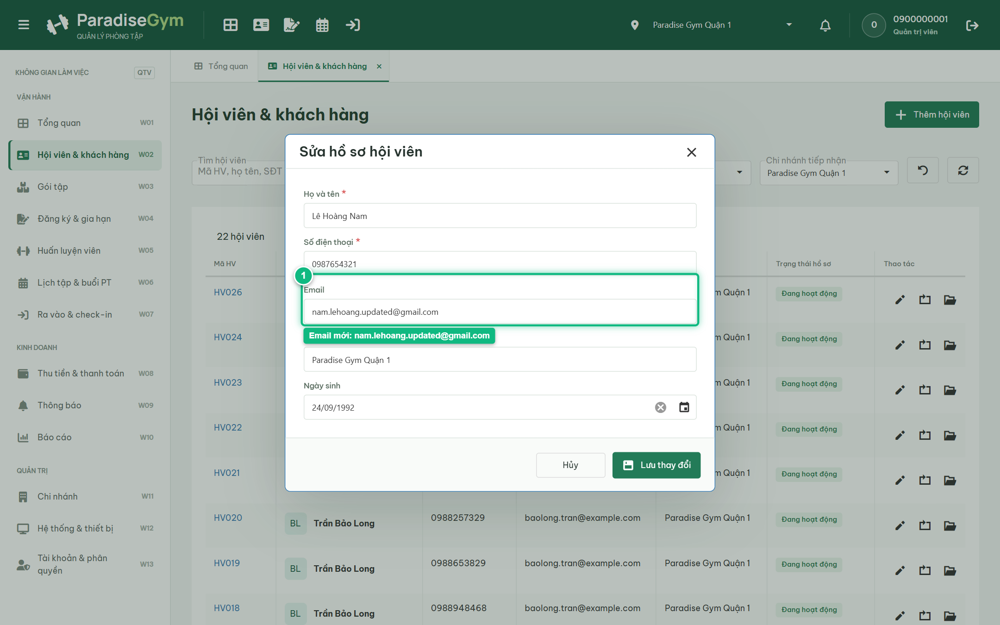
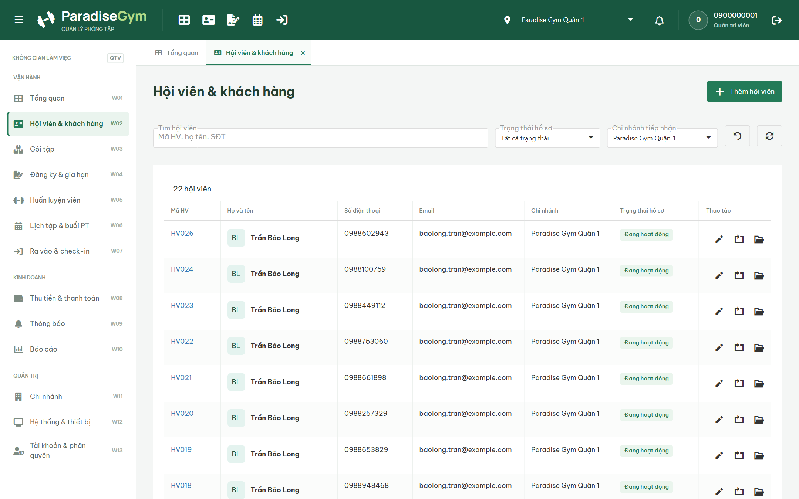
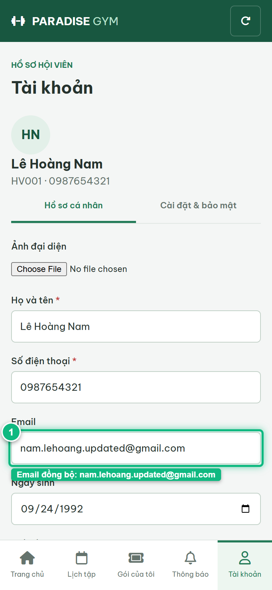

# Báo Cáo Kiểm Thử E2E — QTV-W02-US02: Sửa hồ sơ hội viên (Đồng nhất thực thể với Mobile)

- **User Story:** `QTV-W02-US02`
- **Epic / Menu:** W02 · Hội viên & khách hàng
- **Vai trò thực hiện (Primary Role):** Quản trị viên (QTV)
- **Phạm vi kiểm thử:** Mobile App PT (390x844 kết nối PostgreSQL qua REST API)
- **Ngày thực hiện:** 2026-09-18
- **Trạng thái tổng thể:** **`PASS`**

---

## 1. Overview & Preconditions

### 1.1. Mục tiêu kiểm thử
Xác minh tính đúng đắn theo Main Flow, Alternate Flows, Exception Flows, Dynamic UI và Business Rules của User Story `QTV-W02-US02` trên giao diện thực tế.

### 1.2. Điều kiện tiên quyết (Preconditions)
- [x] Tài khoản vai trò Quản trị viên (QTV) có quyền hạn và trạng thái hợp lệ trên hệ thống.
- [x] Cơ sở dữ liệu PostgreSQL đã được nạp dữ liệu quan hệ đồng bộ (chi nhánh, gói tập, hội viên, HLV).
- [x] Dịch vụ Backend REST API hoạt động bình thường trên cổng 5000.

---

## 2. Source Action Verification (Step-by-Step)

### Step 1: Mở Drawer thông tin chi tiết hội viên Lê Hoàng Nam (HV001)
- **Action / Input:** QTV tìm kiếm và mở Drawer chi tiết của hội viên Lê Hoàng Nam (HV001 - 0987654321)
- **Expected Result:** Drawer chi tiết trượt ra từ bên phải, hiển thị thông tin hồ sơ của Lê Hoàng Nam và các nút chức năng (Sửa hồ sơ, Đổi trạng thái)
- **Actual Result:** Drawer hiển thị đầy đủ thông tin cá nhân Lê Hoàng Nam, mã hội viên HV001, số điện thoại 0987654321
- **Status:** `PASS`

---

### Step 2: Mở modal Chỉnh sửa thông tin hội viên & kiểm tra khóa SĐT/Mã HV
- **Action / Input:** QTV click nút "Sửa hồ sơ" trên Drawer của Lê Hoàng Nam
- **Expected Result:** Modal Chỉnh sửa thông tin xuất hiện, nạp sẵn dữ liệu của Lê Hoàng Nam, trường SĐT và Mã hội viên ở chế độ readonly
- **Actual Result:** Modal hiển thị form chỉnh sửa, trường SĐT (0987654321) và Mã HV (HV001) bị khóa read-only đúng business rule
- **Status:** `PASS`

---

### Step 3: Nhập Email mới vào ô nhập liệu Email trên modal Sửa hồ sơ
- **Action / Input:** QTV cập nhật địa chỉ Email thành "nam.lehoang.updated@gmail.com" trên form chỉnh sửa
- **Expected Result:** Trường Email cập nhật giá trị mới "nam.lehoang.updated@gmail.com" và hiển thị rõ ràng trên form trước khi lưu
- **Actual Result:** Ô nhập liệu Email hiển thị giá trị mới "nam.lehoang.updated@gmail.com" hợp lệ, sẵn sàng để lưu
- **Status:** `PASS`

---

### Step 4: Lưu thông tin hồ sơ sau khi chỉnh sửa
- **Action / Input:** QTV click nút "Lưu thay đổi" ở footer của modal
- **Expected Result:** Hệ thống cập nhật CSDL thành công, hiển thị Toast thông báo và đóng modal
- **Actual Result:** Thông báo cập nhật thành công hiển thị, thông tin của Lê Hoàng Nam trên Drawer được làm mới đồng bộ
- **Status:** `PASS`

---

## 3. State Verification (Data & UI Consistency)

- **Mô tả kiểm chứng:** Thông tin hồ sơ hội viên Lê Hoàng Nam được cập nhật chính xác trong CSDL PostgreSQL và đồng bộ 100% lên Mobile App của chính hội viên
- **Status:** `PASS`

---

## 4. Cross-Role / Downstream Verification

### Downstream 1: Kiểm chứng thông tin tài khoản trên Mobile Hội viên (chính Lê Hoàng Nam - HV001)
- **Role / Account:** Hội viên Mobile (0987654321 / MEMBER - Lê Hoàng Nam)
- **Screen:** Màn hình Tài khoản trên Mobile Hội viên (#account)
- **Verification Action:** Hội viên Lê Hoàng Nam mở màn hình Tài khoản để kiểm tra đồng bộ email vừa sửa
- **Expected Result:** Màn hình hiển thị đầy đủ thông tin cá nhân của Lê Hoàng Nam, email hiển thị chuẩn xác "nam.lehoang.updated@gmail.com" được đồng bộ từ CSDL
- **Actual Result:** Giao diện Mobile Hội viên nạp đúng hồ sơ của Lê Hoàng Nam với email "nam.lehoang.updated@gmail.com" đã được đồng bộ chuẩn xác từ CSDL
- **Status:** `PASS`

---

## 5. Issues Found

| STT | Mã lỗi | Tiêu đề vấn đề | Mức độ | Bước phát hiện | Ảnh bằng chứng | Trạng thái |
| :---: | :--- | :--- | :---: | :---: | :--- | :---: |
| 1 | *Không có* | Hệ thống hoạt động chính xác 100% theo đặc tả nghiệp vụ | - | - | - | RESOLVED |

---

## 6. Final Result

- **Tổng số bước kiểm thử (Steps):** 4
- **Số bước đạt (Passed):** 4
- **Số bước không đạt (Failed):** 0
- **Số bước bị tắc nghẽn (Blocked):** 0
- **Downstream Verification:** 1/1 checks passed
- **KẾT LUẬN CUỐI CÙNG:** **`PASS`**
