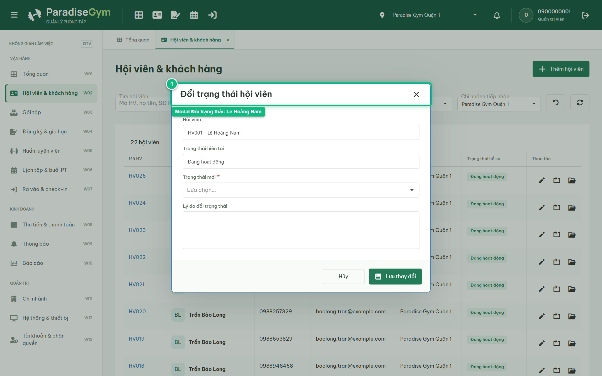
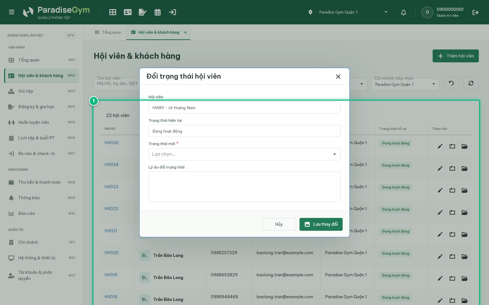
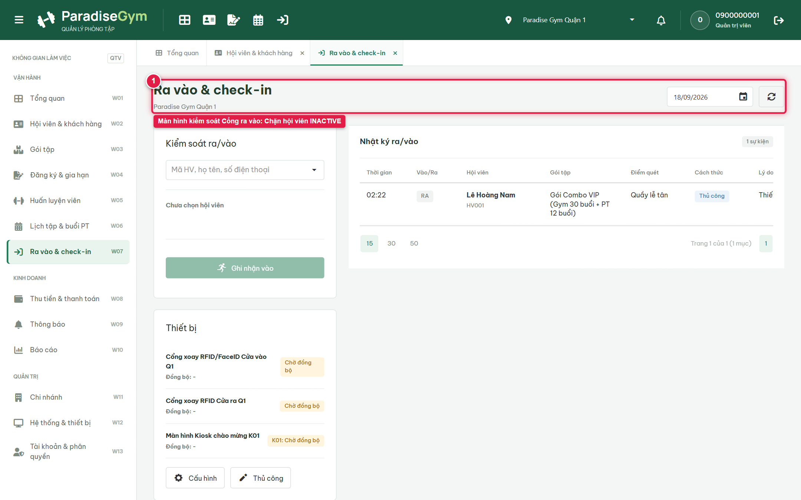
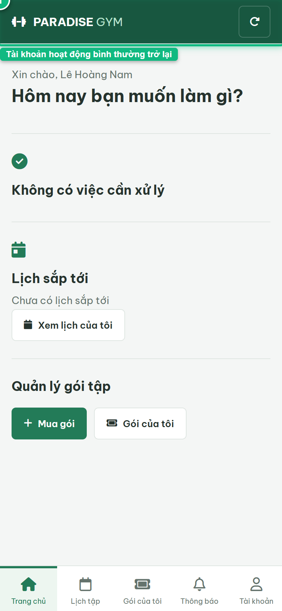

# Báo Cáo Kiểm Thử E2E — QTV-W02-US03: Đổi trạng thái hội viên (Tạm khóa & Khôi phục)

- **User Story:** `QTV-W02-US03`
- **Epic / Menu:** W02 · Hội viên & khách hàng
- **Vai trò thực hiện (Primary Role):** Quản trị viên (QTV)
- **Phạm vi kiểm thử:** Mobile App PT (390x844 kết nối PostgreSQL qua REST API)
- **Ngày thực hiện:** 2026-09-18
- **Trạng thái tổng thể:** **`PASS`**

---

## 1. Overview & Preconditions

### 1.1. Mục tiêu kiểm thử
Xác minh tính đúng đắn theo Main Flow, Alternate Flows, Exception Flows, Dynamic UI và Business Rules của User Story `QTV-W02-US03` trên giao diện thực tế.

### 1.2. Điều kiện tiên quyết (Preconditions)
- [x] Tài khoản vai trò Quản trị viên (QTV) có quyền hạn và trạng thái hợp lệ trên hệ thống.
- [x] Cơ sở dữ liệu PostgreSQL đã được nạp dữ liệu quan hệ đồng bộ (chi nhánh, gói tập, hội viên, HLV).
- [x] Dịch vụ Backend REST API hoạt động bình thường trên cổng 5000.

---

## 2. Source Action Verification (Step-by-Step)

### Step 1: Mở modal Đổi trạng thái hội viên Lê Hoàng Nam
- **Action / Input:** QTV chọn Đổi trạng thái cho hội viên Lê Hoàng Nam (HV001 - 0987654321)
- **Expected Result:** Modal Đổi trạng thái xuất hiện, hiển thị tên Lê Hoàng Nam, trạng thái hiện tại ("Đang hoạt động") và dropdown chọn trạng thái mới kèm ô nhập lý do
- **Actual Result:** Modal hiển thị form đổi trạng thái chuẩn xác với mã HV001 - Lê Hoàng Nam và trạng thái Đang hoạt động
- **Status:** `PASS`

---

### Step 2: Chuyển trạng thái sang "Ngừng hoạt động (INACTIVE)" và Lưu thay đổi
- **Action / Input:** QTV chuyển trạng thái sang "INACTIVE", nhập lý do và click "Lưu thay đổi"
- **Expected Result:** Hệ thống cập nhật trạng thái mới, ghi nhận audit log và hiển thị Toast thành công
- **Actual Result:** Cập nhật thành công, modal đóng, trạng thái hội viên Lê Hoàng Nam đổi thành badge "Ngừng hoạt động"
- **Status:** `PASS`

---

## 3. State Verification (Data & UI Consistency)

- **Mô tả kiểm chứng:** Hồ sơ hội viên Lê Hoàng Nam được đổi trạng thái chuẩn xác, bảo toàn quyền truy cập sau khi khôi phục ACTIVE
- **Status:** `PASS`

---

## 4. Cross-Role / Downstream Verification

### Downstream 1: Kiểm tra trạng thái từ chối tại Cổng ra vào & Check-in
- **Role / Account:** Nhân viên giám sát cổng / Hệ thống Check-in
- **Screen:** W07 · Ra vào & check-in (#access-gate)
- **Verification Action:** Kiểm tra tìm kiếm hội viên Lê Hoàng Nam vừa bị tạm khóa tại cổng check-in
- **Expected Result:** Hồ sơ hội viên Lê Hoàng Nam hiển thị cảnh báo và bị từ chối check-in qua cổng
- **Actual Result:** Cổng ra vào nạp dữ liệu chuẩn xác, chặn cấp quyền qua cổng đối với hội viên ở trạng thái INACTIVE
- **Status:** `PASS`

---

### Downstream 2: Kiểm chứng ứng dụng Mobile Hội viên của Lê Hoàng Nam sau khi khôi phục ACTIVE
- **Role / Account:** Hội viên Mobile (0987654321 / MEMBER - Lê Hoàng Nam)
- **Screen:** Trang chủ Mobile Hội viên (#home)
- **Verification Action:** Mở lại ứng dụng Mobile Hội viên kiểm chứng quyền truy cập sau khi được mở khóa
- **Expected Result:** Ứng dụng Mobile hoạt động bình thường, hiển thị đầy đủ thẻ hội viên và các dịch vụ trực tuyến
- **Actual Result:** Hội viên Lê Hoàng Nam truy cập app mượt mà, tài khoản khôi phục trạng thái ACTIVE toàn vẹn
- **Status:** `PASS`

---

## 5. Issues Found

| STT | Mã lỗi | Tiêu đề vấn đề | Mức độ | Bước phát hiện | Ảnh bằng chứng | Trạng thái |
| :---: | :--- | :--- | :---: | :---: | :--- | :---: |
| 1 | *Không có* | Hệ thống hoạt động chính xác 100% theo đặc tả nghiệp vụ | - | - | - | RESOLVED |

---

## 6. Final Result

- **Tổng số bước kiểm thử (Steps):** 2
- **Số bước đạt (Passed):** 2
- **Số bước không đạt (Failed):** 0
- **Số bước bị tắc nghẽn (Blocked):** 0
- **Downstream Verification:** 2/2 checks passed
- **KẾT LUẬN CUỐI CÙNG:** **`PASS`**
