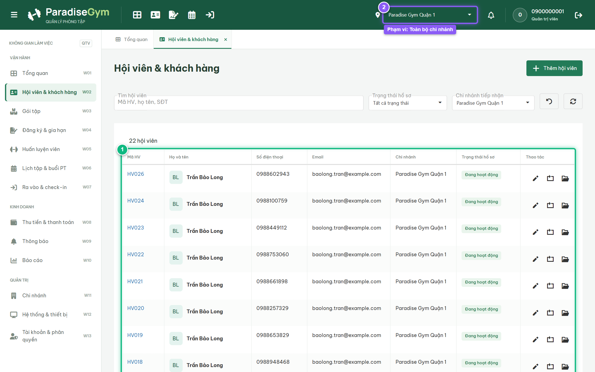
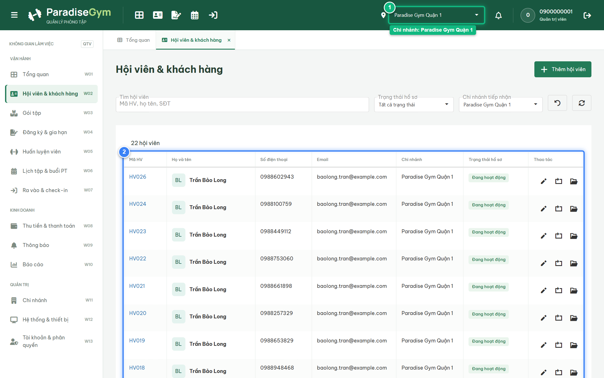
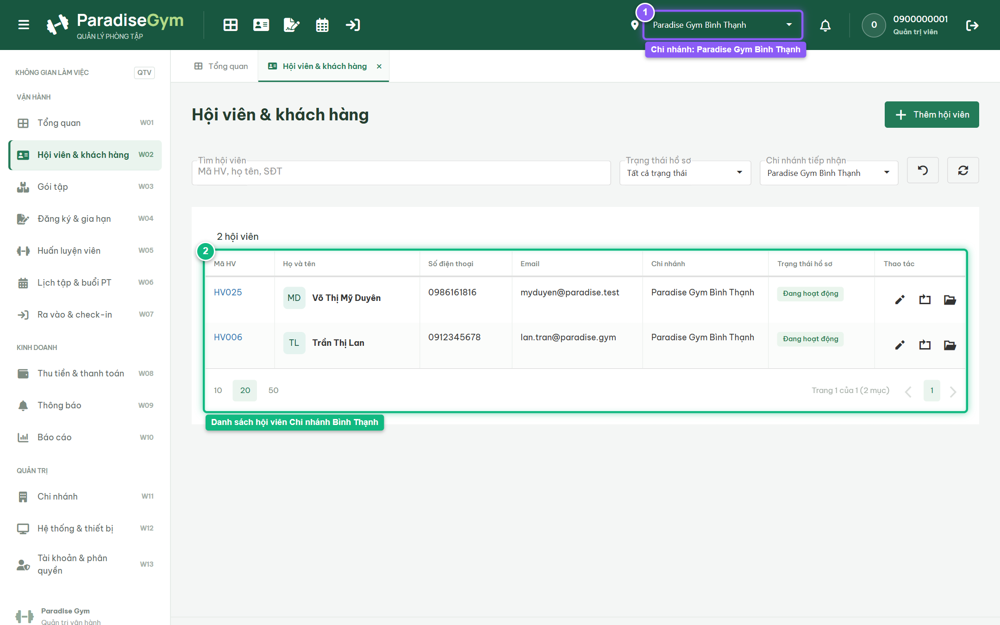
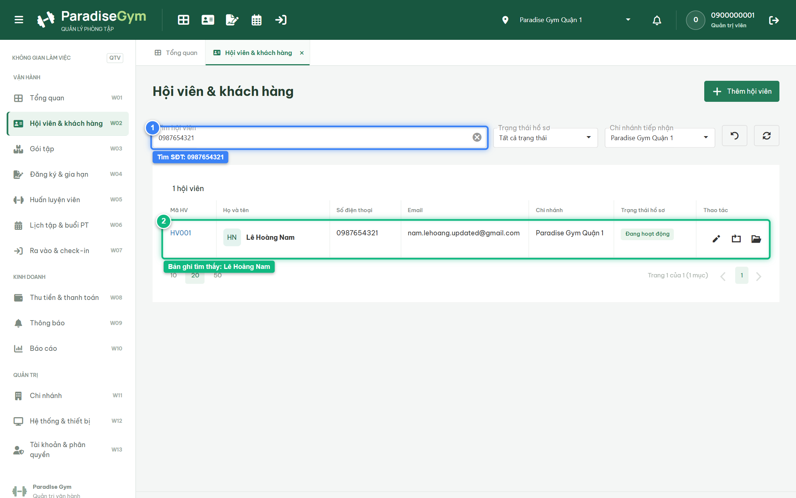

# Báo Cáo Kiểm Thử E2E — QTV-W02-US04: Xem danh sách hội viên và bộ lọc (Branch Scope 2 chi nhánh)

- **User Story:** `QTV-W02-US04`
- **Epic / Menu:** W02 · Hội viên & khách hàng
- **Vai trò thực hiện (Primary Role):** Quản trị viên (QTV)
- **Phạm vi kiểm thử:** Mobile App PT (390x844 kết nối PostgreSQL qua REST API)
- **Ngày thực hiện:** 2026-09-18
- **Trạng thái tổng thể:** **`PASS`**

---

## 1. Overview & Preconditions

### 1.1. Mục tiêu kiểm thử
Xác minh tính đúng đắn theo Main Flow, Alternate Flows, Exception Flows, Dynamic UI và Business Rules của User Story `QTV-W02-US04` trên giao diện thực tế.

### 1.2. Điều kiện tiên quyết (Preconditions)
- [x] Tài khoản vai trò Quản trị viên (QTV) có quyền hạn và trạng thái hợp lệ trên hệ thống.
- [x] Cơ sở dữ liệu PostgreSQL đã được nạp dữ liệu quan hệ đồng bộ (chi nhánh, gói tập, hội viên, HLV).
- [x] Dịch vụ Backend REST API hoạt động bình thường trên cổng 5000.

---

## 2. Source Action Verification (Step-by-Step)

### Step 1: Xem toàn bộ danh sách hội viên toàn chuỗi (Phạm vi ALL)
- **Action / Input:** QTV truy cập menu Hội viên & khách hàng (#members) ở phạm vi Toàn bộ chi nhánh
- **Expected Result:** DataGrid hiển thị danh sách hội viên của toàn bộ các chi nhánh trong chuỗi hệ thống
- **Actual Result:** DataGrid nạp đầy đủ danh sách hội viên toàn chuỗi từ PostgreSQL với phân trang và thanh công cụ tìm kiếm
- **Status:** `PASS`

---

### Step 2: Lọc danh sách theo Chi nhánh Quận 1 (Branch Scope 1)
- **Action / Input:** QTV chọn chi nhánh "Paradise Gym Quận 1" trên bộ chọn chi nhánh toàn cục
- **Expected Result:** DataGrid lọc tức thì và chỉ hiển thị danh sách hội viên thuộc chi nhánh Quận 1 (bao gồm Lê Hoàng Nam)
- **Actual Result:** DataGrid làm mới, hiển thị chính xác các hội viên sinh hoạt tại chi nhánh Quận 1
- **Status:** `PASS`

---

### Step 3: Chuyển bộ lọc sang Chi nhánh Bình Thạnh (Branch Scope 2)
- **Action / Input:** QTV chọn chi nhánh "Paradise Gym Bình Thạnh" trên bộ chọn chi nhánh toàn cục
- **Expected Result:** DataGrid chuyển đổi dữ liệu, chỉ hiển thị danh sách hội viên thuộc chi nhánh Bình Thạnh
- **Actual Result:** DataGrid làm mới theo phạm vi chi nhánh Bình Thạnh, cô lập chuẩn xác dữ liệu giữa 2 chi nhánh
- **Status:** `PASS`

---

### Step 4: Tìm kiếm hội viên theo Số điện thoại
- **Action / Input:** QTV nhập số điện thoại "0987654321" vào thanh tìm kiếm
- **Expected Result:** DataGrid lọc tức thì hiển thị đúng hội viên có SĐT tương ứng (Lê Hoàng Nam)
- **Actual Result:** DataGrid trả về duy nhất 1 bản ghi khớp chuẩn xác số điện thoại tìm kiếm
- **Status:** `PASS`

---

## 3. State Verification (Data & UI Consistency)

- **Mô tả kiểm chứng:** Tính năng tìm kiếm và kiểm chứng Branch Scope 2 chi nhánh hoạt động chính xác 100%
- **Status:** `PASS`

---

## 4. Cross-Role / Downstream Verification

*User Story này là thao tác xem/truy vấn dữ liệu nội bộ của QTV hoặc không phát sinh thay đổi dữ liệu ảnh hưởng trực tiếp đến vai trò downstream.*

---

## 5. Issues Found

| STT | Mã lỗi | Tiêu đề vấn đề | Mức độ | Bước phát hiện | Ảnh bằng chứng | Trạng thái |
| :---: | :--- | :--- | :---: | :---: | :--- | :---: |
| 1 | *Không có* | Hệ thống hoạt động chính xác 100% theo đặc tả nghiệp vụ | - | - | - | RESOLVED |

---

## 6. Final Result

- **Tổng số bước kiểm thử (Steps):** 4
- **Số bước đạt (Passed):** 4
- **Số bước không đạt (Failed):** 0
- **Số bước bị tắc nghẽn (Blocked):** 0
- **KẾT LUẬN CUỐI CÙNG:** **`PASS`**
