# QTV-W02-US04 member popup readonly E2E

Mode: final. Started source SHA256: 6457b1b72c45fa6396bcdf61cf38e3a6c265faf7883c8c443f86b2392dab2a3c.

Frontend: http://localhost:3001/web/; API: http://localhost:5000/api/v1.

Subject: HV001 / 40000000-0000-0000-0000-000000000001. No business writes; auth allowed.

Expected sources: QTV-W02-US04 Main Flow/field tables/AF02/EF02/EF03; Product Spec W02; HV01-US01; HV03-US01; current user requirements. Final field tables must be reread after documentation freeze.

## Source Action Verification

### Step 1: open-members-list

- Action/Input: open members list. Visible inputs: [{"label":"Chi nhánh làm việc","value":"Toàn bộ chi nhánh"},{"label":"Mã HV, họ tên, SĐT","value":""},{"label":"Lựa chọn...","value":"Tất cả trạng thái"},{"label":"Lựa chọn...","value":"Tất cả trong phạm vi"}].
- Expected Result: QTV-W02-US04 Main Flow / Field-level specification / Exception Flows: readonly rows in branch scope
- Actual Result: URL /web/#members; popup=false; title=-; visible alerts=[]; visible grid rows=20. DOM assertions passed; screenshot requires visual audit.
- Status: PASS

### Step 2: initial-row-opens-popup

- Action/Input: initial row opens popup. Visible inputs: [{"label":"Tìm kiếm","value":""},{"label":"Tìm kiếm","value":""},{"label":"Tìm kiếm","value":""}].
- Expected Result: QTV-W02-US04 Main Flow 2-8, popup navigation field table and Business Rules; Product Spec W02: clicking first visible member row opens that member profile
- Actual Result: URL /web/#members; popup=true; title=HV026 - Trần Bảo Long; visible alerts=[]; visible grid rows=0. DOM assertions passed; screenshot requires visual audit.
- Status: PASS

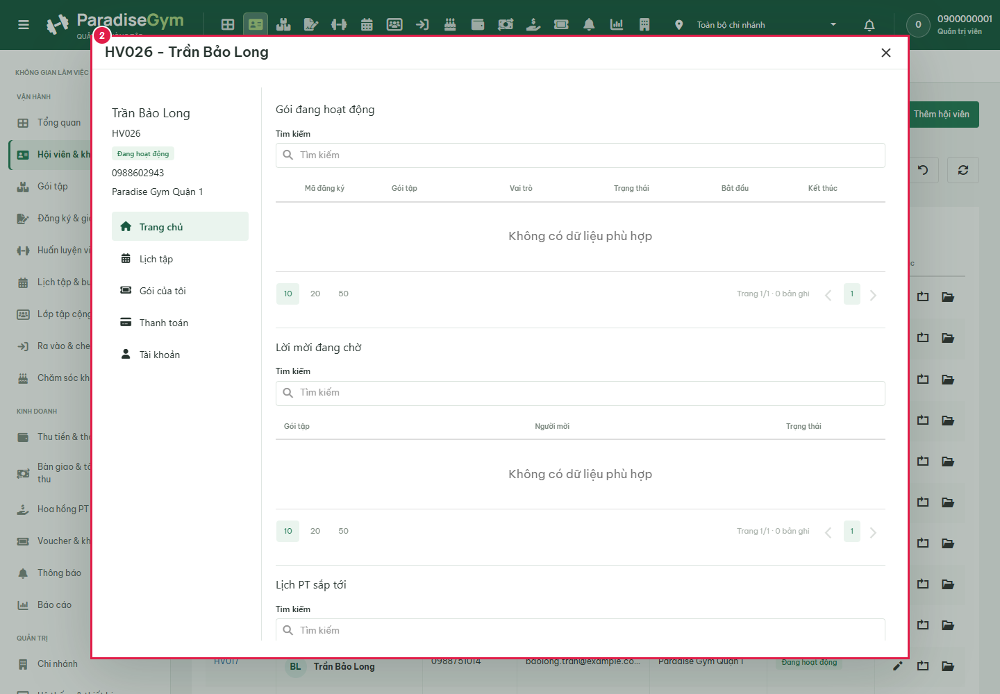

### Step 3: close-initial-popup

- Action/Input: close initial popup. Visible inputs: [{"label":"Chi nhánh làm việc","value":"Toàn bộ chi nhánh"},{"label":"Mã HV, họ tên, SĐT","value":""},{"label":"Lựa chọn...","value":"Tất cả trạng thái"},{"label":"Lựa chọn...","value":"Tất cả trong phạm vi"}].
- Expected Result: Close returns to member list
- Actual Result: URL /web/#members; popup=false; title=-; visible alerts=[]; visible grid rows=20. DOM assertions passed; screenshot requires visual audit.
- Status: PASS

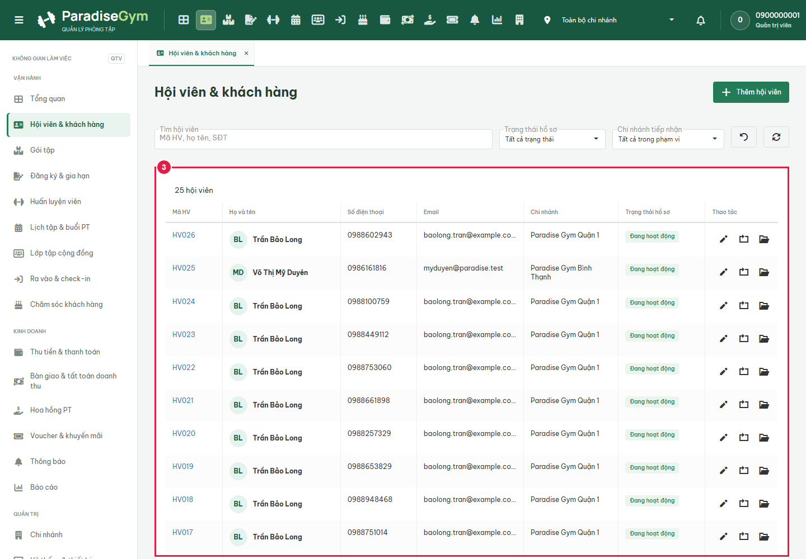

### Step 4: search-same-active-mobile-member

- Action/Input: search same active mobile member. Visible inputs: [{"label":"Chi nhánh làm việc","value":"Toàn bộ chi nhánh"},{"label":"Mã HV, họ tên, SĐT","value":"0987654321"},{"label":"Lựa chọn...","value":"Tất cả trạng thái"},{"label":"Lựa chọn...","value":"Tất cả trong phạm vi"}].
- Expected Result: QTV-W02-US04 Main Flow / Field-level specification / Exception Flows: search exact phone and show matching row
- Actual Result: URL /web/#members; popup=false; title=-; visible alerts=[]; visible grid rows=1. DOM assertions passed; screenshot requires visual audit.
- Status: PASS

### Step 5: open-same-member-popup

- Action/Input: open same member popup. Visible inputs: [{"label":"Tìm kiếm","value":""},{"label":"Trạng thái","value":""},{"label":"Tìm kiếm","value":""},{"label":"Tìm kiếm","value":""},{"label":"Trạng thái","value":""}].
- Expected Result: QTV-W02-US04 Main Flow 2-8, popup navigation field table and Business Rules; Product Spec W02: same member identity; exactly five menu tabs
- Actual Result: URL /web/#members; popup=true; title=HV001 - Lê Hoàng Nam; visible alerts=[]; visible grid rows=11. DOM assertions passed; screenshot requires visual audit.
- Status: PASS

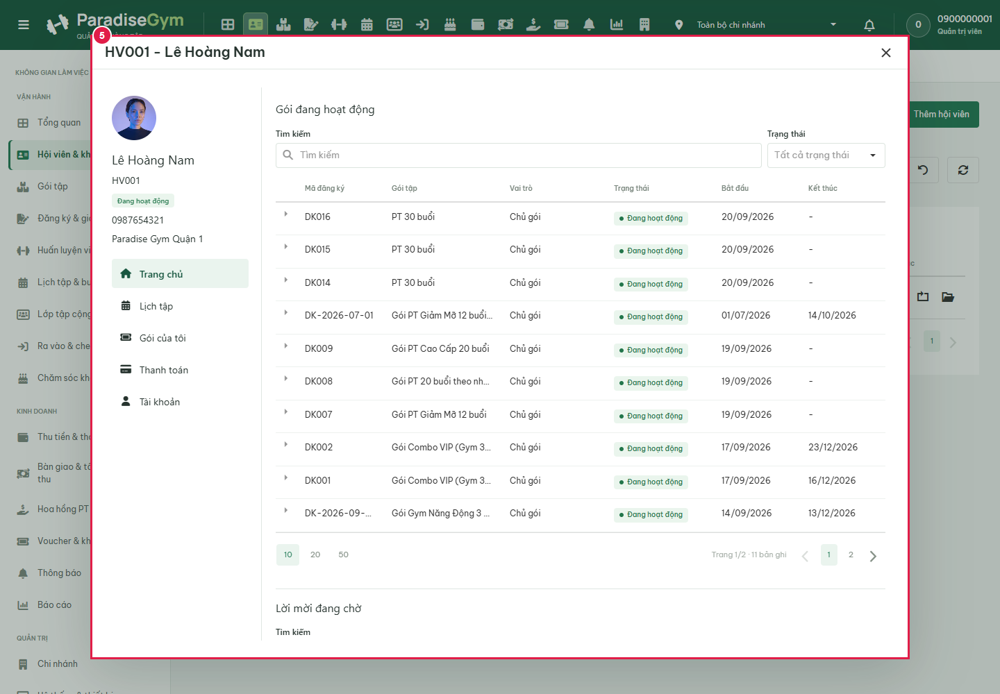

### Step 6: tab-1-home

- Action/Input: tab 1 home. Visible inputs: [{"label":"Tìm kiếm","value":""},{"label":"Trạng thái","value":""},{"label":"Tìm kiếm","value":""},{"label":"Tìm kiếm","value":""},{"label":"Trạng thái","value":""}].
- Expected Result: QTV-W02-US04 Main Flow 2-8, popup navigation field table and Business Rules; Product Spec W02: correct active menu and loaded business content
- Actual Result: URL /web/#members; popup=true; title=HV001 - Lê Hoàng Nam; visible alerts=[]; visible grid rows=11. DOM assertions passed; screenshot requires visual audit.
- Status: PASS

### Step 8: tab-2-schedule

- Action/Input: tab 2 schedule. Visible inputs: [{"label":"Tìm kiếm","value":""},{"label":"Trạng thái","value":""},{"label":"Từ ngày","value":""},{"label":"Đến ngày","value":""}].
- Expected Result: QTV-W02-US04 Main Flow 2-8, popup navigation field table and Business Rules; Product Spec W02: correct active menu and loaded business content
- Actual Result: URL /web/#members; popup=true; title=HV001 - Lê Hoàng Nam; visible alerts=[]; visible grid rows=10. DOM assertions passed; screenshot requires visual audit.
- Status: PASS

### Step 10: tab-3-packages

- Action/Input: tab 3 packages. Visible inputs: [{"label":"Tìm kiếm","value":""},{"label":"Trạng thái","value":""},{"label":"Từ ngày","value":""},{"label":"Đến ngày","value":""}].
- Expected Result: QTV-W02-US04 Main Flow 2-8, popup navigation field table and Business Rules; Product Spec W02: correct active menu and loaded business content
- Actual Result: URL /web/#members; popup=true; title=HV001 - Lê Hoàng Nam; visible alerts=[]; visible grid rows=10. DOM assertions passed; screenshot requires visual audit.
- Status: PASS

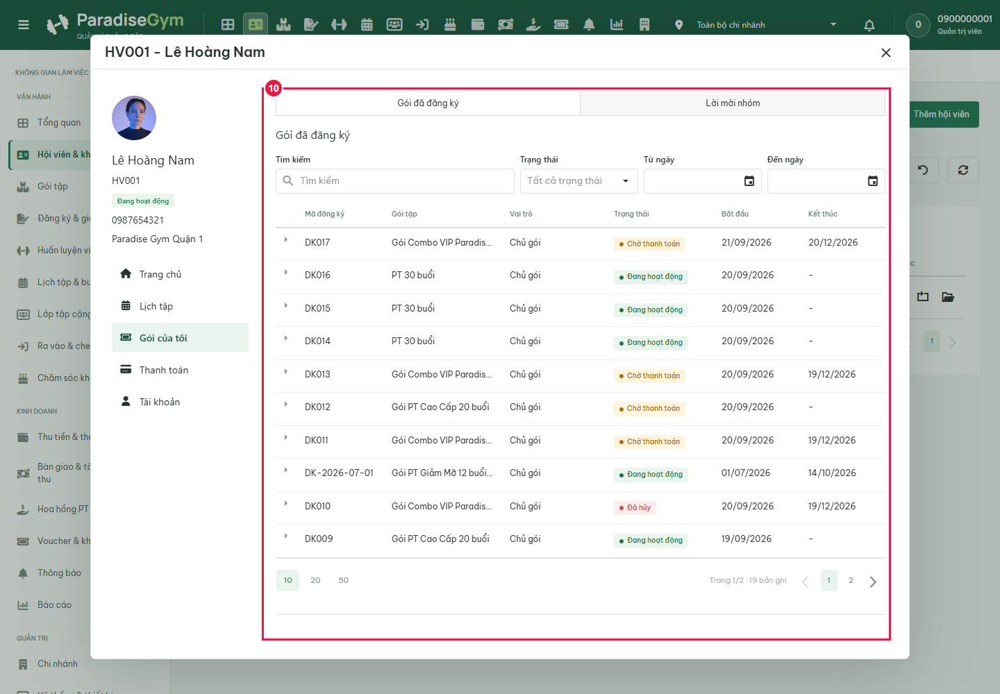

### Step 12: tab-4-payments

- Action/Input: tab 4 payments. Visible inputs: [{"label":"Tìm kiếm","value":""},{"label":"Phương thức","value":""},{"label":"Từ ngày","value":""},{"label":"Đến ngày","value":""}].
- Expected Result: QTV-W02-US04 Main Flow 2-8, popup navigation field table and Business Rules; Product Spec W02: correct active menu and loaded business content
- Actual Result: URL /web/#members; popup=true; title=HV001 - Lê Hoàng Nam; visible alerts=[]; visible grid rows=10. DOM assertions passed; screenshot requires visual audit.
- Status: PASS

### Step 14: tab-5-account

- Action/Input: tab 5 account. Visible inputs: [].
- Expected Result: QTV-W02-US04 Main Flow 2-8, popup navigation field table and Business Rules; Product Spec W02: correct active menu and loaded business content
- Actual Result: URL /web/#members; popup=true; title=HV001 - Lê Hoàng Nam; visible alerts=[]; visible grid rows=0. DOM assertions passed; screenshot requires visual audit.
- Status: PASS

### Step 16: open-packages-for-readonly-filter

- Action/Input: open packages for readonly filter. Visible inputs: [{"label":"Tìm kiếm","value":""},{"label":"Trạng thái","value":""},{"label":"Từ ngày","value":""},{"label":"Đến ngày","value":""}].
- Expected Result: QTV-W02-US04 Main Flow 2-8, popup navigation field table and Business Rules; Product Spec W02
- Actual Result: URL /web/#members; popup=true; title=HV001 - Lê Hoàng Nam; visible alerts=[]; visible grid rows=10. DOM assertions passed; screenshot requires visual audit.
- Status: PASS

### Step 18: clear-package-search

- Action/Input: clear package search. Visible inputs: [{"label":"Tìm kiếm","value":""},{"label":"Trạng thái","value":""},{"label":"Từ ngày","value":""},{"label":"Đến ngày","value":""}].
- Expected Result: Clear readonly search and restore package list
- Actual Result: URL /web/#members; popup=true; title=HV001 - Lê Hoàng Nam; visible alerts=[]; visible grid rows=10. DOM assertions passed; screenshot requires visual audit.
- Status: PASS

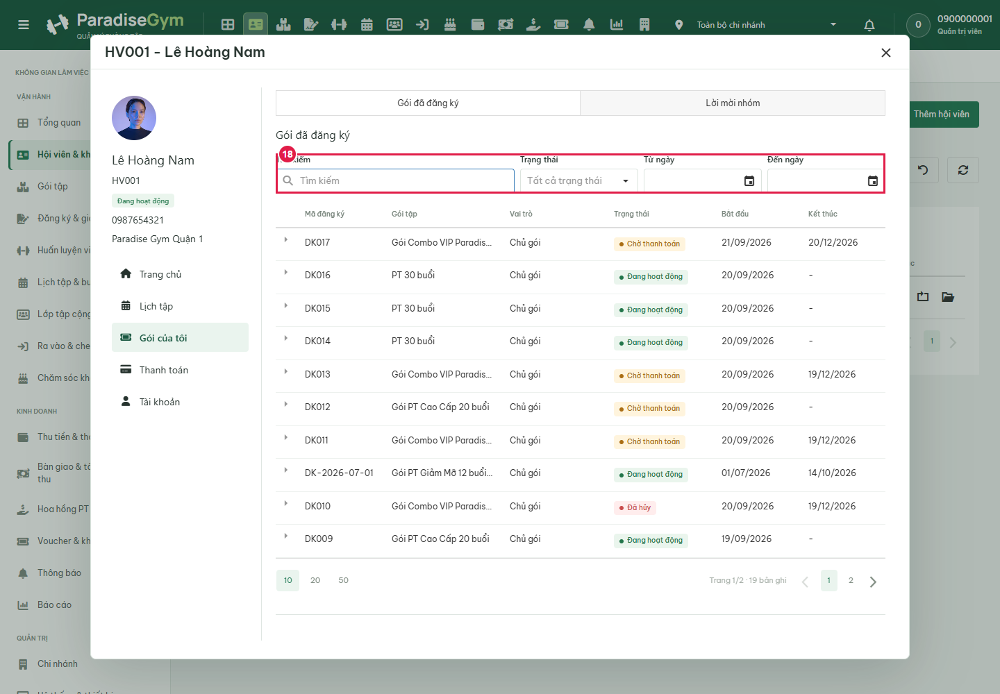

### Step 21: open-schedule-date-filter

- Action/Input: open schedule date filter. Visible inputs: [{"label":"Tìm kiếm","value":""},{"label":"Trạng thái","value":""},{"label":"Từ ngày","value":""},{"label":"Đến ngày","value":""}].
- Expected Result: QTV-W02-US04 Main Flow 2-8, popup navigation field table and Business Rules; Product Spec W02
- Actual Result: URL /web/#members; popup=true; title=HV001 - Lê Hoàng Nam; visible alerts=[]; visible grid rows=10. DOM assertions passed; screenshot requires visual audit.
- Status: PASS

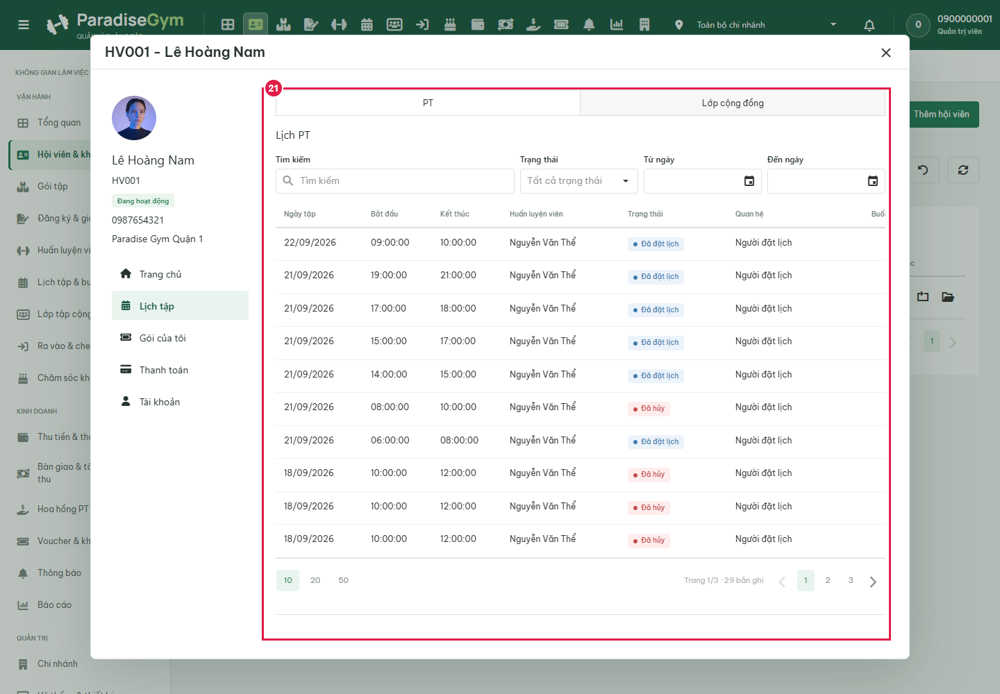

### Step 22: input-from-date-2099-12-31

- Action/Input: input from date 2099 12 31. Visible inputs: [{"label":"Tìm kiếm","value":""},{"label":"Trạng thái","value":""},{"label":"Từ ngày","value":"31/12/2099"},{"label":"Đến ngày","value":""}].
- Expected Result: QTV-W02-US04 filter field table, AF02 and EF03: Ngày bắt đầu phải trước hoặc bằng ngày kết thúc.: capture from date before changing to date
- Actual Result: URL /web/#members; popup=true; title=HV001 - Lê Hoàng Nam; visible alerts=[]; visible grid rows=0. DOM assertions passed; screenshot requires visual audit.
- Status: PASS

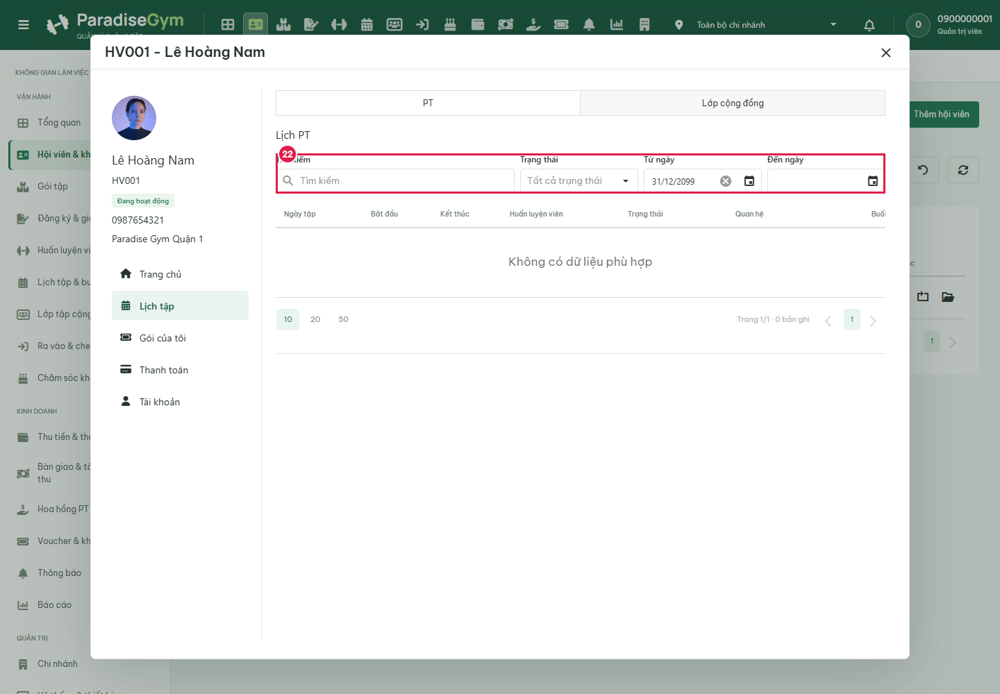

### Step 23: input-to-date-2000-01-01-invalid-range

- Action/Input: input to date 2000 01 01 invalid range. Visible inputs: [{"label":"Tìm kiếm","value":""},{"label":"Trạng thái","value":""},{"label":"Từ ngày","value":"31/12/2099"},{"label":"Đến ngày","value":"01/01/2000"}].
- Expected Result: QTV-W02-US04 filter field table, AF02 and EF03: Ngày bắt đầu phải trước hoặc bằng ngày kết thúc.: reversed interval displays validation error and no misleading data
- Actual Result: URL /web/#members; popup=true; title=HV001 - Lê Hoàng Nam; visible alerts=["Ngày bắt đầu phải trước hoặc bằng ngày kết thúc."]; visible grid rows=0. DOM assertions passed; screenshot requires visual audit.
- Status: PASS

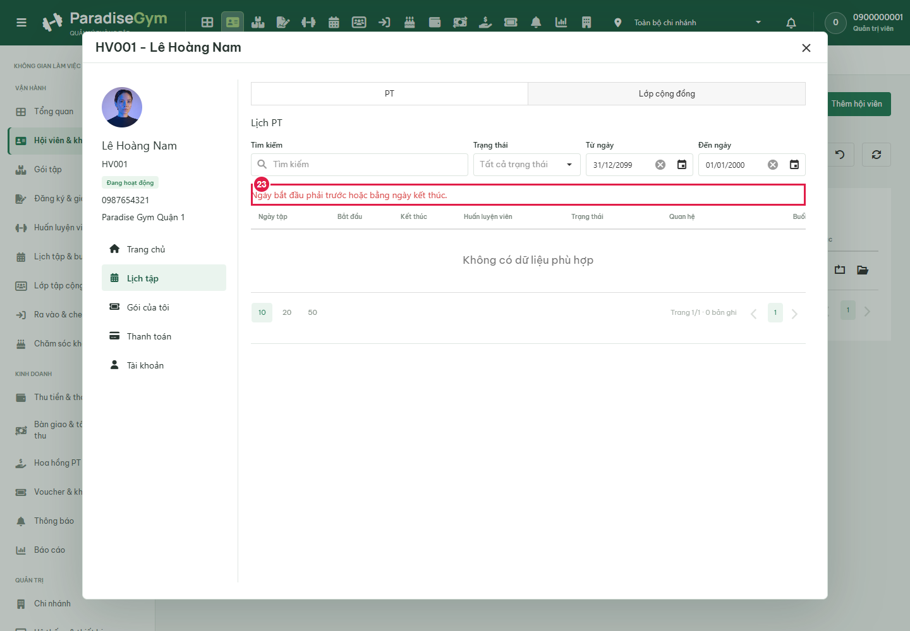

### Step 24: correct-from-date-2000-01-01

- Action/Input: correct from date 2000 01 01. Visible inputs: [{"label":"Tìm kiếm","value":""},{"label":"Trạng thái","value":""},{"label":"Từ ngày","value":"01/01/2000"},{"label":"Đến ngày","value":"01/01/2000"}].
- Expected Result: QTV-W02-US04 filter field table, AF02 and EF03: Ngày bắt đầu phải trước hoặc bằng ngày kết thúc.: corrected interval removes validation error
- Actual Result: URL /web/#members; popup=true; title=HV001 - Lê Hoàng Nam; visible alerts=[]; visible grid rows=0. DOM assertions passed; screenshot requires visual audit.
- Status: PASS

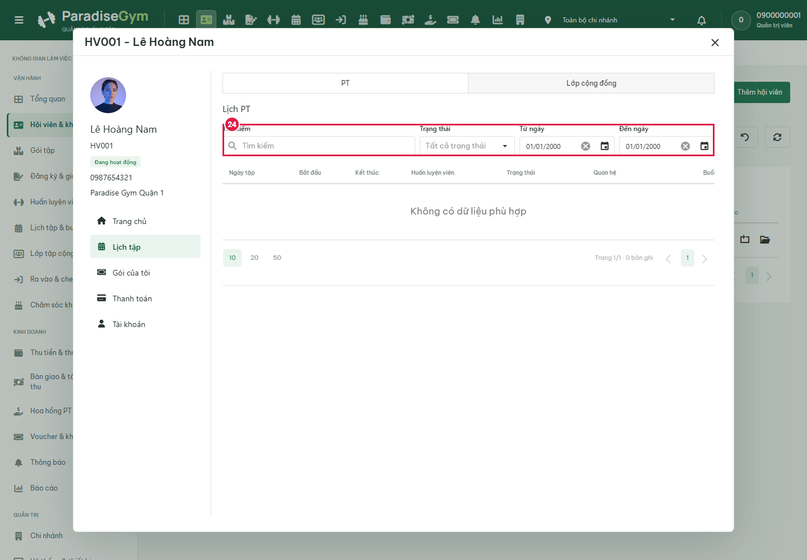

### Step 25: clear-to-date-filter

- Action/Input: clear to date filter. Visible inputs: [{"label":"Tìm kiếm","value":""},{"label":"Trạng thái","value":""},{"label":"Từ ngày","value":"01/01/2000"},{"label":"Đến ngày","value":""}].
- Expected Result: QTV-W02-US04 filter field table, AF02 and EF03: Ngày bắt đầu phải trước hoặc bằng ngày kết thúc.: clear upper bound restores current bookings
- Actual Result: URL /web/#members; popup=true; title=HV001 - Lê Hoàng Nam; visible alerts=[]; visible grid rows=10. DOM assertions passed; screenshot requires visual audit.
- Status: PASS

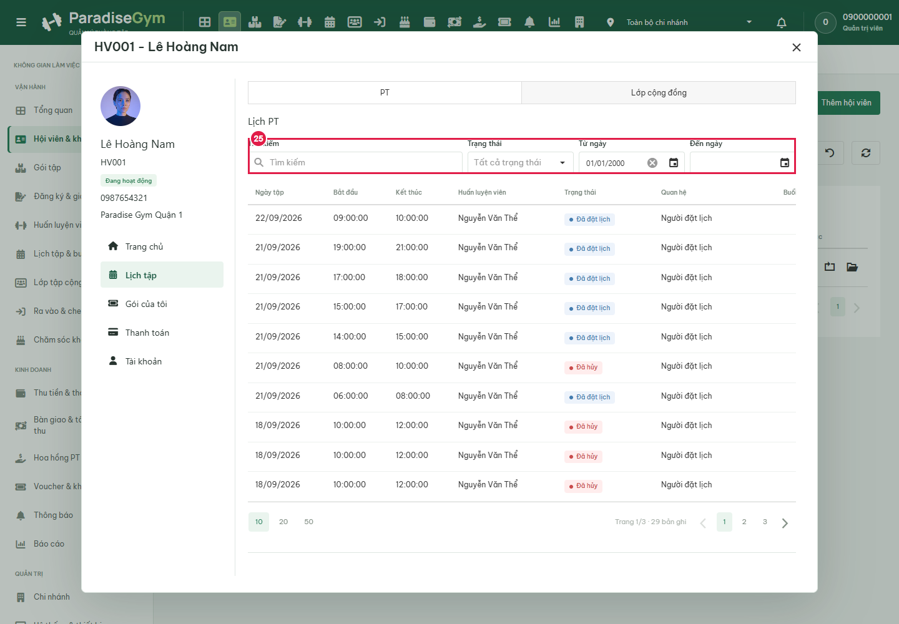

### Step 26: open-payment-tab-for-network-error

- Action/Input: open payment tab for network error. Visible inputs: [{"label":"Tìm kiếm","value":""},{"label":"Phương thức","value":""},{"label":"Từ ngày","value":""},{"label":"Đến ngày","value":""}].
- Expected Result: HV03-US01 payment-card source = confirmed 100% receipts; current user: successful confirmed ledger only
- Actual Result: URL /web/#members; popup=true; title=HV001 - Lê Hoàng Nam; visible alerts=[]; visible grid rows=10. DOM assertions passed; screenshot requires visual audit.
- Status: PASS

### Step 28: abort-payment-get-visible-error

- Action/Input: abort payment get visible error. Visible inputs: [].
- Expected Result: QTV-W02-US04 Main Flow / Field-level specification / Exception Flows: failed payment request shows error, not empty ledger
- Actual Result: URL /web/#members; popup=true; title=HV001 - Lê Hoàng Nam; visible alerts=["Failed to fetch\nThử lại"]; visible grid rows=0. DOM assertions passed; screenshot requires visual audit.
- Status: PASS

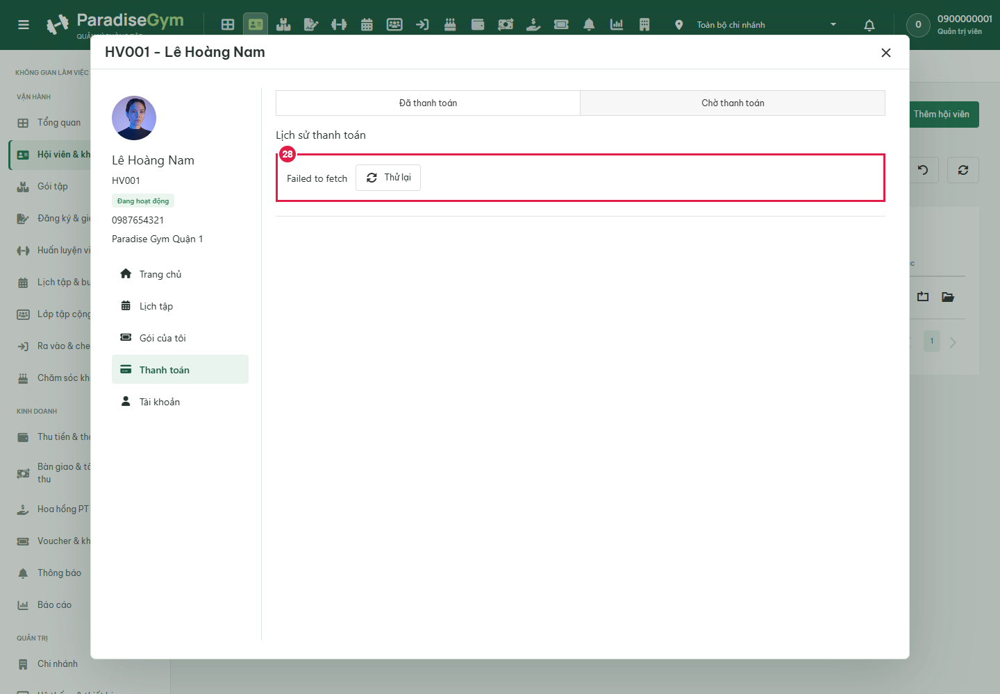

### Step 29: retry-payment-get-real-data

- Action/Input: retry payment get real data. Visible inputs: [{"label":"Tìm kiếm","value":""},{"label":"Phương thức","value":"Chuyển khoản"},{"label":"Từ ngày","value":""},{"label":"Đến ngày","value":""}].
- Expected Result: HV03-US01 payment-card source = confirmed 100% receipts; current user: successful confirmed ledger only: retry after network restoration
- Actual Result: URL /web/#members; popup=true; title=HV001 - Lê Hoàng Nam; visible alerts=[]; visible grid rows=6. DOM assertions passed; screenshot requires visual audit.
- Status: PASS

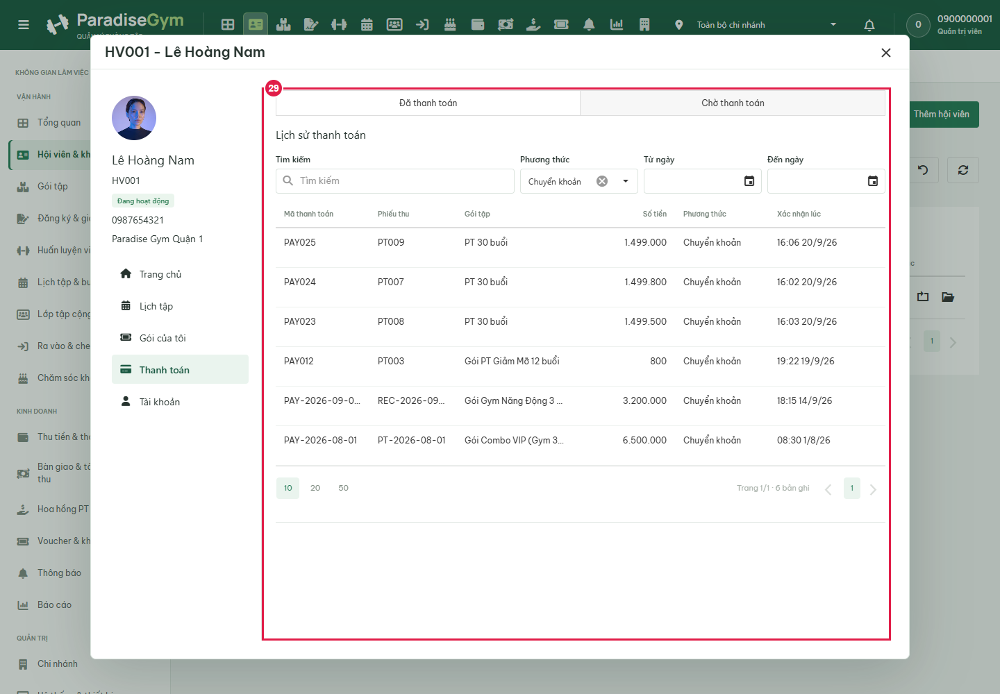

### Step 30: schedule-before-horizontal-scroll

- Action/Input: schedule before horizontal scroll. Visible inputs: [{"label":"Tìm kiếm","value":""},{"label":"Trạng thái","value":""},{"label":"Từ ngày","value":"01/01/2000"},{"label":"Đến ngày","value":""}].
- Expected Result: QTV-W02-US04 Main Flow 2-8, popup navigation field table and Business Rules; Product Spec W02
- Actual Result: URL /web/#members; popup=true; title=HV001 - Lê Hoàng Nam; visible alerts=[]; visible grid rows=10. DOM assertions passed; screenshot requires visual audit.
- Status: PASS

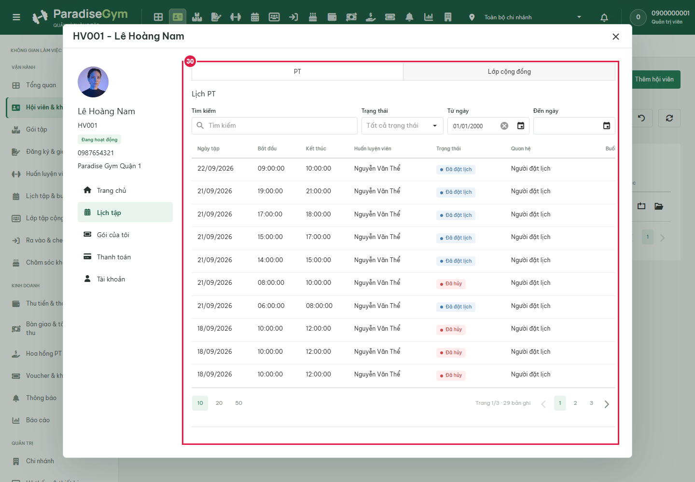

### Step 31: filter-completed-bookings-for-confirmation-evidence

- Action/Input: filter completed bookings for confirmation evidence. Visible inputs: [{"label":"Tìm kiếm","value":""},{"label":"Trạng thái","value":"Hoàn thành"},{"label":"Từ ngày","value":"01/01/2000"},{"label":"Đến ngày","value":""}].
- Expected Result: QTV-W02-US04 Main Flow 2-8, popup navigation field table and Business Rules; Product Spec W02: completed status filter matches real projection
- Actual Result: URL /web/#members; popup=true; title=HV001 - Lê Hoàng Nam; visible alerts=[]; visible grid rows=10. DOM assertions passed; screenshot requires visual audit.
- Status: PASS

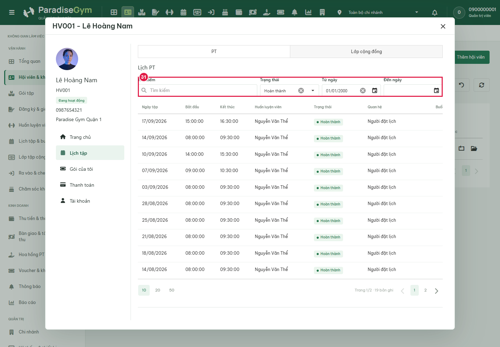

### Step 34: packages-before-invitations-subtab

- Action/Input: packages before invitations subtab. Visible inputs: [{"label":"Tìm kiếm","value":""},{"label":"Trạng thái","value":"Chờ thanh toán"},{"label":"Từ ngày","value":""},{"label":"Đến ngày","value":""}].
- Expected Result: QTV-W02-US04 Main Flow 2-8, popup navigation field table and Business Rules; Product Spec W02
- Actual Result: URL /web/#members; popup=true; title=HV001 - Lê Hoàng Nam; visible alerts=[]; visible grid rows=7. DOM assertions passed; screenshot requires visual audit.
- Status: PASS

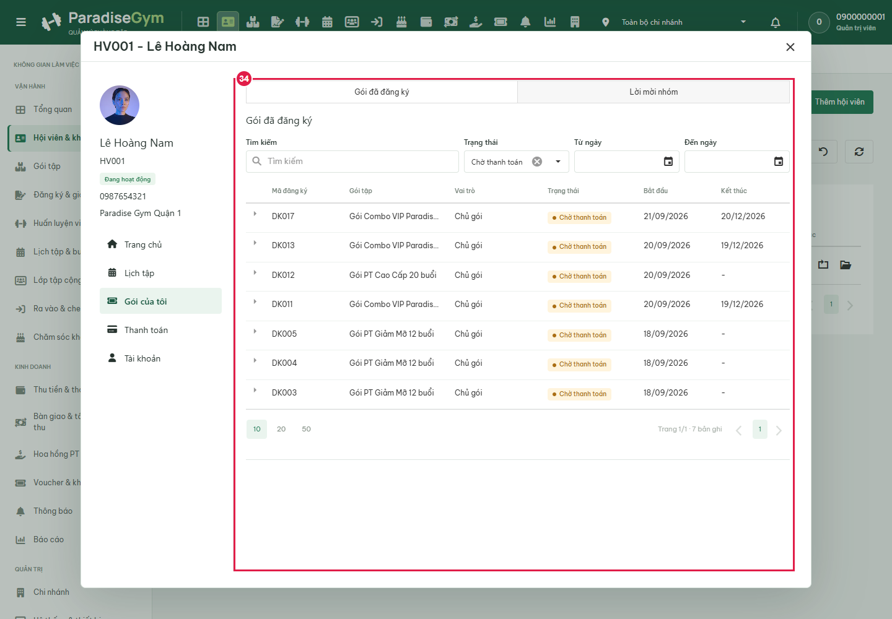

### Step 36: payment-ledger-before-pagination

- Action/Input: payment ledger before pagination. Visible inputs: [{"label":"Tìm kiếm","value":""},{"label":"Phương thức","value":"Chuyển khoản"},{"label":"Từ ngày","value":""},{"label":"Đến ngày","value":""}].
- Expected Result: HV03-US01 payment-card source = confirmed 100% receipts; current user: successful confirmed ledger only
- Actual Result: URL /web/#members; popup=true; title=HV001 - Lê Hoàng Nam; visible alerts=[]; visible grid rows=6. DOM assertions passed; screenshot requires visual audit.
- Status: PASS

### Step 37: clear-payment-method-before-pagination

- Action/Input: clear payment method before pagination. Visible inputs: [{"label":"Tìm kiếm","value":""},{"label":"Phương thức","value":""},{"label":"Từ ngày","value":""},{"label":"Đến ngày","value":""}].
- Expected Result: HV03-US01 payment-card source = confirmed 100% receipts; current user: successful confirmed ledger only: clear method filter and display complete confirmed ledger
- Actual Result: URL /web/#members; popup=true; title=HV001 - Lê Hoàng Nam; visible alerts=[]; visible grid rows=10. DOM assertions passed; screenshot requires visual audit.
- Status: PASS

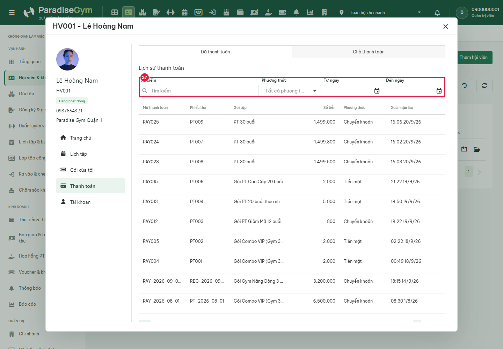

### Step 41: narrow-popup-viewport-900

- Action/Input: narrow popup viewport 900. Visible inputs: [{"label":"Tìm kiếm","value":""},{"label":"Trạng thái","value":""},{"label":"Từ ngày","value":""},{"label":"Đến ngày","value":""}].
- Expected Result: QTV-W02-US04 Main Flow 2-8, popup navigation field table and Business Rules; Product Spec W02: popup and navigation remain inside viewport
- Actual Result: URL /web/#members; popup=true; title=HV001 - Lê Hoàng Nam; visible alerts=[]; visible grid rows=7. DOM assertions passed; screenshot requires visual audit.
- Status: PASS

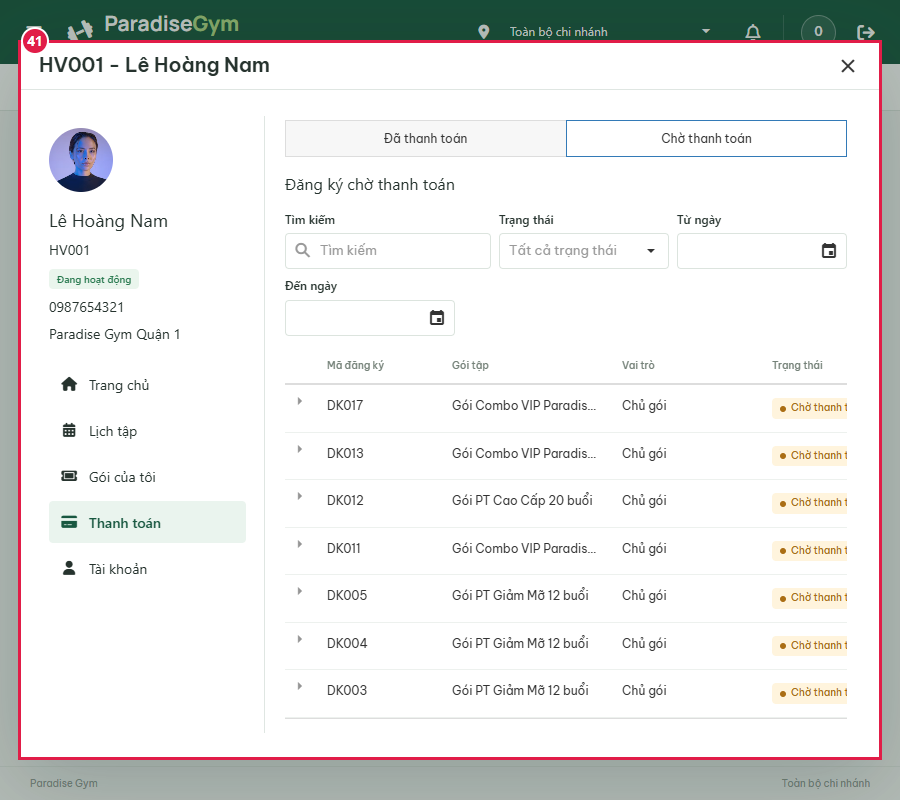

### Step 42: close-popup-before-scope-change

- Action/Input: close popup before scope change. Visible inputs: [{"label":"Chi nhánh làm việc","value":"Toàn bộ chi nhánh"},{"label":"Mã HV, họ tên, SĐT","value":"0987654321"},{"label":"Lựa chọn...","value":"Tất cả trạng thái"},{"label":"Lựa chọn...","value":"Tất cả trong phạm vi"}].
- Expected Result: Close profile before changing branch scope
- Actual Result: URL /web/#members; popup=false; title=-; visible alerts=[]; visible grid rows=1. DOM assertions passed; screenshot requires visual audit.
- Status: PASS

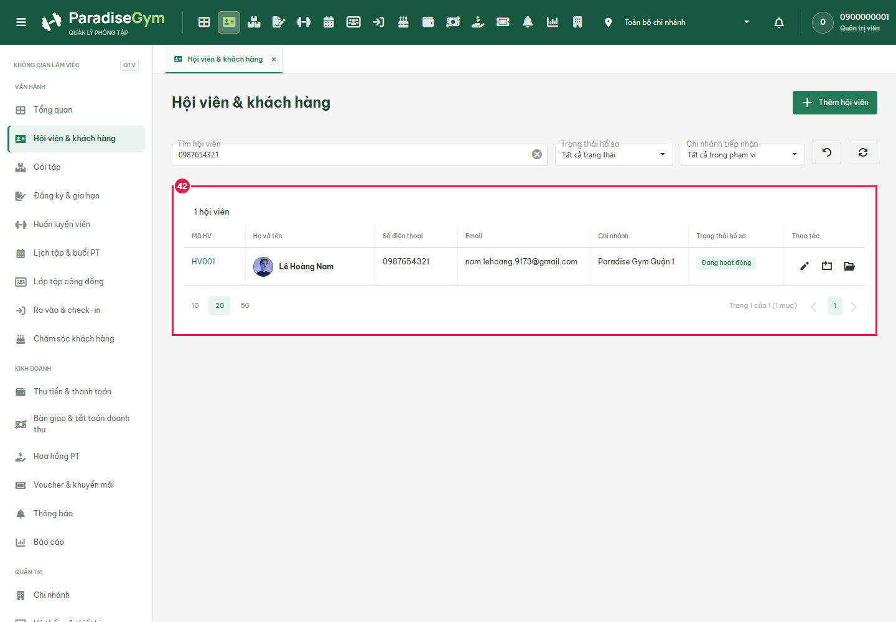

### Step 45: close-branch-A-popup

- Action/Input: close branch A popup. Visible inputs: [{"label":"Chi nhánh làm việc","value":"Paradise Gym Bình Thạnh"},{"label":"Mã HV, họ tên, SĐT","value":""},{"label":"Lựa chọn...","value":"Tất cả trạng thái"},{"label":"Lựa chọn...","value":"Paradise Gym Bình Thạnh"}].
- Expected Result: Close readonly profile before next scope
- Actual Result: URL /web/#members; popup=false; title=-; visible alerts=[]; visible grid rows=2. DOM assertions passed; screenshot requires visual audit.
- Status: PASS

### Step 48: close-branch-B-popup

- Action/Input: close branch B popup. Visible inputs: [{"label":"Chi nhánh làm việc","value":"Paradise Gym Quận 1"},{"label":"Mã HV, họ tên, SĐT","value":""},{"label":"Lựa chọn...","value":"Tất cả trạng thái"},{"label":"Lựa chọn...","value":"Paradise Gym Quận 1"}].
- Expected Result: Close readonly profile before next scope
- Actual Result: URL /web/#members; popup=false; title=-; visible alerts=[]; visible grid rows=20. DOM assertions passed; screenshot requires visual audit.
- Status: PASS

### Step 51: close-branch-ALL-popup

- Action/Input: close branch ALL popup. Visible inputs: [{"label":"Chi nhánh làm việc","value":"Toàn bộ chi nhánh"},{"label":"Mã HV, họ tên, SĐT","value":""},{"label":"Lựa chọn...","value":"Tất cả trạng thái"},{"label":"Lựa chọn...","value":"Tất cả trong phạm vi"}].
- Expected Result: Close readonly profile before next scope
- Actual Result: URL /web/#members; popup=false; title=-; visible alerts=[]; visible grid rows=20. DOM assertions passed; screenshot requires visual audit.
- Status: PASS

### Step 52: network-abort-member-list

- Action/Input: network abort member list. Visible inputs: [{"label":"Chi nhánh làm việc","value":"Toàn bộ chi nhánh"},{"label":"Mã HV, họ tên, SĐT","value":""},{"label":"Lựa chọn...","value":"Tất cả trạng thái"},{"label":"Lựa chọn...","value":"Tất cả trong phạm vi"}].
- Expected Result: QTV-W02-US04 Main Flow / Field-level specification / Exception Flows: loading error is visible and retry offered
- Actual Result: URL /web/#members; popup=false; title=-; visible alerts=["Failed to fetch\nThử lại"]; visible grid rows=0. DOM assertions passed; screenshot requires visual audit.
- Status: PASS

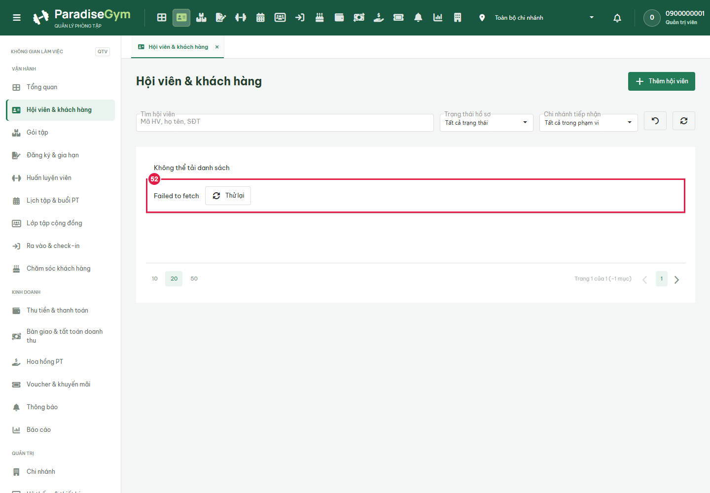

### Step 53: network-retry-member-list

- Action/Input: network retry member list. Visible inputs: [{"label":"Chi nhánh làm việc","value":"Toàn bộ chi nhánh"},{"label":"Mã HV, họ tên, SĐT","value":""},{"label":"Lựa chọn...","value":"Tất cả trạng thái"},{"label":"Lựa chọn...","value":"Tất cả trong phạm vi"}].
- Expected Result: QTV-W02-US04 Main Flow / Field-level specification / Exception Flows: retry loads real rows after network restored
- Actual Result: URL /web/#members; popup=false; title=-; visible alerts=[]; visible grid rows=20. DOM assertions passed; screenshot requires visual audit.
- Status: PASS

## State Verification

### Step 7: home-active-packages-confirmed-paid-only

- Action/Input: home active packages confirmed paid only. Visible inputs: [{"label":"Tìm kiếm","value":""},{"label":"Trạng thái","value":""},{"label":"Tìm kiếm","value":""},{"label":"Tìm kiếm","value":""},{"label":"Trạng thái","value":""}].
- Expected Result: QTV-W02-US04 Main Flow 2-8, popup navigation field table and Business Rules; Product Spec W02; main correction: ACTIVE and is_paid === true only
- Actual Result: URL /web/#members; popup=true; title=HV001 - Lê Hoàng Nam; visible alerts=[]; visible grid rows=11. DOM assertions passed; screenshot requires visual audit.
- Status: PASS

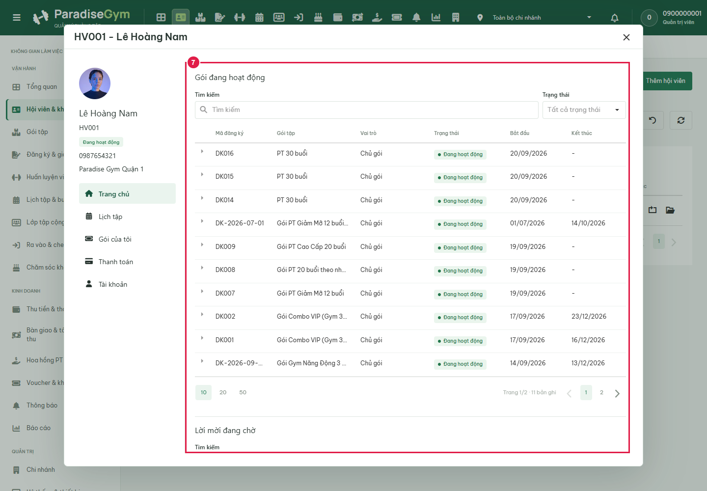

### Step 9: booking-statuses-match-overview

- Action/Input: booking statuses match overview. Visible inputs: [{"label":"Tìm kiếm","value":""},{"label":"Trạng thái","value":""},{"label":"Từ ngày","value":""},{"label":"Đến ngày","value":""}].
- Expected Result: QTV-W02-US04 Main Flow 2-8, popup navigation field table and Business Rules; Product Spec W02: displayed IDs/statuses are the same selected-member projection
- Actual Result: URL /web/#members; popup=true; title=HV001 - Lê Hoàng Nam; visible alerts=[]; visible grid rows=10. DOM assertions passed; screenshot requires visual audit.
- Status: PASS

### Step 11: registration-statuses-match-overview

- Action/Input: registration statuses match overview. Visible inputs: [{"label":"Tìm kiếm","value":""},{"label":"Trạng thái","value":""},{"label":"Từ ngày","value":""},{"label":"Đến ngày","value":""}].
- Expected Result: QTV-W02-US04 Main Flow 2-8, popup navigation field table and Business Rules; Product Spec W02: displayed IDs/statuses are the same selected-member projection
- Actual Result: URL /web/#members; popup=true; title=HV001 - Lê Hoàng Nam; visible alerts=[]; visible grid rows=10. DOM assertions passed; screenshot requires visual audit.
- Status: PASS

### Step 13: confirmed-payment-ledger-only

- Action/Input: confirmed payment ledger only. Visible inputs: [{"label":"Tìm kiếm","value":""},{"label":"Phương thức","value":""},{"label":"Từ ngày","value":""},{"label":"Đến ngày","value":""}].
- Expected Result: HV03-US01 payment-card source = confirmed 100% receipts; current user: successful confirmed ledger only
- Actual Result: URL /web/#members; popup=true; title=HV001 - Lê Hoàng Nam; visible alerts=[]; visible grid rows=10. DOM assertions passed; screenshot requires visual audit.
- Status: PASS

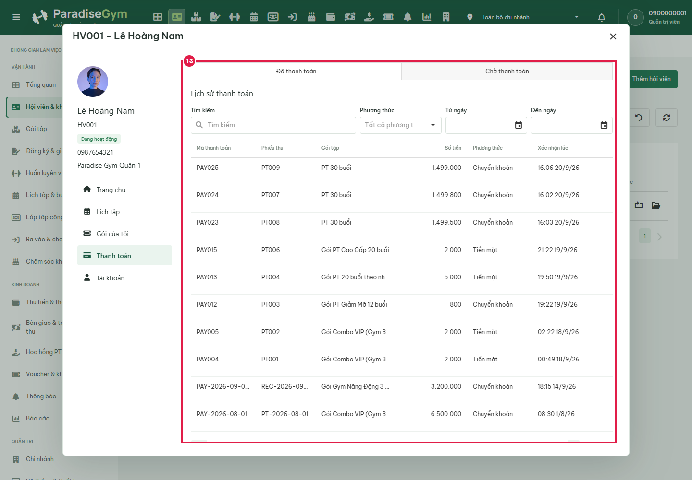

### Step 15: readonly-identity-without-biometric-claim

- Action/Input: readonly identity without biometric claim. Visible inputs: [].
- Expected Result: QTV-W02-US04 Main Flow 2-8, popup navigation field table and Business Rules; Product Spec W02: readonly identity only; no FaceID/enrollment claim derived from avatar
- Actual Result: URL /web/#members; popup=true; title=HV001 - Lê Hoàng Nam; visible alerts=[]; visible grid rows=0. DOM assertions passed; screenshot requires visual audit.
- Status: PASS

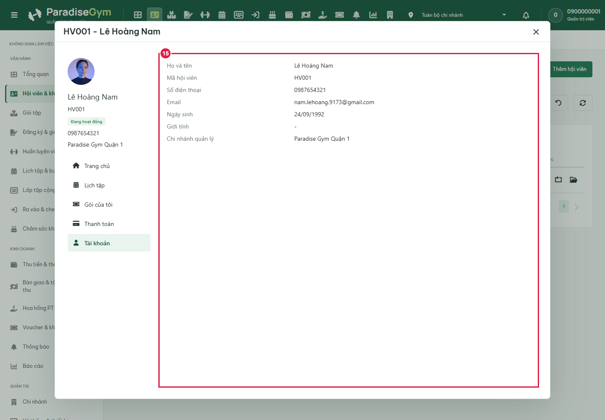

### Step 17: package-search-input-auto-applies

- Action/Input: package search input auto applies. Visible inputs: [{"label":"Tìm kiếm","value":"DK017"},{"label":"Trạng thái","value":""},{"label":"Từ ngày","value":""},{"label":"Đến ngày","value":""}].
- Expected Result: QTV-W02-US04 Main Flow 2-8, popup navigation field table and Business Rules; Product Spec W02: search actual registration code, capture input (auto-apply; no submit button)
- Actual Result: URL /web/#members; popup=true; title=HV001 - Lê Hoàng Nam; visible alerts=[]; visible grid rows=1. DOM assertions passed; screenshot requires visual audit.
- Status: PASS

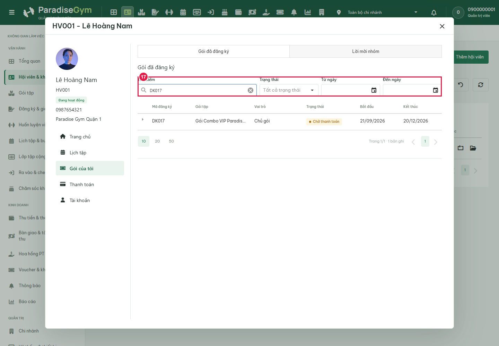

### Step 19: expand-same-registration-entitlements

- Action/Input: expand same registration entitlements. Visible inputs: [{"label":"Tìm kiếm","value":""},{"label":"Trạng thái","value":""},{"label":"Từ ngày","value":""},{"label":"Đến ngày","value":""}].
- Expected Result: QTV-W02-US04 Main Flow 2-8, popup navigation field table and Business Rules; Product Spec W02: expanded row shows package-level rights, assigned PT and allowed branches from same registration
- Actual Result: URL /web/#members; popup=true; title=HV001 - Lê Hoàng Nam; visible alerts=[]; visible grid rows=10. DOM assertions passed; screenshot requires visual audit.
- Status: PASS

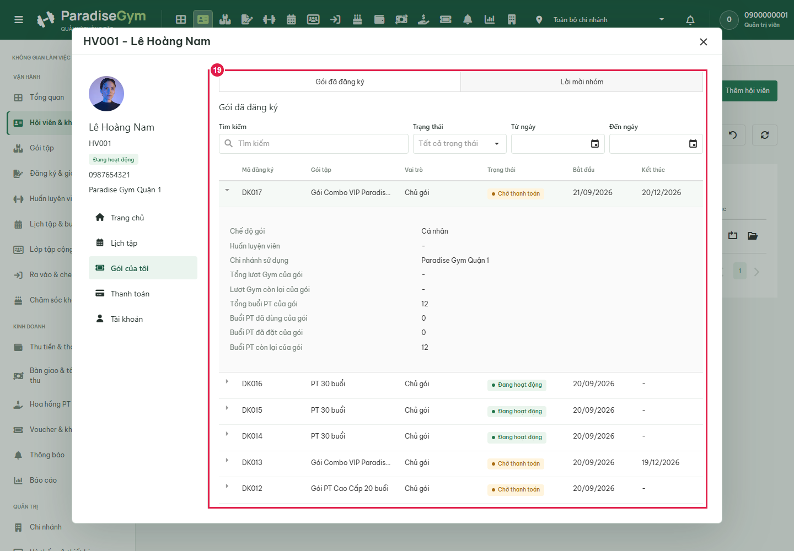

### Step 20: filter-existing-package-status

- Action/Input: filter existing package status. Visible inputs: [{"label":"Tìm kiếm","value":""},{"label":"Trạng thái","value":"Chờ thanh toán"},{"label":"Từ ngày","value":""},{"label":"Đến ngày","value":""}].
- Expected Result: QTV-W02-US04 Main Flow 2-8, popup navigation field table and Business Rules; Product Spec W02: filter uses real registration status; no status mutation
- Actual Result: URL /web/#members; popup=true; title=HV001 - Lê Hoàng Nam; visible alerts=[]; visible grid rows=7. DOM assertions passed; screenshot requires visual audit.
- Status: PASS

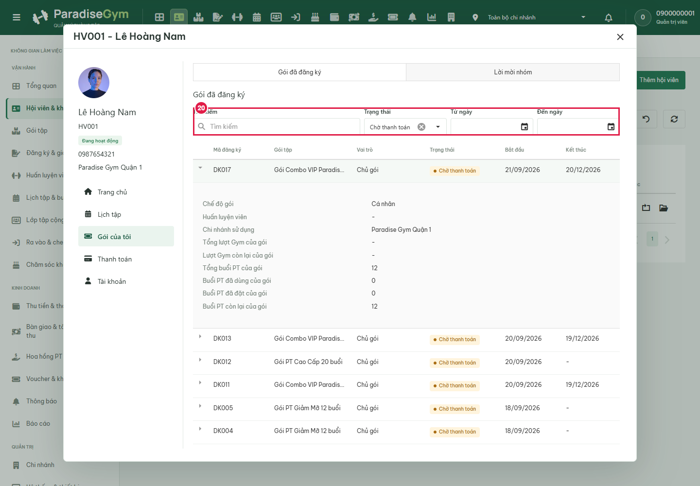

### Step 27: payment-method-filter-confirmed-ledger

- Action/Input: payment method filter confirmed ledger. Visible inputs: [{"label":"Tìm kiếm","value":""},{"label":"Phương thức","value":"Chuyển khoản"},{"label":"Từ ngày","value":""},{"label":"Đến ngày","value":""}].
- Expected Result: HV03-US01 payment-card source = confirmed 100% receipts; current user: successful confirmed ledger only: method filter only matches actual confirmed records; no payment-status dropdown
- Actual Result: URL /web/#members; popup=true; title=HV001 - Lê Hoàng Nam; visible alerts=[]; visible grid rows=6. DOM assertions passed; screenshot requires visual audit.
- Status: PASS

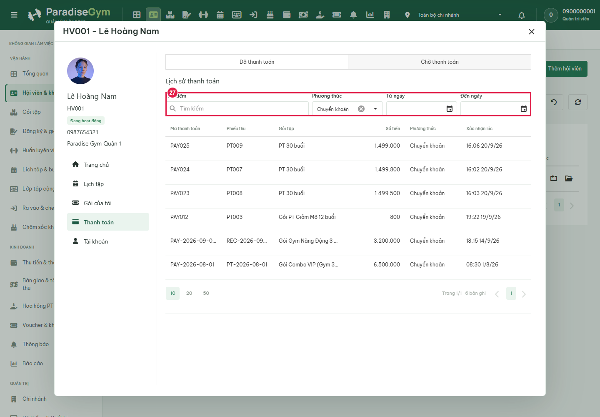

### Step 32: schedule-right-columns-confirmations

- Action/Input: schedule right columns confirmations. Visible inputs: [{"label":"Tìm kiếm","value":""},{"label":"Trạng thái","value":"Hoàn thành"},{"label":"Từ ngày","value":"01/01/2000"},{"label":"Đến ngày","value":""}].
- Expected Result: QTV-W02-US04 Main Flow 2-8, popup navigation field table and Business Rules; Product Spec W02: scroll to actual confirmation and assessment columns
- Actual Result: URL /web/#members; popup=true; title=HV001 - Lê Hoàng Nam; visible alerts=[]; visible grid rows=10. DOM assertions passed; screenshot requires visual audit.
- Status: PASS

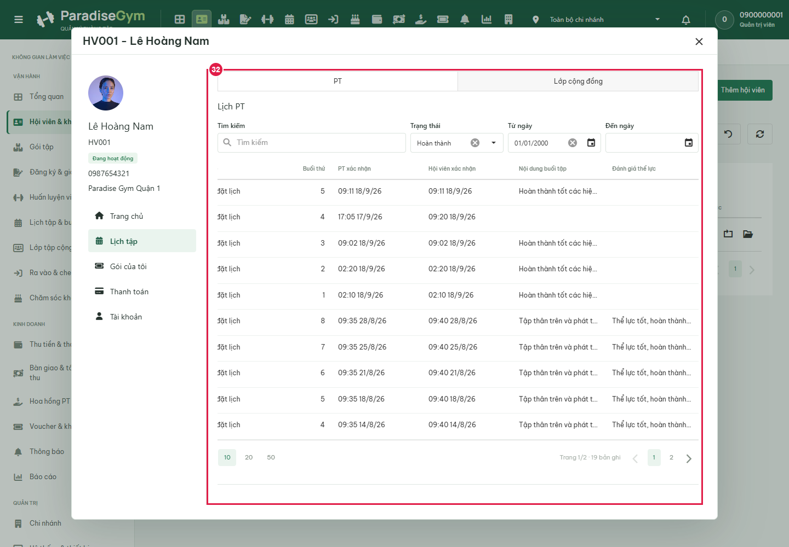

### Step 33: community-subtab-same-member-projection

- Action/Input: community subtab same member projection. Visible inputs: [{"label":"Tìm kiếm","value":""},{"label":"Từ ngày","value":""},{"label":"Đến ngày","value":""}].
- Expected Result: QTV-W02-US04 Main Flow 2-8, popup navigation field table and Business Rules; Product Spec W02: registered community classes match overview.community_registrations, including genuine empty state
- Actual Result: URL /web/#members; popup=true; title=HV001 - Lê Hoàng Nam; visible alerts=[]; visible grid rows=0. DOM assertions passed; screenshot requires visual audit.
- Status: PASS

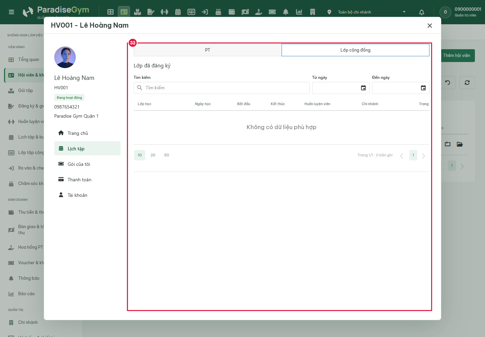

### Step 35: group-invitations-subtab-same-member-projection

- Action/Input: group invitations subtab same member projection. Visible inputs: [{"label":"Tìm kiếm","value":""},{"label":"Trạng thái","value":""},{"label":"Từ ngày","value":""},{"label":"Đến ngày","value":""}].
- Expected Result: QTV-W02-US04 Main Flow 2-8, popup navigation field table and Business Rules; Product Spec W02: invitations match sent/received IDs and status from same selected member
- Actual Result: URL /web/#members; popup=true; title=HV001 - Lê Hoàng Nam; visible alerts=[]; visible grid rows=1. DOM assertions passed; screenshot requires visual audit.
- Status: PASS

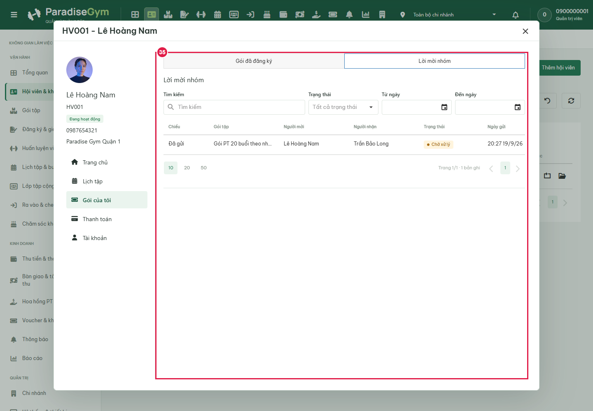

### Step 38: payment-ledger-second-page

- Action/Input: payment ledger second page. Visible inputs: [{"label":"Tìm kiếm","value":""},{"label":"Phương thức","value":""},{"label":"Từ ngày","value":""},{"label":"Đến ngày","value":""}].
- Expected Result: HV03-US01 payment-card source = confirmed 100% receipts; current user: successful confirmed ledger only: confirmed ledger contains remaining record on actual page 2
- Actual Result: URL /web/#members; popup=true; title=HV001 - Lê Hoàng Nam; visible alerts=[]; visible grid rows=1. DOM assertions passed; screenshot requires visual audit.
- Status: PASS

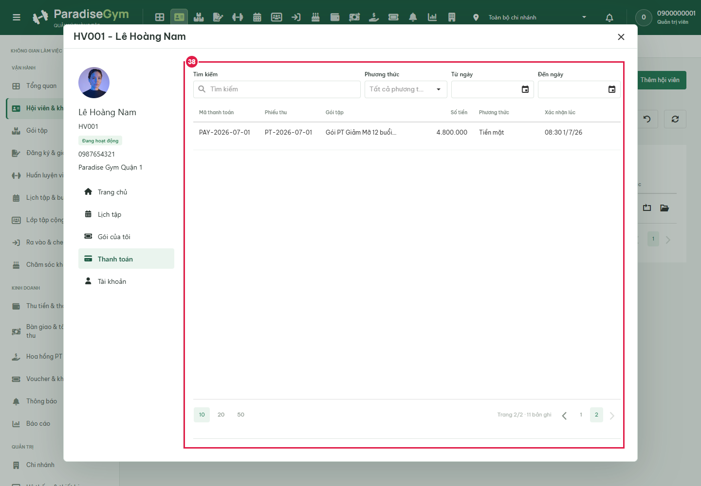

### Step 39: open-readonly-receipt-matching-payment

- Action/Input: open readonly receipt matching payment. Visible inputs: [{"label":"Tìm kiếm","value":""},{"label":"Phương thức","value":""},{"label":"Từ ngày","value":""},{"label":"Đến ngày","value":""}].
- Expected Result: QTV-W02-US04 receipt field table: inline receipt matches selected payment, no writes
- Actual Result: URL /web/#members; popup=true; title=HV001 - Lê Hoàng Nam; visible alerts=[]; visible grid rows=1. DOM assertions passed; screenshot requires visual audit.
- Status: PASS

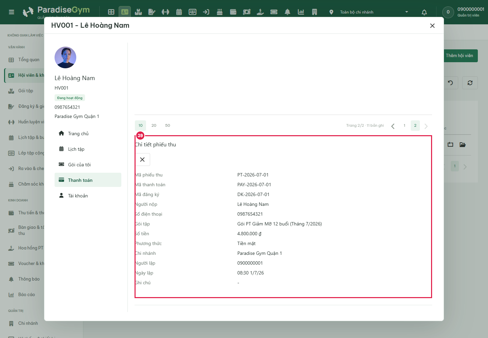

### Step 40: pending-payment-subtab-same-member-projection

- Action/Input: pending payment subtab same member projection. Visible inputs: [{"label":"Tìm kiếm","value":""},{"label":"Trạng thái","value":""},{"label":"Từ ngày","value":""},{"label":"Đến ngày","value":""}].
- Expected Result: QTV-W02-US04 Main Flow 2-8, popup navigation field table and Business Rules; Product Spec W02: pending owned registrations are separate from confirmed ledger
- Actual Result: URL /web/#members; popup=true; title=HV001 - Lê Hoàng Nam; visible alerts=[]; visible grid rows=7. DOM assertions passed; screenshot requires visual audit.
- Status: PASS

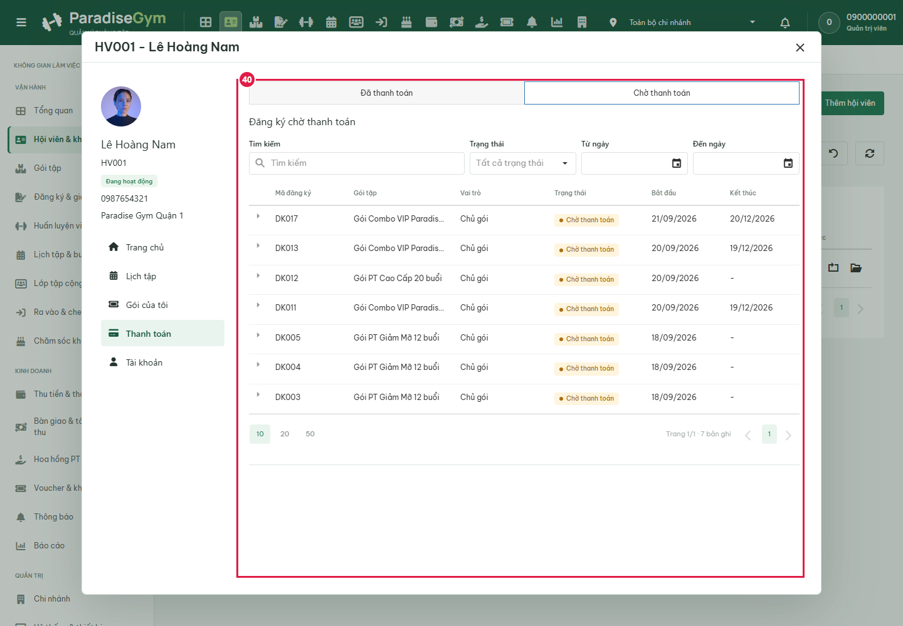

### Step 43: branch-scope-A

- Action/Input: branch scope A. Visible inputs: [{"label":"Chi nhánh làm việc","value":"Paradise Gym Bình Thạnh"},{"label":"Mã HV, họ tên, SĐT","value":""},{"label":"Lựa chọn...","value":"Tất cả trạng thái"},{"label":"Lựa chọn...","value":"Paradise Gym Bình Thạnh"}].
- Expected Result: QTV-W02-US04 Main Flow / Field-level specification / Exception Flows: selected branch determines actual visible members
- Actual Result: URL /web/#members; popup=false; title=-; visible alerts=[]; visible grid rows=2. DOM assertions passed; screenshot requires visual audit.
- Status: PASS

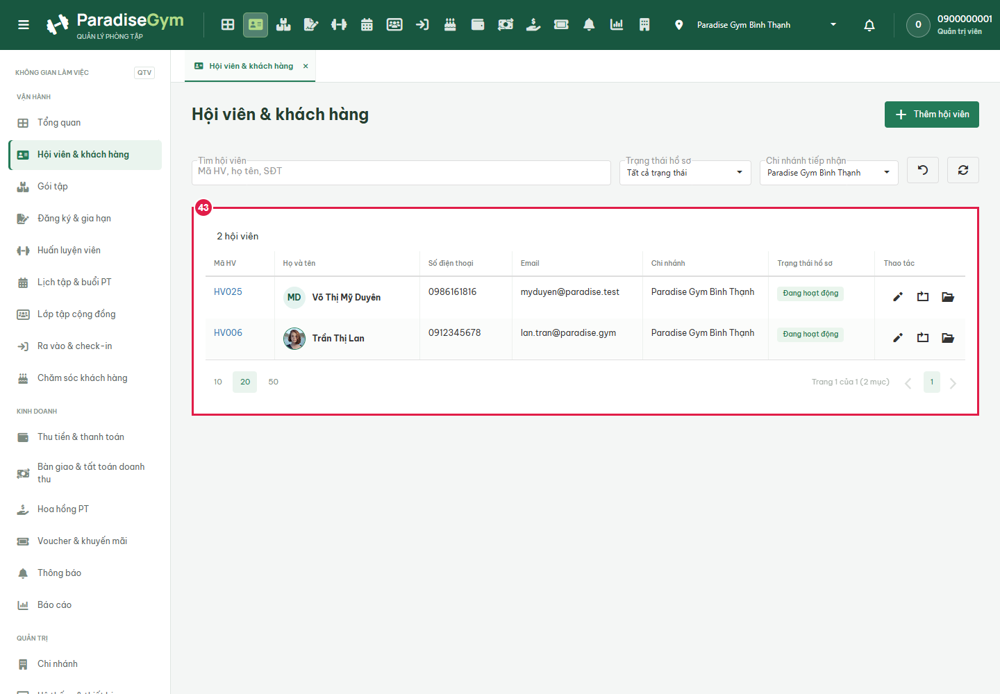

### Step 44: branch-A-popup-retains-scope

- Action/Input: branch A popup retains scope. Visible inputs: [{"label":"Tìm kiếm","value":""},{"label":"Tìm kiếm","value":""},{"label":"Tìm kiếm","value":""}].
- Expected Result: QTV-W02-US04 Main Flow 2-8, popup navigation field table and Business Rules; Product Spec W02: popup GET retains selected branch header and same clicked member
- Actual Result: URL /web/#members; popup=true; title=HV025 - Võ Thị Mỹ Duyên; visible alerts=[]; visible grid rows=0. DOM assertions passed; screenshot requires visual audit.
- Status: PASS

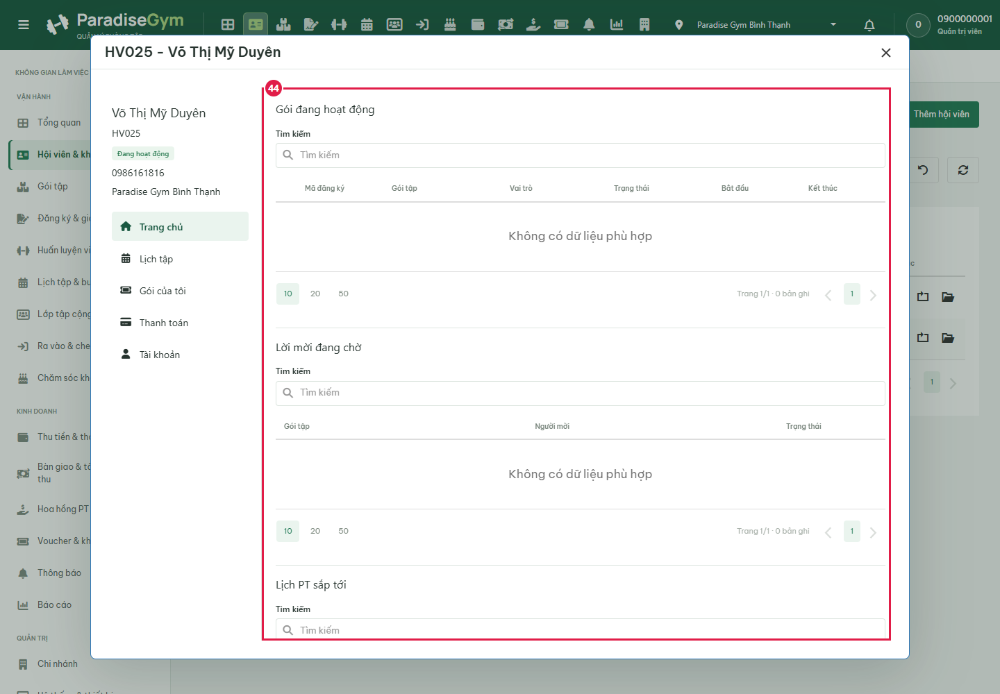

### Step 46: branch-scope-B

- Action/Input: branch scope B. Visible inputs: [{"label":"Chi nhánh làm việc","value":"Paradise Gym Quận 1"},{"label":"Mã HV, họ tên, SĐT","value":""},{"label":"Lựa chọn...","value":"Tất cả trạng thái"},{"label":"Lựa chọn...","value":"Paradise Gym Quận 1"}].
- Expected Result: QTV-W02-US04 Main Flow / Field-level specification / Exception Flows: selected branch determines actual visible members
- Actual Result: URL /web/#members; popup=false; title=-; visible alerts=[]; visible grid rows=20. DOM assertions passed; screenshot requires visual audit.
- Status: PASS

### Step 47: branch-B-popup-retains-scope

- Action/Input: branch B popup retains scope. Visible inputs: [{"label":"Tìm kiếm","value":""},{"label":"Tìm kiếm","value":""},{"label":"Tìm kiếm","value":""}].
- Expected Result: QTV-W02-US04 Main Flow 2-8, popup navigation field table and Business Rules; Product Spec W02: popup GET retains selected branch header and same clicked member
- Actual Result: URL /web/#members; popup=true; title=HV026 - Trần Bảo Long; visible alerts=[]; visible grid rows=0. DOM assertions passed; screenshot requires visual audit.
- Status: PASS

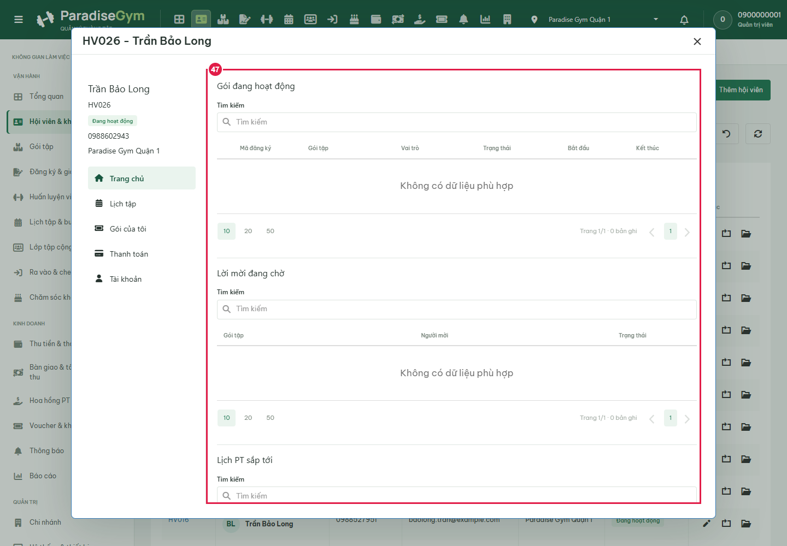

### Step 49: branch-scope-ALL

- Action/Input: branch scope ALL. Visible inputs: [{"label":"Chi nhánh làm việc","value":"Toàn bộ chi nhánh"},{"label":"Mã HV, họ tên, SĐT","value":""},{"label":"Lựa chọn...","value":"Tất cả trạng thái"},{"label":"Lựa chọn...","value":"Tất cả trong phạm vi"}].
- Expected Result: QTV-W02-US04 Main Flow / Field-level specification / Exception Flows: selected branch determines actual visible members
- Actual Result: URL /web/#members; popup=false; title=-; visible alerts=[]; visible grid rows=20. DOM assertions passed; screenshot requires visual audit.
- Status: PASS

### Step 50: branch-ALL-popup-retains-scope

- Action/Input: branch ALL popup retains scope. Visible inputs: [{"label":"Tìm kiếm","value":""},{"label":"Tìm kiếm","value":""},{"label":"Tìm kiếm","value":""}].
- Expected Result: QTV-W02-US04 Main Flow 2-8, popup navigation field table and Business Rules; Product Spec W02: popup GET retains selected branch header and same clicked member
- Actual Result: URL /web/#members; popup=true; title=HV026 - Trần Bảo Long; visible alerts=[]; visible grid rows=0. DOM assertions passed; screenshot requires visual audit.
- Status: PASS

### Step 54: qtv-popup-does-not-fetch-legacy-profile

- Action/Input: qtv popup does not fetch legacy profile. Visible inputs: [{"label":"Chi nhánh làm việc","value":"Toàn bộ chi nhánh"},{"label":"Mã HV, họ tên, SĐT","value":""},{"label":"Lựa chọn...","value":"Tất cả trạng thái"},{"label":"Lựa chọn...","value":"Tất cả trong phạm vi"}].
- Expected Result: QTV-W02-US04 Main Flow 2: browser uses whitelist overview projection, no legacy detail overfetch
- Actual Result: URL /web/#members; popup=false; title=-; visible alerts=[]; visible grid rows=20. DOM assertions passed; screenshot requires visual audit.
- Status: PASS

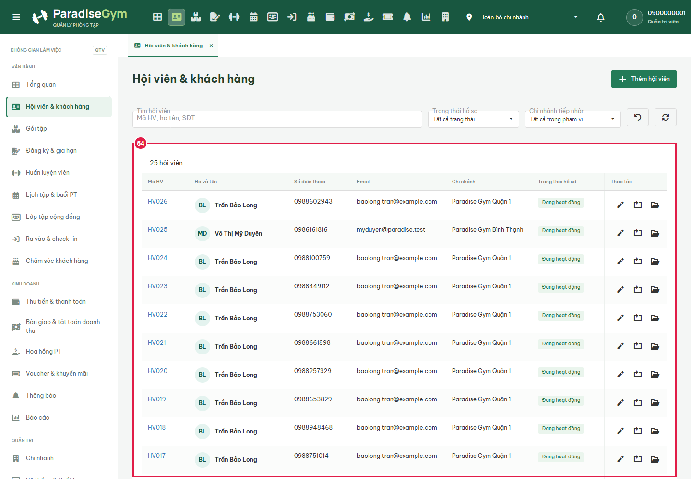

### Step 61: receptionist-existing-members-list

- Action/Input: receptionist existing members list. Visible inputs: [{"label":"Chi nhánh làm việc","value":"Paradise Gym Quận 1"},{"label":"Mã HV, họ tên, SĐT","value":""},{"label":"Lựa chọn...","value":"Tất cả trạng thái"},{"label":"Lựa chọn...","value":"Paradise Gym Quận 1"}].
- Expected Result: User scope: LT existing member experience retained; QTV refactor must not remove LT list
- Actual Result: URL /web/#members; popup=false; title=-; visible alerts=[]; visible grid rows=20. DOM assertions passed; screenshot requires visual audit.
- Status: PASS

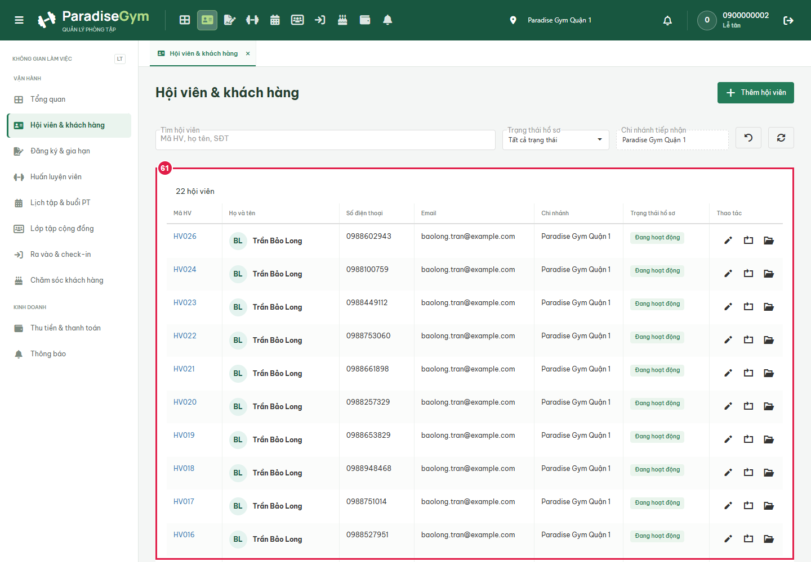

### Step 62: receptionist-existing-profile

- Action/Input: receptionist existing profile. Visible inputs: [].
- Expected Result: User scope: LT existing profile opens from visible row
- Actual Result: URL /web/#members; popup=true; title=HV026 - Trần Bảo Long; visible alerts=[]; visible grid rows=0. DOM assertions passed; screenshot requires visual audit.
- Status: PASS

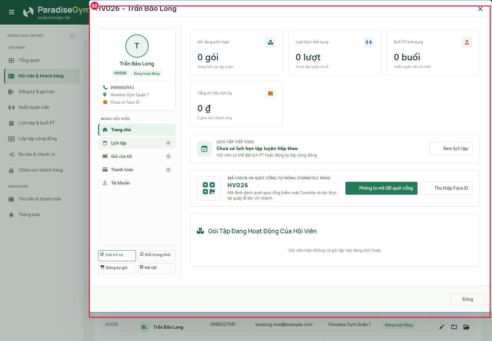

## Cross-Role / Downstream Verification

### Step 55: mobile-authenticated-same-member-home

- Action/Input: mobile authenticated same member home. Visible inputs: [].
- Expected Result: HV01-US01 ownership rule; HV03-US01 package/receipt fields; current user: same member, readonly
- Actual Result: URL /mobile/member/#home; popup=false; title=-; visible alerts=[]; visible grid rows=0. DOM assertions passed; screenshot requires visual audit.
- Status: PASS

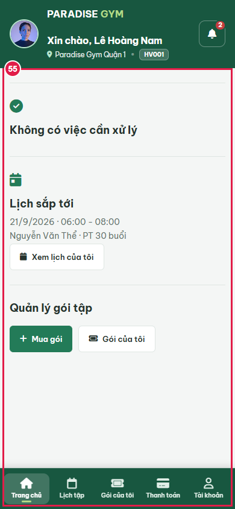

### Step 56: mobile-same-member-schedule

- Action/Input: mobile same member schedule. Visible inputs: [].
- Expected Result: HV01-US01 ownership rule; HV03-US01 package/receipt fields; current user: same member, readonly: authenticated business screen; API errors retained
- Actual Result: URL /mobile/member/#schedule; popup=false; title=-; visible alerts=[]; visible grid rows=0. DOM assertions passed; screenshot requires visual audit.
- Status: PASS

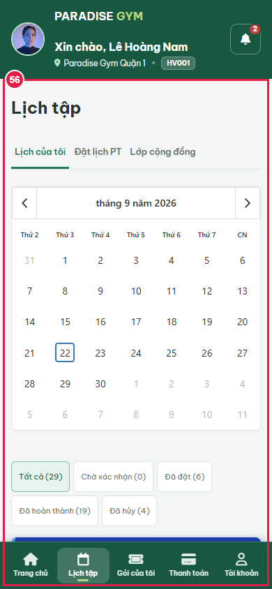

### Step 57: mobile-same-member-packages

- Action/Input: mobile same member packages. Visible inputs: [].
- Expected Result: HV01-US01 ownership rule; HV03-US01 package/receipt fields; current user: same member, readonly: authenticated business screen; API errors retained
- Actual Result: URL /mobile/member/#packages; popup=false; title=-; visible alerts=[]; visible grid rows=0. DOM assertions passed; screenshot requires visual audit.
- Status: PASS

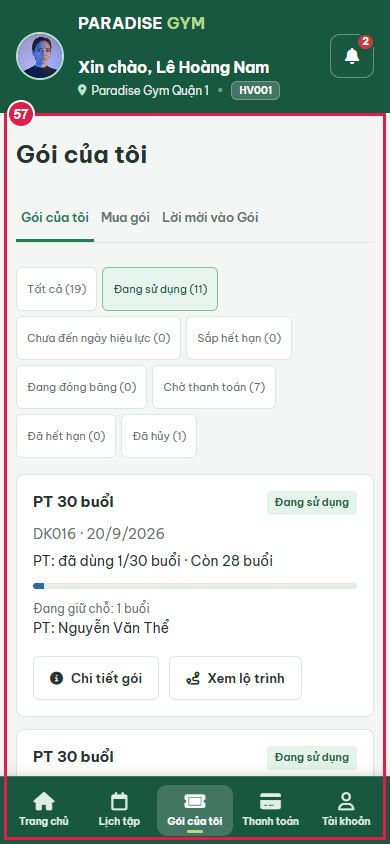

### Step 58: mobile-package-filter-all-same-registration

- Action/Input: mobile package filter all same registration. Visible inputs: [].
- Expected Result: HV01-US01 ownership rule; HV03-US01 package/receipt fields; current user: same member, readonly: same registration code and package name as QTV overview
- Actual Result: URL /mobile/member/#packages/mine; popup=false; title=-; visible alerts=[]; visible grid rows=0. DOM assertions passed; screenshot requires visual audit.
- Status: PASS

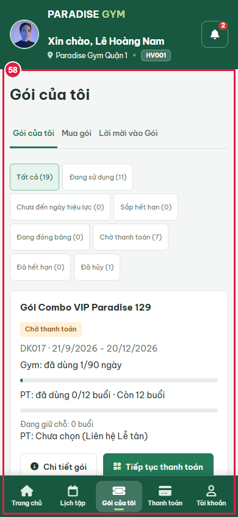

### Step 59: mobile-same-member-payments

- Action/Input: mobile same member payments. Visible inputs: [].
- Expected Result: HV01-US01 ownership rule; HV03-US01 package/receipt fields; current user: same member, readonly: authenticated business screen; API errors retained
- Actual Result: URL /mobile/member/#payments; popup=false; title=-; visible alerts=[]; visible grid rows=0. Mobile has no confirmed shared payment identifier; Web API has 11 confirmed records (legacy statuses: )
- Status: FAIL

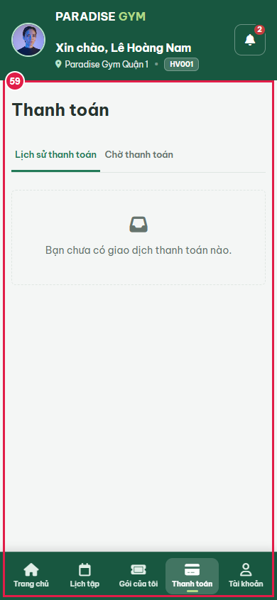

### Step 60: mobile-same-member-account

- Action/Input: mobile same member account. Visible inputs: [{"label":"","value":""},{"label":"","value":"Lê Hoàng Nam"},{"label":"","value":"0987654321"},{"label":"","value":"nam.lehoang.9173@gmail.com"},{"label":"","value":"1992-09-24"}].
- Expected Result: HV01-US01 ownership rule; HV03-US01 package/receipt fields; current user: same member, readonly: authenticated business screen; API errors retained
- Actual Result: URL /mobile/member/#account; popup=false; title=-; visible alerts=[]; visible grid rows=0. DOM assertions passed; screenshot requires visual audit.
- Status: PASS

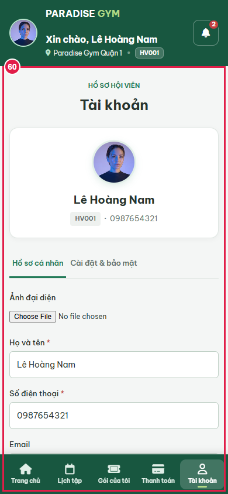

## Issues Found

- Step 59: mobile-same-member-payments: Mobile has no confirmed shared payment identifier; Web API has 11 confirmed records (legacy statuses: )

API failures: [{"path":"/api/v1/group-invitations","status":403}].

Blocked write attempts: [].

## Final Result

PASS assertions: 61; FAIL assertions: 1.

**Pending visual audit and coverage review. Do not treat raw assertion counts as final acceptance.**
