# QTV-W02-US04 member popup readonly E2E

Mode: preliminary. Started source SHA256: 8adddde2bf7e35f1fecaa36e2c2b1c6dc8a5421d17298a05a29c9eab32d6b9f3.

Frontend: http://localhost:3001/web/; API: http://localhost:5000/api/v1.

Subject: HV001 / 40000000-0000-0000-0000-000000000001. No business writes; auth allowed.

Expected sources: QTV-W02-US04; Product Spec W02; HV01-US01; HV03-US01; five-menu implementation walkthrough; current user requirements. Canonical popup date/filter spec remains a documentation gap until main agent synchronizes it.

## Source Action Verification

### Step 1: open-members-list

- Action/Input: open members list.
- Expected Result: QTV-W02-US04 Main Flow / Field-level specification / Exception Flows: readonly rows in branch scope
- Actual Result: URL /web/#members; popup=false; title=-; visible alerts=[]. DOM assertions passed; screenshot requires visual audit.
- Status: PASS

### Step 2: initial-row-opens-popup

- Action/Input: initial row opens popup.
- Expected Result: Product Spec W02 profile 360; docs/reports/tab1-web-admin/2026-09-21-mobile-menus-profile-popups-walkthrough.md section I.1; current user popup requirement: clicking first visible member row opens that member profile
- Actual Result: URL /web/#members; popup=true; title=HV026 - Trần Bảo Long; visible alerts=["Route not found\nThử lại","Route not found\nThử lại"]. DOM assertions passed; screenshot requires visual audit.
- Status: PASS

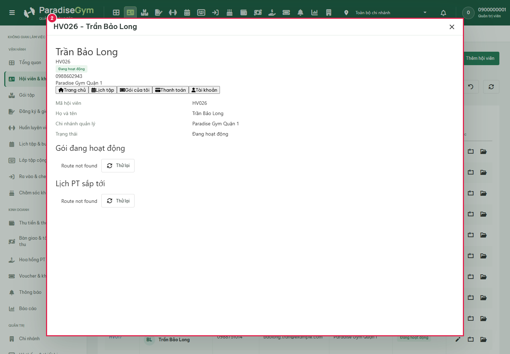

### Step 3: close-initial-popup

- Action/Input: close initial popup.
- Expected Result: Close returns to member list
- Actual Result: URL /web/#members; popup=false; title=-; visible alerts=[]. DOM assertions passed; screenshot requires visual audit.
- Status: PASS

### Step 4: search-same-active-mobile-member

- Action/Input: search same active mobile member.
- Expected Result: QTV-W02-US04 Main Flow / Field-level specification / Exception Flows: search exact phone and show matching row
- Actual Result: URL /web/#members; popup=false; title=-; visible alerts=[]. DOM assertions passed; screenshot requires visual audit.
- Status: PASS

### Step 5: open-same-member-popup

- Action/Input: open same member popup.
- Expected Result: Product Spec W02 profile 360; docs/reports/tab1-web-admin/2026-09-21-mobile-menus-profile-popups-walkthrough.md section I.1; current user popup requirement: same member identity; exactly five menu tabs
- Actual Result: URL /web/#members; popup=true; title=HV001 - Lê Hoàng Nam; visible alerts=["Route not found\nThử lại","Route not found\nThử lại"]. Expected values to be strictly equal:

0 !== 5

- Status: FAIL

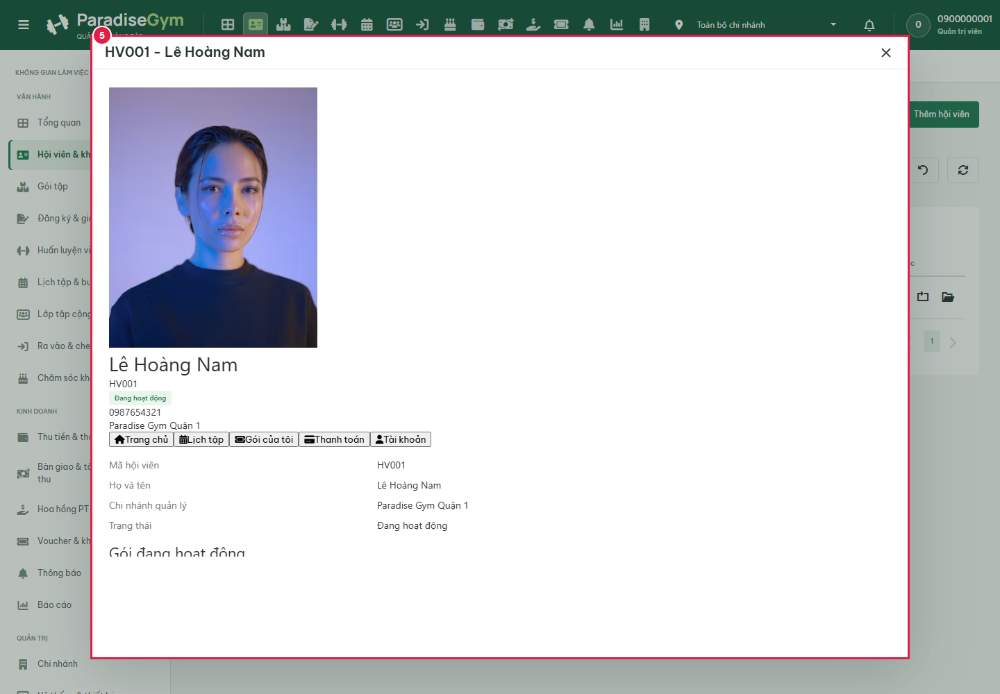

### Step 9: network-abort-member-list

- Action/Input: network abort member list.
- Expected Result: QTV-W02-US04 Main Flow / Field-level specification / Exception Flows: loading error is visible and retry offered
- Actual Result: URL /web/#members; popup=false; title=-; visible alerts=["Failed to fetch\nThử lại"]. DOM assertions passed; screenshot requires visual audit.
- Status: PASS

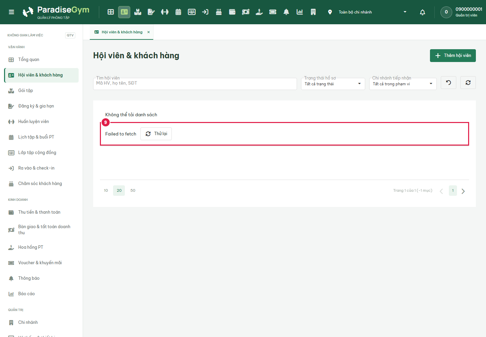

### Step 10: network-retry-member-list

- Action/Input: network retry member list.
- Expected Result: QTV-W02-US04 Main Flow / Field-level specification / Exception Flows: retry loads real rows after network restored
- Actual Result: URL /web/#members; popup=false; title=-; visible alerts=[]. DOM assertions passed; screenshot requires visual audit.
- Status: PASS

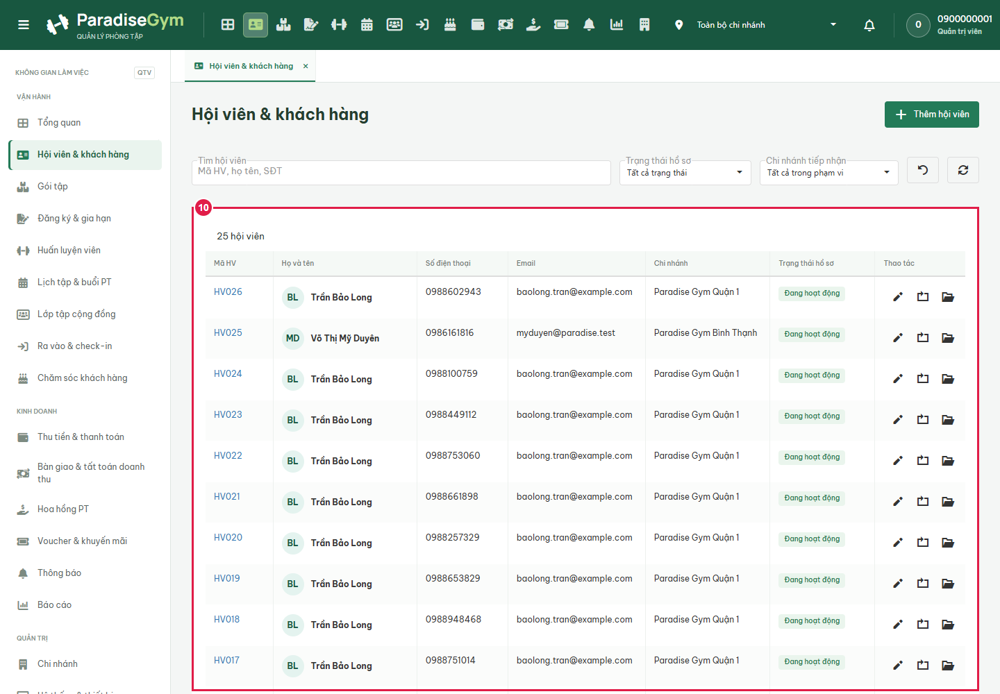

## State Verification

### Step 6: branch-scope-A

- Action/Input: branch scope A.
- Expected Result: QTV-W02-US04 Main Flow / Field-level specification / Exception Flows: selected branch determines actual visible members
- Actual Result: URL /web/#members; popup=false; title=-; visible alerts=[]. DOM assertions passed; screenshot requires visual audit.
- Status: PASS

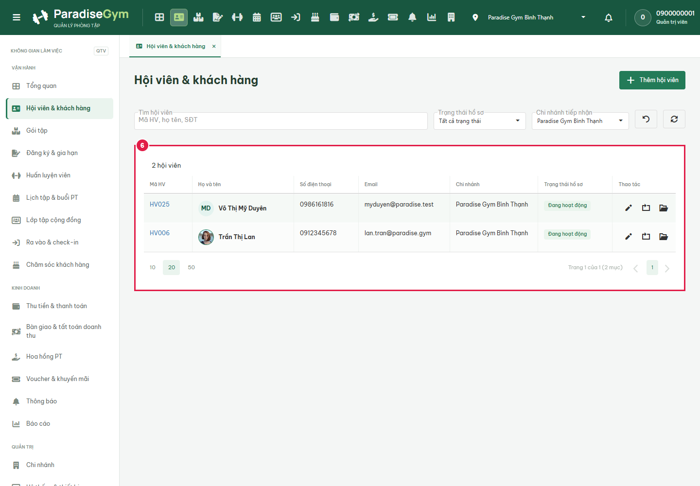

### Step 7: branch-scope-B

- Action/Input: branch scope B.
- Expected Result: QTV-W02-US04 Main Flow / Field-level specification / Exception Flows: selected branch determines actual visible members
- Actual Result: URL /web/#members; popup=false; title=-; visible alerts=[]. DOM assertions passed; screenshot requires visual audit.
- Status: PASS

### Step 8: branch-scope-ALL

- Action/Input: branch scope ALL.
- Expected Result: QTV-W02-US04 Main Flow / Field-level specification / Exception Flows: selected branch determines actual visible members
- Actual Result: URL /web/#members; popup=false; title=-; visible alerts=[]. DOM assertions passed; screenshot requires visual audit.
- Status: PASS

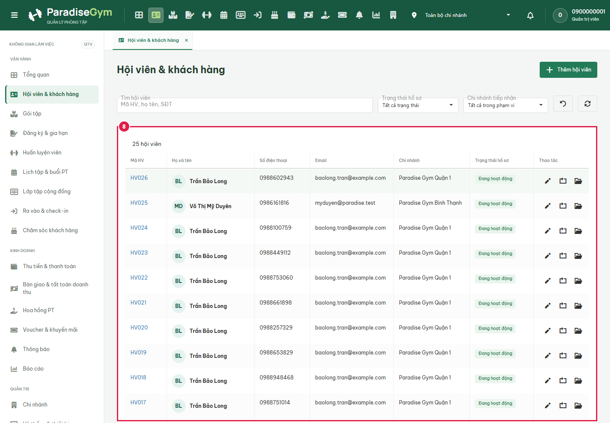

### Step 16: receptionist-existing-members-list

- Action/Input: receptionist existing members list.
- Expected Result: User scope: LT existing member experience retained; QTV refactor must not remove LT list
- Actual Result: URL /web/#members; popup=false; title=-; visible alerts=[]. DOM assertions passed; screenshot requires visual audit.
- Status: PASS

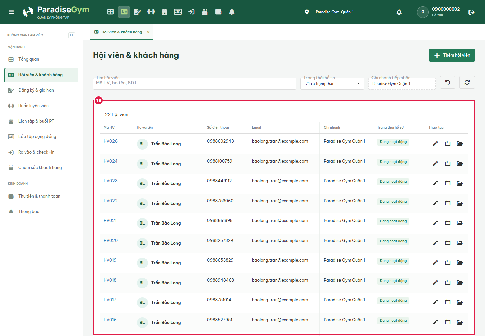

### Step 17: receptionist-existing-profile

- Action/Input: receptionist existing profile.
- Expected Result: User scope: LT existing profile opens from visible row
- Actual Result: URL /web/#members; popup=true; title=HV026 - Trần Bảo Long; visible alerts=[]. DOM assertions passed; screenshot requires visual audit.
- Status: PASS

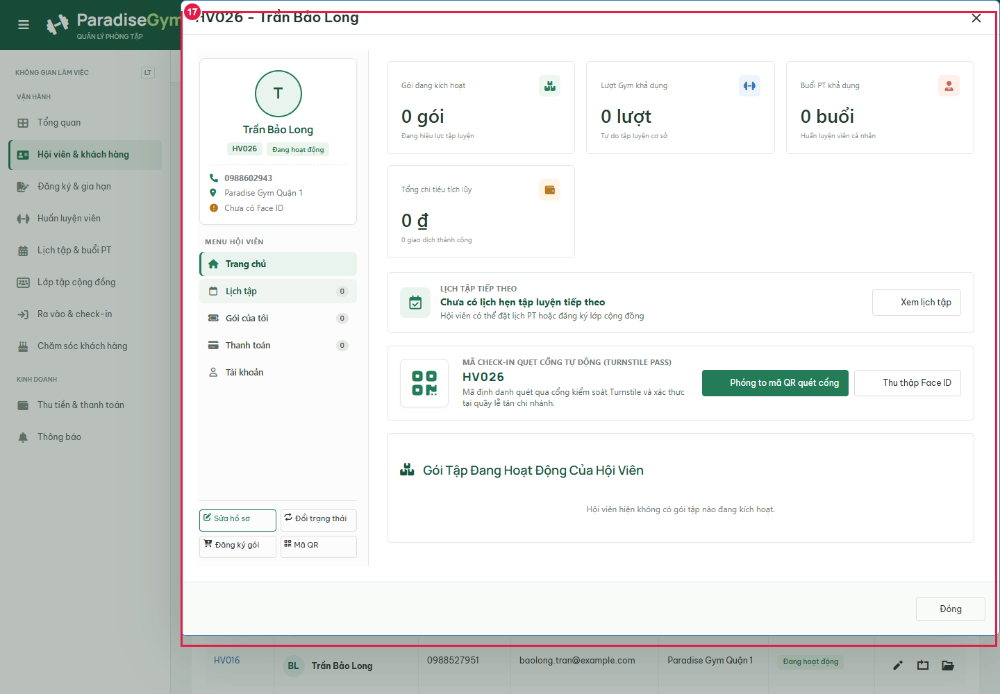

## Cross-Role / Downstream Verification

### Step 11: mobile-authenticated-same-member-home

- Action/Input: mobile authenticated same member home.
- Expected Result: HV01-US01 ownership rule; HV03-US01 package/receipt fields; current user: same member, readonly
- Actual Result: URL /mobile/member/#home; popup=false; title=-; visible alerts=[]. Same member name missing in mobile business UI
- Status: FAIL

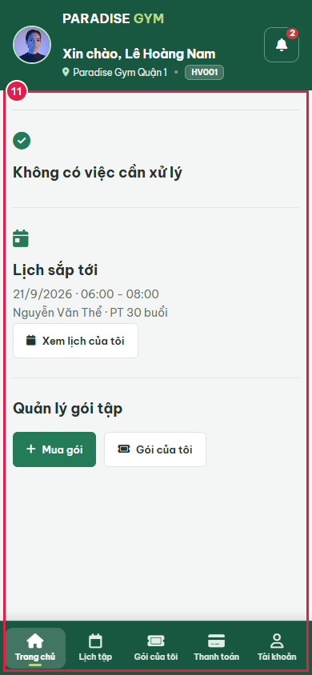

### Step 12: mobile-same-member-schedule

- Action/Input: mobile same member schedule.
- Expected Result: HV01-US01 ownership rule; HV03-US01 package/receipt fields; current user: same member, readonly: authenticated business screen; API errors retained
- Actual Result: URL /mobile/member/#schedule; popup=false; title=-; visible alerts=[]. DOM assertions passed; screenshot requires visual audit.
- Status: PASS

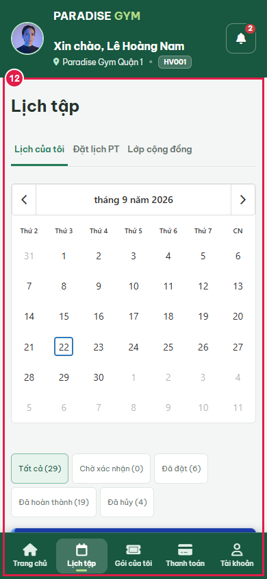

### Step 13: mobile-same-member-packages

- Action/Input: mobile same member packages.
- Expected Result: HV01-US01 ownership rule; HV03-US01 package/receipt fields; current user: same member, readonly: authenticated business screen; API errors retained
- Actual Result: URL /mobile/member/#packages; popup=false; title=-; visible alerts=[]. DOM assertions passed; screenshot requires visual audit.
- Status: PASS

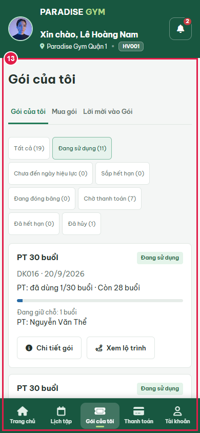

### Step 14: mobile-same-member-payments

- Action/Input: mobile same member payments.
- Expected Result: HV01-US01 ownership rule; HV03-US01 package/receipt fields; current user: same member, readonly: authenticated business screen; API errors retained
- Actual Result: URL /mobile/member/#payments; popup=false; title=-; visible alerts=[]. DOM assertions passed; screenshot requires visual audit.
- Status: PASS

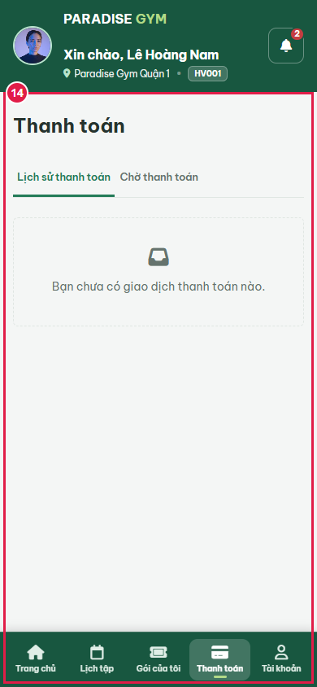

### Step 15: mobile-same-member-account

- Action/Input: mobile same member account.
- Expected Result: HV01-US01 ownership rule; HV03-US01 package/receipt fields; current user: same member, readonly: authenticated business screen; API errors retained
- Actual Result: URL /mobile/member/#account; popup=false; title=-; visible alerts=[]. DOM assertions passed; screenshot requires visual audit.
- Status: PASS

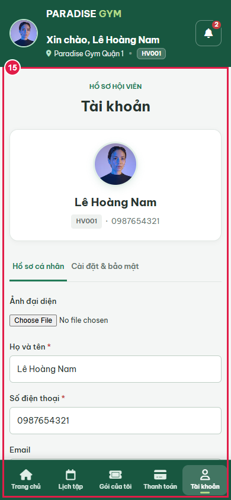

## Issues Found

- Step 0: overview-endpoint: GET /members/40000000-0000-0000-0000-000000000001/overview-data returned 404
- Step 5: open-same-member-popup: Expected values to be strictly equal:

0 !== 5

- Step 11: mobile-authenticated-same-member-home: Same member name missing in mobile business UI
- Step 0: source-changed-during-run: UI source changed; rerun after explicit freeze

API failures: [{"path":"/api/v1/members/07fedd34-b752-4a3a-84e2-3f71a983ae70/overview-data","status":404},{"path":"/api/v1/members/40000000-0000-0000-0000-000000000001/overview-data","status":404},{"path":"/api/v1/group-invitations","status":403}].

Blocked write attempts: [].

## Final Result

PASS assertions: 15; FAIL assertions: 2.

**BLOCKED for final acceptance: awaiting explicit API/UI freeze. Preliminary evidence only.**
