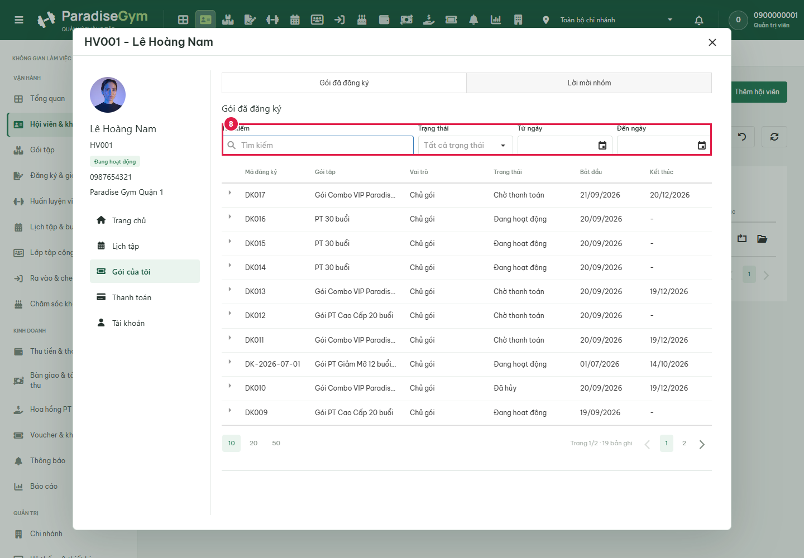
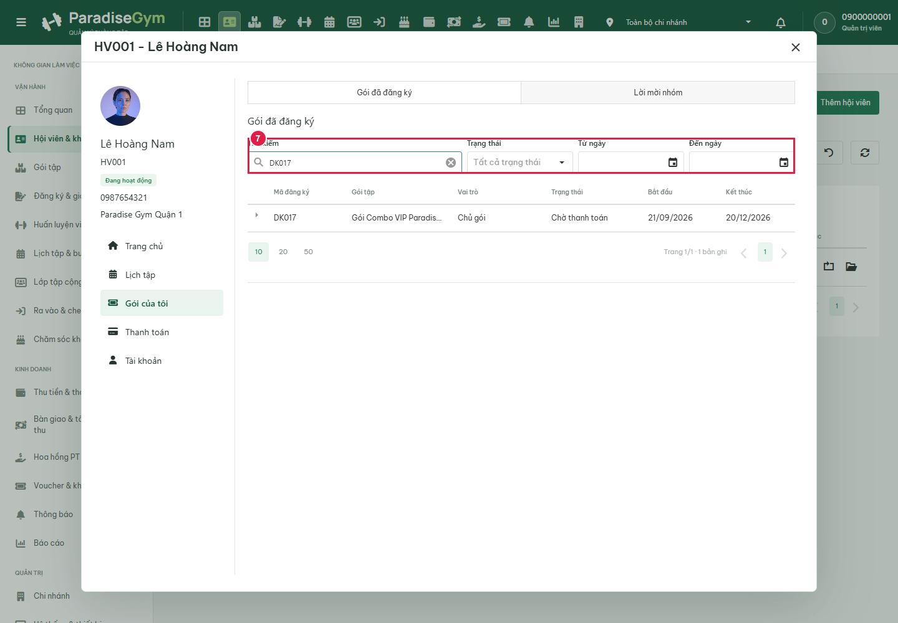

# QTV-W02-US04 member popup readonly E2E

Mode: final. Started source SHA256: 6e797b3b9e841cc9f05eef1dc8ae12f194eecec930bdfe2984e114b1d0ddf616.

Frontend: http://localhost:3001/web/; API: http://localhost:5000/api/v1.

Subject: HV001 / 40000000-0000-0000-0000-000000000001. No business writes; auth allowed.

Expected sources: QTV-W02-US04 Main Flow/field tables/AF02/EF02/EF03; Product Spec W02; HV01-US01; HV03-US01; current user requirements. Final field tables must be reread after documentation freeze.

## Source Action Verification

### Step 1: open-members-list

- Action/Input: open members list. Visible inputs: [{"label":"Chi nhánh làm việc","value":"Toàn bộ chi nhánh"},{"label":"Mã HV, họ tên, SĐT","value":""},{"label":"Lựa chọn...","value":"Tất cả trạng thái"},{"label":"Lựa chọn...","value":"Tất cả trong phạm vi"}].
- Expected Result: QTV-W02-US04 Main Flow / Field-level specification / Exception Flows: readonly rows in branch scope
- Actual Result: URL /web/#members; popup=false; title=-; visible alerts=[]; visible grid rows=20. DOM assertions passed; screenshot requires visual audit.
- Status: PASS

### Step 2: initial-row-opens-popup

- Action/Input: initial row opens popup. Visible inputs: [{"label":"Tìm kiếm","value":""},{"label":"Tìm kiếm","value":""},{"label":"Tìm kiếm","value":""}].
- Expected Result: QTV-W02-US04 Main Flow 2-8, popup navigation field table and Business Rules; Product Spec W02: clicking first visible member row opens that member profile
- Actual Result: URL /web/#members; popup=true; title=HV026 - Trần Bảo Long; visible alerts=[]; visible grid rows=0. DOM assertions passed; screenshot requires visual audit.
- Status: PASS

### Step 3: close-initial-popup

- Action/Input: close initial popup. Visible inputs: [{"label":"Chi nhánh làm việc","value":"Toàn bộ chi nhánh"},{"label":"Mã HV, họ tên, SĐT","value":""},{"label":"Lựa chọn...","value":"Tất cả trạng thái"},{"label":"Lựa chọn...","value":"Tất cả trong phạm vi"}].
- Expected Result: Close returns to member list
- Actual Result: URL /web/#members; popup=false; title=-; visible alerts=[]; visible grid rows=20. DOM assertions passed; screenshot requires visual audit.
- Status: PASS

### Step 4: search-same-active-mobile-member

- Action/Input: search same active mobile member. Visible inputs: [{"label":"Chi nhánh làm việc","value":"Toàn bộ chi nhánh"},{"label":"Mã HV, họ tên, SĐT","value":"0987654321"},{"label":"Lựa chọn...","value":"Tất cả trạng thái"},{"label":"Lựa chọn...","value":"Tất cả trong phạm vi"}].
- Expected Result: QTV-W02-US04 Main Flow / Field-level specification / Exception Flows: search exact phone and show matching row
- Actual Result: URL /web/#members; popup=false; title=-; visible alerts=[]; visible grid rows=1. DOM assertions passed; screenshot requires visual audit.
- Status: PASS

### Step 5: open-same-member-popup

- Action/Input: open same member popup. Visible inputs: [{"label":"Tìm kiếm","value":""},{"label":"Trạng thái","value":""},{"label":"Tìm kiếm","value":""},{"label":"Tìm kiếm","value":""},{"label":"Trạng thái","value":""}].
- Expected Result: QTV-W02-US04 Main Flow 2-8, popup navigation field table and Business Rules; Product Spec W02: same member identity; exactly five menu tabs
- Actual Result: URL /web/#members; popup=true; title=HV001 - Lê Hoàng Nam; visible alerts=[]; visible grid rows=11. DOM assertions passed; screenshot requires visual audit.
- Status: PASS

### Step 6: open-packages-for-readonly-filter

- Action/Input: open packages for readonly filter. Visible inputs: [{"label":"Tìm kiếm","value":""},{"label":"Trạng thái","value":""},{"label":"Từ ngày","value":""},{"label":"Đến ngày","value":""}].
- Expected Result: QTV-W02-US04 Main Flow 2-8, popup navigation field table and Business Rules; Product Spec W02
- Actual Result: URL /web/#members; popup=true; title=HV001 - Lê Hoàng Nam; visible alerts=[]; visible grid rows=10. DOM assertions passed; screenshot requires visual audit.
- Status: PASS

### Step 8: clear-package-search

- Action/Input: clear package search. Visible inputs: [{"label":"Tìm kiếm","value":""},{"label":"Trạng thái","value":""},{"label":"Từ ngày","value":""},{"label":"Đến ngày","value":""}].
- Expected Result: Clear readonly search and restore package list
- Actual Result: URL /web/#members; popup=true; title=HV001 - Lê Hoàng Nam; visible alerts=[]; visible grid rows=10. DOM assertions passed; screenshot requires visual audit.
- Status: PASS

## State Verification

### Step 7: package-search-input-auto-applies

- Action/Input: package search input auto applies. Visible inputs: [{"label":"Tìm kiếm","value":"DK017"},{"label":"Trạng thái","value":""},{"label":"Từ ngày","value":""},{"label":"Đến ngày","value":""}].
- Expected Result: QTV-W02-US04 Main Flow 2-8, popup navigation field table and Business Rules; Product Spec W02: search actual registration code, capture input (auto-apply; no submit button)
- Actual Result: URL /web/#members; popup=true; title=HV001 - Lê Hoàng Nam; visible alerts=[]; visible grid rows=1. DOM assertions passed; screenshot requires visual audit.
- Status: PASS

## Cross-Role / Downstream Verification

## Issues Found

- No assertion failures recorded yet; this is not an all-PASS conclusion.

API failures: [].

Blocked write attempts: [].

## Final Result

PASS assertions: 8; FAIL assertions: 0.

**Pending visual audit and coverage review. Do not treat raw assertion counts as final acceptance.**
