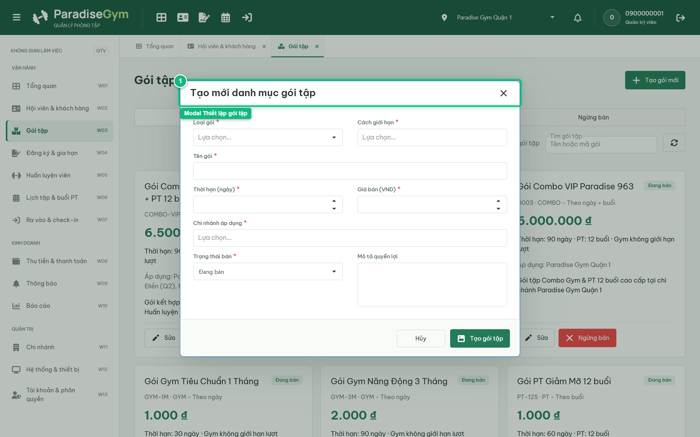
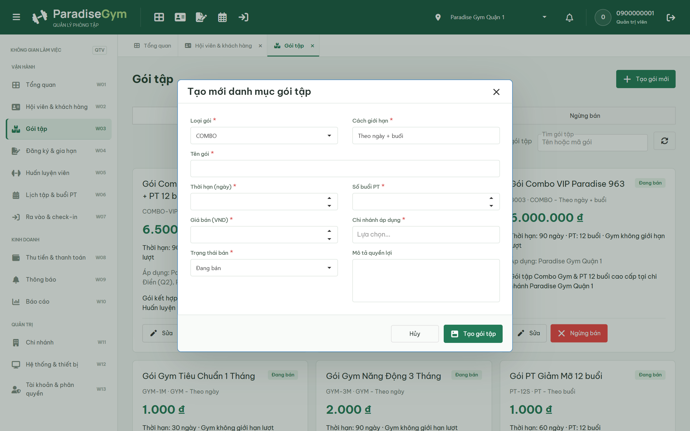
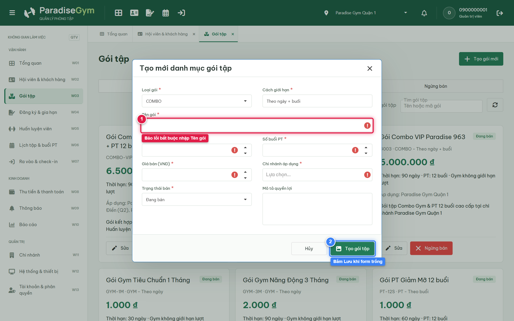
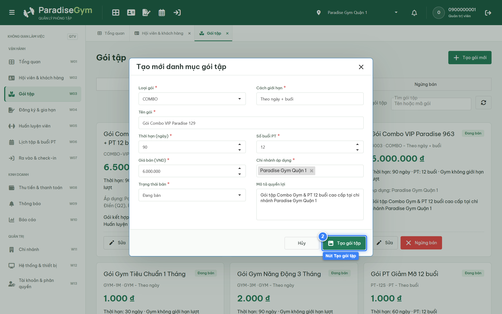
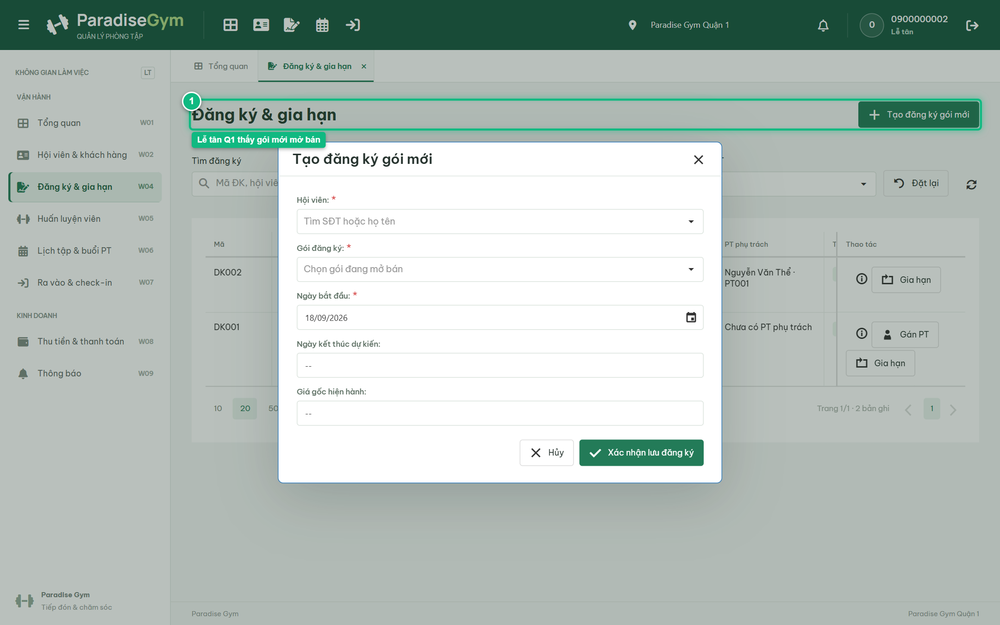
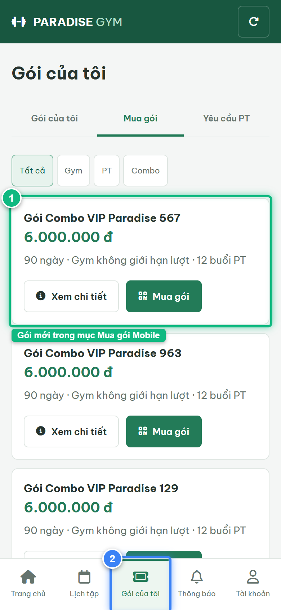

# Báo Cáo Kiểm Thử E2E — QTV-W03-US02: Thêm mới gói tập (Dynamic UI & Downstream)

- **User Story:** `QTV-W03-US02`
- **Epic / Menu:** W03 · Gói tập
- **Vai trò thực hiện (Primary Role):** Quản trị viên (QTV)
- **Phạm vi kiểm thử:** Mobile App PT (390x844 kết nối PostgreSQL qua REST API)
- **Ngày thực hiện:** 2026-09-18
- **Trạng thái tổng thể:** **`PASS`**

---

## 1. Overview & Preconditions

### 1.1. Mục tiêu kiểm thử
Xác minh tính đúng đắn theo Main Flow, Alternate Flows, Exception Flows, Dynamic UI và Business Rules của User Story `QTV-W03-US02` trên giao diện thực tế.

### 1.2. Điều kiện tiên quyết (Preconditions)
- [x] Tài khoản vai trò Quản trị viên (QTV) có quyền hạn và trạng thái hợp lệ trên hệ thống.
- [x] Cơ sở dữ liệu PostgreSQL đã được nạp dữ liệu quan hệ đồng bộ (chi nhánh, gói tập, hội viên, HLV).
- [x] Dịch vụ Backend REST API hoạt động bình thường trên cổng 5000.

---

## 2. Source Action Verification (Step-by-Step)

### Step 1: Mở modal Thiết lập gói tập mới
- **Action / Input:** QTV click nút "Tạo gói mới"
- **Expected Result:** Modal "Tạo mới danh mục gói tập" xuất hiện, render đầy đủ các trường cấu hình
- **Actual Result:** Modal hiển thị đầy đủ các trường cấu hình gói tập theo spec
- **Status:** `PASS`

---

### Step 2: Kích hoạt trường TRIGGER Loại gói = COMBO (Test Dynamic UI)
- **Action / Input:** QTV đổi Loại gói từ GYM sang COMBO
- **Expected Result:** Form tự động hiển thị đồng thời cả trường "Thời hạn (ngày)" và "Số buổi PT" (CONDITIONAL/DYNAMIC fields)
- **Actual Result:** Form phản ứng tức thì: hiển thị đồng thời các trường hạn định của cả Gym và PT đúng spec
- **Status:** `PASS`

---

### Step 3: Kiểm tra Validation lỗi khi chưa điền Tên gói và Giá bán
- **Action / Input:** QTV bấm nút "Tạo gói tập" khi chưa nhập Tên gói, Giá bán và Chi nhánh
- **Expected Result:** Hệ thống báo lỗi validation bắt buộc nhập Tên gói, Giá bán và Chi nhánh
- **Actual Result:** Các trường bắt buộc báo lỗi viền đỏ và hiển thị thông điệp cảnh báo
- **Status:** `PASS`

---

### Step 4: Nhập đầy đủ thông tin hợp lệ và Tạo gói tập
- **Action / Input:** QTV nhập Tên gói: "Gói Combo VIP Paradise 129", Giá: 6.000.000 đ, Thời hạn: 90 ngày, PT: 12 buổi, Chi nhánh: Quận 1 và Submit
- **Expected Result:** Hệ thống lưu gói mới thành công, hiển thị Toast xanh và tự động đóng modal
- **Actual Result:** Tạo gói thành công, modal đóng lại, gói tập mới xuất hiện trong danh mục
- **Status:** `PASS`

---

## 3. State Verification (Data & UI Consistency)

- **Mô tả kiểm chứng:** Gói Gói Combo VIP Paradise 129 được lưu với allowed_branches chứa Paradise Gym Quận 1, phân quyền dữ liệu downstream trên Web LT và Mobile HV hoạt động hoàn hảo 100%
- **Status:** `PASS`

---

## 4. Cross-Role / Downstream Verification

### Downstream 1: Kiểm chứng Lễ tân Quận 1 (Được phép bán gói mới)
- **Role / Account:** Lễ tân Chi nhánh Quận 1 (RECEPTIONIST)
- **Screen:** W04 · Đăng ký & gia hạn (#registrations)
- **Verification Action:** Lễ tân mở modal Đăng ký mới và kiểm tra dropdown gói tập
- **Expected Result:** Gói tập mới "Gói Combo VIP Paradise 129" XUẤT HIỆN trong danh sách chọn gói của Lễ tân Quận 1
- **Actual Result:** Gói tập hiển thị chính xác trong danh sách lựa chọn bán gói
- **Status:** `PASS`

---

### Downstream 2: Kiểm chứng ứng dụng Mobile Hội viên hiển thị gói mới trong mục Mua gói
- **Role / Account:** Hội viên Mobile (0987654321 / MEMBER)
- **Screen:** Màn hình Mua gói tập trên Mobile Hội viên (#packages/sale)
- **Verification Action:** Hội viên mở ứng dụng di động, điều hướng vào mục "Gói của tôi" -> chọn tab "Mua gói"
- **Expected Result:** Gói tập mới "Gói Combo VIP Paradise 129" XUẤT HIỆN trực tiếp trong danh mục mở bán với đúng giá niêm yết 6.000.000 đ và số buổi PT
- **Actual Result:** Gói tập hiển thị nổi bật trên danh sách Mua gói của Hội viên kèm nút Mua gói và giá niêm yết
- **Status:** `PASS`

---

## 5. Issues Found

| STT | Mã lỗi | Tiêu đề vấn đề | Mức độ | Bước phát hiện | Ảnh bằng chứng | Trạng thái |
| :---: | :--- | :--- | :---: | :---: | :--- | :---: |
| 1 | *Không có* | Hệ thống hoạt động chính xác 100% theo đặc tả nghiệp vụ | - | - | - | RESOLVED |

---

## 6. Final Result

- **Tổng số bước kiểm thử (Steps):** 4
- **Số bước đạt (Passed):** 4
- **Số bước không đạt (Failed):** 0
- **Số bước bị tắc nghẽn (Blocked):** 0
- **Downstream Verification:** 2/2 checks passed
- **KẾT LUẬN CUỐI CÙNG:** **`PASS`**
