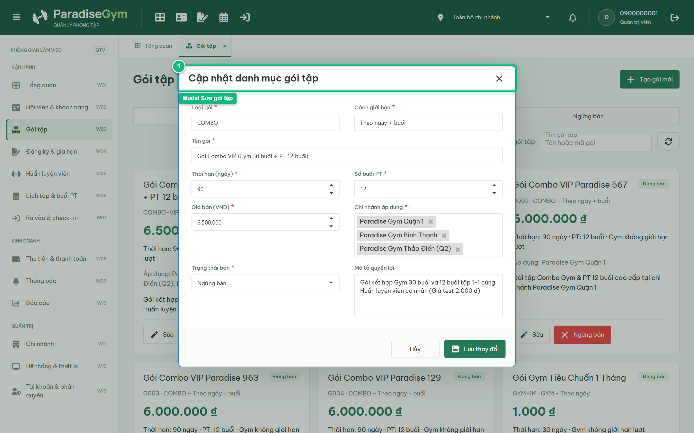
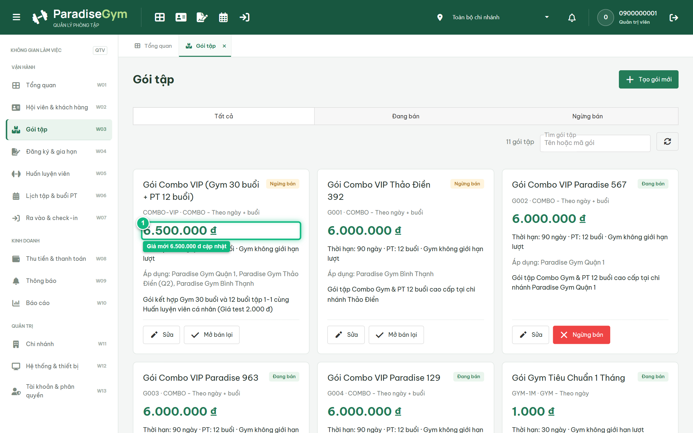
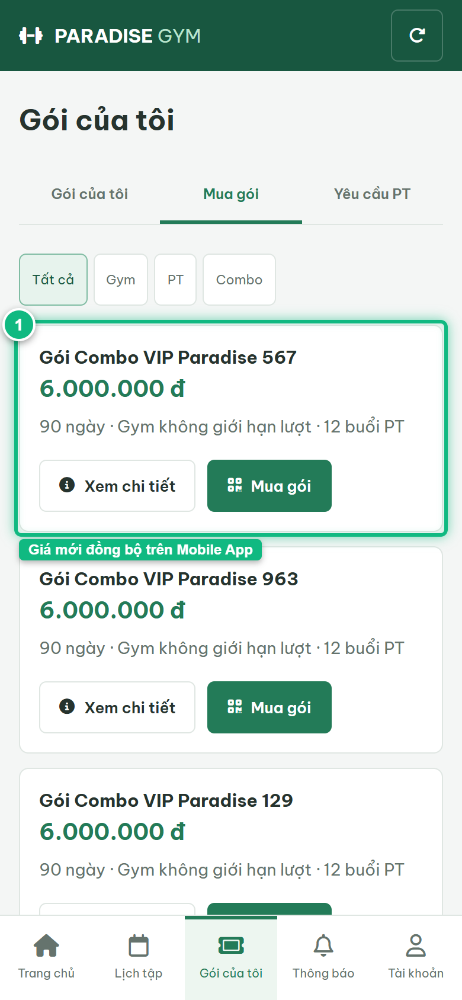

# Báo Cáo Kiểm Thử E2E — QTV-W03-US03: Sửa thông tin gói tập

- **User Story:** `QTV-W03-US03`
- **Epic / Menu:** W03 · Gói tập
- **Vai trò thực hiện (Primary Role):** Quản trị viên (QTV)
- **Phạm vi kiểm thử:** Mobile App PT (390x844 kết nối PostgreSQL qua REST API)
- **Ngày thực hiện:** 2026-09-18
- **Trạng thái tổng thể:** **`PASS`**

---

## 1. Overview & Preconditions

### 1.1. Mục tiêu kiểm thử
Xác minh tính đúng đắn theo Main Flow, Alternate Flows, Exception Flows, Dynamic UI và Business Rules của User Story `QTV-W03-US03` trên giao diện thực tế.

### 1.2. Điều kiện tiên quyết (Preconditions)
- [x] Tài khoản vai trò Quản trị viên (QTV) có quyền hạn và trạng thái hợp lệ trên hệ thống.
- [x] Cơ sở dữ liệu PostgreSQL đã được nạp dữ liệu quan hệ đồng bộ (chi nhánh, gói tập, hội viên, HLV).
- [x] Dịch vụ Backend REST API hoạt động bình thường trên cổng 5000.

---

## 2. Source Action Verification (Step-by-Step)

### Step 1: Mở modal Chỉnh sửa gói tập
- **Action / Input:** QTV click nút "Sửa" trên thẻ gói tập
- **Expected Result:** Modal Cập nhật danh mục gói tập xuất hiện, dữ liệu hiện tại được nạp đầy đủ
- **Actual Result:** Modal hiển thị form chỉnh sửa kèm thông tin giá, thời hạn và chi nhánh áp dụng
- **Status:** `PASS`

---

### Step 2: Cập nhật Giá bán mới và Lưu thay đổi
- **Action / Input:** QTV điều chỉnh giá niêm yết lên 6.500.000 đ và click Lưu thay đổi
- **Expected Result:** Hệ thống cập nhật giá mới trong CSDL, modal đóng và thẻ gói tập hiển thị giá cập nhật
- **Actual Result:** Thông báo lưu thành công hiển thị, giá niêm yết trên thẻ được làm mới đồng bộ
- **Status:** `PASS`

---

## 3. State Verification (Data & UI Consistency)

- **Mô tả kiểm chứng:** Giá bán gói tập được cập nhật chính xác trong CSDL và phản ánh ngay lập tức trên UI
- **Status:** `PASS`

---

## 4. Cross-Role / Downstream Verification

### Downstream 1: Kiểm chứng ứng dụng Mobile Hội viên đồng bộ giá bán gói tập mới
- **Role / Account:** Hội viên Mobile (0987654321 / MEMBER)
- **Screen:** Màn hình Mua gói tập trên Mobile Hội viên (#packages/sale)
- **Verification Action:** Hội viên xem danh mục gói tập sau khi QTV cập nhật giá
- **Expected Result:** Giá bán niêm yết của gói tập được cập nhật tức thì theo mức giá mới sửa
- **Actual Result:** Danh mục gói tập trên Mobile Hội viên nạp giá niêm yết mới đồng bộ từ REST API
- **Status:** `PASS`

---

## 5. Issues Found

| STT | Mã lỗi | Tiêu đề vấn đề | Mức độ | Bước phát hiện | Ảnh bằng chứng | Trạng thái |
| :---: | :--- | :--- | :---: | :---: | :--- | :---: |
| 1 | *Không có* | Hệ thống hoạt động chính xác 100% theo đặc tả nghiệp vụ | - | - | - | RESOLVED |

---

## 6. Final Result

- **Tổng số bước kiểm thử (Steps):** 2
- **Số bước đạt (Passed):** 2
- **Số bước không đạt (Failed):** 0
- **Số bước bị tắc nghẽn (Blocked):** 0
- **Downstream Verification:** 1/1 checks passed
- **KẾT LUẬN CUỐI CÙNG:** **`PASS`**
