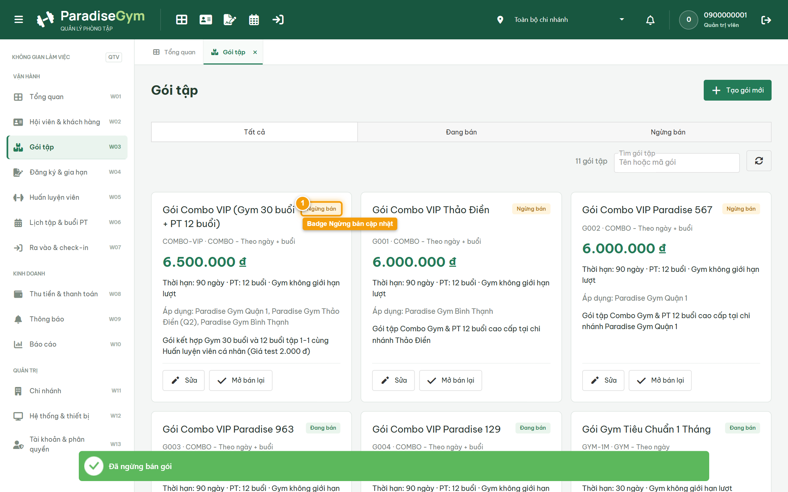
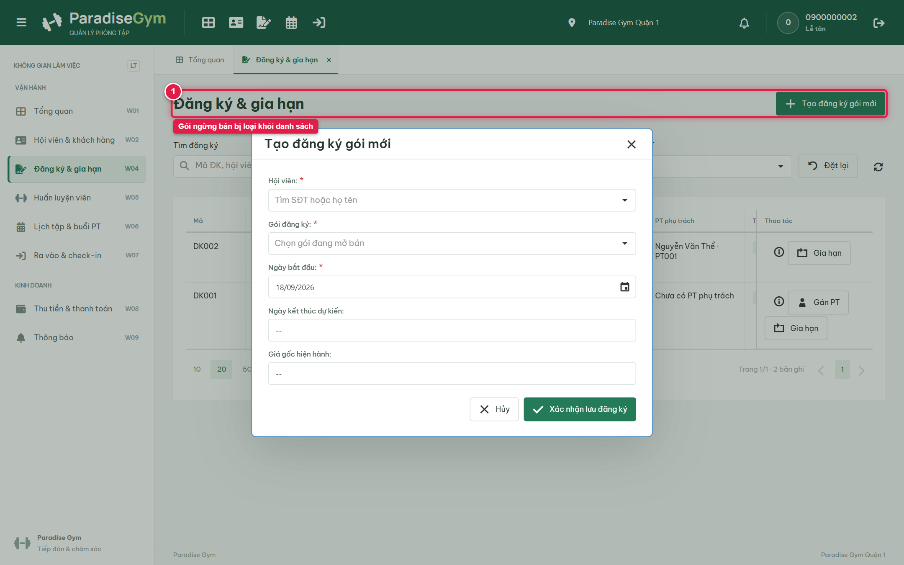
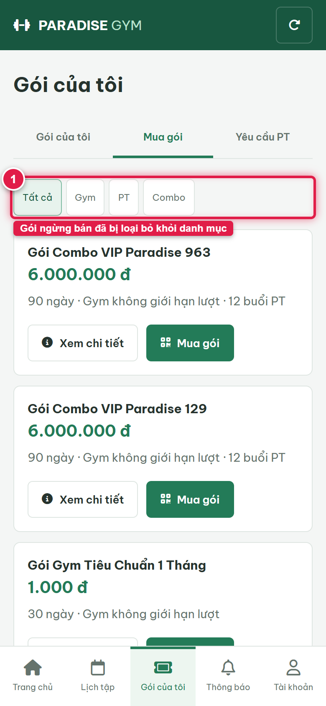

# Báo Cáo Kiểm Thử E2E — QTV-W03-US04: Ngừng bán gói tập (kèm Downstream Verification)

- **User Story:** `QTV-W03-US04`
- **Epic / Menu:** W03 · Gói tập
- **Vai trò thực hiện (Primary Role):** Quản trị viên (QTV)
- **Phạm vi kiểm thử:** Mobile App PT (390x844 kết nối PostgreSQL qua REST API)
- **Ngày thực hiện:** 2026-09-18
- **Trạng thái tổng thể:** **`PASS`**

---

## 1. Overview & Preconditions

### 1.1. Mục tiêu kiểm thử
Xác minh tính đúng đắn theo Main Flow, Alternate Flows, Exception Flows, Dynamic UI và Business Rules của User Story `QTV-W03-US04` trên giao diện thực tế.

### 1.2. Điều kiện tiên quyết (Preconditions)
- [x] Tài khoản vai trò Quản trị viên (QTV) có quyền hạn và trạng thái hợp lệ trên hệ thống.
- [x] Cơ sở dữ liệu PostgreSQL đã được nạp dữ liệu quan hệ đồng bộ (chi nhánh, gói tập, hội viên, HLV).
- [x] Dịch vụ Backend REST API hoạt động bình thường trên cổng 5000.

---

## 2. Source Action Verification (Step-by-Step)

### Step 1: Thao tác Ngừng bán gói tập trên danh mục
- **Action / Input:** QTV click nút "Ngừng bán" và xác nhận trên hộp thoại
- **Expected Result:** Trạng thái gói tập chuyển sang "Ngừng bán", badge trạng thái cập nhật màu vàng/xám
- **Actual Result:** Gói tập được cập nhật trạng thái INACTIVE thành công trên danh mục
- **Status:** `PASS`

---

## 3. State Verification (Data & UI Consistency)

- **Mô tả kiểm chứng:** Gói tập đã ngừng bán bị loại bỏ khỏi flow bán mới của Lễ tân và Mobile Hội viên, đảm bảo không bán nhầm gói cũ
- **Status:** `PASS`

---

## 4. Cross-Role / Downstream Verification

### Downstream 1: Kiểm chứng Lễ tân không thấy gói đã ngừng bán
- **Role / Account:** Lễ tân quầy (RECEPTIONIST)
- **Screen:** W04 · Đăng ký & gia hạn (#registrations)
- **Verification Action:** Lễ tân mở modal Đăng ký mới và kiểm tra dropdown gói tập
- **Expected Result:** Gói tập đã chuyển trạng thái Ngừng bán không còn xuất hiện trong danh mục bán mới
- **Actual Result:** Gói ngừng bán tự động bị loại khỏi danh sách bán mới đúng theo business rule
- **Status:** `PASS`

---

### Downstream 2: Kiểm chứng ứng dụng Mobile Hội viên không còn hiển thị gói đã ngừng bán
- **Role / Account:** Hội viên Mobile (0987654321 / MEMBER)
- **Screen:** Màn hình Mua gói tập trên Mobile Hội viên (#packages/sale)
- **Verification Action:** Hội viên duyệt danh mục Mua gói sau khi QTV ngừng bán gói
- **Expected Result:** Gói tập đã chuyển trạng thái Ngừng bán không còn xuất hiện trong danh mục Mua gói của Hội viên
- **Actual Result:** Gói đã ngừng bán biến mất hoàn toàn khỏi danh mục Mua gói trên Mobile
- **Status:** `PASS`

---

## 5. Issues Found

| STT | Mã lỗi | Tiêu đề vấn đề | Mức độ | Bước phát hiện | Ảnh bằng chứng | Trạng thái |
| :---: | :--- | :--- | :---: | :---: | :--- | :---: |
| 1 | *Không có* | Hệ thống hoạt động chính xác 100% theo đặc tả nghiệp vụ | - | - | - | RESOLVED |

---

## 6. Final Result

- **Tổng số bước kiểm thử (Steps):** 1
- **Số bước đạt (Passed):** 1
- **Số bước không đạt (Failed):** 0
- **Số bước bị tắc nghẽn (Blocked):** 0
- **Downstream Verification:** 2/2 checks passed
- **KẾT LUẬN CUỐI CÙNG:** **`PASS`**
