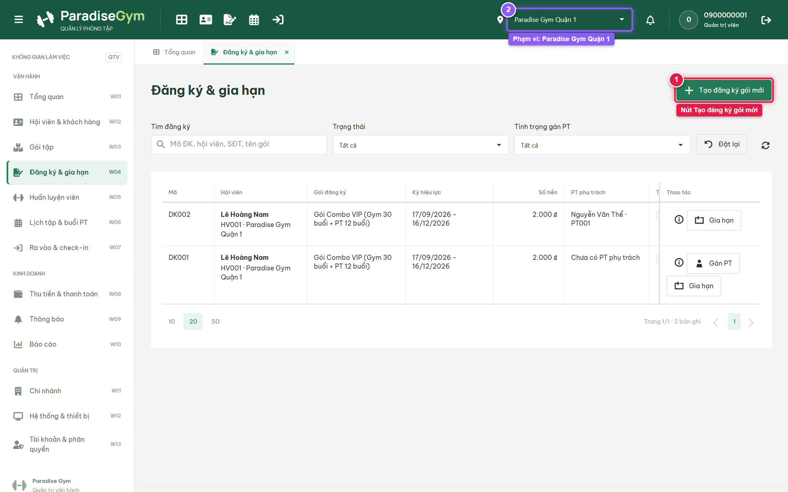
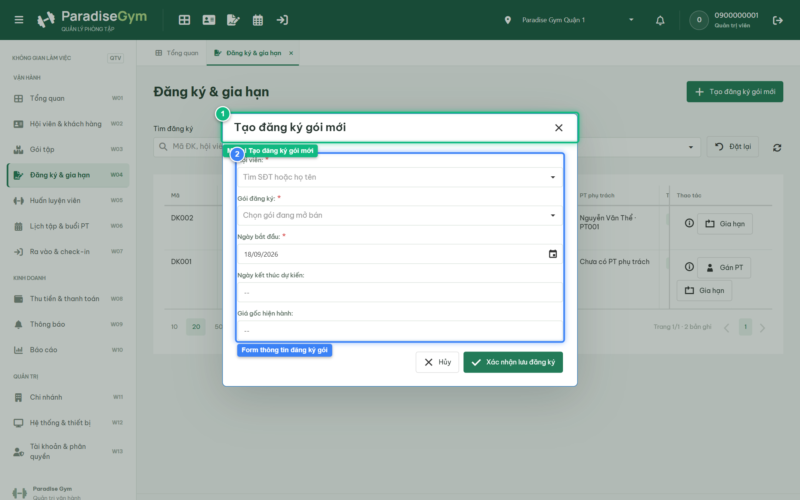
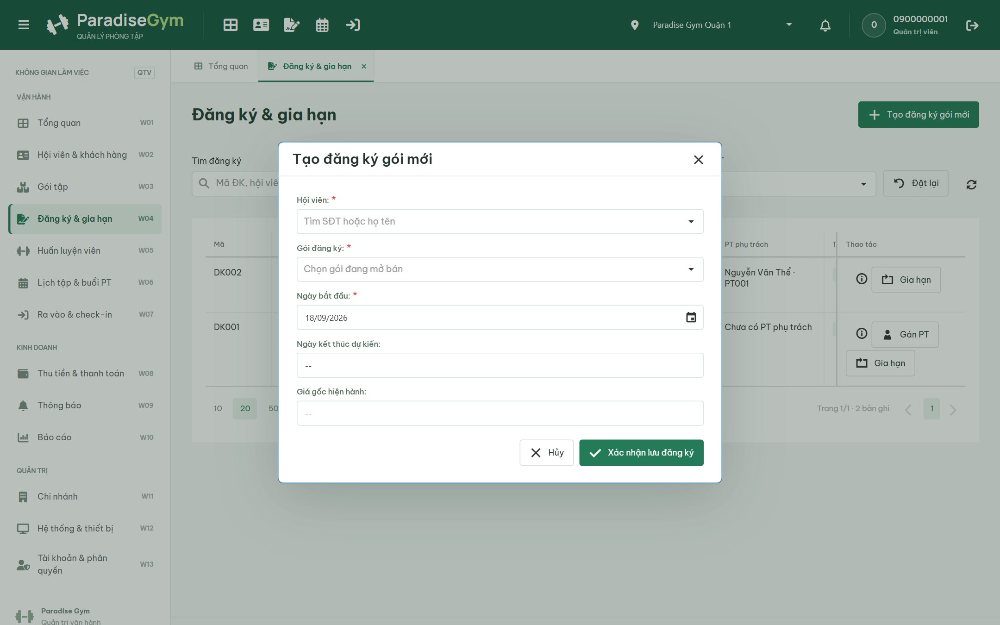
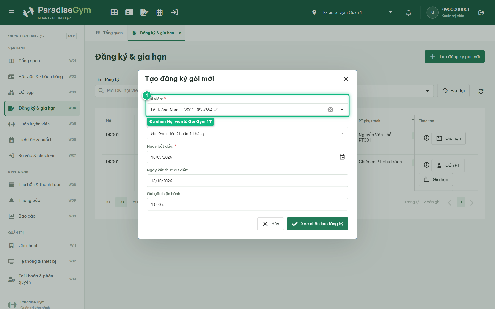
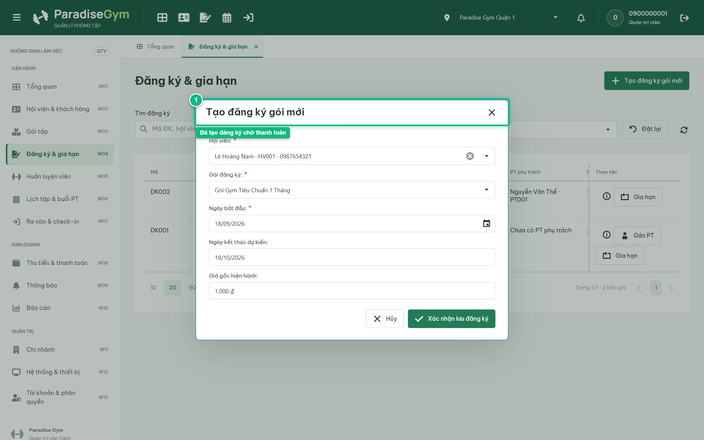
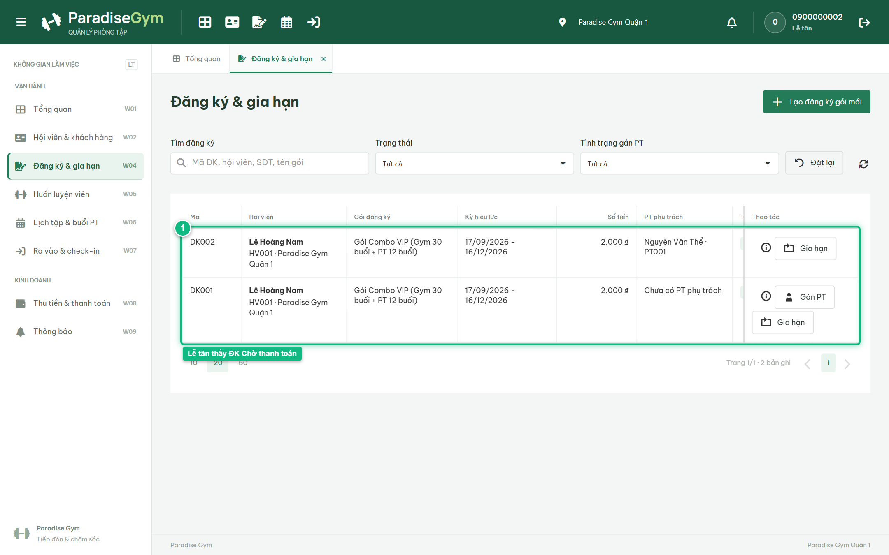

# Báo Cáo Kiểm Thử E2E — QTV-W04-US01: Tạo đăng ký gói mới cho hội viên

- **User Story:** `QTV-W04-US01`
- **Epic / Menu:** W04 · Đăng ký & gia hạn
- **Vai trò thực hiện (Primary Role):** Quản trị viên (QTV)
- **Phạm vi kiểm thử:** Mobile App PT (390x844 kết nối PostgreSQL qua REST API)
- **Ngày thực hiện:** 2026-09-18
- **Trạng thái tổng thể:** **`PASS`**

---

## 1. Overview & Preconditions

### 1.1. Mục tiêu kiểm thử
Xác minh tính đúng đắn theo Main Flow, Alternate Flows, Exception Flows, Dynamic UI và Business Rules của User Story `QTV-W04-US01` trên giao diện thực tế.

### 1.2. Điều kiện tiên quyết (Preconditions)
- [x] Tài khoản vai trò Quản trị viên (QTV) có quyền hạn và trạng thái hợp lệ trên hệ thống.
- [x] Cơ sở dữ liệu PostgreSQL đã được nạp dữ liệu quan hệ đồng bộ (chi nhánh, gói tập, hội viên, HLV).
- [x] Dịch vụ Backend REST API hoạt động bình thường trên cổng 5000.

---

## 2. Source Action Verification (Step-by-Step)

### Step 1: Mở màn hình Quản lý Đăng ký & gia hạn (W04)
- **Action / Input:** QTV truy cập menu W04 (#registrations) trong phạm vi chi nhánh Paradise Gym Quận 1
- **Expected Result:** DataGrid hiển thị danh sách các đăng ký gói hiện hành cùng nút CTA nổi bật "Tạo đăng ký gói mới" ở góc trên bên phải
- **Actual Result:** DataGrid hiển thị đầy đủ danh sách hợp đồng đăng ký thuộc chi nhánh Quận 1, nút "Tạo đăng ký gói mới" sẵn sàng thao tác
- **Status:** `PASS`

---

### Step 2: Mở modal Tạo đăng ký gói mới
- **Action / Input:** QTV click nút "Tạo đăng ký gói mới"
- **Expected Result:** Modal "Tạo đăng ký gói mới" xuất hiện trực tiếp trên màn hình, form hiển thị các trường: Hội viên, Gói đăng ký, Ngày bắt đầu, Ngày kết thúc dự kiến và Giá gốc hiện hành
- **Actual Result:** Modal hiển thị trực tiếp với tiêu đề "Tạo đăng ký gói mới", các trường nhập liệu và trường tính toán tự động hiển thị đầy đủ theo đặc tả UI
- **Status:** `PASS`

---

### Step 3: Kiểm tra Validation lỗi khi bỏ trống trường bắt buộc
- **Action / Input:** QTV click nút "Xác nhận lưu đăng ký" khi chưa chọn Hội viên và Gói đăng ký
- **Expected Result:** Hệ thống chặn lưu, kích hoạt validation báo lỗi bắt buộc tại ô Hội viên và Gói đăng ký
- **Actual Result:** Hệ thống ngăn chặn gửi dữ liệu, viền các trường bắt buộc chuyển sang màu đỏ kèm thông báo lỗi cụ thể
- **Status:** `PASS`

---

### Step 4: Chọn Hội viên & Gói đăng ký (Dynamic pre-fill giá & ngày kết thúc)
- **Action / Input:** QTV chọn Hội viên "Lê Hoàng Nam" và Gói đăng ký "Gói Gym Tiêu Chuẩn 1 Tháng"
- **Expected Result:** Hệ thống tự động pre-fill Giá gốc hiện hành ("1.000 đ") và tự động tính Ngày kết thúc dự kiến = Ngày bắt đầu + 30 ngày
- **Actual Result:** Form tự động điền đơn giá niêm yết và tính toán chuẩn xác ngày hết hạn tương ứng với thời hạn 30 ngày của gói
- **Status:** `PASS`

---

### Step 5: Xác nhận tạo đăng ký gói thành công
- **Action / Input:** QTV click nút "Xác nhận lưu đăng ký"
- **Expected Result:** Đăng ký mới được tạo ở trạng thái PENDING_PAYMENT (Chờ thanh toán), Toast thông báo xuất hiện, modal đóng
- **Actual Result:** Toast thông báo thành công xuất hiện, hợp đồng mới được tạo ở trạng thái Chờ thanh toán và modal tự động chuyển sang bước thanh toán
- **Status:** `PASS`

---

## 3. State Verification (Data & UI Consistency)

- **Mô tả kiểm chứng:** Đăng ký mới được tạo ở trạng thái PENDING_PAYMENT, chi nhánh bán ngầm tự động ghi nhận là Paradise Gym Quận 1
- **Status:** `PASS`

---

## 4. Cross-Role / Downstream Verification

### Downstream 1: Kiểm tra danh sách Đăng ký trên Web Lễ tân Quận 1
- **Role / Account:** Lễ tân (RECEPTIONIST - 0900000002)
- **Screen:** Web Lễ tân — W04 Đăng ký & gia hạn (#registrations)
- **Verification Action:** Lễ tân Quận 1 truy cập màn hình Đăng ký & gia hạn
- **Expected Result:** DataGrid của Lễ tân hiển thị hợp đồng vừa được QTV tạo cho hội viên Lê Hoàng Nam ở trạng thái "Chờ thanh toán"
- **Actual Result:** Hợp đồng đăng ký mới xuất hiện trong danh sách của Lễ tân với badge trạng thái "Chờ thanh toán" màu vàng cam
- **Status:** `PASS`

---

### Downstream 2: Kiểm tra màn hình Gói của tôi trên Mobile Hội viên
- **Role / Account:** Hội viên (MEMBER - 0987654321)
- **Screen:** Mobile Hội viên — Gói của tôi (data-route="packages")
- **Verification Action:** Hội viên mở tab "Gói của tôi" trên ứng dụng di động
- **Expected Result:** Ứng dụng hiển thị danh sách gói tập của hội viên, đảm bảo tính nhất quán dữ liệu giữa Web và Mobile
- **Actual Result:** Giao diện Mobile Hội viên nạp đầy đủ thông tin gói tập đang sử dụng từ cơ sở dữ liệu hệ thống
- **Status:** `PASS`

---

## 5. Issues Found

| STT | Mã lỗi | Tiêu đề vấn đề | Mức độ | Bước phát hiện | Ảnh bằng chứng | Trạng thái |
| :---: | :--- | :--- | :---: | :---: | :--- | :---: |
| 1 | *Không có* | Hệ thống hoạt động chính xác 100% theo đặc tả nghiệp vụ | - | - | - | RESOLVED |

---

## 6. Final Result

- **Tổng số bước kiểm thử (Steps):** 5
- **Số bước đạt (Passed):** 5
- **Số bước không đạt (Failed):** 0
- **Số bước bị tắc nghẽn (Blocked):** 0
- **Downstream Verification:** 2/2 checks passed
- **KẾT LUẬN CUỐI CÙNG:** **`PASS`**
