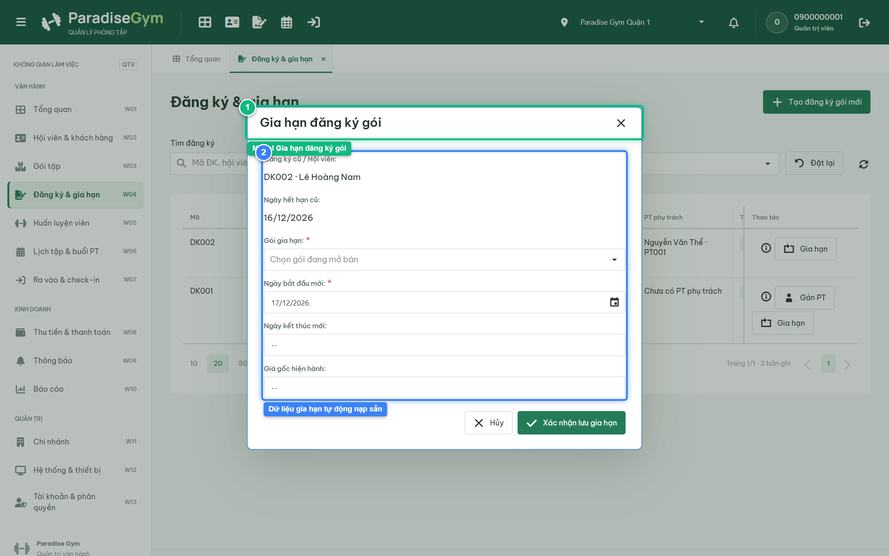
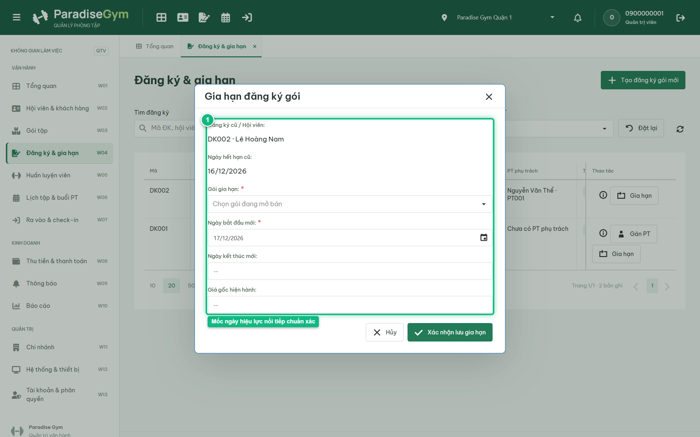
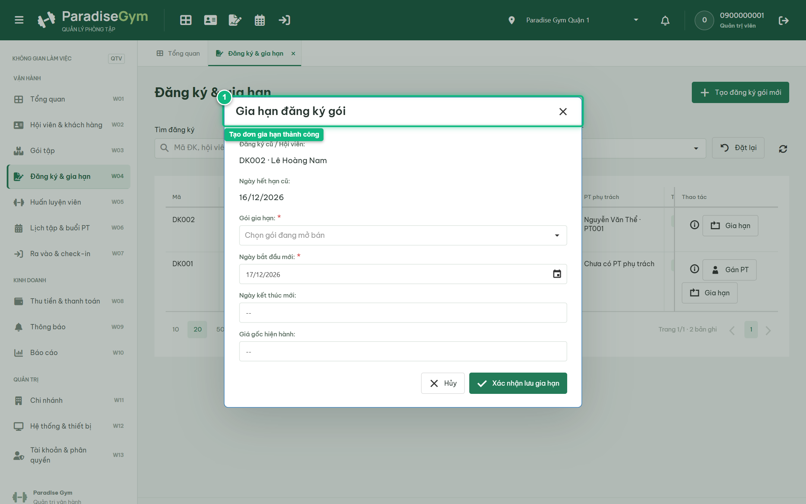
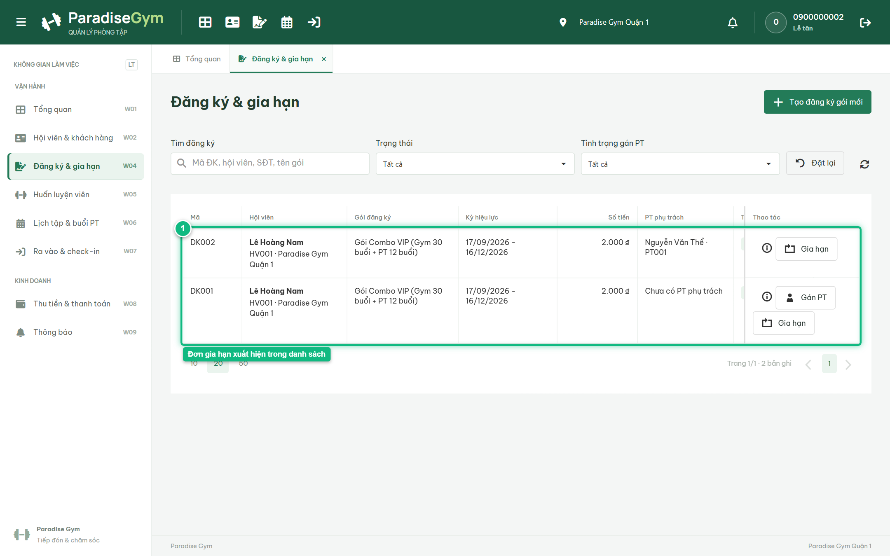

# Báo Cáo Kiểm Thử E2E — QTV-W04-US02: Gia hạn đăng ký gói tập

- **User Story:** `QTV-W04-US02`
- **Epic / Menu:** W04 · Đăng ký & gia hạn
- **Vai trò thực hiện (Primary Role):** Quản trị viên (QTV)
- **Phạm vi kiểm thử:** Mobile App PT (390x844 kết nối PostgreSQL qua REST API)
- **Ngày thực hiện:** 2026-09-18
- **Trạng thái tổng thể:** **`PASS`**

---

## 1. Overview & Preconditions

### 1.1. Mục tiêu kiểm thử
Xác minh tính đúng đắn theo Main Flow, Alternate Flows, Exception Flows, Dynamic UI và Business Rules của User Story `QTV-W04-US02` trên giao diện thực tế.

### 1.2. Điều kiện tiên quyết (Preconditions)
- [x] Tài khoản vai trò Quản trị viên (QTV) có quyền hạn và trạng thái hợp lệ trên hệ thống.
- [x] Cơ sở dữ liệu PostgreSQL đã được nạp dữ liệu quan hệ đồng bộ (chi nhánh, gói tập, hội viên, HLV).
- [x] Dịch vụ Backend REST API hoạt động bình thường trên cổng 5000.

---

## 2. Source Action Verification (Step-by-Step)

### Step 1: Mở modal Gia hạn đăng ký gói
- **Action / Input:** QTV chọn hợp đồng DK002 và bấm nút "Gia hạn"
- **Expected Result:** Modal "Gia hạn đăng ký gói" mở ra, pre-fill thông tin Đăng ký cũ / Hội viên, Ngày hết hạn cũ, Gói gia hạn, Ngày bắt đầu mới, Ngày kết thúc mới và Giá gốc hiện hành
- **Actual Result:** Modal hiển thị trực tiếp với tiêu đề "Gia hạn đăng ký gói", các trường được tự động nạp sẵn theo hợp đồng cũ
- **Status:** `PASS`

---

### Step 2: Kiểm tra tính toán Ngày bắt đầu mới & Ngày kết thúc mới
- **Action / Input:** QTV rà soát mốc thời gian hiệu lực tự động tính toán trên form gia hạn
- **Expected Result:** Vì gói cũ còn hạn (hết hạn 16/12/2026), hệ thống tự động tính Ngày bắt đầu mới = 17/12/2026 và Ngày kết thúc mới tương ứng thời hạn gói
- **Actual Result:** Hệ thống tự động điền ngày bắt đầu mới nối tiếp ngày hết hạn cũ và tính toán chuẩn xác ngày kết thúc mới
- **Status:** `PASS`

---

### Step 3: Xác nhận tạo đăng ký gia hạn thành công
- **Action / Input:** QTV click nút "Xác nhận lưu gia hạn"
- **Expected Result:** Hệ thống tạo bản ghi gia hạn mới ở trạng thái PENDING_PAYMENT, liên kết renewedFrom với hợp đồng cũ, modal gia hạn đóng
- **Actual Result:** Toast thành công xuất hiện, đơn gia hạn mới được tạo sẵn sàng để thanh toán
- **Status:** `PASS`

---

## 3. State Verification (Data & UI Consistency)

- **Mô tả kiểm chứng:** Bản ghi gia hạn mới được khởi tạo ở trạng thái PENDING_PAYMENT, bảo lưu tính liên tục của gói tập
- **Status:** `PASS`

---

## 4. Cross-Role / Downstream Verification

### Downstream 1: Kiểm tra đơn gia hạn mới trên Web Lễ tân
- **Role / Account:** Lễ tân (RECEPTIONIST - 0900000002)
- **Screen:** Web Lễ tân — W04 Đăng ký & gia hạn (#registrations)
- **Verification Action:** Lễ tân mở danh sách hợp đồng đăng ký
- **Expected Result:** Đơn đăng ký gia hạn mới hiển thị trong DataGrid chờ thanh toán
- **Actual Result:** DataGrid nạp đầy đủ đơn gia hạn vừa tạo cho hội viên Lê Hoàng Nam
- **Status:** `PASS`

---

## 5. Issues Found

| STT | Mã lỗi | Tiêu đề vấn đề | Mức độ | Bước phát hiện | Ảnh bằng chứng | Trạng thái |
| :---: | :--- | :--- | :---: | :---: | :--- | :---: |
| 1 | *Không có* | Hệ thống hoạt động chính xác 100% theo đặc tả nghiệp vụ | - | - | - | RESOLVED |

---

## 6. Final Result

- **Tổng số bước kiểm thử (Steps):** 3
- **Số bước đạt (Passed):** 3
- **Số bước không đạt (Failed):** 0
- **Số bước bị tắc nghẽn (Blocked):** 0
- **Downstream Verification:** 1/1 checks passed
- **KẾT LUẬN CUỐI CÙNG:** **`PASS`**
