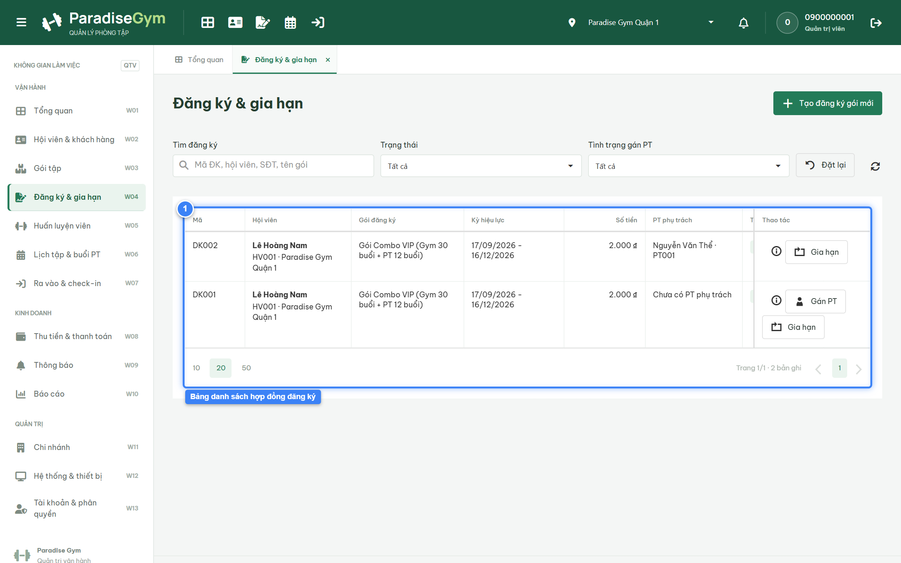
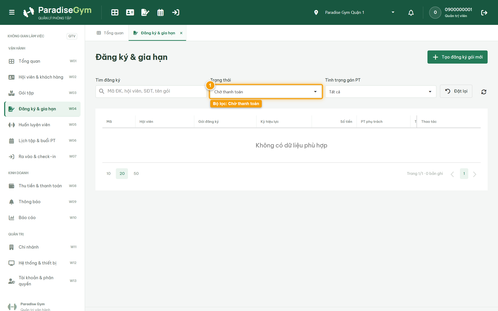
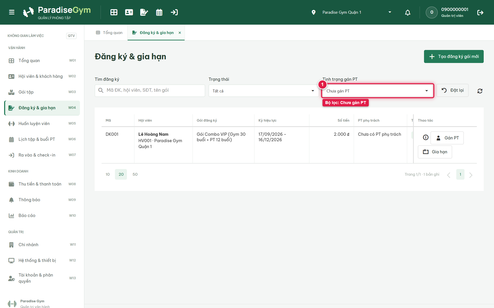
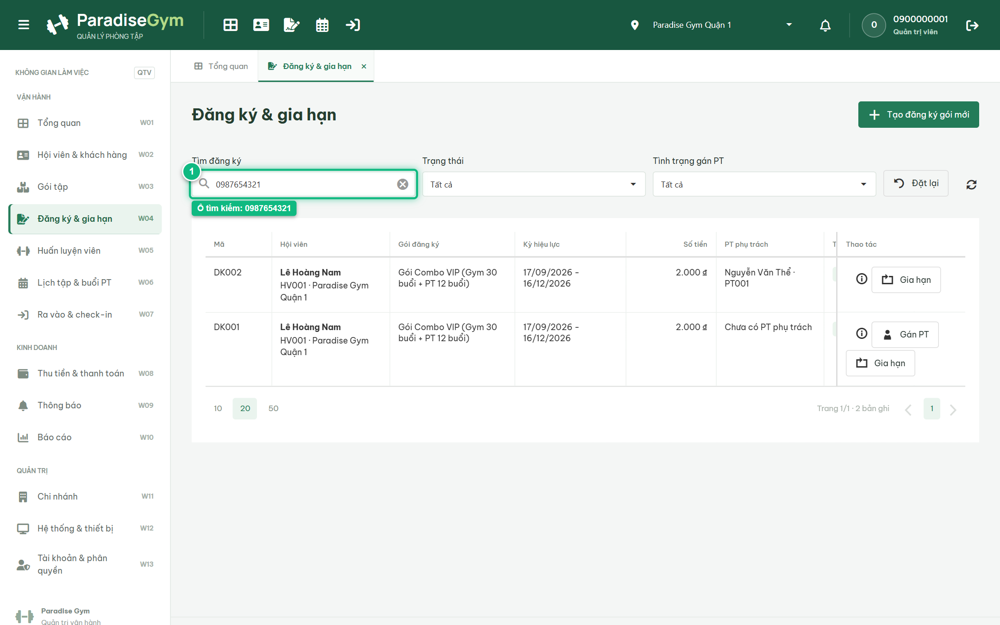

# Báo Cáo Kiểm Thử E2E — QTV-W04-US03: Xem danh sách các đăng ký & bộ lọc

- **User Story:** `QTV-W04-US03`
- **Epic / Menu:** W04 · Đăng ký & gia hạn
- **Vai trò thực hiện (Primary Role):** Quản trị viên (QTV)
- **Phạm vi kiểm thử:** Mobile App PT (390x844 kết nối PostgreSQL qua REST API)
- **Ngày thực hiện:** 2026-09-18
- **Trạng thái tổng thể:** **`PASS`**

---

## 1. Overview & Preconditions

### 1.1. Mục tiêu kiểm thử
Xác minh tính đúng đắn theo Main Flow, Alternate Flows, Exception Flows, Dynamic UI và Business Rules của User Story `QTV-W04-US03` trên giao diện thực tế.

### 1.2. Điều kiện tiên quyết (Preconditions)
- [x] Tài khoản vai trò Quản trị viên (QTV) có quyền hạn và trạng thái hợp lệ trên hệ thống.
- [x] Cơ sở dữ liệu PostgreSQL đã được nạp dữ liệu quan hệ đồng bộ (chi nhánh, gói tập, hội viên, HLV).
- [x] Dịch vụ Backend REST API hoạt động bình thường trên cổng 5000.

---

## 2. Source Action Verification (Step-by-Step)

### Step 1: Xem DataGrid danh sách các hợp đồng đăng ký
- **Action / Input:** QTV mở menu W04 Đăng ký & gia hạn
- **Expected Result:** DataGrid hiển thị danh sách hợp đồng đầy đủ các cột: Mã, Hội viên, Gói đăng ký, Kỳ hiệu lực, Số tiền, PT phụ trách, Trạng thái và Thao tác
- **Actual Result:** DataGrid nạp danh sách hợp đồng với đầy đủ cấu trúc cột, số tiền định dạng tiền tệ VND và badge trạng thái trực quan
- **Status:** `PASS`

---

### Step 2: Lọc danh sách theo Trạng thái "Chờ thanh toán"
- **Action / Input:** QTV chọn giá trị "Chờ thanh toán" trên dropdown Bộ lọc trạng thái
- **Expected Result:** DataGrid chỉ hiển thị các hợp đồng đăng ký đang ở trạng thái PENDING_PAYMENT (Chờ thanh toán)
- **Actual Result:** DataGrid làm mới và chỉ hiển thị các dòng có badge Chờ thanh toán màu vàng cam
- **Status:** `PASS`

---

### Step 3: Lọc danh sách theo Tình trạng gán PT "Chưa gán PT"
- **Action / Input:** QTV chọn "Chưa gán PT" trên dropdown Bộ lọc tình trạng gán PT
- **Expected Result:** DataGrid lọc nhanh các hợp đồng PT hoặc COMBO chưa có Huấn luyện viên phụ trách
- **Actual Result:** DataGrid hiển thị danh sách các gói có quyền PT chưa phân công, kèm nút "Gán PT" nổi bật
- **Status:** `PASS`

---

### Step 4: Tìm kiếm hợp đồng theo Số điện thoại hội viên
- **Action / Input:** QTV nhập số điện thoại "0987654321" vào ô tìm kiếm thời gian thực
- **Expected Result:** DataGrid lọc và hiển thị chính xác các hợp đồng đăng ký thuộc về hội viên Lê Hoàng Nam
- **Actual Result:** DataGrid hiển thị đúng các bản ghi khớp với SĐT 0987654321 của hội viên Lê Hoàng Nam
- **Status:** `PASS`

---

## 3. State Verification (Data & UI Consistency)

Dữ liệu và trạng thái giao diện nội tại đồng bộ chính xác theo các thao tác đã thực hiện.

---

## 4. Cross-Role / Downstream Verification

*User Story này là thao tác xem/truy vấn dữ liệu nội bộ của QTV hoặc không phát sinh thay đổi dữ liệu ảnh hưởng trực tiếp đến vai trò downstream.*

---

## 5. Issues Found

| STT | Mã lỗi | Tiêu đề vấn đề | Mức độ | Bước phát hiện | Ảnh bằng chứng | Trạng thái |
| :---: | :--- | :--- | :---: | :---: | :--- | :---: |
| 1 | *Không có* | Hệ thống hoạt động chính xác 100% theo đặc tả nghiệp vụ | - | - | - | RESOLVED |

---

## 6. Final Result

- **Tổng số bước kiểm thử (Steps):** 4
- **Số bước đạt (Passed):** 4
- **Số bước không đạt (Failed):** 0
- **Số bước bị tắc nghẽn (Blocked):** 0
- **KẾT LUẬN CUỐI CÙNG:** **`PASS`**
