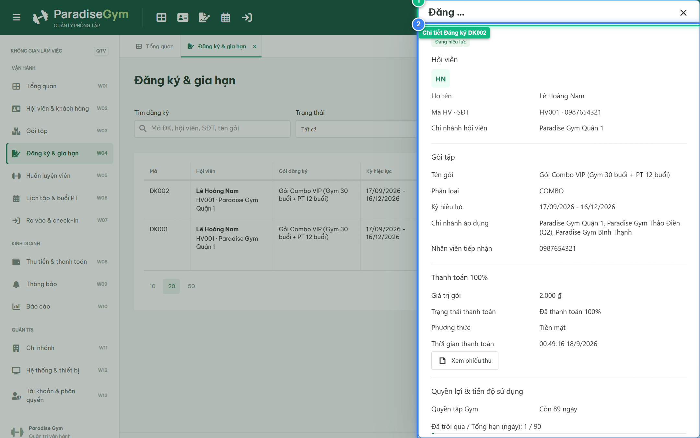
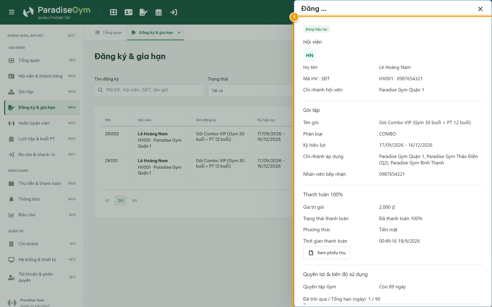
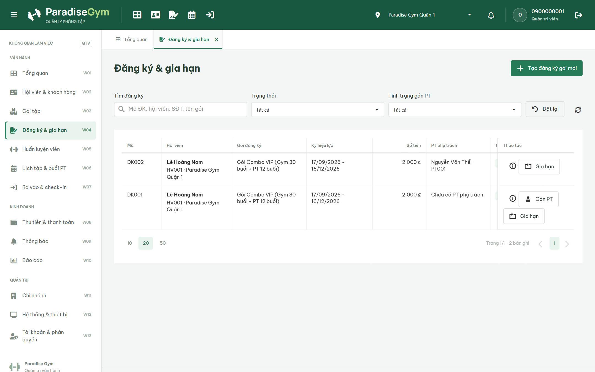

# Báo Cáo Kiểm Thử E2E — QTV-W04-US04: Xem chi tiết lượt đăng ký gói

- **User Story:** `QTV-W04-US04`
- **Epic / Menu:** W04 · Đăng ký & gia hạn
- **Vai trò thực hiện (Primary Role):** Quản trị viên (QTV)
- **Phạm vi kiểm thử:** Mobile App PT (390x844 kết nối PostgreSQL qua REST API)
- **Ngày thực hiện:** 2026-09-18
- **Trạng thái tổng thể:** **`PASS`**

---

## 1. Overview & Preconditions

### 1.1. Mục tiêu kiểm thử
Xác minh tính đúng đắn theo Main Flow, Alternate Flows, Exception Flows, Dynamic UI và Business Rules của User Story `QTV-W04-US04` trên giao diện thực tế.

### 1.2. Điều kiện tiên quyết (Preconditions)
- [x] Tài khoản vai trò Quản trị viên (QTV) có quyền hạn và trạng thái hợp lệ trên hệ thống.
- [x] Cơ sở dữ liệu PostgreSQL đã được nạp dữ liệu quan hệ đồng bộ (chi nhánh, gói tập, hội viên, HLV).
- [x] Dịch vụ Backend REST API hoạt động bình thường trên cổng 5000.

---

## 2. Source Action Verification (Step-by-Step)

### Step 1: Mở popup Chi tiết Lượt Đăng ký Gói
- **Action / Input:** QTV bấm nút "Chi tiết" tại hợp đồng DK002
- **Expected Result:** Popup Chi tiết mở ra, hiển thị đầy đủ 4 khối thông tin: Khối Hội viên, Khối Gói tập, Khối Thanh toán 100% và Khối Quyền lợi & tiến độ sử dụng
- **Actual Result:** Popup hiển thị tiêu đề "Đăng ký DK002", badge "Đang hiệu lực", thông tin hội viên Lê Hoàng Nam, gói Combo và các thanh tiến độ sử dụng dịch vụ
- **Status:** `PASS`

---

### Step 2: Kiểm tra hiển thị Tiến độ ngày tập Gym và Tiến độ buổi tập PT
- **Action / Input:** QTV quan sát khối Quyền lợi & tiến độ sử dụng của gói COMBO
- **Expected Result:** Vì là gói COMBO, hệ thống hiển thị đồng thời thanh Progress bar Gym (xanh lá) và thanh Progress bar PT (cam) thể hiện số buổi còn lại
- **Actual Result:** Giao diện hiển thị trực quan tỷ lệ ngày tập Gym và số buổi PT: 12 / 12 buổi kèm thanh tiến độ đồ họa
- **Status:** `PASS`

---

### Step 3: Đóng popup Chi tiết lượt đăng ký
- **Action / Input:** QTV click nút "Đóng" trên popup
- **Expected Result:** Popup chi tiết đóng lại, giao diện quay về bảng DataGrid danh sách
- **Actual Result:** Popup đóng an toàn, danh sách DataGrid giữ nguyên vị trí dòng dữ liệu
- **Status:** `PASS`

---

## 3. State Verification (Data & UI Consistency)

Dữ liệu và trạng thái giao diện nội tại đồng bộ chính xác theo các thao tác đã thực hiện.

---

## 4. Cross-Role / Downstream Verification

*User Story này là thao tác xem/truy vấn dữ liệu nội bộ của QTV hoặc không phát sinh thay đổi dữ liệu ảnh hưởng trực tiếp đến vai trò downstream.*

---

## 5. Issues Found

| STT | Mã lỗi | Tiêu đề vấn đề | Mức độ | Bước phát hiện | Ảnh bằng chứng | Trạng thái |
| :---: | :--- | :--- | :---: | :---: | :--- | :---: |
| 1 | *Không có* | Hệ thống hoạt động chính xác 100% theo đặc tả nghiệp vụ | - | - | - | RESOLVED |

---

## 6. Final Result

- **Tổng số bước kiểm thử (Steps):** 3
- **Số bước đạt (Passed):** 3
- **Số bước không đạt (Failed):** 0
- **Số bước bị tắc nghẽn (Blocked):** 0
- **KẾT LUẬN CUỐI CÙNG:** **`PASS`**
