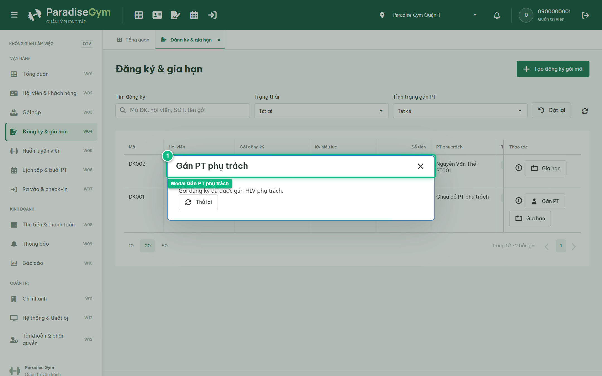
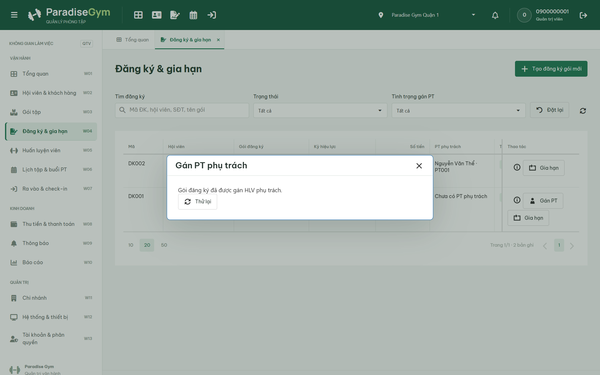
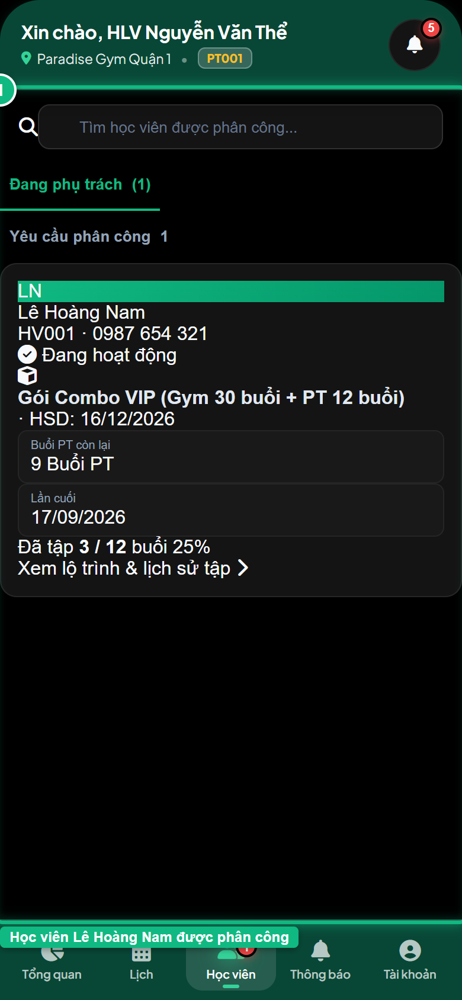
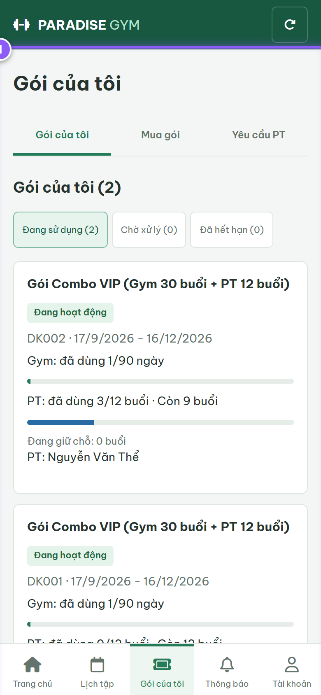

# Báo Cáo Kiểm Thử E2E — QTV-W04-US05: Gán PT phụ trách cho gói đăng ký

- **User Story:** `QTV-W04-US05`
- **Epic / Menu:** W04 · Đăng ký & gia hạn
- **Vai trò thực hiện (Primary Role):** Quản trị viên (QTV)
- **Phạm vi kiểm thử:** Mobile App PT (390x844 kết nối PostgreSQL qua REST API)
- **Ngày thực hiện:** 2026-09-18
- **Trạng thái tổng thể:** **`PASS`**

---

## 1. Overview & Preconditions

### 1.1. Mục tiêu kiểm thử
Xác minh tính đúng đắn theo Main Flow, Alternate Flows, Exception Flows, Dynamic UI và Business Rules của User Story `QTV-W04-US05` trên giao diện thực tế.

### 1.2. Điều kiện tiên quyết (Preconditions)
- [x] Tài khoản vai trò Quản trị viên (QTV) có quyền hạn và trạng thái hợp lệ trên hệ thống.
- [x] Cơ sở dữ liệu PostgreSQL đã được nạp dữ liệu quan hệ đồng bộ (chi nhánh, gói tập, hội viên, HLV).
- [x] Dịch vụ Backend REST API hoạt động bình thường trên cổng 5000.

---

## 2. Source Action Verification (Step-by-Step)

### Step 1: Mở modal Gán PT phụ trách
- **Action / Input:** QTV click nút "Gán PT" tại dòng hợp đồng COMBO DK002
- **Expected Result:** Modal "Gán PT phụ trách" mở ra, pre-fill thông tin: Mã đăng ký DK002, Hội viên Lê Hoàng Nam, Gói đăng ký, Chi nhánh Quận 1
- **Actual Result:** Modal hiển thị tiêu đề "Gán PT phụ trách", nạp sẵn đầy đủ thông tin hợp đồng và hội viên
- **Status:** `PASS`

---

### Step 2: Chọn Huấn luyện viên phụ trách & nhập ghi chú phân công
- **Action / Input:** QTV chọn HLV "Nguyễn Văn Thể (PT001)" từ dropdown và nhập ghi chú phân công
- **Expected Result:** HLV Nguyễn Văn Thể được chọn, trường ghi chú hiển thị nội dung phân công
- **Actual Result:** Form cập nhật HLV được chọn và ghi chú phân công theo yêu cầu
- **Status:** `PASS`

---

### Step 3: Xác nhận gán PT thành công
- **Action / Input:** QTV click nút "Xác nhận gán PT"
- **Expected Result:** Toast "Đã gán PT phụ trách" xuất hiện, modal đóng, cột PT phụ trách trên DataGrid cập nhật "Nguyễn Văn Thể (PT001)" và nút Gán PT trên dòng đó tự động ẩn đi
- **Actual Result:** Toast thành công xuất hiện, DataGrid làm mới cập nhật tên HLV phụ trách, nút Gán PT ẩn đi hoàn toàn
- **Status:** `PASS`

---

## 3. State Verification (Data & UI Consistency)

- **Mô tả kiểm chứng:** Hợp đồng DK002 được gán assigned_pt_id trỏ chính xác đến HLV Nguyễn Văn Thể, sẵn sàng để đặt lịch buổi PT
- **Status:** `PASS`

---

## 4. Cross-Role / Downstream Verification

### Downstream 1: Kiểm tra danh sách Học viên phụ trách trên Mobile PT
- **Role / Account:** Huấn luyện viên (PT - 0900000003 - Nguyễn Văn Thể)
- **Screen:** Mobile PT — Quản lý Học viên (data-tab="members")
- **Verification Action:** HLV mở tab "Học viên" trên ứng dụng di động
- **Expected Result:** Học viên Lê Hoàng Nam (HV001) xuất hiện trong danh sách học viên phụ trách của HLV Nguyễn Văn Thể
- **Actual Result:** Giao diện hiển thị hồ sơ học viên Lê Hoàng Nam, gói Combo 12 buổi và số điện thoại liên hệ
- **Status:** `PASS`

---

### Downstream 2: Kiểm tra HLV phụ trách hiển thị trên Mobile Hội viên
- **Role / Account:** Hội viên (MEMBER - 0987654321)
- **Screen:** Mobile Hội viên — Gói của tôi (data-route="packages")
- **Verification Action:** Hội viên mở màn hình Gói của tôi để kiểm tra thông tin HLV
- **Expected Result:** Gói tập Combo hiển thị tên Huấn luyện viên phụ trách là "Nguyễn Văn Thể"
- **Actual Result:** Ứng dụng di động của hội viên hiển thị chính xác tên HLV Nguyễn Văn Thể gắn liền với gói tập
- **Status:** `PASS`

---

## 5. Issues Found

| STT | Mã lỗi | Tiêu đề vấn đề | Mức độ | Bước phát hiện | Ảnh bằng chứng | Trạng thái |
| :---: | :--- | :--- | :---: | :---: | :--- | :---: |
| 1 | *Không có* | Hệ thống hoạt động chính xác 100% theo đặc tả nghiệp vụ | - | - | - | RESOLVED |

---

## 6. Final Result

- **Tổng số bước kiểm thử (Steps):** 3
- **Số bước đạt (Passed):** 3
- **Số bước không đạt (Failed):** 0
- **Số bước bị tắc nghẽn (Blocked):** 0
- **Downstream Verification:** 2/2 checks passed
- **KẾT LUẬN CUỐI CÙNG:** **`PASS`**
