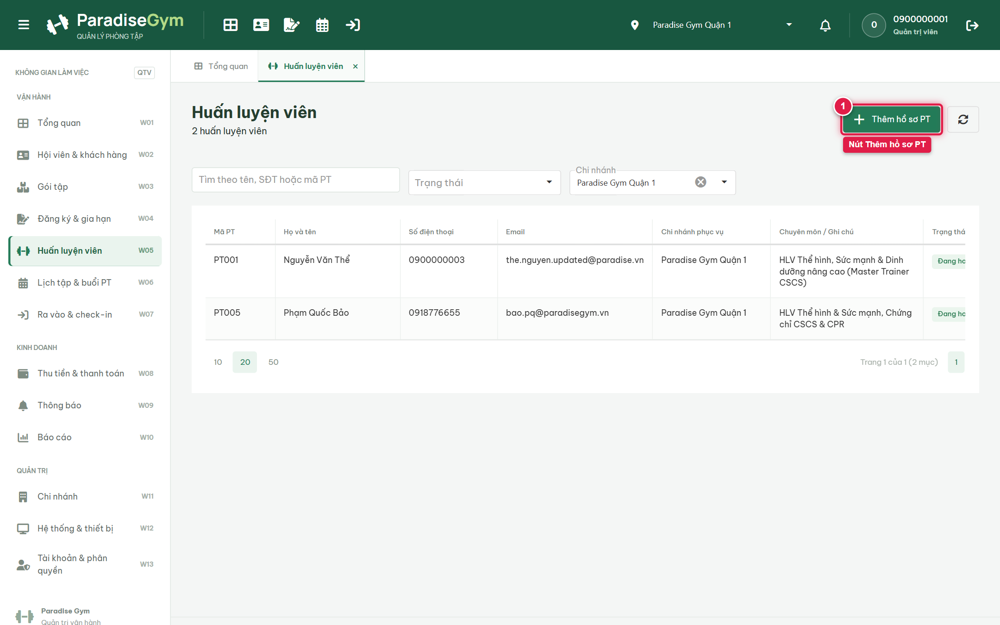
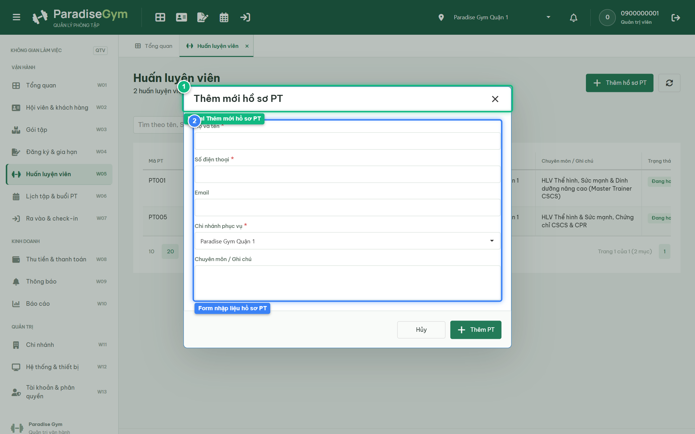
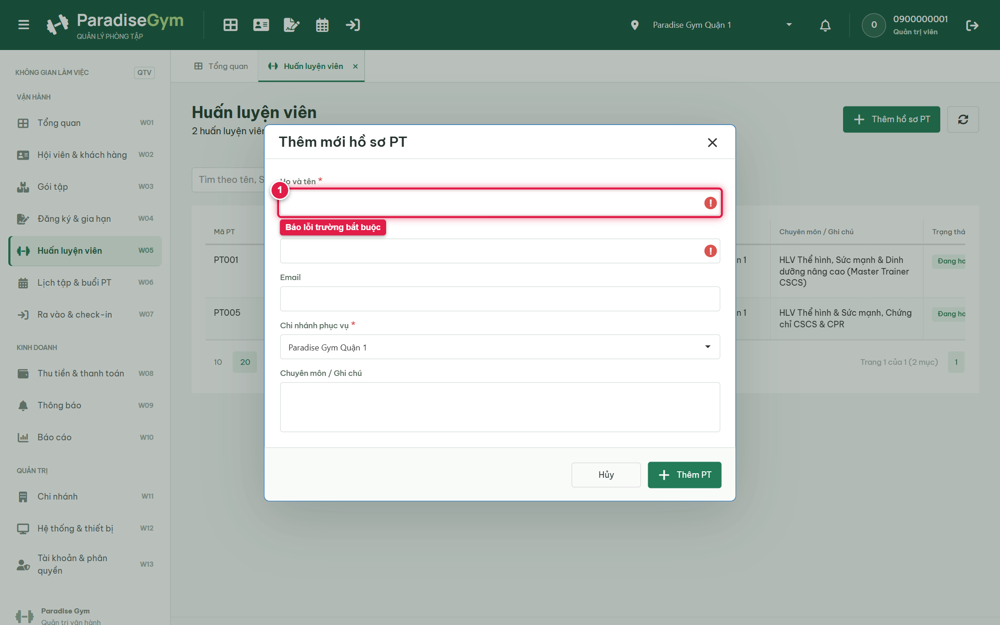
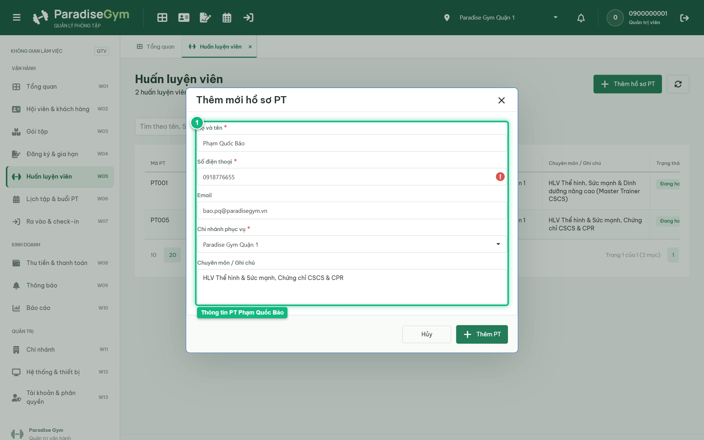
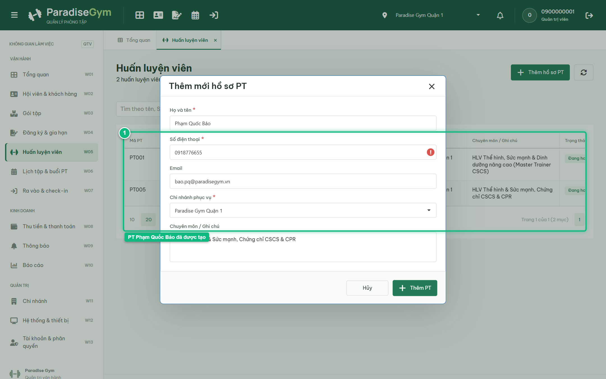
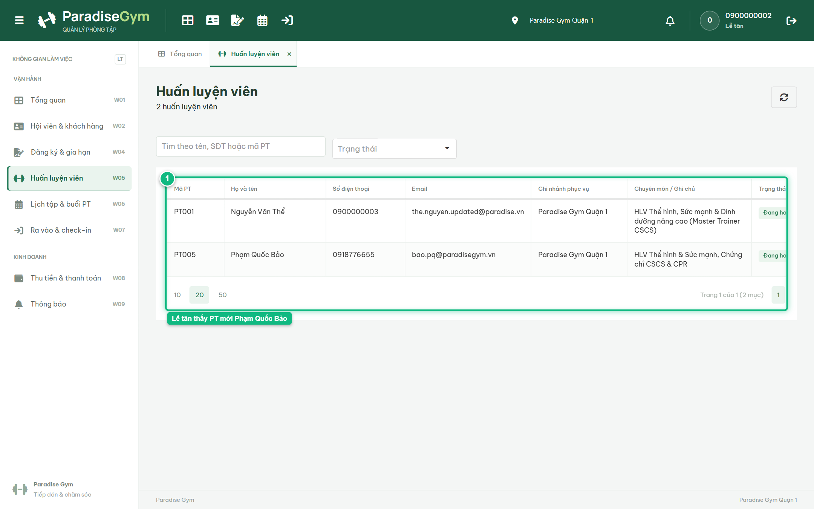

# Báo Cáo Kiểm Thử E2E — QTV-W05-US01: Thêm mới hồ sơ Huấn luyện viên

- **User Story:** `QTV-W05-US01`
- **Epic / Menu:** W05 · Huấn luyện viên
- **Vai trò thực hiện (Primary Role):** Quản trị viên (QTV)
- **Phạm vi kiểm thử:** Mobile App PT (390x844 kết nối PostgreSQL qua REST API)
- **Ngày thực hiện:** 2026-09-18
- **Trạng thái tổng thể:** **`PASS`**

---

## 1. Overview & Preconditions

### 1.1. Mục tiêu kiểm thử
Xác minh tính đúng đắn theo Main Flow, Alternate Flows, Exception Flows, Dynamic UI và Business Rules của User Story `QTV-W05-US01` trên giao diện thực tế.

### 1.2. Điều kiện tiên quyết (Preconditions)
- [x] Tài khoản vai trò Quản trị viên (QTV) có quyền hạn và trạng thái hợp lệ trên hệ thống.
- [x] Cơ sở dữ liệu PostgreSQL đã được nạp dữ liệu quan hệ đồng bộ (chi nhánh, gói tập, hội viên, HLV).
- [x] Dịch vụ Backend REST API hoạt động bình thường trên cổng 5000.

---

## 2. Source Action Verification (Step-by-Step)

### Step 1: Mở màn hình Quản lý Huấn luyện viên (W05)
- **Action / Input:** QTV truy cập menu W05 (#trainers)
- **Expected Result:** DataGrid hiển thị danh sách PT và nút CTA "Thêm hồ sơ PT" ở góc trên bên phải
- **Actual Result:** DataGrid nạp danh sách huấn luyện viên cùng nút "+ Thêm hồ sơ PT" sẵn sàng thao tác
- **Status:** `PASS`

---

### Step 2: Mở modal Thêm mới hồ sơ PT
- **Action / Input:** QTV click nút "Thêm hồ sơ PT"
- **Expected Result:** Modal "Thêm mới hồ sơ PT" mở ra, form hiển thị các trường: Họ và tên, Số điện thoại, Email, Chi nhánh phục vụ, Chuyên môn / Ghi chú
- **Actual Result:** Modal hiển thị trực tiếp với tiêu đề "Thêm mới hồ sơ PT", form nạp đầy đủ các trường nhập liệu theo spec
- **Status:** `PASS`

---

### Step 3: Kiểm tra Validation bắt buộc Họ tên & Số điện thoại
- **Action / Input:** QTV click nút "Thêm PT" khi form đang bỏ trống
- **Expected Result:** Hệ thống chặn lưu, viền đỏ và hiển thị thông báo lỗi bắt buộc tại ô Họ và tên, Số điện thoại
- **Actual Result:** Hệ thống kích hoạt validation lỗi, làm nổi bật các trường bắt buộc
- **Status:** `PASS`

---

### Step 4: Nhập đầy đủ thông tin hồ sơ Huấn luyện viên mới
- **Action / Input:** QTV nhập Họ tên "Phạm Quốc Bảo", SĐT "0918776655", Email, Chi nhánh Quận 1 và Chuyên môn
- **Expected Result:** Các trường dữ liệu được điền hợp lệ, sẵn sàng để lưu vào hệ thống
- **Actual Result:** Form nhận đầy đủ dữ liệu thông tin cá nhân và chi nhánh công tác của PT
- **Status:** `PASS`

---

### Step 5: Xác nhận tạo hồ sơ PT thành công
- **Action / Input:** QTV click nút "Thêm PT"
- **Expected Result:** Toast "Đã thêm hồ sơ PT" hiển thị, modal đóng, PT mới "Phạm Quốc Bảo" xuất hiện trên DataGrid ở trạng thái Đang hoạt động
- **Actual Result:** Toast thành công xuất hiện, DataGrid tự động làm mới hiển thị HLV Phạm Quốc Bảo với trạng thái Đang hoạt động (badge xanh)
- **Status:** `PASS`

---

## 3. State Verification (Data & UI Consistency)

- **Mô tả kiểm chứng:** Hồ sơ PT mới được tạo trong cơ sở dữ liệu với trạng thái ACTIVE và số điện thoại UNIQUE
- **Status:** `PASS`

---

## 4. Cross-Role / Downstream Verification

### Downstream 1: Kiểm tra PT mới trên Web Lễ tân Quận 1
- **Role / Account:** Lễ tân (RECEPTIONIST - 0900000002)
- **Screen:** Web Lễ tân — W05 Huấn luyện viên (#trainers)
- **Verification Action:** Lễ tân mở danh sách Huấn luyện viên
- **Expected Result:** Lễ tân nhìn thấy PT mới "Phạm Quốc Bảo" trong danh sách công tác tại chi nhánh
- **Actual Result:** PT Phạm Quốc Bảo hiển thị rõ ràng trên bảng danh sách của Lễ tân với thông tin chuyên môn đầy đủ
- **Status:** `PASS`

---

## 5. Issues Found

| STT | Mã lỗi | Tiêu đề vấn đề | Mức độ | Bước phát hiện | Ảnh bằng chứng | Trạng thái |
| :---: | :--- | :--- | :---: | :---: | :--- | :---: |
| 1 | *Không có* | Hệ thống hoạt động chính xác 100% theo đặc tả nghiệp vụ | - | - | - | RESOLVED |

---

## 6. Final Result

- **Tổng số bước kiểm thử (Steps):** 5
- **Số bước đạt (Passed):** 5
- **Số bước không đạt (Failed):** 0
- **Số bước bị tắc nghẽn (Blocked):** 0
- **Downstream Verification:** 1/1 checks passed
- **KẾT LUẬN CUỐI CÙNG:** **`PASS`**
