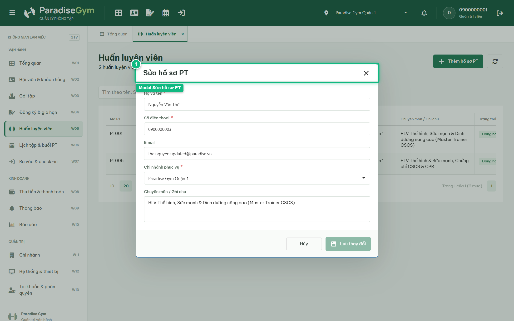
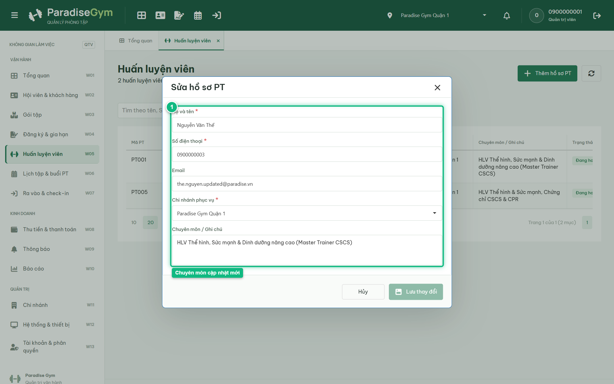
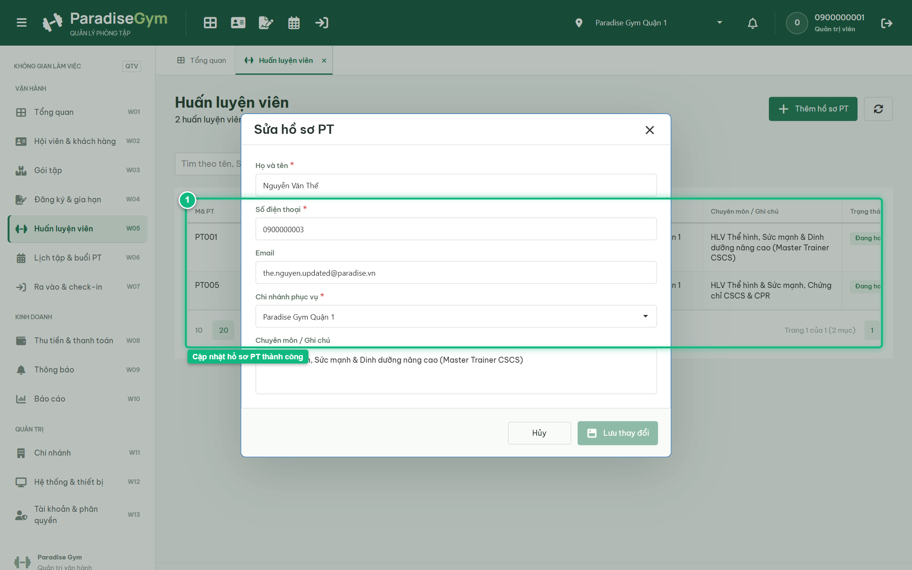

# Báo Cáo Kiểm Thử E2E — QTV-W05-US02: Sửa hồ sơ Huấn luyện viên

- **User Story:** `QTV-W05-US02`
- **Epic / Menu:** W05 · Huấn luyện viên
- **Vai trò thực hiện (Primary Role):** Quản trị viên (QTV)
- **Phạm vi kiểm thử:** Mobile App PT (390x844 kết nối PostgreSQL qua REST API)
- **Ngày thực hiện:** 2026-09-18
- **Trạng thái tổng thể:** **`PASS`**

---

## 1. Overview & Preconditions

### 1.1. Mục tiêu kiểm thử
Xác minh tính đúng đắn theo Main Flow, Alternate Flows, Exception Flows, Dynamic UI và Business Rules của User Story `QTV-W05-US02` trên giao diện thực tế.

### 1.2. Điều kiện tiên quyết (Preconditions)
- [x] Tài khoản vai trò Quản trị viên (QTV) có quyền hạn và trạng thái hợp lệ trên hệ thống.
- [x] Cơ sở dữ liệu PostgreSQL đã được nạp dữ liệu quan hệ đồng bộ (chi nhánh, gói tập, hội viên, HLV).
- [x] Dịch vụ Backend REST API hoạt động bình thường trên cổng 5000.

---

## 2. Source Action Verification (Step-by-Step)

### Step 1: Mở modal Sửa hồ sơ PT & kiểm tra khóa Số điện thoại
- **Action / Input:** QTV click nút "Sửa" tại dòng huấn luyện viên
- **Expected Result:** Modal "Sửa hồ sơ PT" mở ra, nạp sẵn dữ liệu hiện tại, trường Số điện thoại bị khóa (disabled/readonly) vì là khóa định danh nghiệp vụ
- **Actual Result:** Modal mở ra với tiêu đề "Sửa hồ sơ PT", trường Số điện thoại bị vô hiệu hóa hoàn toàn không cho phép chỉnh sửa
- **Status:** `PASS`

---

### Step 2: Cập nhật Chuyên môn / Ghi chú của Huấn luyện viên
- **Action / Input:** QTV cập nhật nội dung chuyên môn mới: "HLV Thể hình, Sức mạnh & Dinh dưỡng nâng cao (Master Trainer CSCS)"
- **Expected Result:** Trường Chuyên môn được cập nhật nội dung mới, nút "Lưu thay đổi" chuyển sang trạng thái khả dụng
- **Actual Result:** Nội dung chuyên môn mới được điền vào form, hệ thống phát hiện thay đổi và kích hoạt nút Lưu
- **Status:** `PASS`

---

### Step 3: Xác nhận lưu cập nhật hồ sơ PT thành công
- **Action / Input:** QTV click nút "Lưu thay đổi"
- **Expected Result:** Toast "Đã cập nhật hồ sơ PT" xuất hiện, modal đóng, cột Chuyên môn trên DataGrid cập nhật thông tin mới
- **Actual Result:** Toast thành công xuất hiện, modal đóng, DataGrid hiển thị tóm tắt chuyên môn mới vừa chỉnh sửa
- **Status:** `PASS`

---

## 3. State Verification (Data & UI Consistency)

- **Mô tả kiểm chứng:** Thông tin chuyên môn của PT được cập nhật đồng bộ trong database
- **Status:** `PASS`

---

## 4. Cross-Role / Downstream Verification

*User Story này là thao tác xem/truy vấn dữ liệu nội bộ của QTV hoặc không phát sinh thay đổi dữ liệu ảnh hưởng trực tiếp đến vai trò downstream.*

---

## 5. Issues Found

| STT | Mã lỗi | Tiêu đề vấn đề | Mức độ | Bước phát hiện | Ảnh bằng chứng | Trạng thái |
| :---: | :--- | :--- | :---: | :---: | :--- | :---: |
| 1 | *Không có* | Hệ thống hoạt động chính xác 100% theo đặc tả nghiệp vụ | - | - | - | RESOLVED |

---

## 6. Final Result

- **Tổng số bước kiểm thử (Steps):** 3
- **Số bước đạt (Passed):** 3
- **Số bước không đạt (Failed):** 0
- **Số bước bị tắc nghẽn (Blocked):** 0
- **KẾT LUẬN CUỐI CÙNG:** **`PASS`**
