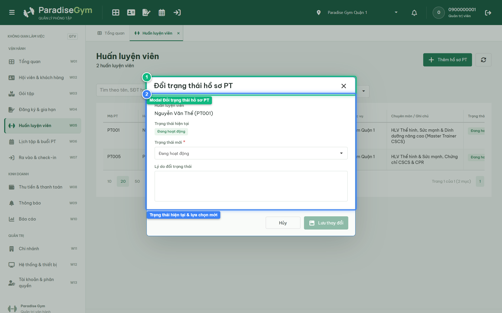
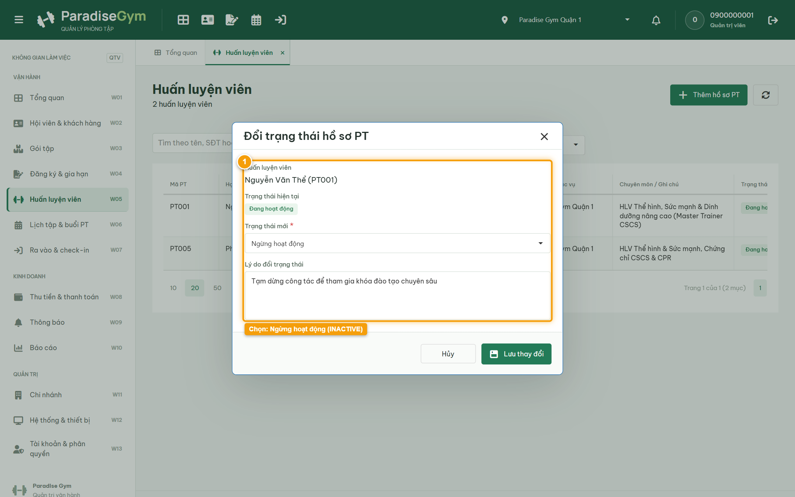
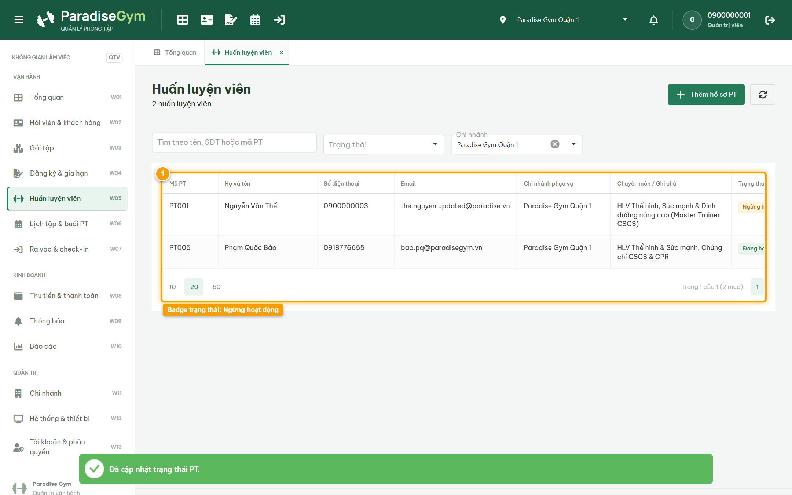
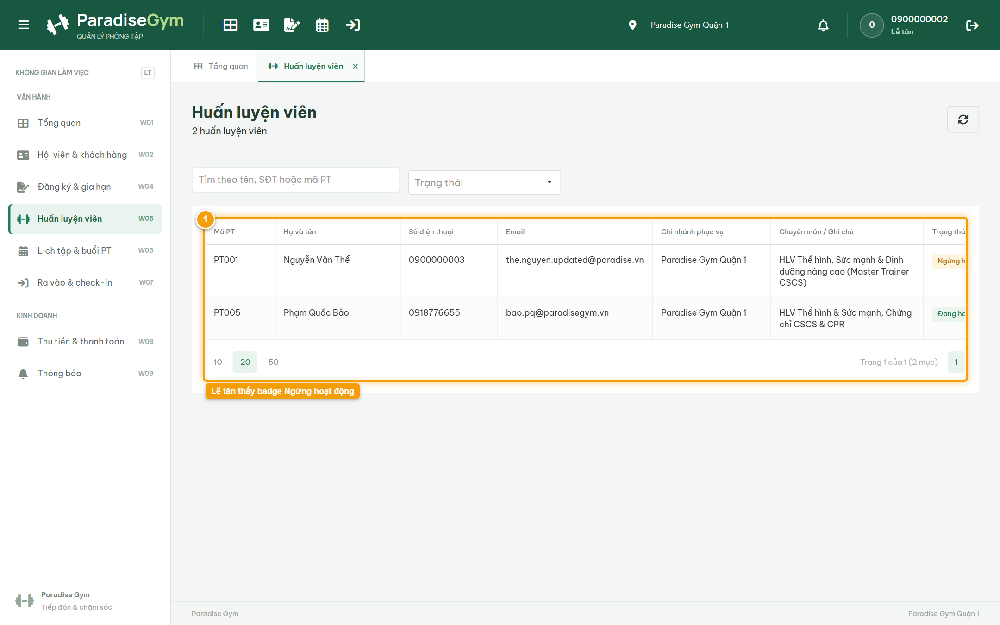

# Báo Cáo Kiểm Thử E2E — QTV-W05-US03: Cập nhật trạng thái hồ sơ Huấn luyện viên

- **User Story:** `QTV-W05-US03`
- **Epic / Menu:** W05 · Huấn luyện viên
- **Vai trò thực hiện (Primary Role):** Quản trị viên (QTV)
- **Phạm vi kiểm thử:** Mobile App PT (390x844 kết nối PostgreSQL qua REST API)
- **Ngày thực hiện:** 2026-09-18
- **Trạng thái tổng thể:** **`PASS`**

---

## 1. Overview & Preconditions

### 1.1. Mục tiêu kiểm thử
Xác minh tính đúng đắn theo Main Flow, Alternate Flows, Exception Flows, Dynamic UI và Business Rules của User Story `QTV-W05-US03` trên giao diện thực tế.

### 1.2. Điều kiện tiên quyết (Preconditions)
- [x] Tài khoản vai trò Quản trị viên (QTV) có quyền hạn và trạng thái hợp lệ trên hệ thống.
- [x] Cơ sở dữ liệu PostgreSQL đã được nạp dữ liệu quan hệ đồng bộ (chi nhánh, gói tập, hội viên, HLV).
- [x] Dịch vụ Backend REST API hoạt động bình thường trên cổng 5000.

---

## 2. Source Action Verification (Step-by-Step)

### Step 1: Mở modal Đổi trạng thái hồ sơ PT
- **Action / Input:** QTV click nút "Đổi trạng thái" (icon repeat) tại dòng PT
- **Expected Result:** Modal "Đổi trạng thái hồ sơ PT" mở ra, hiển thị tên HLV, Trạng thái hiện tại ("Đang hoạt động"), dropdown Trạng thái mới và ô nhập Lý do
- **Actual Result:** Modal hiển thị trực tiếp với tiêu đề "Đổi trạng thái hồ sơ PT" và trạng thái hiện tại của PT
- **Status:** `PASS`

---

### Step 2: Chọn Trạng thái mới "Ngừng hoạt động" & nhập lý do
- **Action / Input:** QTV chọn trạng thái "Ngừng hoạt động" và nhập lý do thay đổi vào nhật ký kiểm toán
- **Expected Result:** Trạng thái mới được chọn là INACTIVE, lý do được ghi nhận đầy đủ
- **Actual Result:** Form ghi nhận lựa chọn Ngừng hoạt động kèm nội dung lý do theo spec
- **Status:** `PASS`

---

### Step 3: Xác nhận cập nhật trạng thái PT thành công
- **Action / Input:** QTV click nút "Lưu thay đổi"
- **Expected Result:** Toast "Đã cập nhật trạng thái PT" hiển thị, modal đóng, DataGrid cập nhật badge trạng thái của PT thành "Ngừng hoạt động" (màu vàng cam)
- **Actual Result:** Toast thành công xuất hiện, DataGrid làm mới cập nhật badge Ngừng hoạt động màu vàng cam
- **Status:** `PASS`

---

## 3. State Verification (Data & UI Consistency)

- **Mô tả kiểm chứng:** Trạng thái PT được cập nhật thành INACTIVE, bảo lưu toàn bộ lịch sử các buổi dạy trước đó
- **Status:** `PASS`

---

## 4. Cross-Role / Downstream Verification

### Downstream 1: Kiểm tra trạng thái PT trên Web Lễ tân
- **Role / Account:** Lễ tân (RECEPTIONIST - 0900000002)
- **Screen:** Web Lễ tân — W05 Huấn luyện viên (#trainers)
- **Verification Action:** Lễ tân mở danh sách PT để rà soát trạng thái hoạt động
- **Expected Result:** Lễ tân thấy PT hiển thị ở trạng thái "Ngừng hoạt động" và không thể gán lịch dạy mới
- **Actual Result:** DataGrid hiển thị đúng badge "Ngừng hoạt động" cho huấn luyện viên
- **Status:** `PASS`

---

## 5. Issues Found

| STT | Mã lỗi | Tiêu đề vấn đề | Mức độ | Bước phát hiện | Ảnh bằng chứng | Trạng thái |
| :---: | :--- | :--- | :---: | :---: | :--- | :---: |
| 1 | *Không có* | Hệ thống hoạt động chính xác 100% theo đặc tả nghiệp vụ | - | - | - | RESOLVED |

---

## 6. Final Result

- **Tổng số bước kiểm thử (Steps):** 3
- **Số bước đạt (Passed):** 3
- **Số bước không đạt (Failed):** 0
- **Số bước bị tắc nghẽn (Blocked):** 0
- **Downstream Verification:** 1/1 checks passed
- **KẾT LUẬN CUỐI CÙNG:** **`PASS`**
