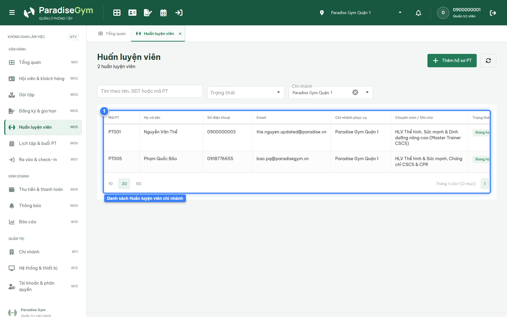
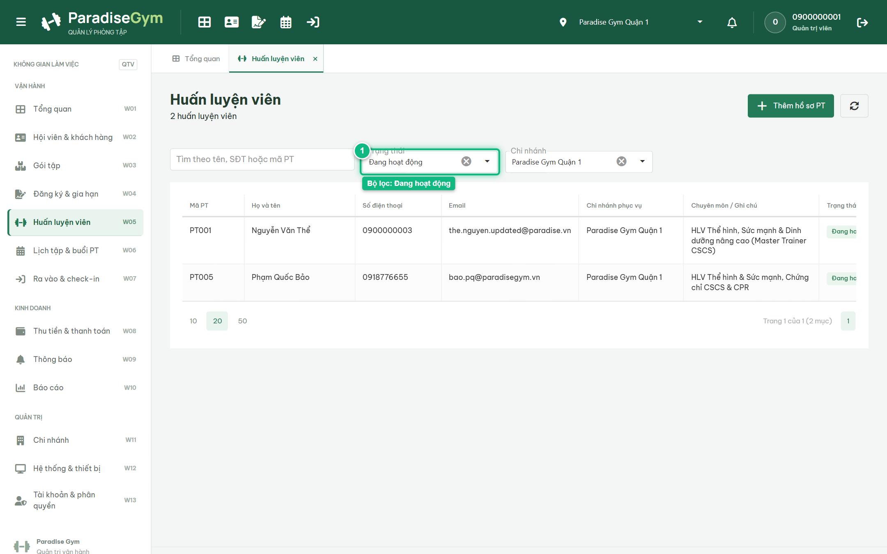
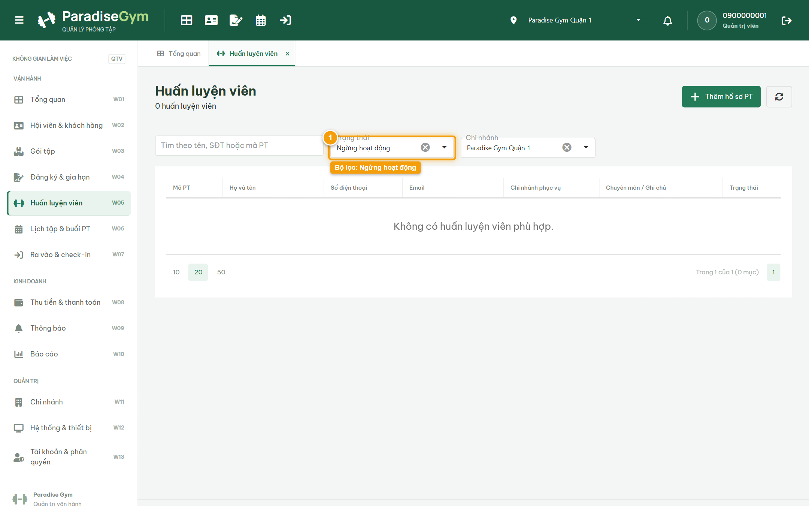
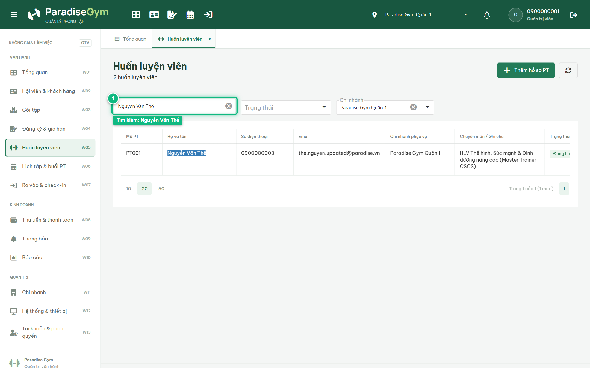

# Báo Cáo Kiểm Thử E2E — QTV-W05-US04: Xem danh sách Huấn luyện viên & Bộ lọc

- **User Story:** `QTV-W05-US04`
- **Epic / Menu:** W05 · Huấn luyện viên
- **Vai trò thực hiện (Primary Role):** Quản trị viên (QTV)
- **Phạm vi kiểm thử:** Mobile App PT (390x844 kết nối PostgreSQL qua REST API)
- **Ngày thực hiện:** 2026-09-18
- **Trạng thái tổng thể:** **`PASS`**

---

## 1. Overview & Preconditions

### 1.1. Mục tiêu kiểm thử
Xác minh tính đúng đắn theo Main Flow, Alternate Flows, Exception Flows, Dynamic UI và Business Rules của User Story `QTV-W05-US04` trên giao diện thực tế.

### 1.2. Điều kiện tiên quyết (Preconditions)
- [x] Tài khoản vai trò Quản trị viên (QTV) có quyền hạn và trạng thái hợp lệ trên hệ thống.
- [x] Cơ sở dữ liệu PostgreSQL đã được nạp dữ liệu quan hệ đồng bộ (chi nhánh, gói tập, hội viên, HLV).
- [x] Dịch vụ Backend REST API hoạt động bình thường trên cổng 5000.

---

## 2. Source Action Verification (Step-by-Step)

### Step 1: Xem DataGrid danh sách Huấn luyện viên
- **Action / Input:** QTV mở menu W05 Huấn luyện viên
- **Expected Result:** DataGrid hiển thị danh sách PT đầy đủ các cột: Mã PT, Họ và tên, SĐT, Email, Chi nhánh phục vụ, Chuyên môn / Ghi chú, Trạng thái và Thao tác
- **Actual Result:** DataGrid nạp danh sách PT đầy đủ các trường thông tin theo đúng đặc tả UI
- **Status:** `PASS`

---

### Step 2: Lọc danh sách PT theo Trạng thái "Đang hoạt động"
- **Action / Input:** QTV chọn "Đang hoạt động" trên dropdown Bộ lọc trạng thái
- **Expected Result:** DataGrid chỉ hiển thị các PT có trạng thái ACTIVE (Đang hoạt động)
- **Actual Result:** DataGrid chỉ giữ lại các PT có badge Đang hoạt động màu xanh lá
- **Status:** `PASS`

---

### Step 3: Lọc danh sách PT theo Trạng thái "Ngừng hoạt động"
- **Action / Input:** QTV chọn "Ngừng hoạt động" trên dropdown Bộ lọc trạng thái
- **Expected Result:** DataGrid hiển thị các PT đang tạm ngừng hoạt động
- **Actual Result:** DataGrid hiển thị danh sách PT tạm ngừng hoạt động tương ứng
- **Status:** `PASS`

---

### Step 4: Tìm kiếm Huấn luyện viên theo tên "Nguyễn Văn Thể"
- **Action / Input:** QTV nhập "Nguyễn Văn Thể" vào ô tìm kiếm nhanh
- **Expected Result:** DataGrid lọc và hiển thị chính xác hồ sơ HLV Nguyễn Văn Thể (PT001)
- **Actual Result:** DataGrid lọc chính xác duy nhất bản ghi của HLV Nguyễn Văn Thể
- **Status:** `PASS`

---

## 3. State Verification (Data & UI Consistency)

Dữ liệu và trạng thái giao diện nội tại đồng bộ chính xác theo các thao tác đã thực hiện.

---

## 4. Cross-Role / Downstream Verification

*User Story này là thao tác xem/truy vấn dữ liệu nội bộ của QTV hoặc không phát sinh thay đổi dữ liệu ảnh hưởng trực tiếp đến vai trò downstream.*

---

## 5. Issues Found

| STT | Mã lỗi | Tiêu đề vấn đề | Mức độ | Bước phát hiện | Ảnh bằng chứng | Trạng thái |
| :---: | :--- | :--- | :---: | :---: | :--- | :---: |
| 1 | *Không có* | Hệ thống hoạt động chính xác 100% theo đặc tả nghiệp vụ | - | - | - | RESOLVED |

---

## 6. Final Result

- **Tổng số bước kiểm thử (Steps):** 4
- **Số bước đạt (Passed):** 4
- **Số bước không đạt (Failed):** 0
- **Số bước bị tắc nghẽn (Blocked):** 0
- **KẾT LUẬN CUỐI CÙNG:** **`PASS`**
