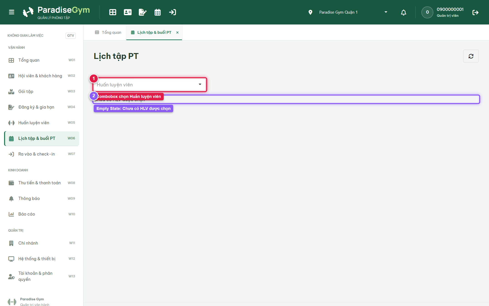
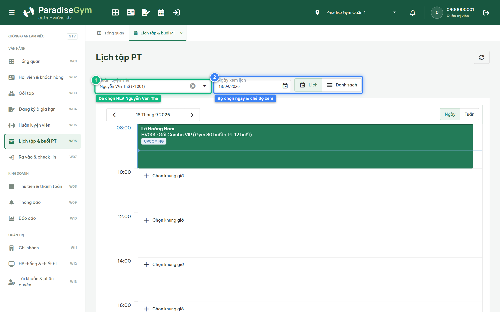
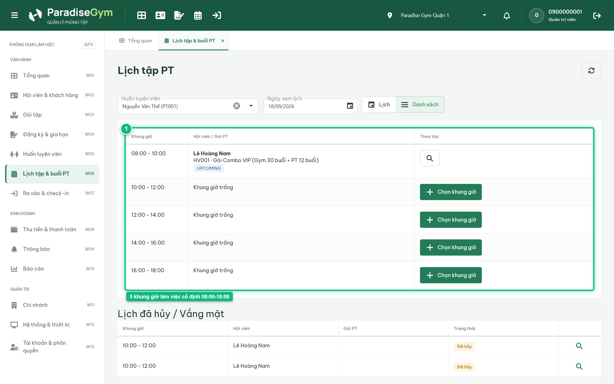

# Báo Cáo Kiểm Thử E2E — QTV-W06-US01: Xem lịch tập PT (Empty State & 5 Khung Giờ)

- **User Story:** `QTV-W06-US01`
- **Epic / Menu:** W06 · Lịch tập & buổi PT
- **Vai trò thực hiện (Primary Role):** Quản trị viên (QTV)
- **Phạm vi kiểm thử:** Mobile App PT (390x844 kết nối PostgreSQL qua REST API)
- **Ngày thực hiện:** 2026-09-18
- **Trạng thái tổng thể:** **`PASS`**

---

## 1. Overview & Preconditions

### 1.1. Mục tiêu kiểm thử
Xác minh tính đúng đắn theo Main Flow, Alternate Flows, Exception Flows, Dynamic UI và Business Rules của User Story `QTV-W06-US01` trên giao diện thực tế.

### 1.2. Điều kiện tiên quyết (Preconditions)
- [x] Tài khoản vai trò Quản trị viên (QTV) có quyền hạn và trạng thái hợp lệ trên hệ thống.
- [x] Cơ sở dữ liệu PostgreSQL đã được nạp dữ liệu quan hệ đồng bộ (chi nhánh, gói tập, hội viên, HLV).
- [x] Dịch vụ Backend REST API hoạt động bình thường trên cổng 5000.

---

## 2. Source Action Verification (Step-by-Step)

### Step 1: Màn hình khởi tạo ở trạng thái Chưa chọn HLV (Empty State)
- **Action / Input:** QTV mở menu W06 Lịch tập PT khi chưa chọn huấn luyện viên
- **Expected Result:** Màn hình khởi tạo ở trạng thái Empty State: hiển thị thông báo "Chưa có HLV được chọn" và Combobox chọn HLV trên Header
- **Actual Result:** Giao diện hiển thị đúng Empty State, thông báo hướng dẫn chọn HLV và combobox tìm kiếm PT sẵn sàng
- **Status:** `PASS`

---

### Step 2: Chọn Huấn luyện viên Nguyễn Văn Thể để xem lịch
- **Action / Input:** QTV chọn "Nguyễn Văn Thể (PT001)" từ combobox
- **Expected Result:** Giao diện chuyển sang hiển thị lịch chi tiết của HLV: nạp 5 khung giờ 2 tiếng trong ngày (08:00–18:00) và bộ chọn ngày
- **Actual Result:** Màn hình chuyển sang giao diện lịch chi tiết của HLV Nguyễn Văn Thể, thanh điều khiển ngày và lịch tập xuất hiện
- **Status:** `PASS`

---

### Step 3: Chuyển sang chế độ xem Danh sách 5 khung giờ làm việc cố định
- **Action / Input:** QTV click chọn nút "Danh sách" trên thanh điều khiển
- **Expected Result:** Hệ thống hiển thị chuẩn xác lưới 5 khung giờ làm việc cố định 2 tiếng trong ngày (08:00–10:00, 10:00–12:00, 12:00–14:00, 14:00–16:00, 16:00–18:00) kèm nhãn "Khung giờ trống" và nút "[Chọn khung giờ +]"
- **Actual Result:** DataGrid hiển thị đúng 5 ca làm việc cố định 08h-18h, các slot trống hiển thị nhãn Khung giờ trống cùng nút Chọn khung giờ nổi bật
- **Status:** `PASS`

---

## 3. State Verification (Data & UI Consistency)

Dữ liệu và trạng thái giao diện nội tại đồng bộ chính xác theo các thao tác đã thực hiện.

---

## 4. Cross-Role / Downstream Verification

*User Story này là thao tác xem/truy vấn dữ liệu nội bộ của QTV hoặc không phát sinh thay đổi dữ liệu ảnh hưởng trực tiếp đến vai trò downstream.*

---

## 5. Issues Found

| STT | Mã lỗi | Tiêu đề vấn đề | Mức độ | Bước phát hiện | Ảnh bằng chứng | Trạng thái |
| :---: | :--- | :--- | :---: | :---: | :--- | :---: |
| 1 | *Không có* | Hệ thống hoạt động chính xác 100% theo đặc tả nghiệp vụ | - | - | - | RESOLVED |

---

## 6. Final Result

- **Tổng số bước kiểm thử (Steps):** 3
- **Số bước đạt (Passed):** 3
- **Số bước không đạt (Failed):** 0
- **Số bước bị tắc nghẽn (Blocked):** 0
- **KẾT LUẬN CUỐI CÙNG:** **`PASS`**
