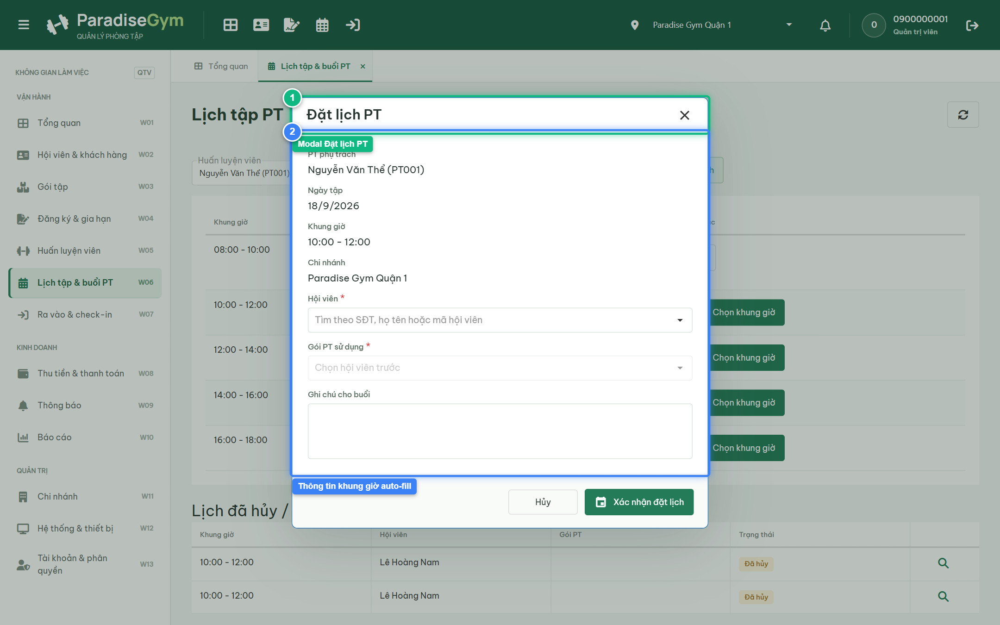
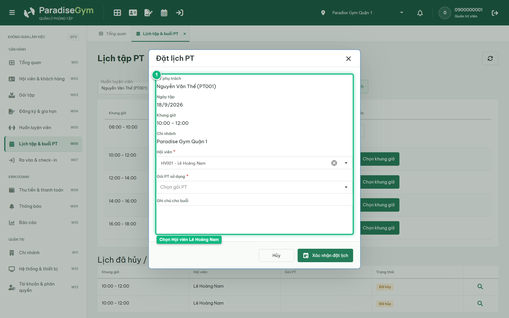
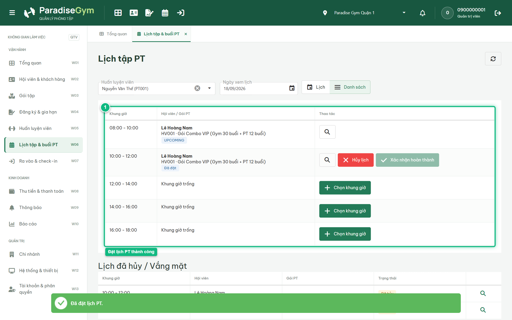
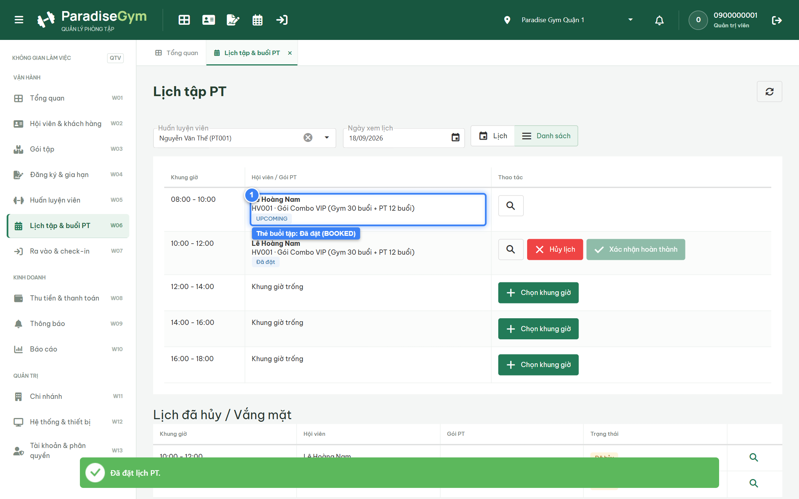
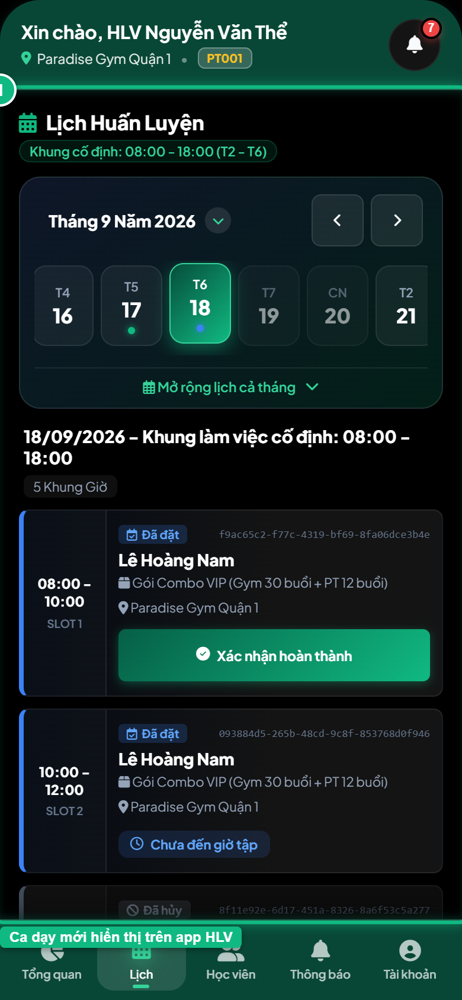
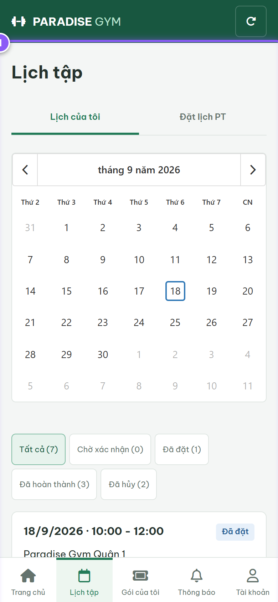

# Báo Cáo Kiểm Thử E2E — QTV-W06-US02: Đặt lịch tập PT mới

- **User Story:** `QTV-W06-US02`
- **Epic / Menu:** W06 · Lịch tập & buổi PT
- **Vai trò thực hiện (Primary Role):** Quản trị viên (QTV)
- **Phạm vi kiểm thử:** Mobile App PT (390x844 kết nối PostgreSQL qua REST API)
- **Ngày thực hiện:** 2026-09-18
- **Trạng thái tổng thể:** **`PASS`**

---

## 1. Overview & Preconditions

### 1.1. Mục tiêu kiểm thử
Xác minh tính đúng đắn theo Main Flow, Alternate Flows, Exception Flows, Dynamic UI và Business Rules của User Story `QTV-W06-US02` trên giao diện thực tế.

### 1.2. Điều kiện tiên quyết (Preconditions)
- [x] Tài khoản vai trò Quản trị viên (QTV) có quyền hạn và trạng thái hợp lệ trên hệ thống.
- [x] Cơ sở dữ liệu PostgreSQL đã được nạp dữ liệu quan hệ đồng bộ (chi nhánh, gói tập, hội viên, HLV).
- [x] Dịch vụ Backend REST API hoạt động bình thường trên cổng 5000.

---

## 2. Source Action Verification (Step-by-Step)

### Step 1: Mở modal Đặt lịch PT từ khung giờ trống
- **Action / Input:** QTV click nút "Chọn khung giờ" tại ca tập trống trên lịch
- **Expected Result:** Modal "Đặt lịch PT" mở ra, auto-fill: PT phụ trách "Nguyễn Văn Thể (PT001)", Ngày tập, Khung giờ, Chi nhánh
- **Actual Result:** Modal hiển thị trực tiếp với tiêu đề "Đặt lịch PT", thông tin HLV và khung giờ được điền tự động chính xác
- **Status:** `PASS`

---

### Step 2: Chọn Hội viên & Dynamic nạp danh sách Gói PT hợp lệ
- **Action / Input:** QTV chọn hội viên "Lê Hoàng Nam" (TRIGGER)
- **Expected Result:** Hệ thống tự động lọc và nạp các gói PT/Combo của hội viên thỏa mãn: do PT Nguyễn Văn Thể phụ trách, còn hạn và còn số buổi > 0
- **Actual Result:** Dropdown "Gói PT sử dụng" tự động kích hoạt nạp gói Combo DK002 hợp lệ của hội viên
- **Status:** `PASS`

---

### Step 3: Chọn Gói PT sử dụng & nhập Ghi chú cho buổi tập
- **Action / Input:** QTV chọn gói Combo DK002 và nhập ghi chú chuyên môn cho buổi tập
- **Expected Result:** Form hoàn tất đầy đủ thông tin, sẵn sàng gửi yêu cầu đặt lịch
- **Actual Result:** Gói tập và ghi chú buổi tập được điền đầy đủ vào form
- **Status:** `PASS`

---

### Step 4: Xác nhận đặt lịch PT thành công
- **Action / Input:** QTV click nút "Xác nhận đặt lịch"
- **Expected Result:** Booking mới được tạo ở trạng thái BOOKED (Đã đặt), modal đóng, toast thành công xuất hiện
- **Actual Result:** Toast thành công xuất hiện, modal đóng, lịch PT tự động làm mới
- **Status:** `PASS`

---

### Step 5: Khung giờ hiển thị thẻ buổi tập Đã đặt
- **Action / Input:** QTV quan sát khung giờ vừa đặt trên bảng lịch
- **Expected Result:** Khung giờ chuyển từ "Khung giờ trống" sang thẻ buổi tập hiển thị tên hội viên "Lê Hoàng Nam", tên gói và badge "Đã đặt" màu xanh dương kèm nút Hủy lịch, Xác nhận hoàn thành
- **Actual Result:** Thẻ buổi tập hiển thị chữ đậm tên hội viên Lê Hoàng Nam, badge Đã đặt màu xanh dương và cụm nút thao tác
- **Status:** `PASS`

---

## 3. State Verification (Data & UI Consistency)

- **Mô tả kiểm chứng:** Buổi tập được tạo ở trạng thái BOOKED, giữ chỗ khung giờ nhưng chưa trừ số buổi còn lại của gói
- **Status:** `PASS`

---

## 4. Cross-Role / Downstream Verification

### Downstream 1: Kiểm tra ca dạy mới hiển thị trên Mobile PT
- **Role / Account:** Huấn luyện viên (PT - 0900000003 - Nguyễn Văn Thể)
- **Screen:** Mobile PT — Quản lý Lịch dạy (data-tab="schedule")
- **Verification Action:** HLV mở tab "Lịch" trên ứng dụng di động
- **Expected Result:** HLV nhìn thấy ca tập vừa đặt với học viên Lê Hoàng Nam hiển thị trực quan trên lịch công tác
- **Actual Result:** Ứng dụng Mobile PT hiển thị ca dạy kèm tên học viên Lê Hoàng Nam và thời gian buổi tập
- **Status:** `PASS`

---

### Downstream 2: Kiểm tra buổi tập PT hiển thị trên Mobile Hội viên
- **Role / Account:** Hội viên (MEMBER - 0987654321)
- **Screen:** Mobile Hội viên — Lịch tập (data-route="schedule")
- **Verification Action:** Hội viên mở tab "Lịch tập" trên app mobile
- **Expected Result:** Hội viên nhìn thấy buổi tập PT đã đặt cùng HLV Nguyễn Văn Thể
- **Actual Result:** Giao diện Mobile Hội viên hiển thị lịch hẹn tập luyện cùng HLV cá nhân
- **Status:** `PASS`

---

## 5. Issues Found

| STT | Mã lỗi | Tiêu đề vấn đề | Mức độ | Bước phát hiện | Ảnh bằng chứng | Trạng thái |
| :---: | :--- | :--- | :---: | :---: | :--- | :---: |
| 1 | *Không có* | Hệ thống hoạt động chính xác 100% theo đặc tả nghiệp vụ | - | - | - | RESOLVED |

---

## 6. Final Result

- **Tổng số bước kiểm thử (Steps):** 5
- **Số bước đạt (Passed):** 5
- **Số bước không đạt (Failed):** 0
- **Số bước bị tắc nghẽn (Blocked):** 0
- **Downstream Verification:** 2/2 checks passed
- **KẾT LUẬN CUỐI CÙNG:** **`PASS`**
