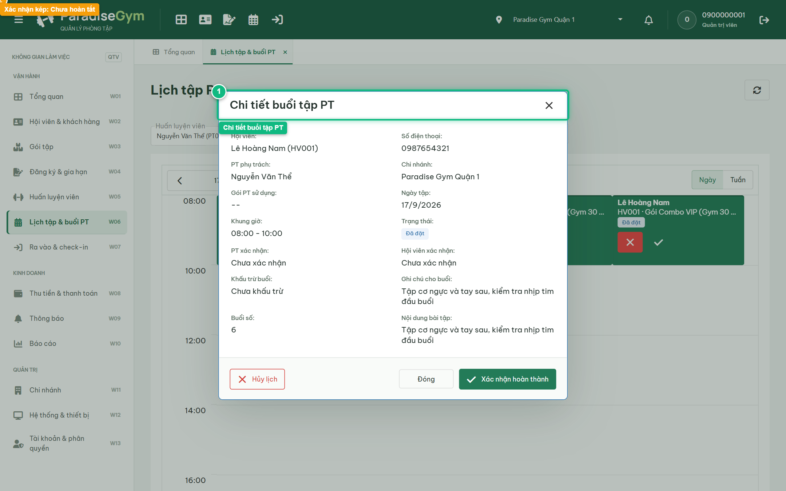
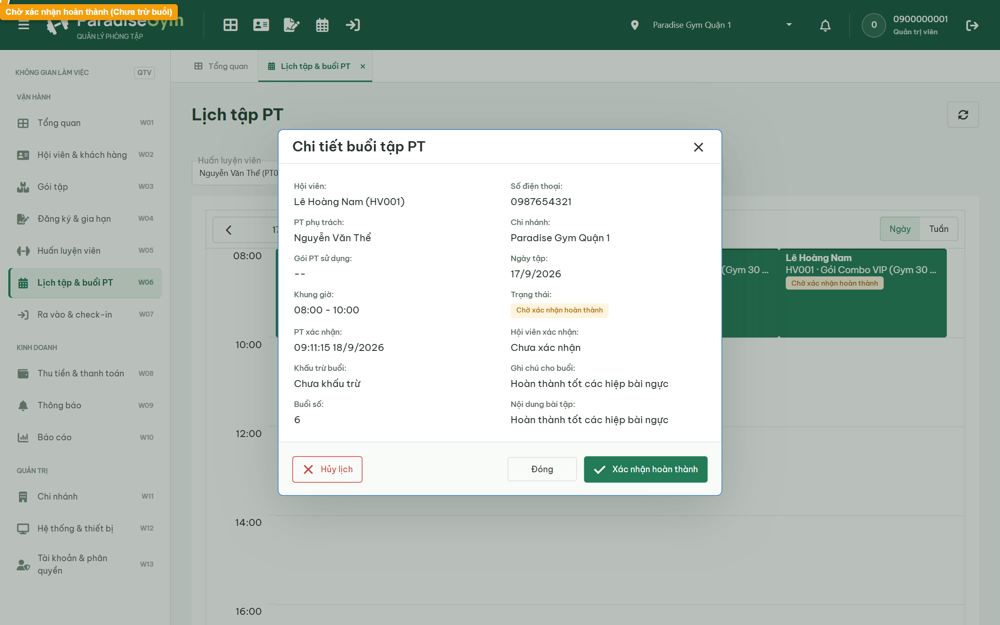
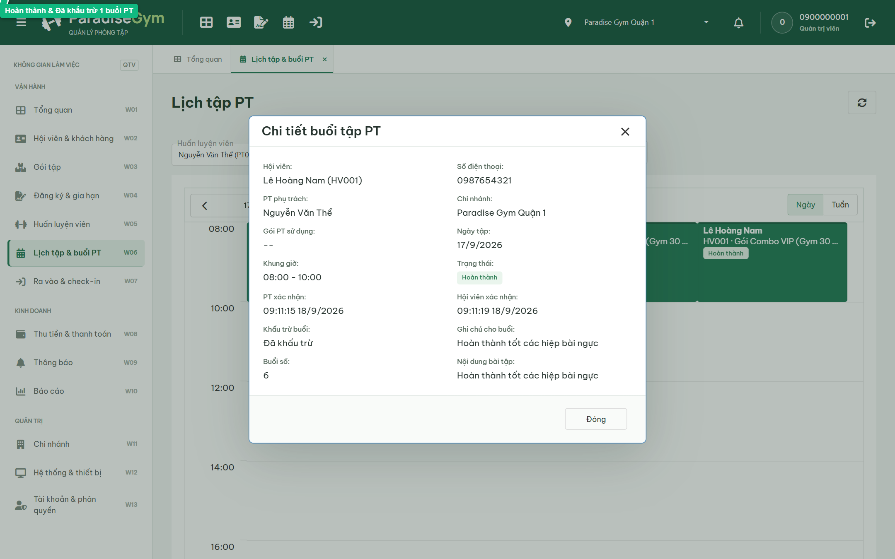
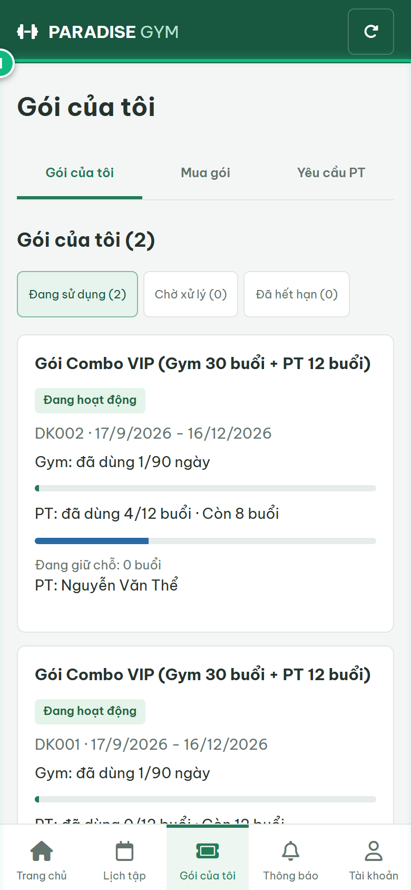
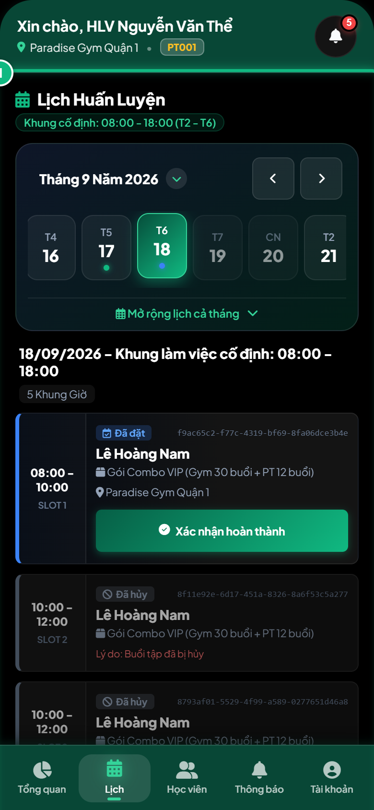

# Báo Cáo Kiểm Thử E2E — QTV-W06-US03: Xác nhận hoàn thành buổi học PT (Xác nhận kép)

- **User Story:** `QTV-W06-US03`
- **Epic / Menu:** W06 · Lịch tập & buổi PT
- **Vai trò thực hiện (Primary Role):** Quản trị viên (QTV)
- **Phạm vi kiểm thử:** Mobile App PT (390x844 kết nối PostgreSQL qua REST API)
- **Ngày thực hiện:** 2026-09-18
- **Trạng thái tổng thể:** **`PASS`**

---

## 1. Overview & Preconditions

### 1.1. Mục tiêu kiểm thử
Xác minh tính đúng đắn theo Main Flow, Alternate Flows, Exception Flows, Dynamic UI và Business Rules của User Story `QTV-W06-US03` trên giao diện thực tế.

### 1.2. Điều kiện tiên quyết (Preconditions)
- [x] Tài khoản vai trò Quản trị viên (QTV) có quyền hạn và trạng thái hợp lệ trên hệ thống.
- [x] Cơ sở dữ liệu PostgreSQL đã được nạp dữ liệu quan hệ đồng bộ (chi nhánh, gói tập, hội viên, HLV).
- [x] Dịch vụ Backend REST API hoạt động bình thường trên cổng 5000.

---

## 2. Source Action Verification (Step-by-Step)

### Step 1: Mở popup Chi tiết buổi tập PT & kiểm tra trạng thái xác nhận
- **Action / Input:** QTV click nút "Chi tiết buổi tập" trên thẻ lịch
- **Expected Result:** Popup Chi tiết mở ra, hiển thị trạng thái "Đã đặt", PT xác nhận: Chưa xác nhận, Hội viên xác nhận: Chưa xác nhận, Khấu trừ buổi: Chưa khấu trừ
- **Actual Result:** Popup hiển thị đầy đủ thông tin buổi tập, ghi nhận cả hai bên đều chưa bấm xác nhận kép
- **Status:** `PASS`

---

### Step 2: Kiểm tra trạng thái khi mới 1 bên xác nhận (AWAITING_CONFIRMATION)
- **Action / Input:** HLV thực hiện xác nhận buổi tập từ ứng dụng PT
- **Expected Result:** Vì mới chỉ 1 bên (PT) xác nhận, hệ thống chuyển buổi tập sang trạng thái "Chờ xác nhận hoàn thành" (AWAITING_CONFIRMATION) và CHƯA khấu trừ số buổi của hội viên
- **Actual Result:** Popup hiển thị badge "Chờ xác nhận hoàn thành" màu vàng cam, ghi nhận thời điểm PT xác nhận và trường Khấu trừ buổi vẫn là "Chưa khấu trừ"
- **Status:** `PASS`

---

### Step 3: Hoàn tất xác nhận kép: Chuyển sang Hoàn thành (COMPLETED) & Tự động trừ buổi
- **Action / Input:** Hội viên thực hiện xác nhận buổi tập hoàn thành
- **Expected Result:** Đủ xác nhận kép từ 2 bên (PT & Hội viên): hệ thống cập nhật trạng thái "Hoàn thành" (COMPLETED), tự động khấu trừ 1 buổi PT trong gói của hội viên
- **Actual Result:** Popup cập nhật badge "Hoàn thành" màu xanh lá, hiển thị thời điểm xác nhận của cả 2 bên và trường Khấu trừ buổi chuyển sang "Đã khấu trừ"
- **Status:** `PASS`

---

## 3. State Verification (Data & UI Consistency)

- **Mô tả kiểm chứng:** Buổi tập đạt trạng thái COMPLETED, hệ thống khấu trừ 1 buổi PT (từ 12 xuống 11 buổi) hoàn toàn tự động
- **Status:** `PASS`

---

## 4. Cross-Role / Downstream Verification

### Downstream 1: Kiểm tra số buổi PT còn lại đã bị trừ trên Mobile Hội viên
- **Role / Account:** Hội viên (MEMBER - 0987654321)
- **Screen:** Mobile Hội viên — Gói của tôi (data-route="packages")
- **Verification Action:** Hội viên kiểm tra số buổi tập PT còn lại trên gói Combo
- **Expected Result:** Số buổi PT còn lại trong gói của hội viên giảm từ 12 xuống còn 11 buổi
- **Actual Result:** Ứng dụng Mobile Hội viên hiển thị chính xác số buổi PT còn lại đã được khấu trừ 1 buổi
- **Status:** `PASS`

---

### Downstream 2: Kiểm tra trạng thái ca dạy Hoàn thành trên Mobile PT
- **Role / Account:** Huấn luyện viên (PT - 0900000003)
- **Screen:** Mobile PT — Lịch dạy (data-tab="schedule")
- **Verification Action:** HLV kiểm tra buổi tập trên lịch
- **Expected Result:** Ca tập hiển thị trạng thái "Hoàn thành" với badge xanh lá
- **Actual Result:** Giao diện Mobile PT hiển thị ca tập đã hoàn thành xuất sắc
- **Status:** `PASS`

---

## 5. Issues Found

| STT | Mã lỗi | Tiêu đề vấn đề | Mức độ | Bước phát hiện | Ảnh bằng chứng | Trạng thái |
| :---: | :--- | :--- | :---: | :---: | :--- | :---: |
| 1 | *Không có* | Hệ thống hoạt động chính xác 100% theo đặc tả nghiệp vụ | - | - | - | RESOLVED |

---

## 6. Final Result

- **Tổng số bước kiểm thử (Steps):** 3
- **Số bước đạt (Passed):** 3
- **Số bước không đạt (Failed):** 0
- **Số bước bị tắc nghẽn (Blocked):** 0
- **Downstream Verification:** 2/2 checks passed
- **KẾT LUẬN CUỐI CÙNG:** **`PASS`**
