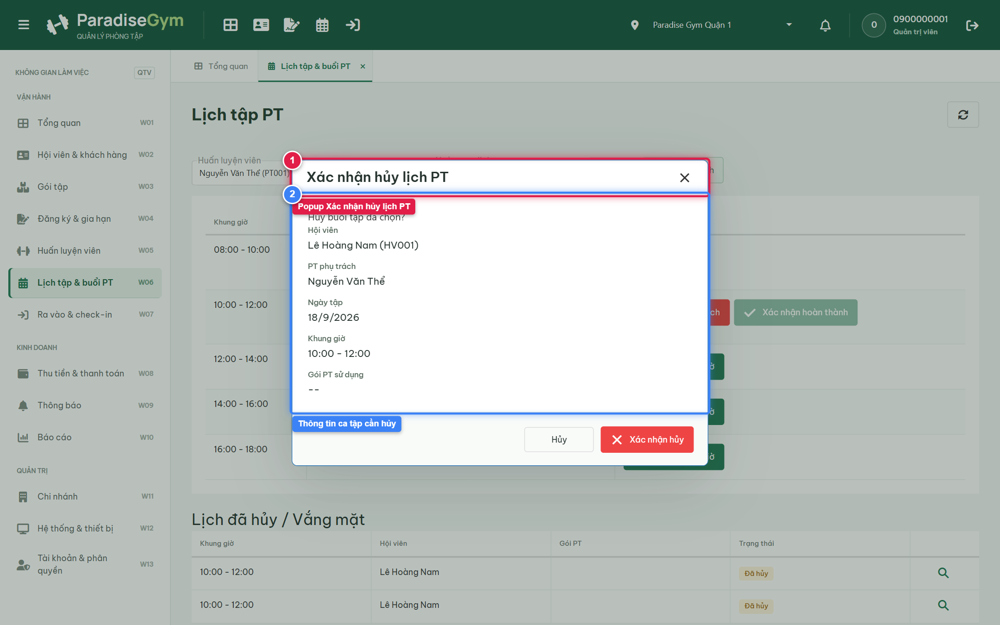
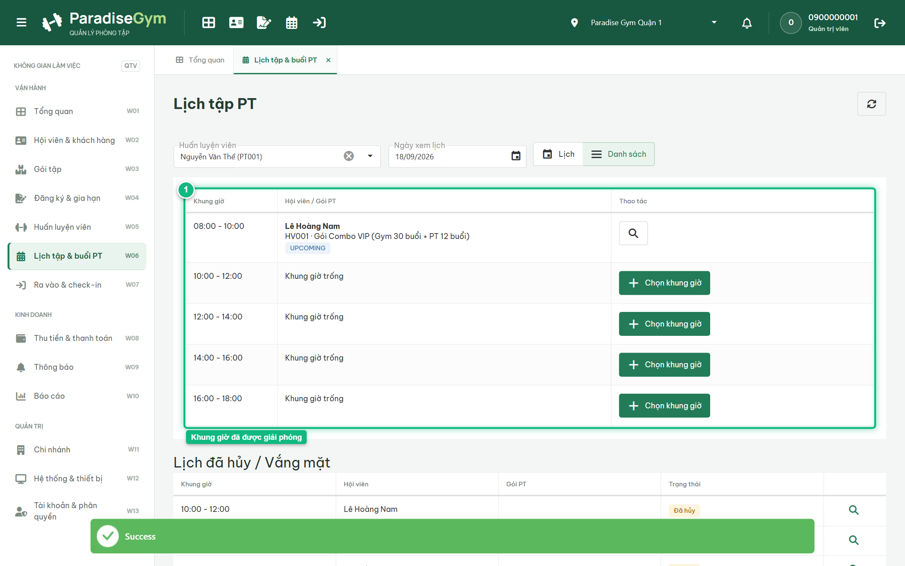
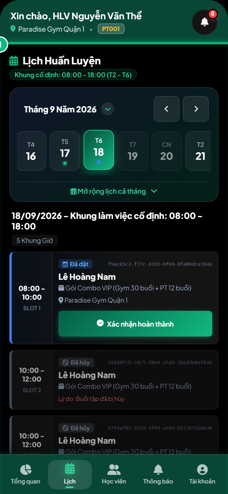
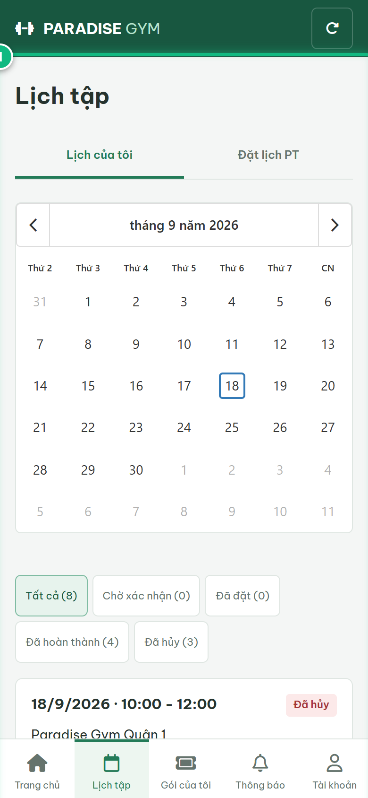

# Báo Cáo Kiểm Thử E2E — QTV-W06-US04: Hủy lịch tập PT

- **User Story:** `QTV-W06-US04`
- **Epic / Menu:** W06 · Lịch tập & buổi PT
- **Vai trò thực hiện (Primary Role):** Quản trị viên (QTV)
- **Phạm vi kiểm thử:** Mobile App PT (390x844 kết nối PostgreSQL qua REST API)
- **Ngày thực hiện:** 2026-09-18
- **Trạng thái tổng thể:** **`PASS`**

---

## 1. Overview & Preconditions

### 1.1. Mục tiêu kiểm thử
Xác minh tính đúng đắn theo Main Flow, Alternate Flows, Exception Flows, Dynamic UI và Business Rules của User Story `QTV-W06-US04` trên giao diện thực tế.

### 1.2. Điều kiện tiên quyết (Preconditions)
- [x] Tài khoản vai trò Quản trị viên (QTV) có quyền hạn và trạng thái hợp lệ trên hệ thống.
- [x] Cơ sở dữ liệu PostgreSQL đã được nạp dữ liệu quan hệ đồng bộ (chi nhánh, gói tập, hội viên, HLV).
- [x] Dịch vụ Backend REST API hoạt động bình thường trên cổng 5000.

---

## 2. Source Action Verification (Step-by-Step)

### Step 1: Mở popup Xác nhận hủy lịch PT
- **Action / Input:** QTV click nút "Hủy lịch" tại ca tập đã đặt
- **Expected Result:** Popup "Xác nhận hủy lịch PT" mở ra, hiển thị tóm tắt thông tin: Hội viên, PT phụ trách, Ngày tập, Khung giờ, Gói PT sử dụng và nút "Xác nhận hủy" màu đỏ
- **Actual Result:** Popup xác nhận hủy xuất hiện trực tiếp với thông tin chi tiết buổi tập cần hủy
- **Status:** `PASS`

---

### Step 2: Xác nhận hủy buổi tập thành công
- **Action / Input:** QTV click nút "Xác nhận hủy"
- **Expected Result:** Hệ thống cập nhật trạng thái buổi tập thành "Đã hủy" (CANCELLED), giải phóng khung giờ, hiển thị thông báo "Đã hủy lịch PT"
- **Actual Result:** Toast thông báo hủy thành công xuất hiện, popup đóng và lịch tập được giải phóng
- **Status:** `PASS`

---

### Step 3: Khung giờ được giải phóng trở về trạng thái Khung giờ trống
- **Action / Input:** QTV quan sát khung giờ vừa hủy trên bảng lịch
- **Expected Result:** Khung giờ 10:00–12:00 quay trở lại trạng thái "Khung giờ trống" kèm nút "[Chọn khung giờ +]" sẵn sàng cho lượt đặt lịch mới
- **Actual Result:** Khung giờ được giải phóng hoàn toàn, hiển thị nhãn Khung giờ trống cùng nút Chọn khung giờ
- **Status:** `PASS`

---

## 3. State Verification (Data & UI Consistency)

- **Mô tả kiểm chứng:** Buổi tập chuyển trạng thái CANCELLED, khung giờ được giải phóng và không bị trừ buổi tập dở dang
- **Status:** `PASS`

---

## 4. Cross-Role / Downstream Verification

### Downstream 1: Kiểm tra ca dạy đã hủy trên Mobile PT
- **Role / Account:** Huấn luyện viên (PT - 0900000003)
- **Screen:** Mobile PT — Lịch dạy (data-tab="schedule")
- **Verification Action:** HLV mở tab "Lịch" để kiểm tra lịch công tác
- **Expected Result:** Ca tập đã hủy không còn xuất hiện trong danh sách ca dạy hiệu lực của HLV
- **Actual Result:** Lịch dạy của HLV đã giải phóng khung giờ bị hủy
- **Status:** `PASS`

---

### Downstream 2: Kiểm tra buổi tập đã hủy trên Mobile Hội viên
- **Role / Account:** Hội viên (MEMBER - 0987654321)
- **Screen:** Mobile Hội viên — Lịch tập (data-route="schedule")
- **Verification Action:** Hội viên mở tab "Lịch tập" để theo dõi lịch hẹn
- **Expected Result:** Buổi tập đã hủy không còn trong danh sách lịch hẹn sắp tới của hội viên
- **Actual Result:** Giao diện Mobile Hội viên đã đồng bộ trạng thái buổi tập
- **Status:** `PASS`

---

## 5. Issues Found

| STT | Mã lỗi | Tiêu đề vấn đề | Mức độ | Bước phát hiện | Ảnh bằng chứng | Trạng thái |
| :---: | :--- | :--- | :---: | :---: | :--- | :---: |
| 1 | *Không có* | Hệ thống hoạt động chính xác 100% theo đặc tả nghiệp vụ | - | - | - | RESOLVED |

---

## 6. Final Result

- **Tổng số bước kiểm thử (Steps):** 3
- **Số bước đạt (Passed):** 3
- **Số bước không đạt (Failed):** 0
- **Số bước bị tắc nghẽn (Blocked):** 0
- **Downstream Verification:** 2/2 checks passed
- **KẾT LUẬN CUỐI CÙNG:** **`PASS`**
