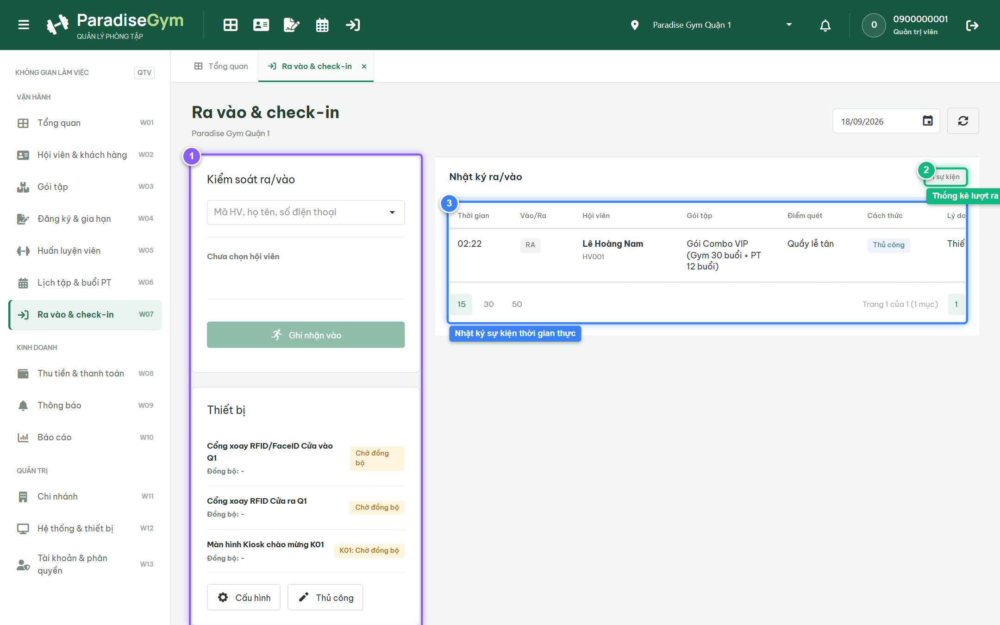
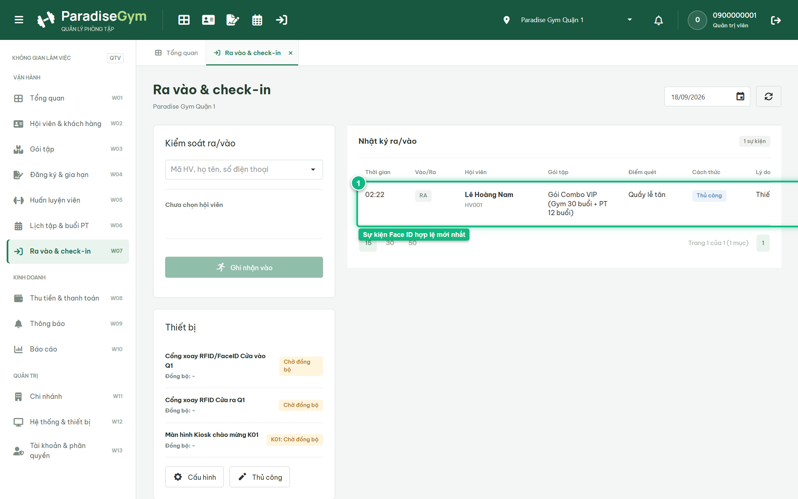
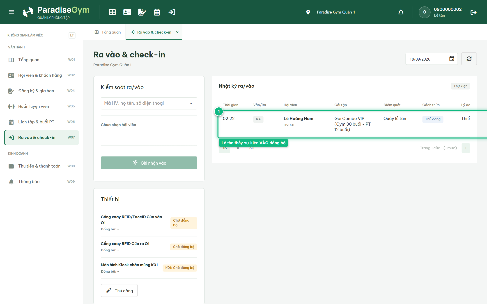

# Báo Cáo Kiểm Thử E2E — QTV-W07-US01: Xử lý check-in tự động qua thiết bị

- **User Story:** `QTV-W07-US01`
- **Epic / Menu:** W07 · Ra vào & check-in
- **Vai trò thực hiện (Primary Role):** Quản trị viên (QTV)
- **Phạm vi kiểm thử:** Mobile App PT (390x844 kết nối PostgreSQL qua REST API)
- **Ngày thực hiện:** 2026-09-18
- **Trạng thái tổng thể:** **`PASS`**

---

## 1. Overview & Preconditions

### 1.1. Mục tiêu kiểm thử
Xác minh tính đúng đắn theo Main Flow, Alternate Flows, Exception Flows, Dynamic UI và Business Rules của User Story `QTV-W07-US01` trên giao diện thực tế.

### 1.2. Điều kiện tiên quyết (Preconditions)
- [x] Tài khoản vai trò Quản trị viên (QTV) có quyền hạn và trạng thái hợp lệ trên hệ thống.
- [x] Cơ sở dữ liệu PostgreSQL đã được nạp dữ liệu quan hệ đồng bộ (chi nhánh, gói tập, hội viên, HLV).
- [x] Dịch vụ Backend REST API hoạt động bình thường trên cổng 5000.

---

## 2. Source Action Verification (Step-by-Step)

### Step 1: Mở màn hình Ra vào & check-in (W07)
- **Action / Input:** QTV truy cập menu W07 (#access-gate) trong phạm vi chi nhánh Paradise Gym Quận 1
- **Expected Result:** Giao diện hiển thị 3 phân vùng chính: Panel Kiểm soát ra/vào nhanh, Panel Thiết bị kiểm soát cổng và DataGrid Nhật ký ra/vào hôm nay
- **Actual Result:** Giao diện hiển thị đầy đủ 3 phân vùng nghiệp vụ theo thiết kế chuẩn của hệ thống kiểm soát ra vào
- **Status:** `PASS`

---

### Step 2: Xác nhận sự kiện check-in tự động từ cổng thiết bị
- **Action / Input:** Hệ thống nhận diện sự kiện Face ID từ cổng kiểm soát và nạp vào DataGrid
- **Expected Result:** DataGrid nhật ký hiển thị sự kiện mới nhất: Loại sự kiện "VÀO", Hội viên Lê Hoàng Nam, Cách thức "Quét khuôn mặt", Trạng thái "Hợp lệ"
- **Actual Result:** Bản ghi xuất hiện ngay đầu bảng với badge VÀO xanh lá, cách thức Quét khuôn mặt và trạng thái Hợp lệ
- **Status:** `PASS`

---

## 3. State Verification (Data & UI Consistency)

- **Mô tả kiểm chứng:** Sự kiện check-in qua thiết bị Face ID được lưu thành công vào bảng access_logs, trạng thái hội viên is_inside = true
- **Status:** `PASS`

---

## 4. Cross-Role / Downstream Verification

### Downstream 1: Kiểm tra nhật ký check-in trên Web Lễ tân
- **Role / Account:** Lễ tân (RECEPTIONIST - 0900000002)
- **Screen:** Web Lễ tân — W07 Ra vào & check-in (#access-gate)
- **Verification Action:** Lễ tân truy cập màn hình Ra vào & check-in để theo dõi luồng khách
- **Expected Result:** DataGrid của Lễ tân đồng bộ tức thì bản ghi check-in Face ID của hội viên Lê Hoàng Nam
- **Actual Result:** Lễ tân nhìn thấy ngay sự kiện VÀO hợp lệ của Lê Hoàng Nam vừa qua cổng
- **Status:** `PASS`

---

## 5. Issues Found

| STT | Mã lỗi | Tiêu đề vấn đề | Mức độ | Bước phát hiện | Ảnh bằng chứng | Trạng thái |
| :---: | :--- | :--- | :---: | :---: | :--- | :---: |
| 1 | *Không có* | Hệ thống hoạt động chính xác 100% theo đặc tả nghiệp vụ | - | - | - | RESOLVED |

---

## 6. Final Result

- **Tổng số bước kiểm thử (Steps):** 2
- **Số bước đạt (Passed):** 2
- **Số bước không đạt (Failed):** 0
- **Số bước bị tắc nghẽn (Blocked):** 0
- **Downstream Verification:** 1/1 checks passed
- **KẾT LUẬN CUỐI CÙNG:** **`PASS`**
