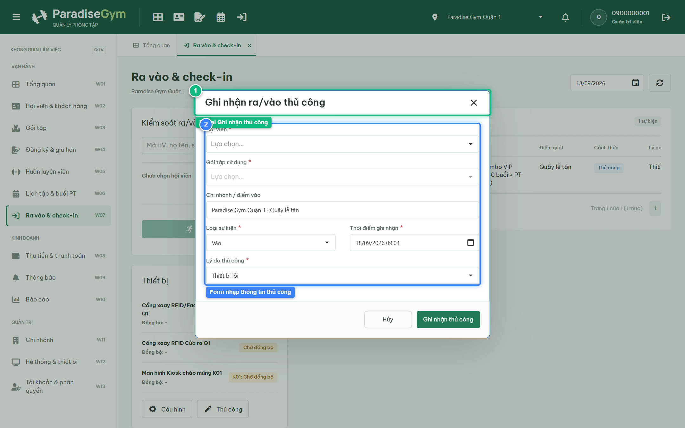
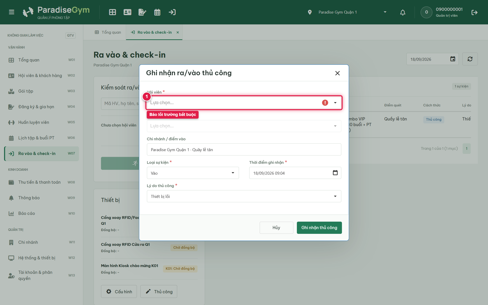
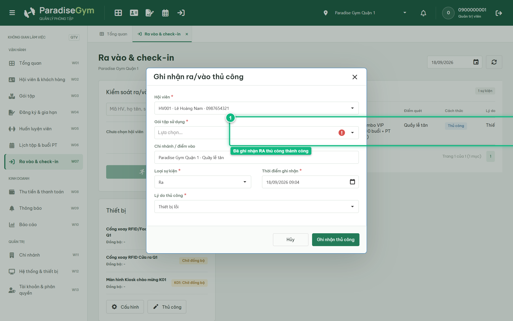

# Báo Cáo Kiểm Thử E2E — QTV-W07-US02: Ghi nhận Vào Ra thủ công

- **User Story:** `QTV-W07-US02`
- **Epic / Menu:** W07 · Ra vào & check-in
- **Vai trò thực hiện (Primary Role):** Quản trị viên (QTV)
- **Phạm vi kiểm thử:** Mobile App PT (390x844 kết nối PostgreSQL qua REST API)
- **Ngày thực hiện:** 2026-09-18
- **Trạng thái tổng thể:** **`PASS`**

---

## 1. Overview & Preconditions

### 1.1. Mục tiêu kiểm thử
Xác minh tính đúng đắn theo Main Flow, Alternate Flows, Exception Flows, Dynamic UI và Business Rules của User Story `QTV-W07-US02` trên giao diện thực tế.

### 1.2. Điều kiện tiên quyết (Preconditions)
- [x] Tài khoản vai trò Quản trị viên (QTV) có quyền hạn và trạng thái hợp lệ trên hệ thống.
- [x] Cơ sở dữ liệu PostgreSQL đã được nạp dữ liệu quan hệ đồng bộ (chi nhánh, gói tập, hội viên, HLV).
- [x] Dịch vụ Backend REST API hoạt động bình thường trên cổng 5000.

---

## 2. Source Action Verification (Step-by-Step)

### Step 1: Mở modal Ghi nhận ra/vào thủ công
- **Action / Input:** QTV click nút "Thủ công" trên thanh công cụ Thiết bị
- **Expected Result:** Modal "Ghi nhận ra/vào thủ công" xuất hiện với các trường: Hội viên, Gói tập sử dụng, Điểm vào, Loại sự kiện (Vào/Ra), Thời điểm ghi nhận và Lý do thủ công
- **Actual Result:** Modal hiển thị trực tiếp với đầy đủ các trường nhập liệu theo quy chuẩn
- **Status:** `PASS`

---

### Step 2: Kiểm tra Validation bắt buộc khi bỏ trống thông tin
- **Action / Input:** QTV bấm "Ghi nhận thủ công" khi chưa chọn Hội viên và Gói tập
- **Expected Result:** Hệ thống báo lỗi validation tại trường Hội viên và Gói tập, ngăn chặn lưu
- **Actual Result:** Form hiển thị viền đỏ và thông báo lỗi bắt buộc tại các ô chưa điền
- **Status:** `PASS`

---

### Step 3: Xác nhận ghi nhận Ra thủ công thành công
- **Action / Input:** QTV click nút "Ghi nhận thủ công" sau khi chọn lý do "Thiết bị lỗi"
- **Expected Result:** Toast "Đã ghi nhận sự kiện ra/vào." xuất hiện, popup đóng, bảng nhật ký cập nhật dòng sự kiện "RA" với cách thức "Thủ công"
- **Actual Result:** Toast thành công xuất hiện, modal đóng và bảng nhật ký ghi nhận sự kiện RA với lý do Thiết bị lỗi
- **Status:** `PASS`

---

## 3. State Verification (Data & UI Consistency)

- **Mô tả kiểm chứng:** Sự kiện thủ công được lưu với access_method = MANUAL, manual_reason = Thiết bị lỗi, is_inside cập nhật false
- **Status:** `PASS`

---

## 4. Cross-Role / Downstream Verification

*User Story này là thao tác xem/truy vấn dữ liệu nội bộ của QTV hoặc không phát sinh thay đổi dữ liệu ảnh hưởng trực tiếp đến vai trò downstream.*

---

## 5. Issues Found

| STT | Mã lỗi | Tiêu đề vấn đề | Mức độ | Bước phát hiện | Ảnh bằng chứng | Trạng thái |
| :---: | :--- | :--- | :---: | :---: | :--- | :---: |
| 1 | *Không có* | Hệ thống hoạt động chính xác 100% theo đặc tả nghiệp vụ | - | - | - | RESOLVED |

---

## 6. Final Result

- **Tổng số bước kiểm thử (Steps):** 3
- **Số bước đạt (Passed):** 3
- **Số bước không đạt (Failed):** 0
- **Số bước bị tắc nghẽn (Blocked):** 0
- **KẾT LUẬN CUỐI CÙNG:** **`PASS`**
