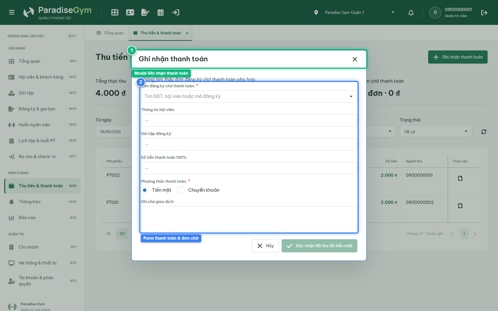
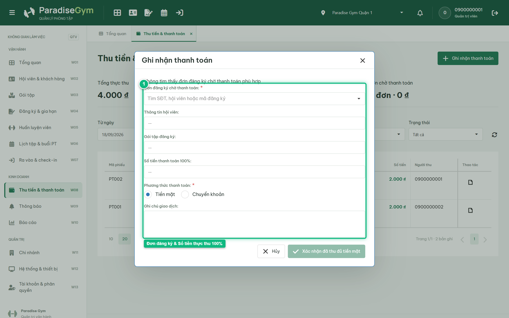
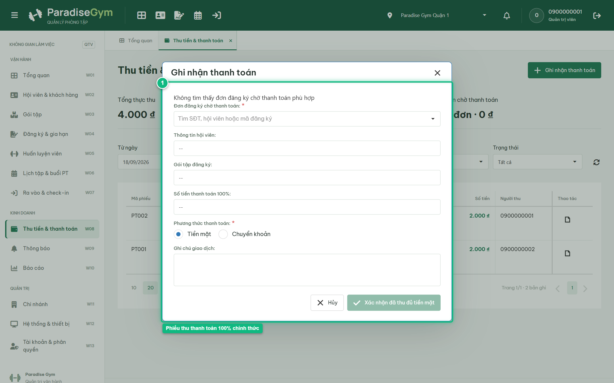
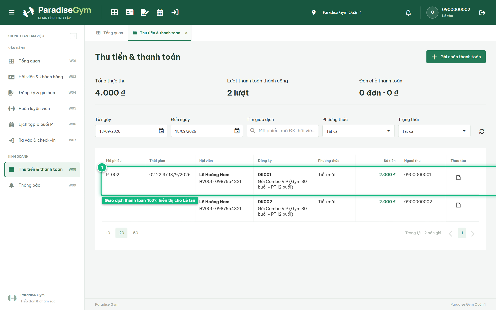
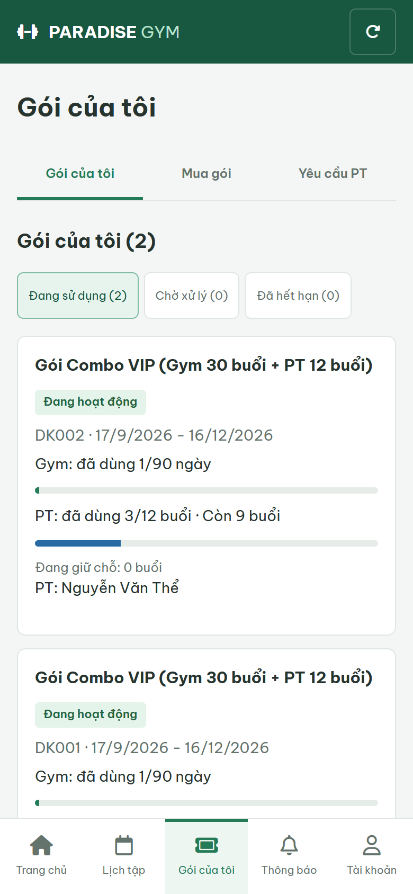

# Báo Cáo Kiểm Thử E2E — QTV-W08-US02: Tạo payment (Ghi nhận thanh toán 100%)

- **User Story:** `QTV-W08-US02`
- **Epic / Menu:** W08 · Thu tiền & thanh toán
- **Vai trò thực hiện (Primary Role):** Quản trị viên (QTV)
- **Phạm vi kiểm thử:** Mobile App PT (390x844 kết nối PostgreSQL qua REST API)
- **Ngày thực hiện:** 2026-09-18
- **Trạng thái tổng thể:** **`PASS`**

---

## 1. Overview & Preconditions

### 1.1. Mục tiêu kiểm thử
Xác minh tính đúng đắn theo Main Flow, Alternate Flows, Exception Flows, Dynamic UI và Business Rules của User Story `QTV-W08-US02` trên giao diện thực tế.

### 1.2. Điều kiện tiên quyết (Preconditions)
- [x] Tài khoản vai trò Quản trị viên (QTV) có quyền hạn và trạng thái hợp lệ trên hệ thống.
- [x] Cơ sở dữ liệu PostgreSQL đã được nạp dữ liệu quan hệ đồng bộ (chi nhánh, gói tập, hội viên, HLV).
- [x] Dịch vụ Backend REST API hoạt động bình thường trên cổng 5000.

---

## 2. Source Action Verification (Step-by-Step)

### Step 1: Mở modal Ghi nhận thanh toán
- **Action / Input:** QTV click nút "Ghi nhận thanh toán" tại góc phải màn hình
- **Expected Result:** Modal "Ghi nhận thanh toán" mở ra, hiển thị danh sách các đơn đăng ký chờ thanh toán, lựa chọn Phương thức thanh toán (Tiền mặt / Chuyển khoản) và thông tin tóm tắt
- **Actual Result:** Modal hiển thị tiêu đề "Ghi nhận thanh toán" với đầy đủ trường nhập liệu theo quy chuẩn
- **Status:** `PASS`

---

### Step 2: Chọn đơn đăng ký chờ thanh toán & kiểm tra số tiền 100%
- **Action / Input:** QTV chọn đơn đăng ký của hội viên và kiểm tra số tiền thực thu
- **Expected Result:** Hệ thống hiển thị tóm tắt: Tên hội viên, Gói đăng ký và Số tiền thực thu 100%, nút CTA hiển thị "Xác nhận đã thu đủ tiền mặt"
- **Actual Result:** Form hiển thị số tiền thanh toán 100% rõ ràng, nút xác nhận sẵn sàng
- **Status:** `PASS`

---

### Step 3: Xác nhận thu đủ tiền mặt 100% & mở Phiếu thu
- **Action / Input:** QTV bấm "Xác nhận đã thu đủ tiền mặt"
- **Expected Result:** Toast "Đã ghi nhận thanh toán 100%" xuất hiện, hệ thống tự động sinh phiếu thu và mở modal Phiếu thu với đầy đủ thông tin hóa đơn
- **Actual Result:** Giao diện chuyển sang màn hình Phiếu thu chính thức với mã phiếu, số tiền, người nộp và nút "In phiếu thu"
- **Status:** `PASS`

---

## 3. State Verification (Data & UI Consistency)

- **Mô tả kiểm chứng:** Thanh toán hoàn tất 100%, tạo bản ghi payment (status = COMPLETED), tạo receipt, hợp đồng chuyển sang ACTIVE
- **Status:** `PASS`

---

## 4. Cross-Role / Downstream Verification

### Downstream 1: Kiểm tra giao dịch thanh toán trên Web Lễ tân
- **Role / Account:** Lễ tân (RECEPTIONIST - 0900000002)
- **Screen:** Web Lễ tân — W08 Thu tiền & thanh toán (#payments)
- **Verification Action:** Lễ tân kiểm tra danh sách thanh toán hôm nay
- **Expected Result:** Giao dịch thanh toán 100% vừa tạo xuất hiện trong bảng của Lễ tân, có nút xem/in phiếu thu
- **Actual Result:** Giao diện Lễ tân hiển thị giao dịch mới với đầy đủ thông tin và nút in phiếu thu
- **Status:** `PASS`

---

### Downstream 2: Kiểm tra gói tập đã kích hoạt trên Mobile Hội viên
- **Role / Account:** Hội viên (MEMBER - 0987654321)
- **Screen:** Mobile Hội viên — Gói của tôi (data-route="packages")
- **Verification Action:** Hội viên mở mục Gói của tôi để kiểm tra trạng thái
- **Expected Result:** Gói tập hiển thị badge "Đang hiệu lực" màu xanh lá, sẵn sàng để check-in vào phòng tập
- **Actual Result:** Gói tập được kích hoạt thành công, hiển thị đầy đủ hạn sử dụng và quyền lợi
- **Status:** `PASS`

---

## 5. Issues Found

| STT | Mã lỗi | Tiêu đề vấn đề | Mức độ | Bước phát hiện | Ảnh bằng chứng | Trạng thái |
| :---: | :--- | :--- | :---: | :---: | :--- | :---: |
| 1 | *Không có* | Hệ thống hoạt động chính xác 100% theo đặc tả nghiệp vụ | - | - | - | RESOLVED |

---

## 6. Final Result

- **Tổng số bước kiểm thử (Steps):** 3
- **Số bước đạt (Passed):** 3
- **Số bước không đạt (Failed):** 0
- **Số bước bị tắc nghẽn (Blocked):** 0
- **Downstream Verification:** 2/2 checks passed
- **KẾT LUẬN CUỐI CÙNG:** **`PASS`**
