# QTV-W08-US02 payment ledger E2E

Result: **BLOCKED**. Real isolated PostgreSQL and private static/API servers. No mock responses. Sources: QTV-W08-US02 MF1-12/field-level specification; sibling US01/US03 ledger; user corrections 2026-09-21 override stale payment status text. SQL fixtures only in disposable DB, API-created packages/registrations, activated same member. Migration hashes/provenance in results.json. Bank transfer is manual reconciliation with test reference, not a real bank settlement.

## Source Action Verification

### Open payment ledger

Expected: User correction + US01/US03: two KPIs; no payment-status filter/column or pending KPI

Actual: {"labels":["Từ ngày","Đến ngày","Tìm giao dịch","Phương thức"],"columns":[" ","Thao tác","Mã phiếu","Thời gian","Hội viên","Đăng ký","Phương thức","Số tiền","Người thu","Chi nhánh","Thao tác"],"kpis":"Tổng thực thu\n1.500.000 ₫\nLượt thanh toán thành công\n3 lượt"}

Status: **PASS**

### Clear date restrictions

Expected: US01 date filters allow complete history

Actual: Thu tiền & thanh toán
Ghi nhận thanh toán
Tổng thực thu
1.500.000 ₫
Lượt thanh toán thành công
3 lượt
Từ ngày
Đến ngày
Toàn thời gian
Hôm nay
Tìm giao dịch
Phương thức
Thao tác
Mã phiếu	
Thời gian	
Hội viên	
Đăng ký	Phương thức	
Số tiền	
Người thu	
Chi nhánh	
PT003	10:40:28 21/9/2026	Payment Same Member
HV001 · 0909210110
	DK008
Not Near Five Days
	Tiền mặt	500.000 ₫	0909210100	Payment Branch A	
PT002	10:40:28 21/9/2026	Payment Same Member
HV001 · 0909210110
	DK007
Near Four Days
	Tiền mặt	500.000 ₫	0909210100	Payment Branch A	
PT001	10:40:27 21/9/2026	Payment Same Member
HV001 · 0909210110
	DK006
Scheduled Paid
	Tiền mặt	500.000 ₫	0909210100	Payment Branch A	

102050
Trang 1/1 · 3 bản ghi1
Đang tải...

Status: **PASS**

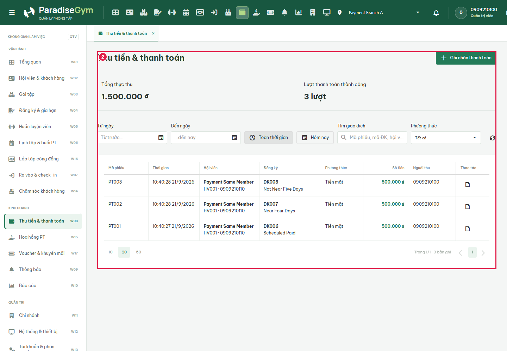

### Open QTV Cash payment form

Expected: US02 MF2: payment form with same active member and pending registrations

Actual: Hội viên cần thanh toán *
Gói tập đăng ký chờ thanh toán *
Số tiền thanh toán 100%
Mã giảm giá / Voucher (nếu có)
Áp dụng
Phương thức thanh toán *
Tiền mặt
Chuyển khoản
Ghi chú giao dịch
Hủy
Xác nhận đã thu đủ tiền mặt

Status: **PASS**

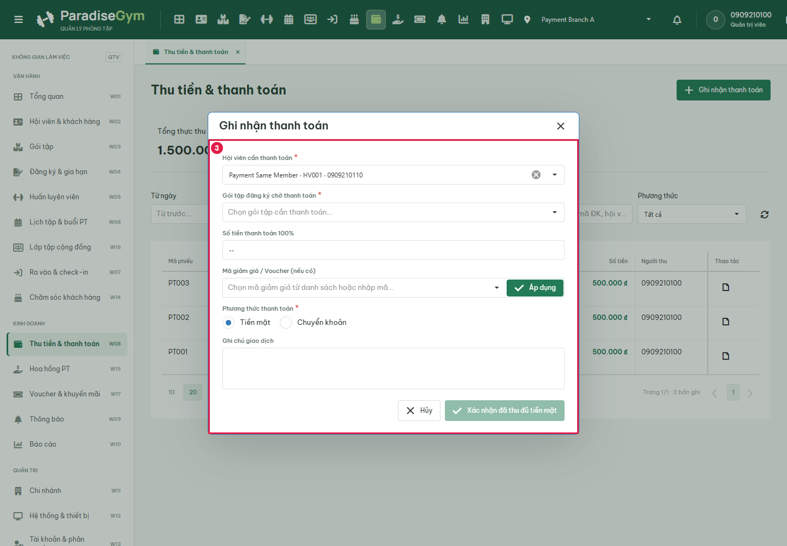

### Open Gói tập đăng ký chờ thanh toán

Expected: US02 field-level searchable options shown

Actual: DK004 · LT Bank
Kỳ: 21/09/2026 - 21/10/2026
500.000 ₫
DK003 · LT Cash
Kỳ: 21/09/2026 - 21/10/2026
500.000 ₫
DK002 · QTV Bank
Kỳ: 21/09/2026 - 21/10/2026
500.000 ₫
DK001 · QTV Cash
Kỳ: 21/09/2026 - 21/10/2026
500.000 ₫
DK005 · Pending Cancel
Kỳ: 21/09/2026 - 21/10/2026
500.000 ₫

Status: **PASS**

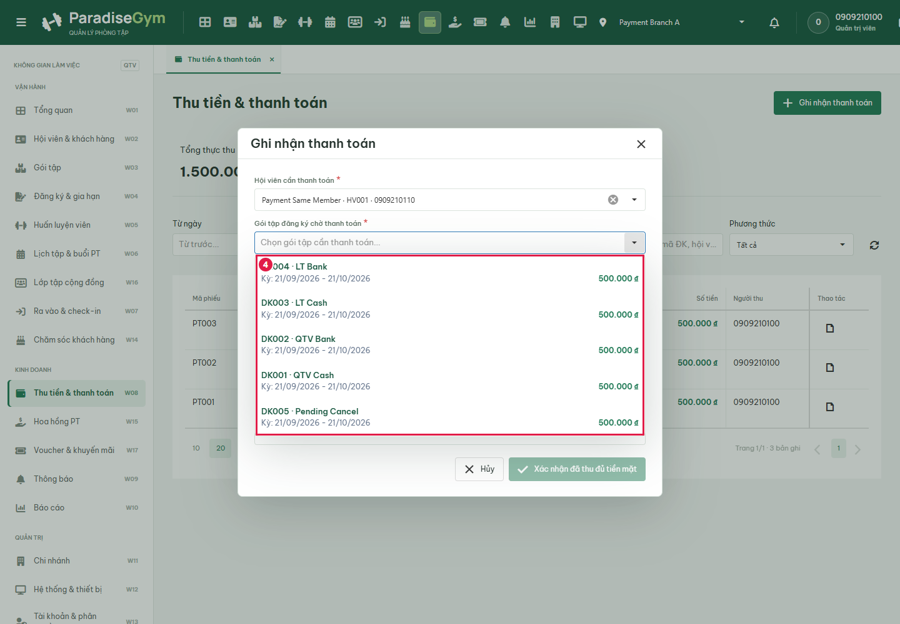

### Choose QTV Cash

Expected: Selected value shown before submit

Actual: Hội viên cần thanh toán *
Gói tập đăng ký chờ thanh toán *
Số tiền thanh toán 100%
Mã giảm giá / Voucher (nếu có)
Áp dụng
Phương thức thanh toán *
Tiền mặt
Chuyển khoản
Ghi chú giao dịch
Hủy
Xác nhận đã thu đủ tiền mặt

Status: **PASS**

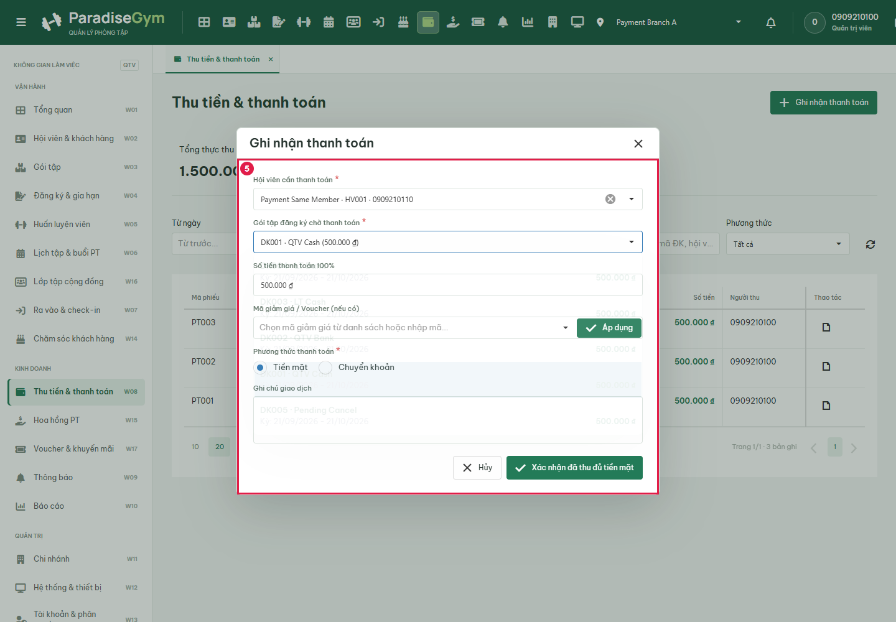

### Enter note for QTV Cash

Expected: Cash selected; no bank-reference field; entered note captured before settlement

Actual: Hội viên cần thanh toán *
Gói tập đăng ký chờ thanh toán *
Số tiền thanh toán 100%
Mã giảm giá / Voucher (nếu có)
Áp dụng
Phương thức thanh toán *
Tiền mặt
Chuyển khoản
Ghi chú giao dịch
Hủy
Xác nhận đã thu đủ tiền mặt

Status: **PASS**

### Confirm QTV Cash payment

Expected: US02 MF10-12: exactly one final payment and receipt, same member, correct method, registration active

Actual: PARADISE GYM
PHIẾU THU
Số phiếu
PT004
Thời gian
10:40:34 21/9/2026
Người nộp tiền
Payment Same Member
Số điện thoại
0909210110
Đăng ký
DK001
Gói tập
QTV Cash
Kỳ hiệu lực
21/09/2026 - 21/10/2026
Phương thức
Tiền mặt
Mã giao dịch
--
Người thu
0909210100
Chi nhánh
Payment Branch A
Thực thu 100%
500.000 ₫
Ghi chú
Cash QTV Cash

Status: **PASS**

### Close receipt

Expected: New successful row visible in source ledger without status

Actual: Thu tiền & thanh toán
Ghi nhận thanh toán
Tổng thực thu
2.000.000 ₫
Lượt thanh toán thành công
4 lượt
Từ ngày
Đến ngày
Toàn thời gian
Hôm nay
Tìm giao dịch
Phương thức
Thao tác
Mã phiếu	
Thời gian	
Hội viên	
Đăng ký	Phương thức	
Số tiền	
Người thu	
Chi nhánh	
PT004	10:40:34 21/9/2026	Payment Same Member
HV001 · 0909210110
	DK001
QTV Cash
	Tiền mặt	500.000 ₫	0909210100	Payment Branch A	
PT003	10:40:28 21/9/2026	Payment Same Member
HV001 · 0909210110
	DK008
Not Near Five Days
	Tiền mặt	500.000 ₫	0909210100	Payment Branch A	
PT002	10:40:28 21/9/2026	Payment Same Member
HV001 · 0909210110
	DK007
Near Four Days
	Tiền mặt	500.000 ₫	0909210100	Payment Branch A	
PT001	10:40:27 21/9/2026	Payment Same Member
HV001 · 0909210110
	DK006
Scheduled Paid
	Tiền mặt	500.000 ₫	0909210100	Payment Branch A	

102050
Trang 1/1 · 4 bản ghi1

Status: **PASS**

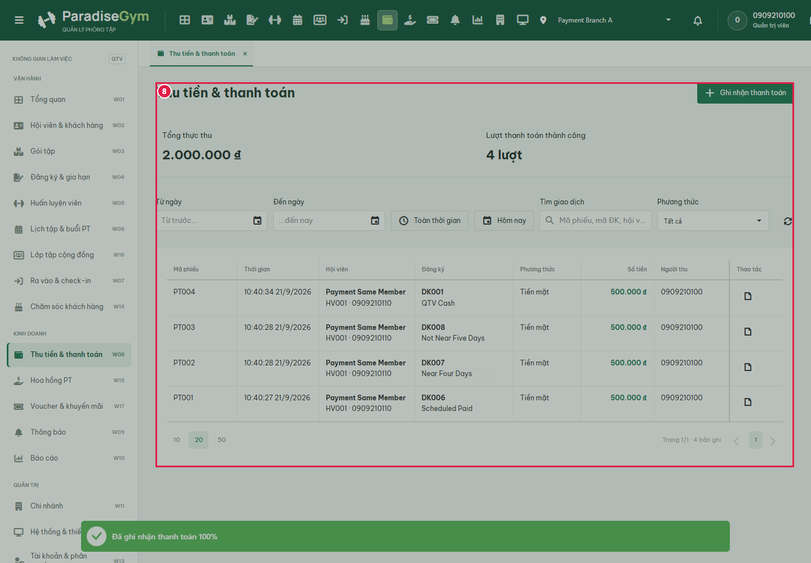

### Open QTV Bank payment form

Expected: US02 MF2: payment form with same active member and pending registrations

Actual: Hội viên cần thanh toán *
Gói tập đăng ký chờ thanh toán *
Số tiền thanh toán 100%
Mã giảm giá / Voucher (nếu có)
Áp dụng
Phương thức thanh toán *
Tiền mặt
Chuyển khoản
Ghi chú giao dịch
Hủy
Xác nhận đã thu đủ tiền mặt

Status: **PASS**

### Open Gói tập đăng ký chờ thanh toán

Expected: US02 field-level searchable options shown

Actual: DK004 · LT Bank
Kỳ: 21/09/2026 - 21/10/2026
500.000 ₫
DK003 · LT Cash
Kỳ: 21/09/2026 - 21/10/2026
500.000 ₫
DK002 · QTV Bank
Kỳ: 21/09/2026 - 21/10/2026
500.000 ₫
DK005 · Pending Cancel
Kỳ: 21/09/2026 - 21/10/2026
500.000 ₫

Status: **PASS**

### Choose QTV Bank

Expected: Selected value shown before submit

Actual: Hội viên cần thanh toán *
Gói tập đăng ký chờ thanh toán *
Số tiền thanh toán 100%
Mã giảm giá / Voucher (nếu có)
Áp dụng
Phương thức thanh toán *
Tiền mặt
Chuyển khoản
Ghi chú giao dịch
Hủy
Xác nhận đã thu đủ tiền mặt

Status: **PASS**

### Select bank transfer

Expected: US02 MF7: QR intent has 15-minute TTL; registration pending and absent from final ledger

Actual: {"registrationId":"d43da72d-3158-4fd5-834e-3e07378b67d8","intentId":"9520f0ab-4a30-434f-bb73-6d3097bddba9","state":"PENDING","ttlSeconds":900}

Status: **PASS**

### Open manual reconciliation

Expected: Manual BANK_TRANSFER form requires transaction reference and reconciliation checkbox

Actual: Giao dịch
PAY005
Số tiền
500.000 ₫
Phương thức
Chuyển khoản
Mã giao dịch trên chứng từ ngân hàng *
Ghi chú đối soát
Đối chiếu thực thu
Đã đối chiếu và nhận đủ 500.000 ₫
Hủy
Xác nhận đã nhận đủ tiền

Status: **PASS**

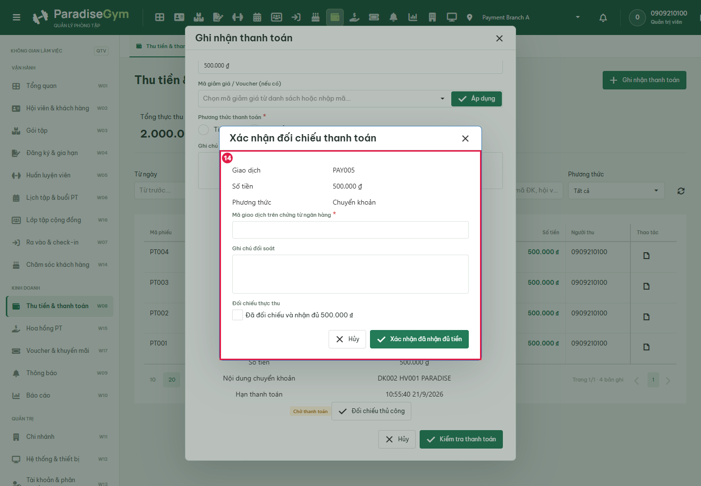

### Submit with empty bank reference

Expected: User requirement: missing transaction reference blocks settlement

Actual: Required-field validation visible; no ledger row

Status: **PASS**

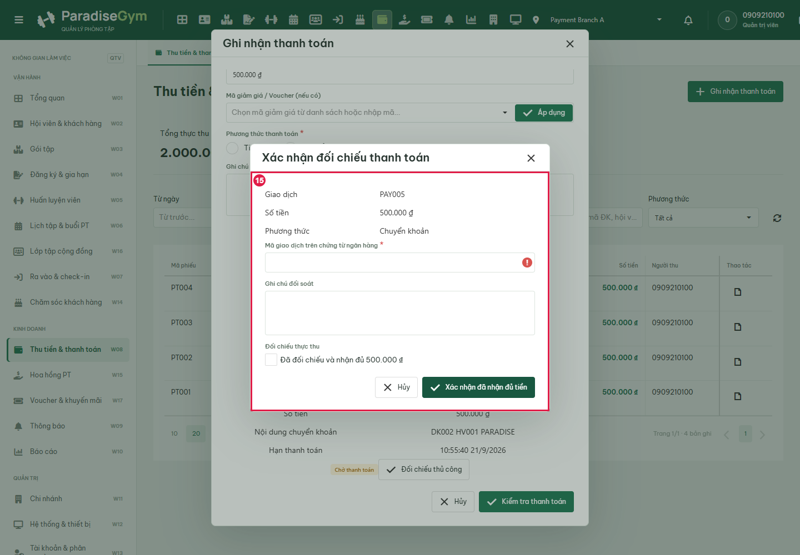

### Enter actual test reference and confirm reconciliation checkbox

Expected: Input Capture Before Submit: bank reference visible, method remains BANK_TRANSFER

Actual: Giao dịch
PAY005
Số tiền
500.000 ₫
Phương thức
Chuyển khoản
Mã giao dịch trên chứng từ ngân hàng *
Ghi chú đối soát
Đối chiếu thực thu
Đã đối chiếu và nhận đủ 500.000 ₫
Hủy
Xác nhận đã nhận đủ tiền

Status: **PASS**

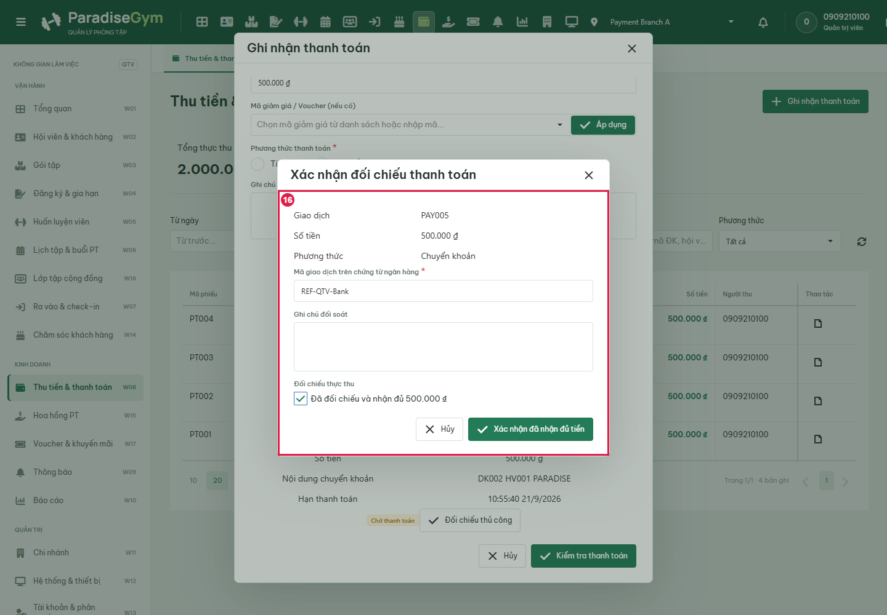

### Confirm QTV Bank payment

Expected: US02 MF10-12: exactly one final payment and receipt, same member, correct method, registration active

Actual: PARADISE GYM
PHIẾU THU
Số phiếu
PT005
Thời gian
10:40:42 21/9/2026
Người nộp tiền
Payment Same Member
Số điện thoại
0909210110
Đăng ký
DK002
Gói tập
QTV Bank
Kỳ hiệu lực
21/09/2026 - 21/10/2026
Phương thức
Chuyển khoản
Mã giao dịch
REF-QTV-Bank
Người thu
0909210100
Chi nhánh
Payment Branch A
Thực thu 100%
500.000 ₫

Status: **PASS**

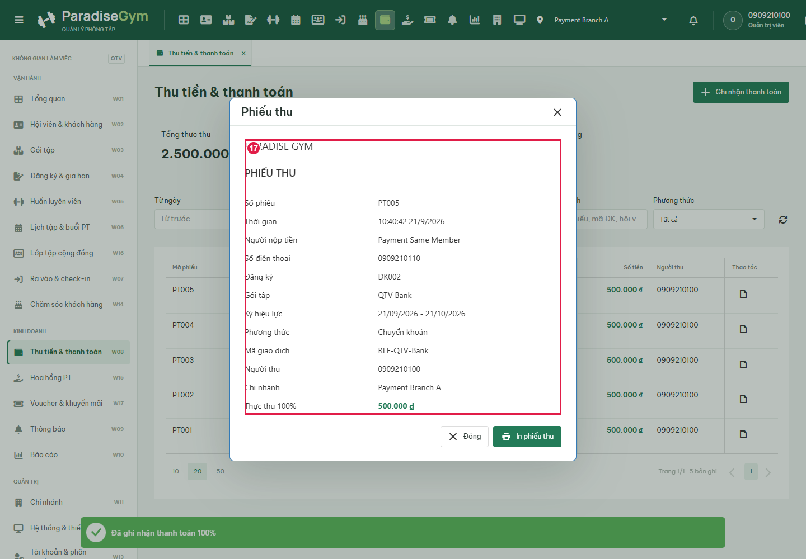

### Close receipt

Expected: New successful row visible in source ledger without status

Actual: Thu tiền & thanh toán
Ghi nhận thanh toán
Tổng thực thu
2.500.000 ₫
Lượt thanh toán thành công
5 lượt
Từ ngày
Đến ngày
Toàn thời gian
Hôm nay
Tìm giao dịch
Phương thức
Thao tác
Mã phiếu	
Thời gian	
Hội viên	
Đăng ký	Phương thức	
Số tiền	
Người thu	
Chi nhánh	
PT005	10:40:42 21/9/2026	Payment Same Member
HV001 · 0909210110
	DK002
QTV Bank
	Chuyển khoản	500.000 ₫	0909210100	Payment Branch A	
PT004	10:40:34 21/9/2026	Payment Same Member
HV001 · 0909210110
	DK001
QTV Cash
	Tiền mặt	500.000 ₫	0909210100	Payment Branch A	
PT003	10:40:28 21/9/2026	Payment Same Member
HV001 · 0909210110
	DK008
Not Near Five Days
	Tiền mặt	500.000 ₫	0909210100	Payment Branch A	
PT002	10:40:28 21/9/2026	Payment Same Member
HV001 · 0909210110
	DK007
Near Four Days
	Tiền mặt	500.000 ₫	0909210100	Payment Branch A	
PT001	10:40:27 21/9/2026	Payment Same Member
HV001 · 0909210110
	DK006
Scheduled Paid
	Tiền mặt	500.000 ₫	0909210100	Payment Branch A	

102050
Trang 1/1 · 5 bản ghi1

Status: **PASS**

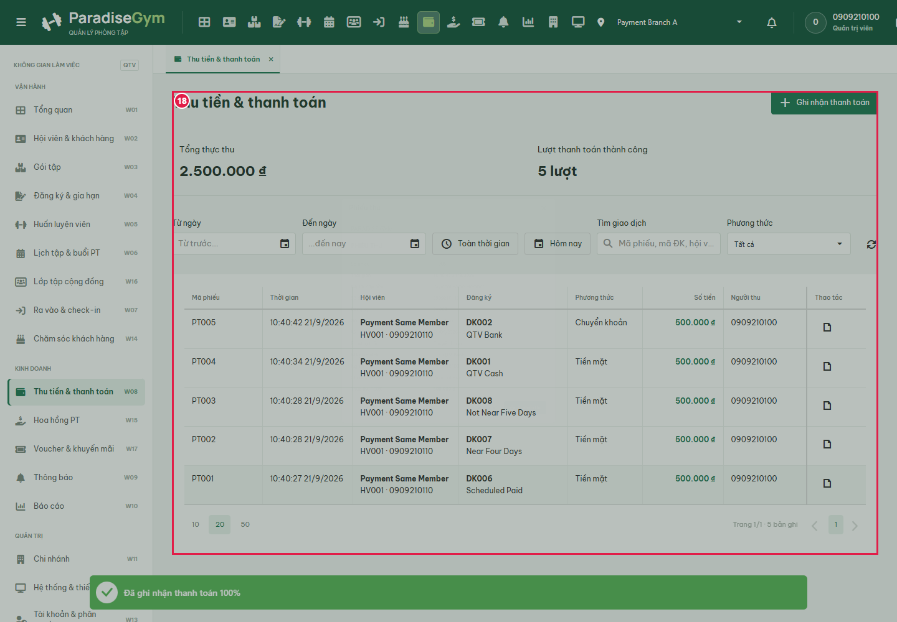

### Filter Scheduled Paid

Expected: Matching registration visible before opening detail

Actual: Missing Scheduled Paid: DK008	10:40:28 21/9/2026	Payment Same Member
HV001 · Payment Branch A
	Not Near Five Days	21/09/2026 - 26/09/2026	500.000 ₫	--	Đang hiệu lực	

Status: **FAIL**

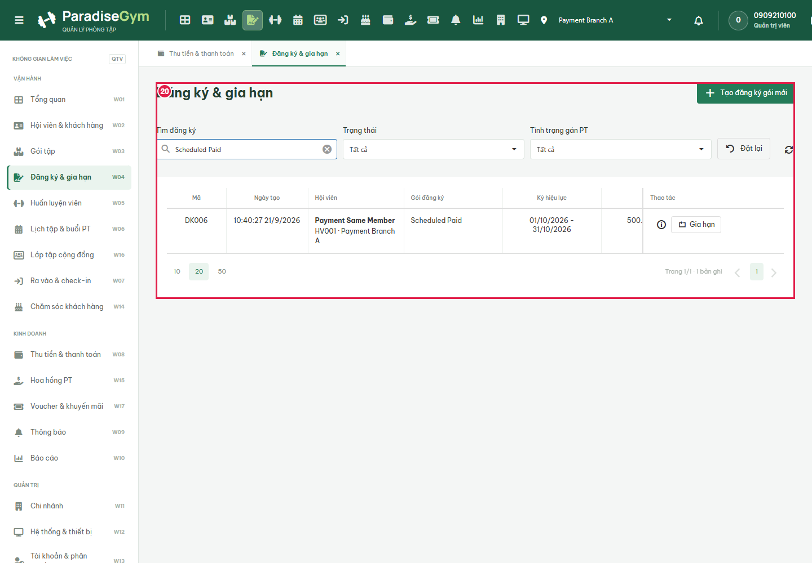

### QTV registration guards

Expected: Complete scenario

Actual: Missing Scheduled Paid: DK008	10:40:28 21/9/2026	Payment Same Member
HV001 · Payment Branch A
	Not Near Five Days	21/09/2026 - 26/09/2026	500.000 ₫	--	Đang hiệu lực	

Status: **FAIL**

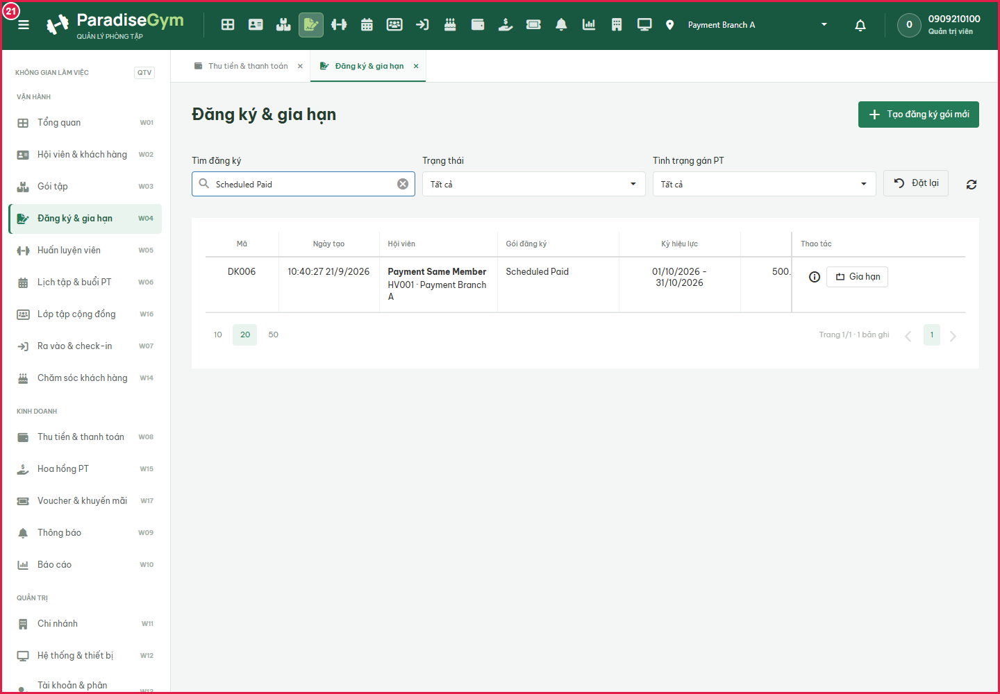

## State Verification

[
  {
    "registrationId": "155519a1-45e8-43ba-a28c-2b54dd2e9a1d",
    "paymentId": "f4600b6c-e7d1-49a5-a91e-14f824976292",
    "memberId": "2c3919bc-87e1-404a-a616-94fdc533d547",
    "method": "CASH",
    "reference": null,
    "amount": 500000
  },
  {
    "registrationId": "d43da72d-3158-4fd5-834e-3e07378b67d8",
    "paymentId": "9520f0ab-4a30-434f-bb73-6d3097bddba9",
    "memberId": "2c3919bc-87e1-404a-a616-94fdc533d547",
    "method": "BANK_TRANSFER",
    "reference": "REF-QTV-Bank",
    "amount": 500000
  }
]

## Cross-Role / Downstream Verification

### Open authenticated same-member payment history

Expected: Downstream shows same package, amount and payment method after source settlement

Actual: PT004
500.000 đ

QTV Cash

10:40:34 21/9/2026 · Tiền mặt

Xem phiếu thu

Status: **PASS**

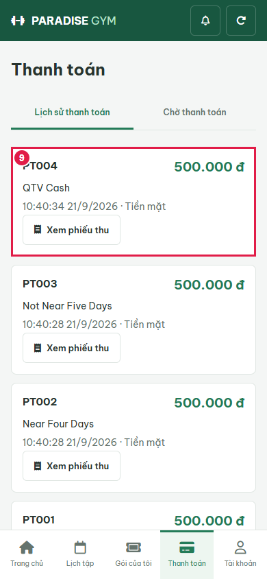

### Open authenticated same-member payment history

Expected: Downstream shows same package, amount and payment method after source settlement

Actual: PT005
500.000 đ

QTV Bank

10:40:42 21/9/2026 · Chuyển khoản Ngân hàng (VietQR)

Xem phiếu thu

Status: **PASS**

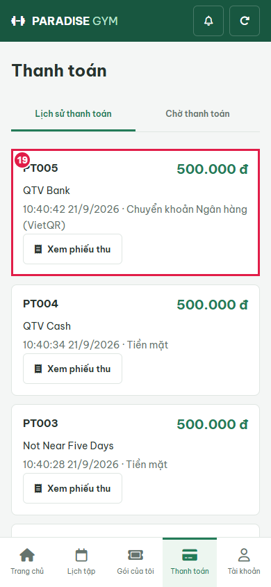

## Issues Found

filter-registration: Missing Scheduled Paid: DK008	10:40:28 21/9/2026	Payment Same Member
HV001 · Payment Branch A
	Not Near Five Days	21/09/2026 - 26/09/2026	500.000 ₫	--	Đang hiệu lực	

QTV registration guards: Missing Scheduled Paid: DK008	10:40:28 21/9/2026	Payment Same Member
HV001 · Payment Branch A
	Not Near Five Days	21/09/2026 - 26/09/2026	500.000 ₫	--	Đang hiệu lực	

blocked: Missing Scheduled Paid: DK008	10:40:28 21/9/2026	Payment Same Member
HV001 · Payment Branch A
	Not Near Five Days	21/09/2026 - 26/09/2026	500.000 ₫	--	Đang hiệu lực	

## Final Result

**BLOCKED**; 19/21 steps passed. Cleanup: {"browserClosed":true,"apiClosed":true,"staticClosed":true,"poolsClosed":true,"databaseDropped":true}.
