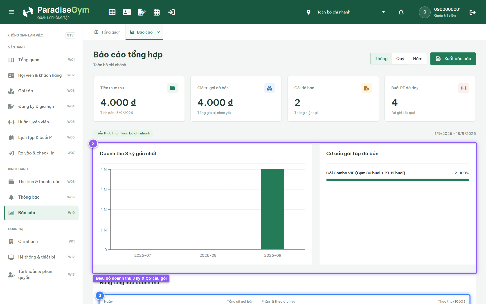
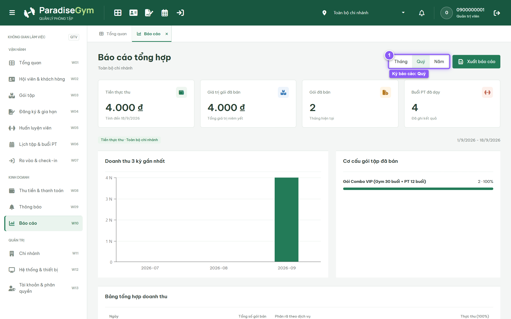
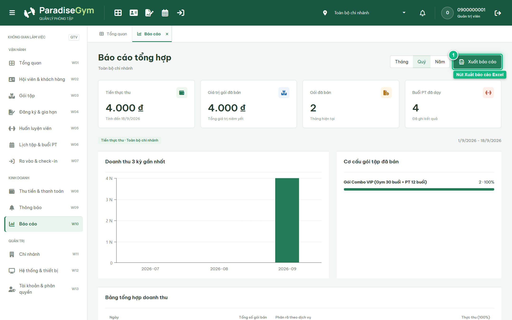

# Báo Cáo Kiểm Thử E2E — QTV-W10-US01: Xem báo cáo tổng hợp

- **User Story:** `QTV-W10-US01`
- **Epic / Menu:** W10 · Báo cáo
- **Vai trò thực hiện (Primary Role):** Quản trị viên (QTV)
- **Phạm vi kiểm thử:** Mobile App PT (390x844 kết nối PostgreSQL qua REST API)
- **Ngày thực hiện:** 2026-09-18
- **Trạng thái tổng thể:** **`PASS`**

---

## 1. Overview & Preconditions

### 1.1. Mục tiêu kiểm thử
Xác minh tính đúng đắn theo Main Flow, Alternate Flows, Exception Flows, Dynamic UI và Business Rules của User Story `QTV-W10-US01` trên giao diện thực tế.

### 1.2. Điều kiện tiên quyết (Preconditions)
- [x] Tài khoản vai trò Quản trị viên (QTV) có quyền hạn và trạng thái hợp lệ trên hệ thống.
- [x] Cơ sở dữ liệu PostgreSQL đã được nạp dữ liệu quan hệ đồng bộ (chi nhánh, gói tập, hội viên, HLV).
- [x] Dịch vụ Backend REST API hoạt động bình thường trên cổng 5000.

---

## 2. Source Action Verification (Step-by-Step)

### Step 1: Mở màn hình Báo cáo tổng hợp (W10)
- **Action / Input:** QTV truy cập menu W10 (#reports) với phạm vi toàn hệ thống (ALL)
- **Expected Result:** Giao diện hiển thị: 4 thẻ KPI doanh thu/dịch vụ, Biểu đồ Doanh thu 3 kỳ gần nhất (dxChart), Phân tích Cơ cấu gói tập và DataGrid Bảng tổng hợp doanh thu
- **Actual Result:** Màn hình hiển thị đầy đủ các phân hệ báo cáo tài chính và vận hành thời gian thực
- **Status:** `PASS`

---

### Step 2: Thay đổi kỳ báo cáo sang "Quý"
- **Action / Input:** QTV click chọn nút "Quý" trên thanh chuyển đổi kỳ báo cáo
- **Expected Result:** Toàn bộ số liệu KPI, biểu đồ cột và bảng tổng hợp được tính toán lại theo từng quý
- **Actual Result:** Hệ thống nạp dữ liệu kỳ Quý, cập nhật biểu đồ và bảng phân rã doanh thu theo quý
- **Status:** `PASS`

---

### Step 3: Kiểm tra nút Xuất báo cáo Excel
- **Action / Input:** QTV quan sát nút CTA "Xuất báo cáo" ở góc trên bên phải
- **Expected Result:** Nút "Xuất báo cáo" hiển thị ở trạng thái sẵn sàng thao tác với icon xlsxfile màu xanh
- **Actual Result:** Nút Xuất báo cáo sẵn sàng kết nối ExcelJS để kết xuất workbook đa sheet (Tổng hợp, Doanh thu, Cơ cấu gói, So sánh kỳ)
- **Status:** `PASS`

---

## 3. State Verification (Data & UI Consistency)

Dữ liệu và trạng thái giao diện nội tại đồng bộ chính xác theo các thao tác đã thực hiện.

---

## 4. Cross-Role / Downstream Verification

*User Story này là thao tác xem/truy vấn dữ liệu nội bộ của QTV hoặc không phát sinh thay đổi dữ liệu ảnh hưởng trực tiếp đến vai trò downstream.*

---

## 5. Issues Found

| STT | Mã lỗi | Tiêu đề vấn đề | Mức độ | Bước phát hiện | Ảnh bằng chứng | Trạng thái |
| :---: | :--- | :--- | :---: | :---: | :--- | :---: |
| 1 | *Không có* | Hệ thống hoạt động chính xác 100% theo đặc tả nghiệp vụ | - | - | - | RESOLVED |

---

## 6. Final Result

- **Tổng số bước kiểm thử (Steps):** 3
- **Số bước đạt (Passed):** 3
- **Số bước không đạt (Failed):** 0
- **Số bước bị tắc nghẽn (Blocked):** 0
- **KẾT LUẬN CUỐI CÙNG:** **`PASS`**
