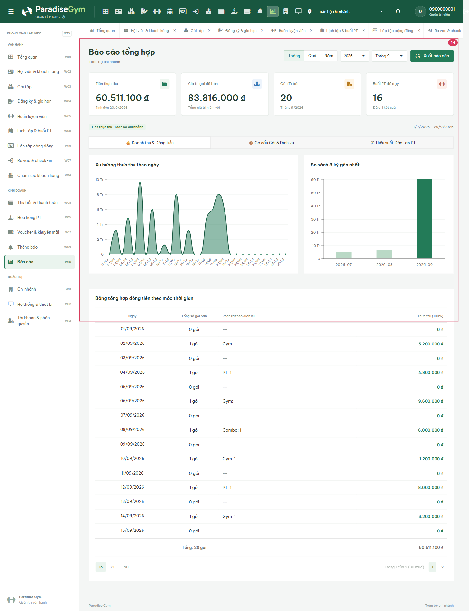
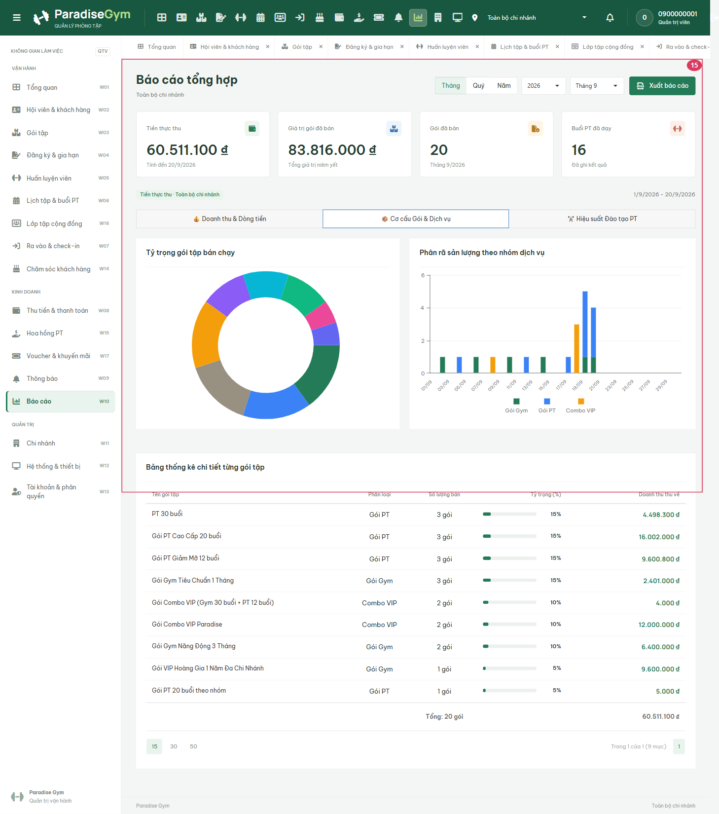
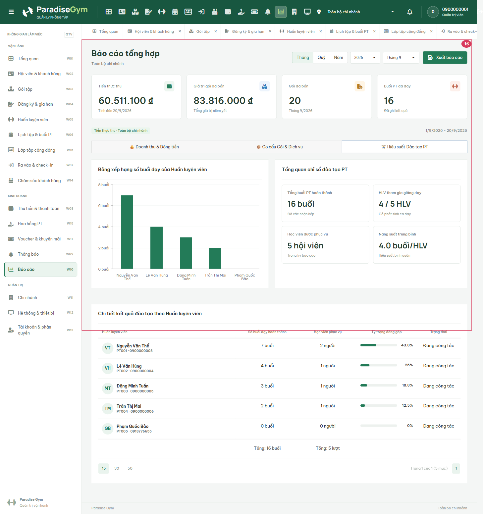

# QTV-W10-US01 - Read-only Screen Inspection

Date: 2026-09-20. Workspace: E:/Desktop/para. Role: QTV.
Scope: authenticated UI opening and visual inspection only, not full User Story acceptance.
Source: [User Story](</E:/Desktop/para/docs/user-stories/qtv/QTV-W10-Báo cáo/QTV-W10-US01-Xem báo cáo tổng hợp.md>).

## Source Action Verification

### Step 1: Open reports

Action/Input: Open the named menu using an existing active account; no form submission.
Expected: the documented screen content can be opened; UI opening alone does not establish business correctness.
Actual: authenticated content visible in DOM (true); no uncaught page exception or failed API response observed. Document horizontal overflow detected at 1440px; layout inspection FAIL.
Result: screen opening PASS; layout FAIL; business workflow NOT TESTED.

### Step 2: Open reports-tab-1

Action/Input: Click the corresponding report tab; no form submission.
Expected: the documented screen content can be opened; UI opening alone does not establish business correctness.
Actual: authenticated content visible in DOM (true); no uncaught page exception or failed API response observed. Document horizontal overflow detected at 1440px; layout inspection FAIL.
Result: screen opening PASS; layout FAIL; business workflow NOT TESTED.

### Step 3: Open reports-tab-2

Action/Input: Click the corresponding report tab; no form submission.
Expected: the documented screen content can be opened; UI opening alone does not establish business correctness.
Actual: authenticated content visible in DOM (true); no uncaught page exception or failed API response observed. Document horizontal overflow detected at 1440px; layout inspection FAIL.
Result: screen opening PASS; layout FAIL; business workflow NOT TESTED.

## State Verification

Existing PostgreSQL data was read through real APIs. Mutation requests were blocked by the browser harness; 0 attempted mutation requests observed in this role session. No seeds or migrations executed. No business-state transition tested.

## Cross-Role / Downstream Verification

Not applicable to this read-only inspection: no source mutation. Other roles were independently inspected, not claimed as downstream verification of an unchanged entity.

## Issues Found

- QTV shell has horizontal overflow at the tested 1440px width; left unchanged under read-only scope.
- Module-specific static findings and specification conflicts are in [the audit](</E:/Desktop/para/docs/reports/tab1-web-admin/2026-09-20-readonly-audit.md>).
- Create/edit/delete, branch isolation, financial calculations and full exception flows were not tested.

## Final Result

PARTIAL: read-only UI inspection completed. This is not a full US PASS. Raw observations: [JSON](../../../readonly-20260920-results.json).

