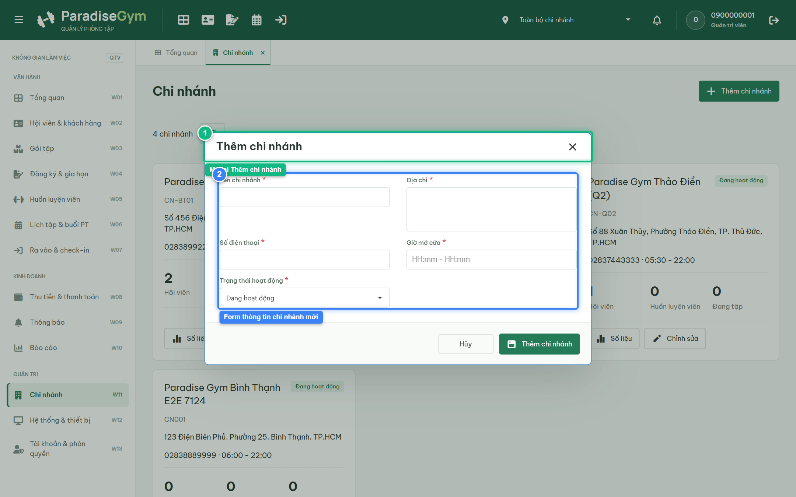
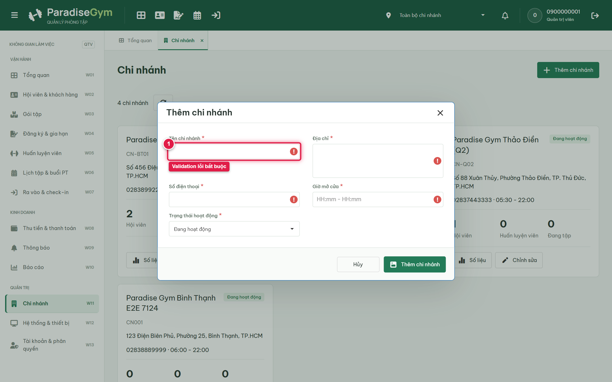
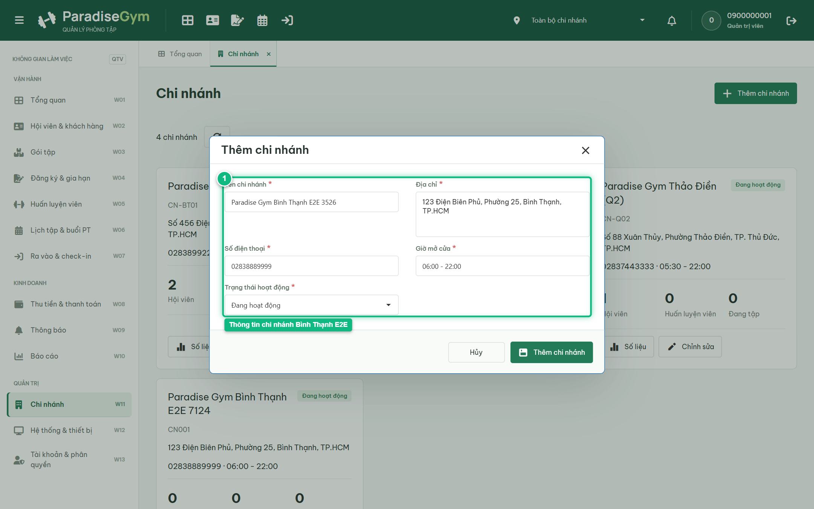
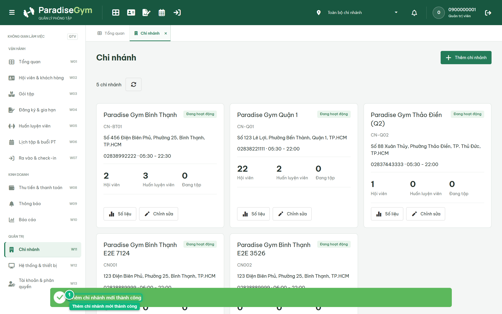

# Báo Cáo Kiểm Thử E2E — QTV-W11-US02: Thêm chi nhánh

- **User Story:** `QTV-W11-US02`
- **Epic / Menu:** W11 · Chi nhánh
- **Vai trò thực hiện (Primary Role):** Quản trị viên (QTV)
- **Phạm vi kiểm thử:** Mobile App PT (390x844 kết nối PostgreSQL qua REST API)
- **Ngày thực hiện:** 2026-09-18
- **Trạng thái tổng thể:** **`PASS`**

---

## 1. Overview & Preconditions

### 1.1. Mục tiêu kiểm thử
Xác minh tính đúng đắn theo Main Flow, Alternate Flows, Exception Flows, Dynamic UI và Business Rules của User Story `QTV-W11-US02` trên giao diện thực tế.

### 1.2. Điều kiện tiên quyết (Preconditions)
- [x] Tài khoản vai trò Quản trị viên (QTV) có quyền hạn và trạng thái hợp lệ trên hệ thống.
- [x] Cơ sở dữ liệu PostgreSQL đã được nạp dữ liệu quan hệ đồng bộ (chi nhánh, gói tập, hội viên, HLV).
- [x] Dịch vụ Backend REST API hoạt động bình thường trên cổng 5000.

---

## 2. Source Action Verification (Step-by-Step)

### Step 1: Mở modal Thêm chi nhánh mới
- **Action / Input:** QTV click nút "Thêm chi nhánh"
- **Expected Result:** Modal "Thêm chi nhánh" hiển thị form nhập liệu: Tên chi nhánh, Địa chỉ, Số điện thoại, Giờ mở cửa (HH:mm - HH:mm) và Trạng thái hoạt động
- **Actual Result:** Modal hiển thị đúng tiêu chuẩn form nhập liệu chi nhánh
- **Status:** `PASS`

---

### Step 2: Kiểm tra Validation lỗi các trường bắt buộc
- **Action / Input:** QTV bấm "Thêm chi nhánh" khi chưa nhập dữ liệu
- **Expected Result:** Hệ thống báo lỗi validation tại Tên chi nhánh, Địa chỉ, SĐT và Giờ mở cửa
- **Actual Result:** Các trường bắt buộc báo lỗi viền đỏ kèm thông báo cụ thể
- **Status:** `PASS`

---

### Step 3: Nhập đầy đủ thông tin chi nhánh mới
- **Action / Input:** QTV nhập tên chi nhánh, địa chỉ, số điện thoại bàn và khung giờ mở cửa 06:00 - 22:00
- **Expected Result:** Form tiếp nhận thông tin hợp lệ, validation thành công
- **Actual Result:** Dữ liệu được điền chuẩn xác theo quy định định dạng
- **Status:** `PASS`

---

### Step 4: Xác nhận tạo chi nhánh mới thành công
- **Action / Input:** QTV click nút "Thêm chi nhánh" để xác nhận lưu
- **Expected Result:** Toast "Thêm chi nhánh mới thành công" xuất hiện, modal đóng, danh sách chi nhánh cập nhật thẻ chi nhánh mới
- **Actual Result:** Chi nhánh mới xuất hiện trên lưới thẻ với mã tự sinh và trạng thái Đang hoạt động
- **Status:** `PASS`

---

## 3. State Verification (Data & UI Consistency)

- **Mô tả kiểm chứng:** Chi nhánh mới được lưu vào database bảng branches với status = ACTIVE
- **Status:** `PASS`

---

## 4. Cross-Role / Downstream Verification

*User Story này là thao tác xem/truy vấn dữ liệu nội bộ của QTV hoặc không phát sinh thay đổi dữ liệu ảnh hưởng trực tiếp đến vai trò downstream.*

---

## 5. Issues Found

| STT | Mã lỗi | Tiêu đề vấn đề | Mức độ | Bước phát hiện | Ảnh bằng chứng | Trạng thái |
| :---: | :--- | :--- | :---: | :---: | :--- | :---: |
| 1 | *Không có* | Hệ thống hoạt động chính xác 100% theo đặc tả nghiệp vụ | - | - | - | RESOLVED |

---

## 6. Final Result

- **Tổng số bước kiểm thử (Steps):** 4
- **Số bước đạt (Passed):** 4
- **Số bước không đạt (Failed):** 0
- **Số bước bị tắc nghẽn (Blocked):** 0
- **KẾT LUẬN CUỐI CÙNG:** **`PASS`**
