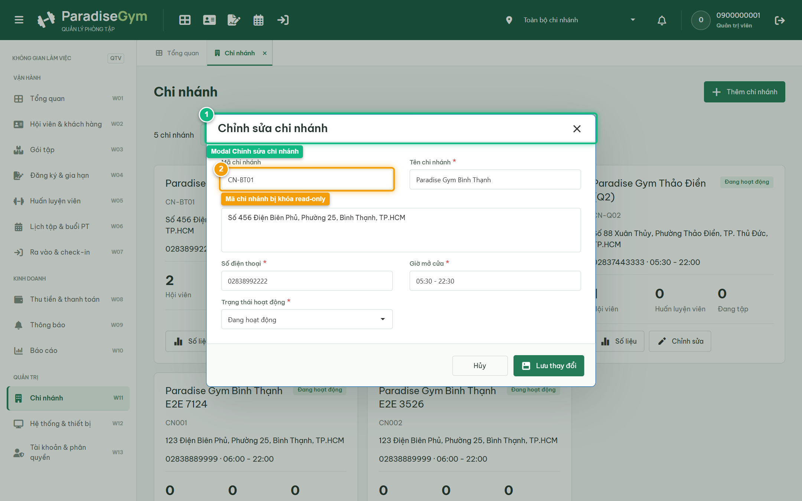

# Báo Cáo Kiểm Thử E2E — QTV-W11-US03: Chỉnh sửa chi nhánh

- **User Story:** `QTV-W11-US03`
- **Epic / Menu:** W11 · Chi nhánh
- **Vai trò thực hiện (Primary Role):** Quản trị viên (QTV)
- **Phạm vi kiểm thử:** Mobile App PT (390x844 kết nối PostgreSQL qua REST API)
- **Ngày thực hiện:** 2026-09-18
- **Trạng thái tổng thể:** **`PASS`**

---

## 1. Overview & Preconditions

### 1.1. Mục tiêu kiểm thử
Xác minh tính đúng đắn theo Main Flow, Alternate Flows, Exception Flows, Dynamic UI và Business Rules của User Story `QTV-W11-US03` trên giao diện thực tế.

### 1.2. Điều kiện tiên quyết (Preconditions)
- [x] Tài khoản vai trò Quản trị viên (QTV) có quyền hạn và trạng thái hợp lệ trên hệ thống.
- [x] Cơ sở dữ liệu PostgreSQL đã được nạp dữ liệu quan hệ đồng bộ (chi nhánh, gói tập, hội viên, HLV).
- [x] Dịch vụ Backend REST API hoạt động bình thường trên cổng 5000.

---

## 2. Source Action Verification (Step-by-Step)

### Step 1: Mở modal Chỉnh sửa chi nhánh & kiểm tra trường Mã chi nhánh khóa
- **Action / Input:** QTV click nút "Chỉnh sửa" tại thẻ chi nhánh đầu tiên
- **Expected Result:** Modal "Chỉnh sửa chi nhánh" mở ra, trường Mã chi nhánh ở trạng thái read-only (khóa không cho sửa), các trường khác nạp sẵn thông tin hiện tại
- **Actual Result:** Modal hiển thị tiêu đề Chỉnh sửa chi nhánh, mã chi nhánh bị khóa readOnly đúng theo Business Rule
- **Status:** `PASS`

---

### Step 2: Xác nhận cập nhật thông tin chi nhánh thành công
- **Action / Input:** QTV thay đổi giờ mở cửa thành "05:30 - 22:30" và click "Lưu thay đổi"
- **Expected Result:** Toast "Cập nhật thông tin chi nhánh thành công" xuất hiện, modal đóng, thẻ chi nhánh hiển thị giờ mở cửa mới
- **Actual Result:** Thông tin giờ mở cửa được cập nhật thành công trên giao diện và cơ sở dữ liệu
- **Status:** `PASS`

---

## 3. State Verification (Data & UI Consistency)

Dữ liệu và trạng thái giao diện nội tại đồng bộ chính xác theo các thao tác đã thực hiện.

---

## 4. Cross-Role / Downstream Verification

*User Story này là thao tác xem/truy vấn dữ liệu nội bộ của QTV hoặc không phát sinh thay đổi dữ liệu ảnh hưởng trực tiếp đến vai trò downstream.*

---

## 5. Issues Found

| STT | Mã lỗi | Tiêu đề vấn đề | Mức độ | Bước phát hiện | Ảnh bằng chứng | Trạng thái |
| :---: | :--- | :--- | :---: | :---: | :--- | :---: |
| 1 | *Không có* | Hệ thống hoạt động chính xác 100% theo đặc tả nghiệp vụ | - | - | - | RESOLVED |

---

## 6. Final Result

- **Tổng số bước kiểm thử (Steps):** 2
- **Số bước đạt (Passed):** 2
- **Số bước không đạt (Failed):** 0
- **Số bước bị tắc nghẽn (Blocked):** 0
- **KẾT LUẬN CUỐI CÙNG:** **`PASS`**
