# QTV-W18-US01 - Real isolated UI verification

Database: paradise_handover_test_15064_1790000786085. Run: 2026-09-21T14-26-27-424Z.

Sources: QTV-W18 Epic BR01-BR10, US01/US02/US03 and explicit user API/UI contract. Main owns docs; per-row account selection follows the explicit contract.

Related reports: [US01](../QTV-W18-US01/QTV-W18-US01-test.md), [US02](../QTV-W18-US02/QTV-W18-US02-test.md), [US03](../QTV-W18-US03/QTV-W18-US03-test.md).

## Source Action Verification

### branch-timezone-default-dates

- Action/Input: Open W18 in Los Angeles browser at a cross-date instant
- Expected: Branch timezone from real /branches determines today; serialized YYYY-MM-DD does not shift to previous day
- Actual: {"browserClock":{"timezone":"America/Los_Angeles","localDay":"2026-09-20"},"branchTimezone":"Asia/Ho_Chi_Minh","expectedDate":"21/09/2026"}
- Status: PASS

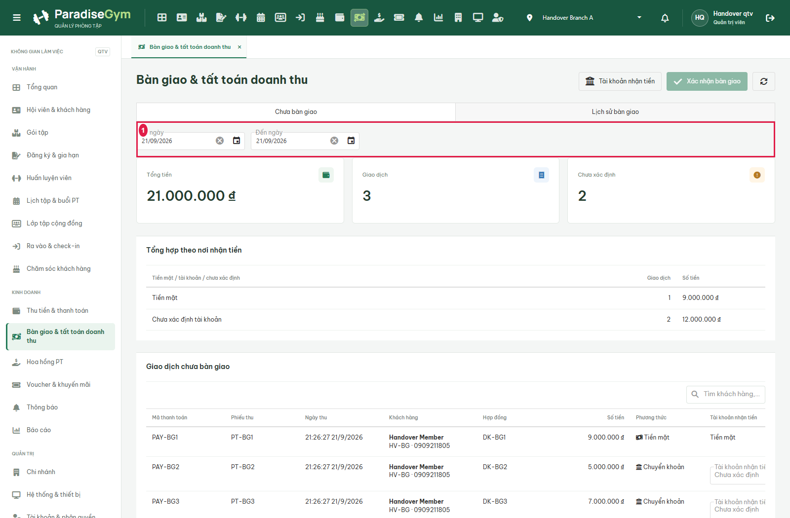

### pending-branch-time

- Action/Input: Inspect pending payment timestamps in Los Angeles browser
- Expected: Payment time rendered in API branch timezone, not browser timezone
- Actual: PAY-BG1	PT-BG1	21:26:27 21/9/2026	Handover Member HV-BG · 0909211805 	DK-BG1	9.000.000 ₫	 Tiền mặt	Tiền mặt
- Status: PASS

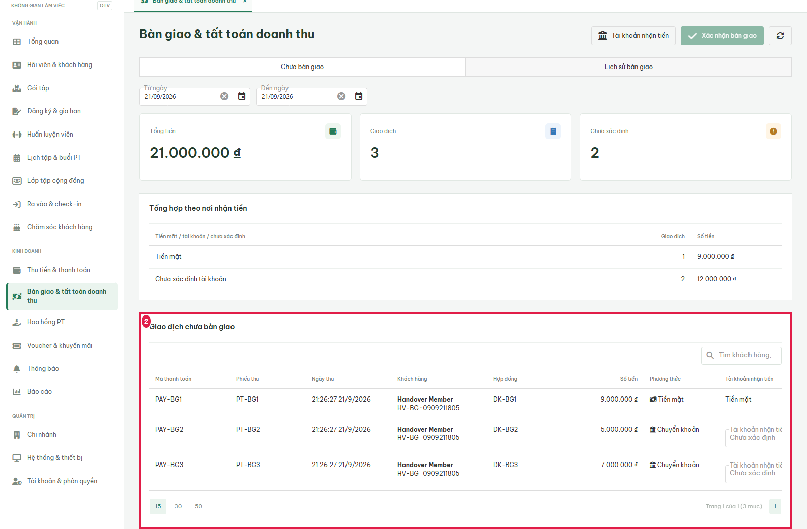

### pending-unresolved

- Action/Input: Open W18 for branch A
- Expected: US01 / BR03-BR05: eligible payments and unresolved transfers; confirm disabled
- Actual: Bàn giao & tất toán doanh thu  Tài khoản nhận tiền Xác nhận bàn giao Chưa bàn giao Lịch sử bàn giao Từ ngày Đến ngày Tổng tiền 21.000.000 ₫ Giao dịch 3 Chưa xác định 2 Tổng hợp theo nơi nhận tiền Tiền mặt / tài khoản / chưa xác định	Giao dịch	Số tiền Tiền mặt	1	9.000.000 ₫ Chưa xác định tài khoản	2	12.000.000 ₫ Giao dịch chưa bàn giao Mã thanh toán	Phiếu thu	Ngày thu	Khách hàng	Hợp đồng	Số tiền	Phương thức	Tài khoản nhận tiền PAY-BG1	PT-BG1	21:26:27 21/9/2026	Handover Member HV-BG · 0909211805 	DK-BG1	9.000.000 ₫	 Tiền mặt	Tiền mặt PAY-BG2	PT-BG2	21:26:27 21/9/2026	Handover Member HV-BG · 0909211805 	DK-BG2	5.000.000 ₫	 Chuyển khoản	 Tài khoản nhận tiền  PAY-BG3	PT-BG3	21:26:27 21/9/2026	Handover Member HV-BG · 0909211805 	DK-BG3	7.000.000 ₫	 Chuyển khoản	 Tài khoản nhận tiền 153050 Trang 1 của 1 (3 mục)1
- Status: PASS

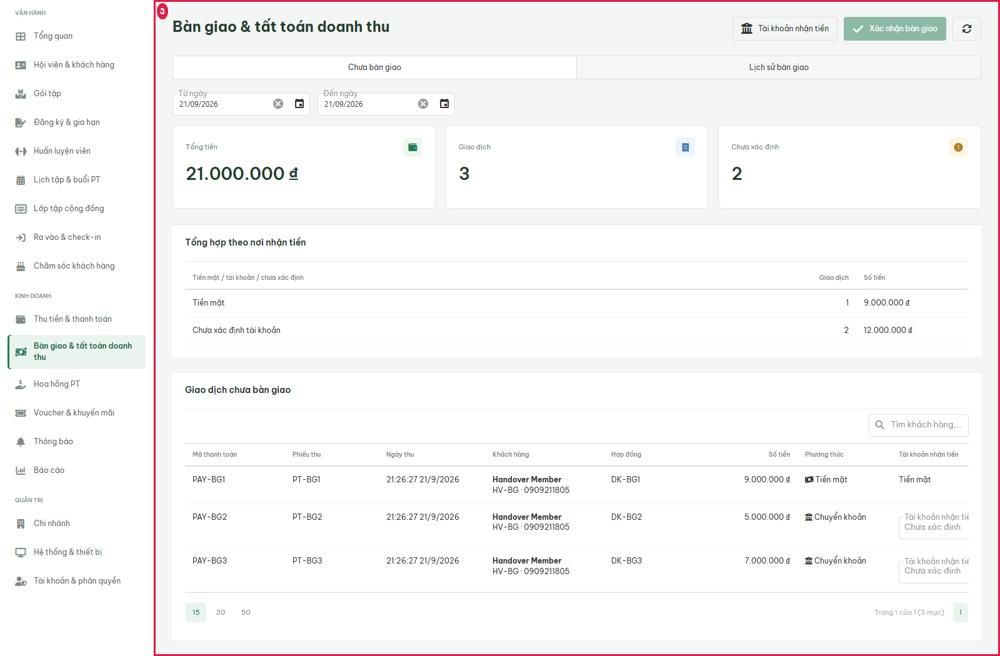

### single-bank-popup

- Action/Input: Double-click receiving-account registry
- Expected: Exactly one popup and one form
- Actual: BIN ngân hàng	Số tài khoản	Tên tài khoản 		 Không có dữ liệu phù hợp 153050 Trang 1 của 1 (0 mục)1 BIN ngân hàng * Số tài khoản * Tên tài khoản * Đóng Thêm tài khoản
- Status: PASS

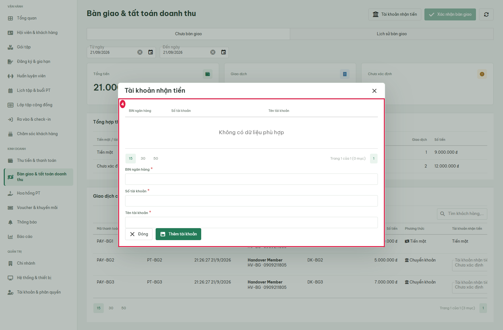

### required-bank-fields

- Action/Input: Submit blank account
- Expected: US01: all three contract fields are required
- Actual: BIN ngân hàng	Số tài khoản	Tên tài khoản 		 Không có dữ liệu phù hợp 153050 Trang 1 của 1 (0 mục)1 BIN ngân hàng * Số tài khoản * Tên tài khoản * Đóng Thêm tài khoản
- Status: PASS

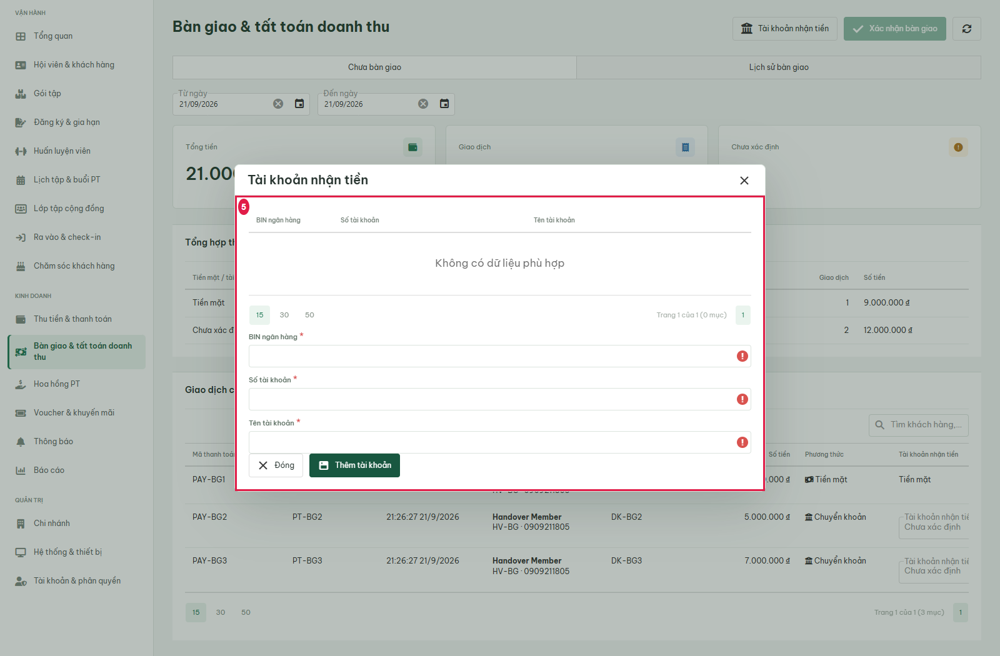

### short-bin-input

- Action/Input: Enter BIN 123
- Expected: Contract requires six digits
- Actual: 123
- Status: PASS

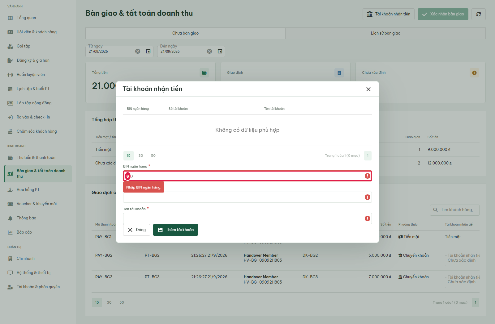

### invalid-account-input

- Action/Input: Enter account ABC
- Expected: Contract permits only 1-30 digits
- Actual: ABC
- Status: PASS

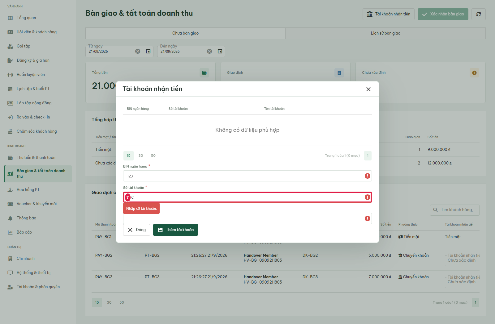

### account-name-input

- Action/Input: Enter holder name
- Expected: Entered name visible before submit
- Actual: W18 UI VERIFIED
- Status: PASS

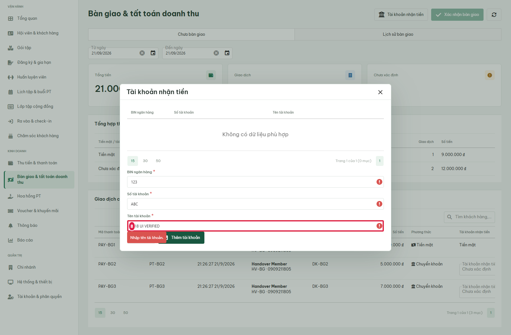

### bank-format-errors

- Action/Input: Submit malformed BIN/account
- Expected: Validation blocks both invalid fields
- Actual: BIN ngân hàng	Số tài khoản	Tên tài khoản 		 Không có dữ liệu phù hợp 153050 Trang 1 của 1 (0 mục)1 BIN ngân hàng * Số tài khoản * Tên tài khoản * Đóng Thêm tài khoản
- Status: PASS

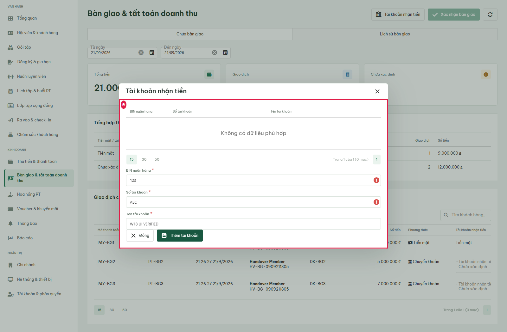

### valid-bin-input

- Action/Input: Enter six-digit BIN
- Expected: BIN retained as text
- Actual: 970422
- Status: PASS

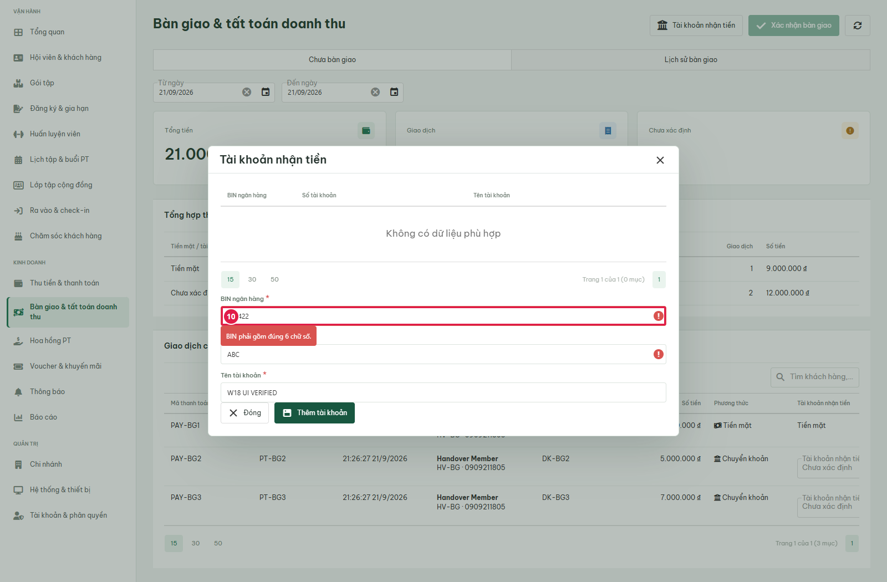

### leading-zero-account

- Action/Input: Enter 000123456789
- Expected: Leading zeroes preserved
- Actual: 000123456789
- Status: PASS

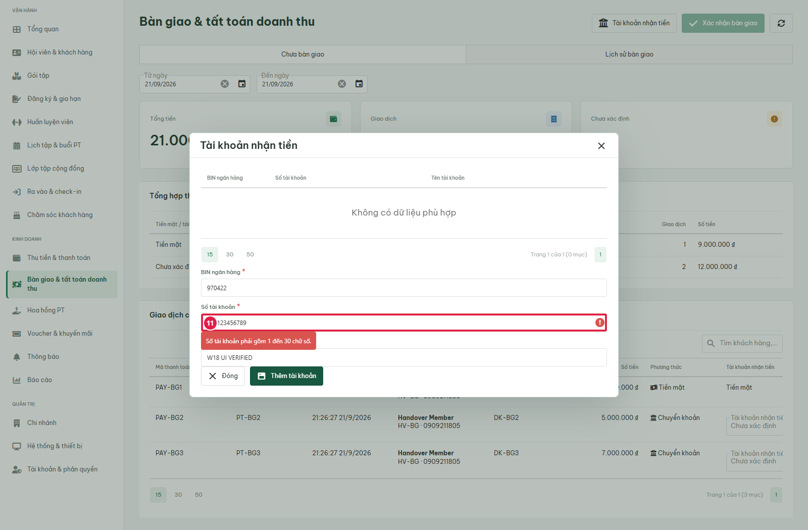

### account-created

- Action/Input: Save receiving account through real API
- Expected: US01 AF02: persistent registry row appears; original payments remain unresolved
- Actual: BIN ngân hàng	Số tài khoản	Tên tài khoản 970422	000123456789	W18 UI VERIFIED 153050 Trang 1 của 1 (1 mục)1 BIN ngân hàng * Số tài khoản * Tên tài khoản * Đóng Thêm tài khoản
- Status: PASS

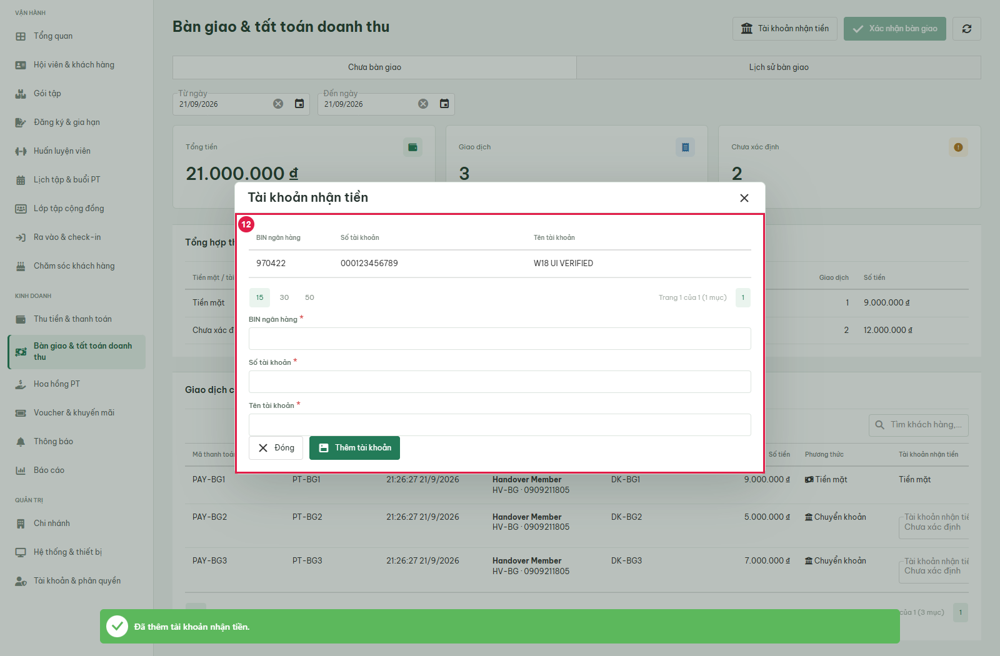

### second-account-field-0

- Action/Input: Enter second account field: 970436
- Expected: New form values visible before submit
- Actual: 970436
- Status: PASS

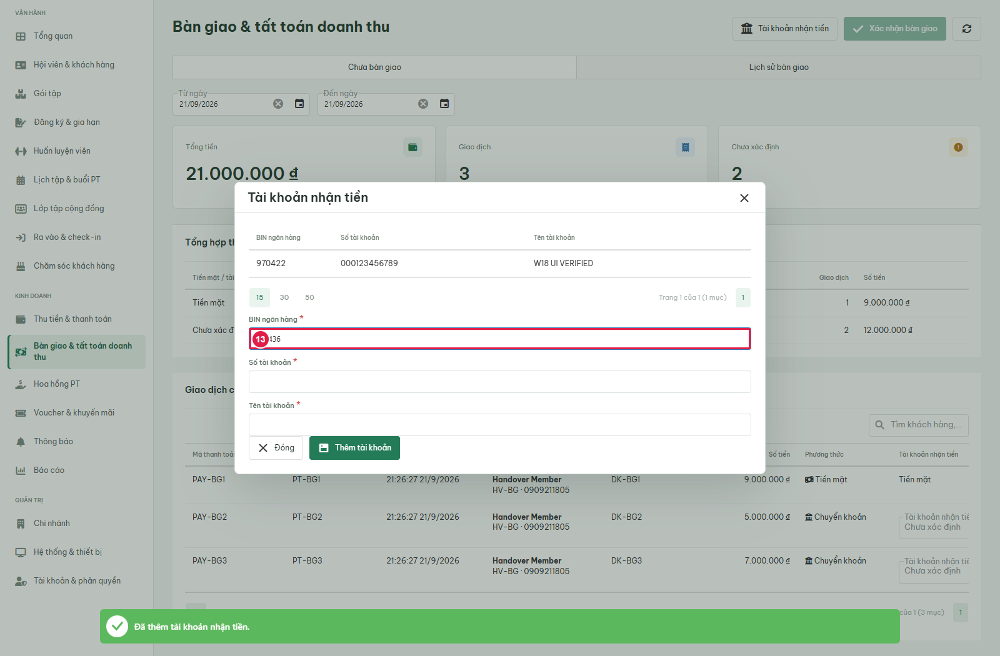

### second-account-field-1

- Action/Input: Enter second account field: 000987654321
- Expected: New form values visible before submit
- Actual: 000987654321
- Status: PASS

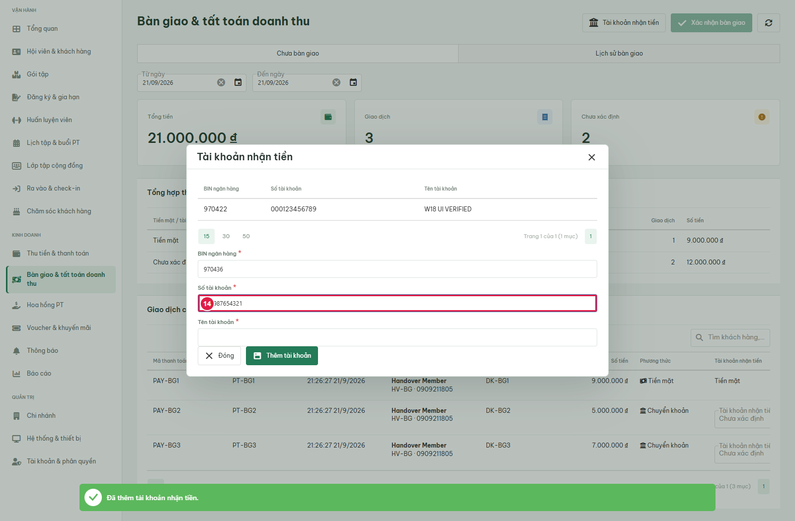

### second-account-field-2

- Action/Input: Enter second account field: W18 SECOND BANK
- Expected: New form values visible before submit
- Actual: W18 SECOND BANK
- Status: PASS

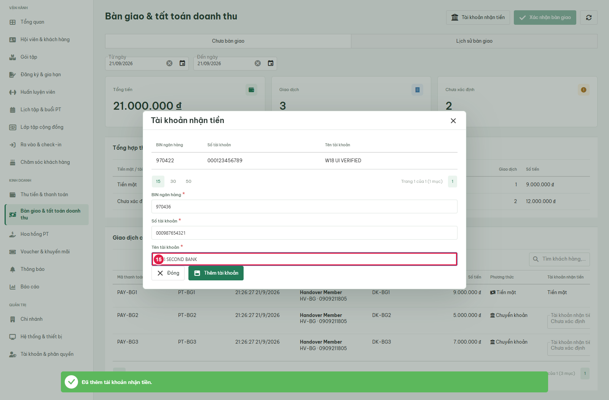

### second-account-created

- Action/Input: Save second account through real UI
- Expected: Registry has two distinct accounts, reset form does not resubmit first values
- Actual: BIN ngân hàng	Số tài khoản	Tên tài khoản 970422	000123456789	W18 UI VERIFIED 970436	000987654321	W18 SECOND BANK 153050 Trang 1 của 1 (2 mục)1 BIN ngân hàng * Số tài khoản * Tên tài khoản * Đóng Thêm tài khoản
- Status: PASS

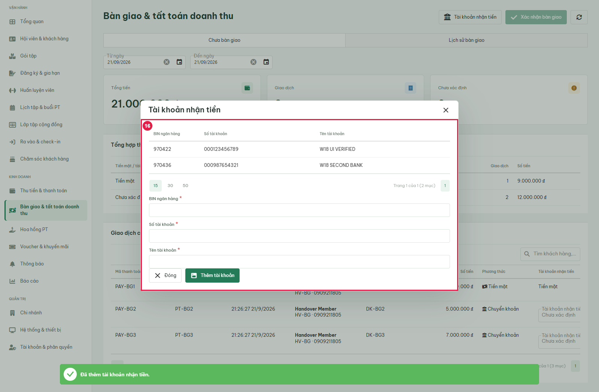

### registry-closed

- Action/Input: Close receiving-account registry
- Expected: No visible popup remains
- Actual: Bàn giao & tất toán doanh thu  Tài khoản nhận tiền Xác nhận bàn giao Chưa bàn giao Lịch sử bàn giao Từ ngày Đến ngày Tổng tiền 21.000.000 ₫ Giao dịch 3 Chưa xác định 2 Tổng hợp theo nơi nhận tiền Tiền mặt / tài khoản / chưa xác định	Giao dịch	Số tiền Tiền mặt	1	9.000.000 ₫ Chưa xác định tài khoản	2	12.000.000 ₫ Giao dịch chưa bàn giao Mã thanh toán	Phiếu thu	Ngày thu	Khách hàng	Hợp đồng	Số tiền	Phương thức	Tài khoản nhận tiền PAY-BG1	PT-BG1	21:26:27 21/9/2026	Handover Member HV-BG · 0909211805 	DK-BG1	9.000.000 ₫	 Tiền mặt	Tiền mặt PAY-BG2	PT-BG2	21:26:27 21/9/2026	Handover Member HV-BG · 0909211805 	DK-BG2	5.000.000 ₫	 Chuyển khoản	 Tài khoản nhận tiền  PAY-BG3	PT-BG3	21:26:27 21/9/2026	Handover Member HV-BG · 0909211805 	DK-BG3	7.000.000 ₫	 Chuyển khoản	 Tài khoản nhận tiền 153050 Trang 1 của 1 (3 mục)1
- Status: PASS

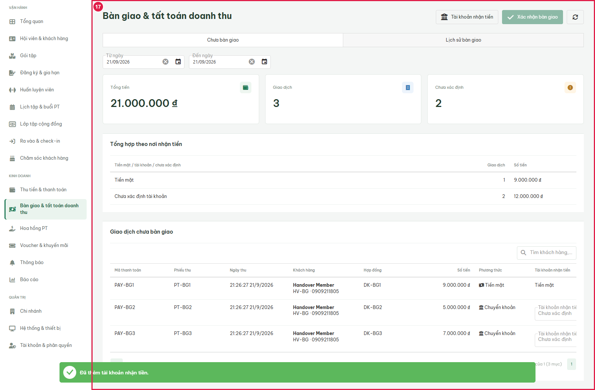

### bank-options-0

- Action/Input: Open receiving-account dropdown
- Expected: User contract: only real API registry options
- Actual: 970422 · 000123456789 · W18 UI VERIFIED
- Status: PASS

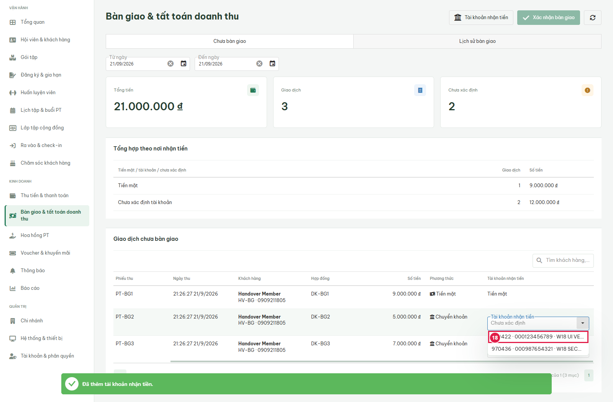

### allocate-bank-0

- Action/Input: Select verified bank account
- Expected: User contract: re-preview after allocation; updated group from API
- Actual: Bàn giao & tất toán doanh thu  Tài khoản nhận tiền Xác nhận bàn giao Chưa bàn giao Lịch sử bàn giao Từ ngày Đến ngày Tổng tiền 21.000.000 ₫ Giao dịch 3 Chưa xác định 1 Tổng hợp theo nơi nhận tiền Tiền mặt / tài khoản / chưa xác định	Giao dịch	Số tiền Tiền mặt	1	9.000.000 ₫ 970422 · 000123456789 · W18 UI VERIFIED	1	5.000.000 ₫ Chưa xác định tài khoản	1	7.000.000 ₫ Giao dịch chưa bàn giao Mã thanh toán	Phiếu thu	Ngày thu	Khách hàng	Hợp đồng	Số tiền	Phương thức	Tài khoản nhận tiền PAY-BG1	PT-BG1	21:26:27 21/9/2026	Handover Member HV-BG · 0909211805 	DK-BG1	9.000.000 ₫	 Tiền mặt	Tiền mặt PAY-BG2	PT-BG2	21:26:27 21/9/2026	Handover Member HV-BG · 0909211805 	DK-BG2	5.000.000 ₫	 Chuyển khoản	 Tài khoản nhận tiền  PAY-BG3	PT-BG3	21:26:27 21/9/2026	Handover Member HV-BG · 0909211805 	DK-BG3	7.000.000 ₫	 Chuyển khoản	 Tài khoản nhận tiền 153050 Trang 1 của 1 (3 mục)1
- Status: PASS

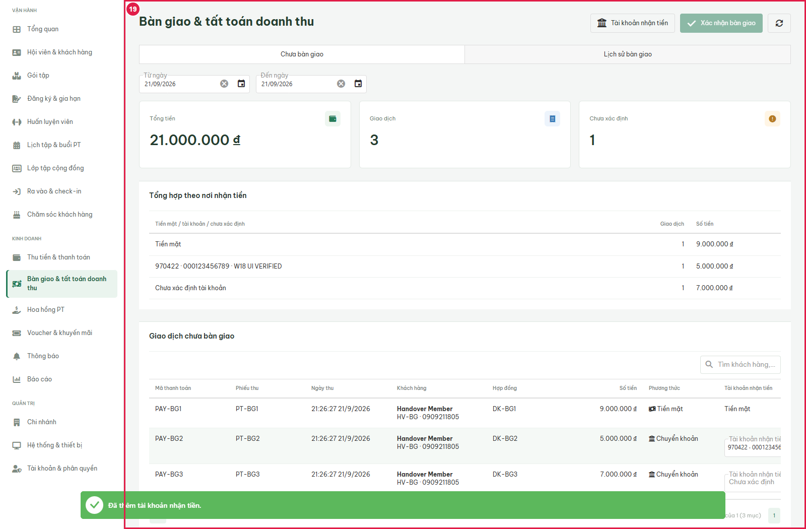

### bank-options-1

- Action/Input: Open receiving-account dropdown
- Expected: User contract: only real API registry options
- Actual: 970436 · 000987654321 · W18 SECOND BANK
- Status: PASS

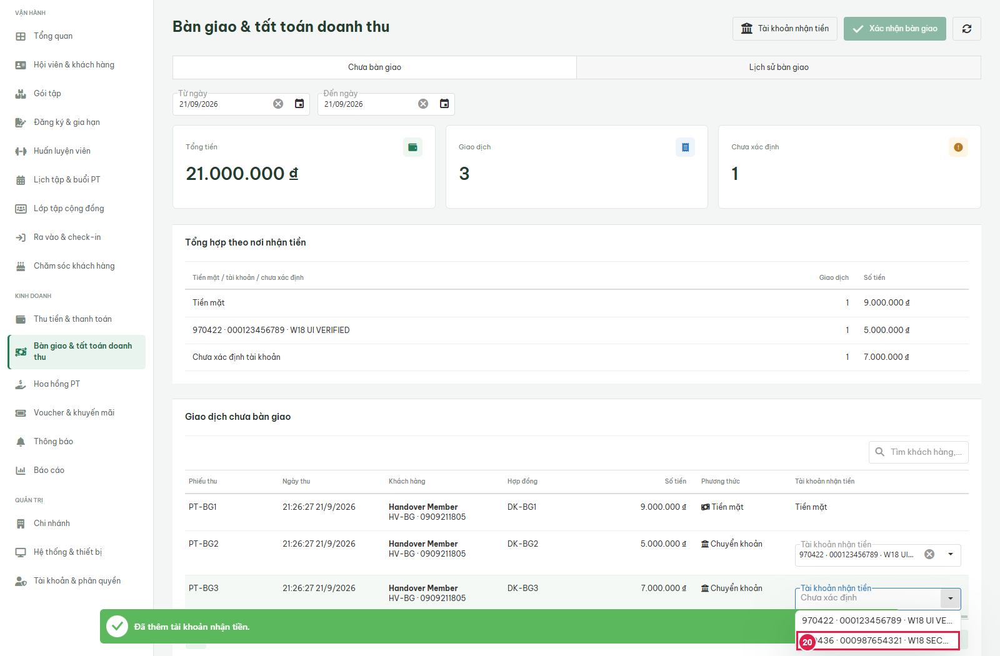

### allocate-bank-1

- Action/Input: Select verified bank account
- Expected: User contract: re-preview after allocation; updated group from API
- Actual: Bàn giao & tất toán doanh thu  Tài khoản nhận tiền Xác nhận bàn giao Chưa bàn giao Lịch sử bàn giao Từ ngày Đến ngày Tổng tiền 21.000.000 ₫ Giao dịch 3 Chưa xác định 0 Tổng hợp theo nơi nhận tiền Tiền mặt / tài khoản / chưa xác định	Giao dịch	Số tiền Tiền mặt	1	9.000.000 ₫ 970422 · 000123456789 · W18 UI VERIFIED	1	5.000.000 ₫ 970436 · 000987654321 · W18 SECOND BANK	1	7.000.000 ₫ Giao dịch chưa bàn giao Mã thanh toán	Phiếu thu	Ngày thu	Khách hàng	Hợp đồng	Số tiền	Phương thức	Tài khoản nhận tiền PAY-BG1	PT-BG1	21:26:27 21/9/2026	Handover Member HV-BG · 0909211805 	DK-BG1	9.000.000 ₫	 Tiền mặt	Tiền mặt PAY-BG2	PT-BG2	21:26:27 21/9/2026	Handover Member HV-BG · 0909211805 	DK-BG2	5.000.000 ₫	 Chuyển khoản	 Tài khoản nhận tiền  PAY-BG3	PT-BG3	21:26:27 21/9/2026	Handover Member HV-BG · 0909211805 	DK-BG3	7.000.000 ₫	 Chuyển khoản	 Tài khoản nhận tiền 153050 Trang 1 của 1 (3 mục)1
- Status: PASS

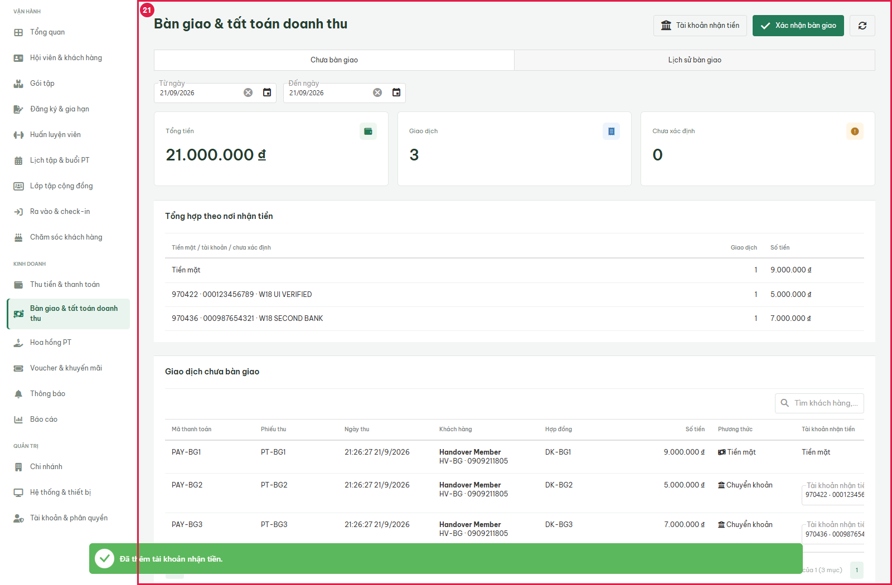

## State Verification

### three-source-groups

- Action/Input: Inspect re-preview summary
- Expected: User contract: CASH 9m, bank A 5m, bank B 7m
- Actual: ["Tiền mặt19.000.000 ₫","970422 · 000123456789 · W18 UI VERIFIED15.000.000 ₫","970436 · 000987654321 · W18 SECOND BANK17.000.000 ₫"]
- Status: PASS

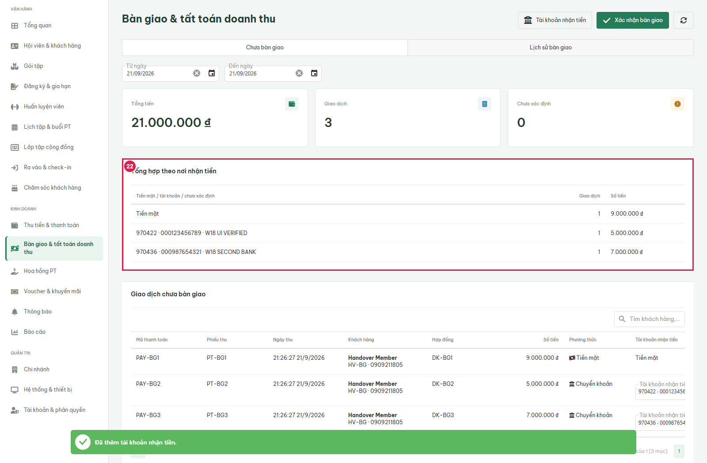

## Cross-Role / Downstream Verification

Cross-role verification for this same handover is recorded in [US03](../QTV-W18-US03/QTV-W18-US03-test.md): authenticated LT has no W18, retains the same receipts; QTV branch B is isolated; ALL history is visible.

## Issues Found

No assertion failures in executed scope.

## Final Result

PASS for executed scope; see results.json for migration/source manifests and network destinations.

Evidence: [results.json](2026-09-21T14-26-27-424Z/results.json).
