# QTV-W18-US02 - Real isolated UI verification

Database: paradise_handover_test_15064_1790000786085. Run: 2026-09-21T14-26-27-424Z.

Sources: QTV-W18 Epic BR01-BR10, US01/US02/US03 and explicit user API/UI contract. Main owns docs; per-row account selection follows the explicit contract.

Related reports: [US01](../QTV-W18-US01/QTV-W18-US01-test.md), [US02](../QTV-W18-US02/QTV-W18-US02-test.md), [US03](../QTV-W18-US03/QTV-W18-US03-test.md).

## Source Action Verification

### confirm-single-popup

- Action/Input: Double-click confirm handover
- Expected: BR08: one confirmation popup, unchecked acknowledgement, disabled submit
- Actual: Tổng tiền 21.000.000 ₫ Giao dịch 3 Chưa xác định 0 Tổng hợp theo nơi nhận tiền Tiền mặt / tài khoản / chưa xác định	Giao dịch	Số tiền Tiền mặt	1	9.000.000 ₫ 970422 · 000123456789 · W18 UI VERIFIED	1	5.000.000 ₫ 970436 · 000987654321 · W18 SECOND BANK	1	7.000.000 ₫ Ghi chú Xác nhận đã bàn giao đầy đủ Hủy Xác nhận bàn giao
- Status: PASS

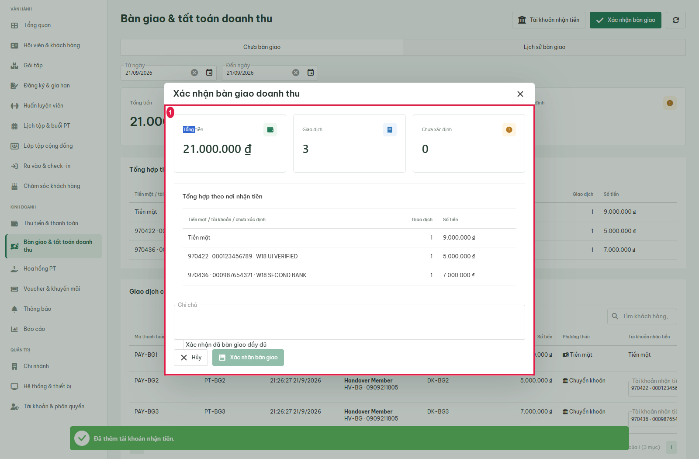

### note-boundary

- Action/Input: Enter 1000-character note
- Expected: User correction: maxLength=1000, content retained before submit
- Actual: 1000 characters visible in textarea; maxlength=1000
- Status: PASS

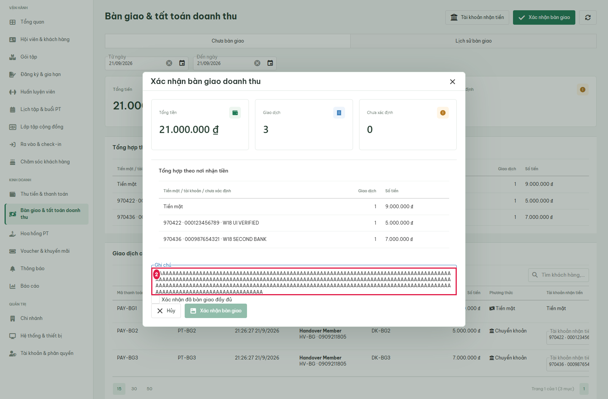

### acknowledgement

- Action/Input: Check Xác nhận đã bàn giao đầy đủ
- Expected: BR08: explicit acknowledgement enables confirm
- Actual: Tổng tiền 21.000.000 ₫ Giao dịch 3 Chưa xác định 0 Tổng hợp theo nơi nhận tiền Tiền mặt / tài khoản / chưa xác định	Giao dịch	Số tiền Tiền mặt	1	9.000.000 ₫ 970422 · 000123456789 · W18 UI VERIFIED	1	5.000.000 ₫ 970436 · 000987654321 · W18 SECOND BANK	1	7.000.000 ₫ Ghi chú Xác nhận đã bàn giao đầy đủ Hủy Xác nhận bàn giao
- Status: PASS

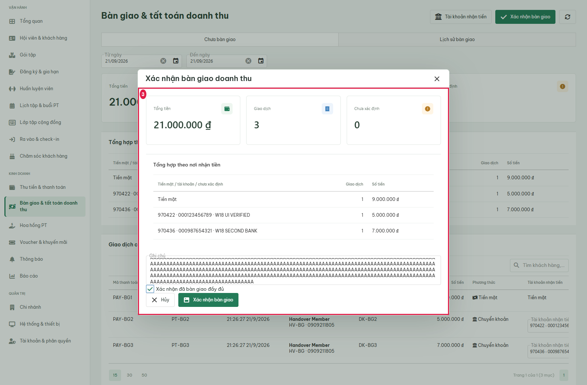

### stale-preview-refresh

- Action/Input: Submit stale preview after a concurrent late payment
- Expected: BR07: 409, refresh preview, no automatic confirm retry, unresolved assignment requires review
- Actual: Bàn giao & tất toán doanh thu  Tài khoản nhận tiền Xác nhận bàn giao Chưa bàn giao Lịch sử bàn giao Từ ngày Đến ngày Tổng tiền 21.000.100 ₫ Giao dịch 4 Chưa xác định 2 Tổng hợp theo nơi nhận tiền Tiền mặt / tài khoản / chưa xác định	Giao dịch	Số tiền Tiền mặt	2	9.000.100 ₫ Chưa xác định tài khoản	2	12.000.000 ₫ Giao dịch chưa bàn giao Mã thanh toán	Phiếu thu	Ngày thu	Khách hàng	Hợp đồng	Số tiền	Phương thức	Tài khoản nhận tiền PAY-BG1	PT-BG1	21:26:27 21/9/2026	Handover Member HV-BG · 0909211805 	DK-BG1	9.000.000 ₫	 Tiền mặt	Tiền mặt PAY-BG2	PT-BG2	21:26:27 21/9/2026	Handover Member HV-BG · 0909211805 	DK-BG2	5.000.000 ₫	 Chuyển khoản	 Tài khoản nhận tiền  PAY-BG3	PT-BG3	21:26:27 21/9/2026	Handover Member HV-BG · 0909211805 	DK-BG3	7.000.000 ₫	 Chuyển khoản	 Tài khoản nhận tiền  PAY-BG5	PT-BG5	21:26:44 21/9/2026	Handover Member HV-BG · 0909211805 	DK-BG5	100 ₫	 Tiền mặt	Tiền mặt 153050 Trang 1 của 1 (4 mục)1
- Status: PASS

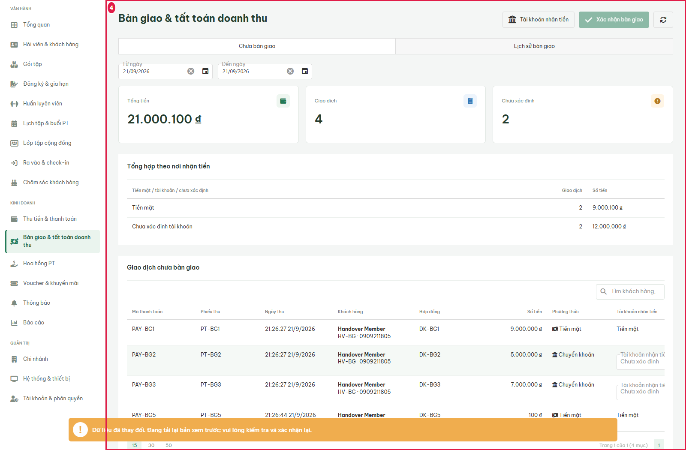

### bank-options-0

- Action/Input: Open receiving-account dropdown
- Expected: User contract: only real API registry options
- Actual: 970422 · 000123456789 · W18 UI VERIFIED
- Status: PASS

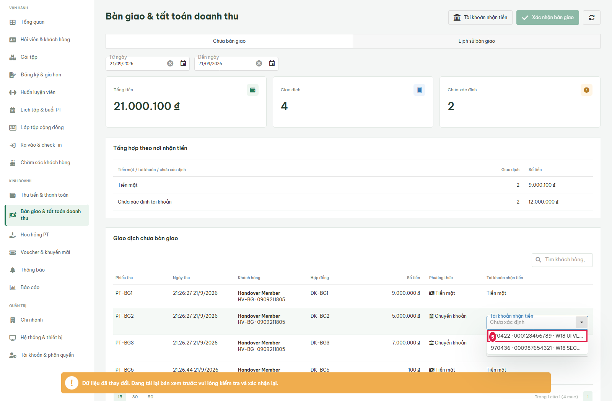

### allocate-bank-0

- Action/Input: Select verified bank account
- Expected: User contract: re-preview after allocation; updated group from API
- Actual: Bàn giao & tất toán doanh thu  Tài khoản nhận tiền Xác nhận bàn giao Chưa bàn giao Lịch sử bàn giao Từ ngày Đến ngày Tổng tiền 21.000.100 ₫ Giao dịch 4 Chưa xác định 1 Tổng hợp theo nơi nhận tiền Tiền mặt / tài khoản / chưa xác định	Giao dịch	Số tiền Tiền mặt	2	9.000.100 ₫ 970422 · 000123456789 · W18 UI VERIFIED	1	5.000.000 ₫ Chưa xác định tài khoản	1	7.000.000 ₫ Giao dịch chưa bàn giao Mã thanh toán	Phiếu thu	Ngày thu	Khách hàng	Hợp đồng	Số tiền	Phương thức	Tài khoản nhận tiền PAY-BG1	PT-BG1	21:26:27 21/9/2026	Handover Member HV-BG · 0909211805 	DK-BG1	9.000.000 ₫	 Tiền mặt	Tiền mặt PAY-BG2	PT-BG2	21:26:27 21/9/2026	Handover Member HV-BG · 0909211805 	DK-BG2	5.000.000 ₫	 Chuyển khoản	 Tài khoản nhận tiền  PAY-BG3	PT-BG3	21:26:27 21/9/2026	Handover Member HV-BG · 0909211805 	DK-BG3	7.000.000 ₫	 Chuyển khoản	 Tài khoản nhận tiền  PAY-BG5	PT-BG5	21:26:44 21/9/2026	Handover Member HV-BG · 0909211805 	DK-BG5	100 ₫	 Tiền mặt	Tiền mặt 153050 Trang 1 của 1 (4 mục)1
- Status: PASS

### bank-options-1

- Action/Input: Open receiving-account dropdown
- Expected: User contract: only real API registry options
- Actual: 970436 · 000987654321 · W18 SECOND BANK
- Status: PASS

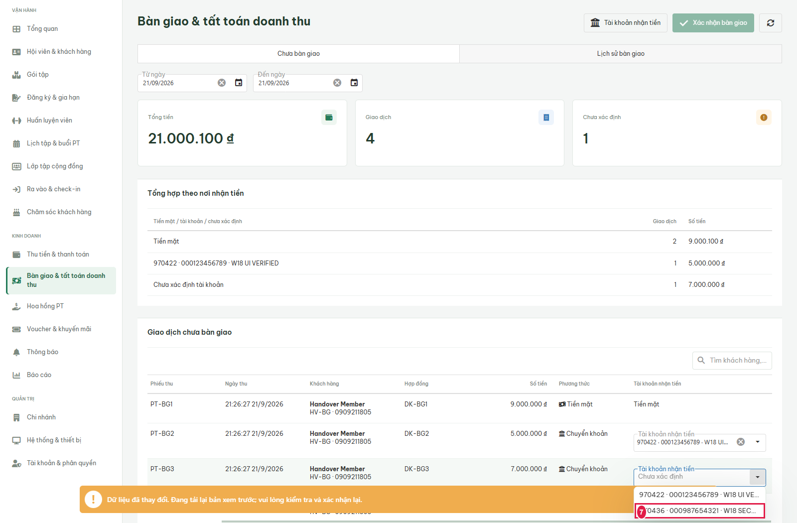

### allocate-bank-1

- Action/Input: Select verified bank account
- Expected: User contract: re-preview after allocation; updated group from API
- Actual: Bàn giao & tất toán doanh thu  Tài khoản nhận tiền Xác nhận bàn giao Chưa bàn giao Lịch sử bàn giao Từ ngày Đến ngày Tổng tiền 21.000.100 ₫ Giao dịch 4 Chưa xác định 0 Tổng hợp theo nơi nhận tiền Tiền mặt / tài khoản / chưa xác định	Giao dịch	Số tiền Tiền mặt	2	9.000.100 ₫ 970422 · 000123456789 · W18 UI VERIFIED	1	5.000.000 ₫ 970436 · 000987654321 · W18 SECOND BANK	1	7.000.000 ₫ Giao dịch chưa bàn giao Mã thanh toán	Phiếu thu	Ngày thu	Khách hàng	Hợp đồng	Số tiền	Phương thức	Tài khoản nhận tiền PAY-BG1	PT-BG1	21:26:27 21/9/2026	Handover Member HV-BG · 0909211805 	DK-BG1	9.000.000 ₫	 Tiền mặt	Tiền mặt PAY-BG2	PT-BG2	21:26:27 21/9/2026	Handover Member HV-BG · 0909211805 	DK-BG2	5.000.000 ₫	 Chuyển khoản	 Tài khoản nhận tiền  PAY-BG3	PT-BG3	21:26:27 21/9/2026	Handover Member HV-BG · 0909211805 	DK-BG3	7.000.000 ₫	 Chuyển khoản	 Tài khoản nhận tiền  PAY-BG5	PT-BG5	21:26:44 21/9/2026	Handover Member HV-BG · 0909211805 	DK-BG5	100 ₫	 Tiền mặt	Tiền mặt 153050 Trang 1 của 1 (4 mục)1
- Status: PASS

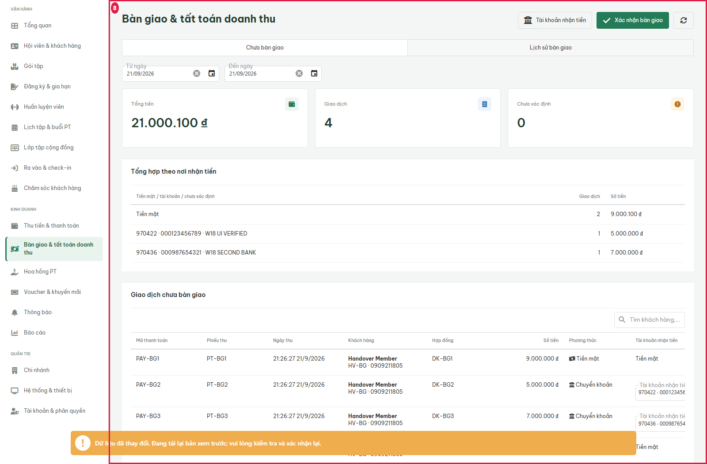

### reopen-confirmation

- Action/Input: Open refreshed confirmation
- Expected: Fresh acknowledgement required after 409
- Actual: Tổng tiền 21.000.100 ₫ Giao dịch 4 Chưa xác định 0 Tổng hợp theo nơi nhận tiền Tiền mặt / tài khoản / chưa xác định	Giao dịch	Số tiền Tiền mặt	2	9.000.100 ₫ 970422 · 000123456789 · W18 UI VERIFIED	1	5.000.000 ₫ 970436 · 000987654321 · W18 SECOND BANK	1	7.000.000 ₫ Ghi chú Xác nhận đã bàn giao đầy đủ Hủy Xác nhận bàn giao
- Status: PASS

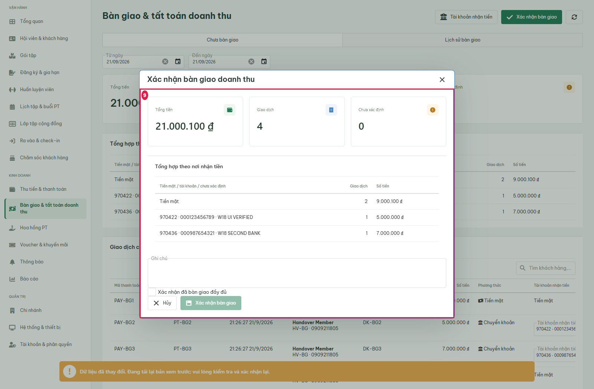

### final-note-input

- Action/Input: Enter final handover note
- Expected: Note visible before submit
- Actual: W18 real isolated UI handover
- Status: PASS

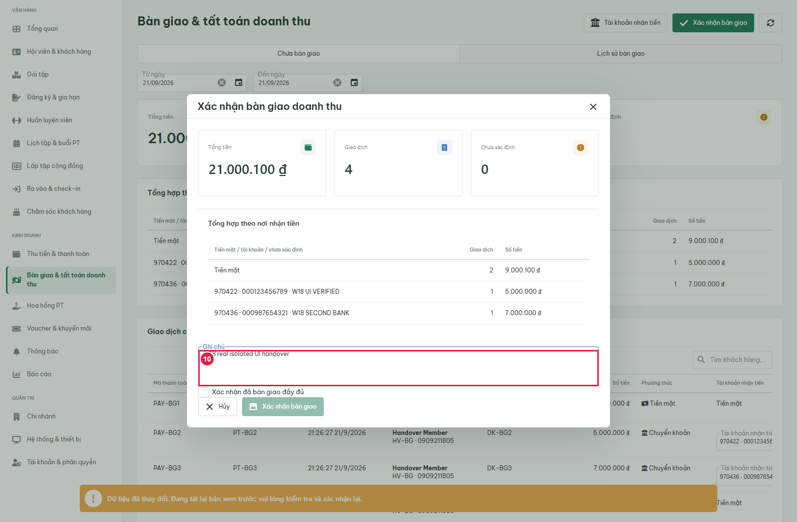

### fresh-acknowledgement

- Action/Input: Acknowledge refreshed totals
- Expected: Confirm enabled for fresh preview
- Actual: Tổng tiền 21.000.100 ₫ Giao dịch 4 Chưa xác định 0 Tổng hợp theo nơi nhận tiền Tiền mặt / tài khoản / chưa xác định	Giao dịch	Số tiền Tiền mặt	2	9.000.100 ₫ 970422 · 000123456789 · W18 UI VERIFIED	1	5.000.000 ₫ 970436 · 000987654321 · W18 SECOND BANK	1	7.000.000 ₫ Ghi chú Xác nhận đã bàn giao đầy đủ Hủy Xác nhận bàn giao
- Status: PASS

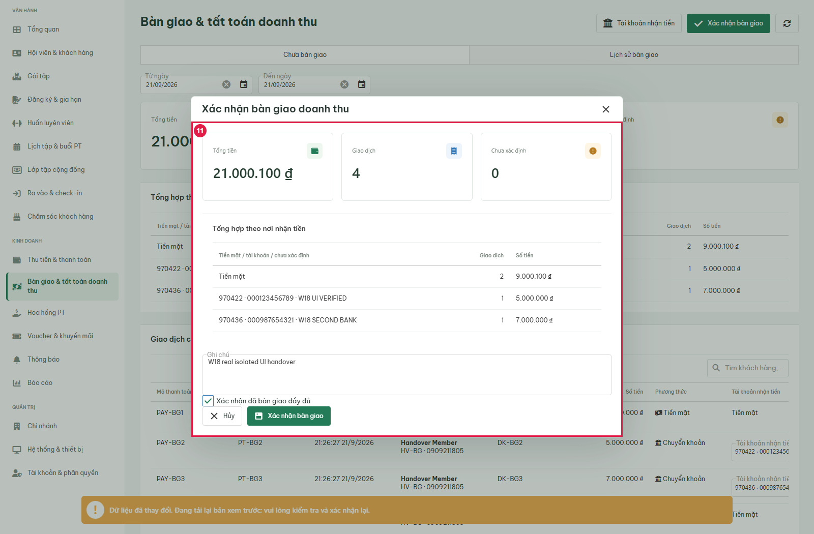

## State Verification

### confirmed-detail

- Action/Input: Confirm refreshed batch
- Expected: BR08-BR09: single read-only detail popup shows API handover_code and snapshot amounts
- Actual: BG001 Chi nhánh Handover Branch A Người xác nhận Handover qtv  21/09/2026 - 21/09/2026 · 21:26:49 21/9/2026  W18 real isolated UI handover  Tổng tiền 21.000.100 ₫ Giao dịch 4 Tổng hợp theo nơi nhận tiền Tiền mặt / tài khoản / chưa xác định	Giao dịch	Số tiền Tiền mặt	2	9.000.100 ₫ 970422 · 000123456789 · W18 UI VERIFIED	1	5.000.000 ₫ 970436 · 000987654321 · W18 SECOND BANK	1	7.000.000 ₫ Chi tiết khách hàng & tài khoản nhận tiền Mã thanh toán	Phiếu thu	Ngày thu	Khách hàng	Hợp đồng	Số tiền	Phương thức	Tài khoản nhận tiền PAY-BG1	PT-BG1	21:26:27 21/9/2026	Handover Member HV-BG · 0909211805 	DK-BG1	9.000.000 ₫	 Tiền mặt	Tiền mặt PAY-BG2	PT-BG2	21:26:27 21/9/2026	Handover Member HV-BG · 0909211805 	DK-BG2	5.000.000 ₫	 Chuyển khoản	970422 · 000123456789 · W18 UI VERIFIED PAY-BG3	PT-BG3	21:26:27 21/9/2026	Handover Member HV-BG · 0909211805 	DK-BG3	7.000.000 ₫	 Chuyển khoản	970436 · 000987654321 · W18 SECOND BANK PAY-BG5	PT-BG5	21:26:44 21/9/2026	Handover Member HV-BG · 0909211805 	DK-BG5	100 ₫	 Tiền mặt	Tiền mặt 153050 Trang 1 của 1 (4 mục)1
- Status: PASS

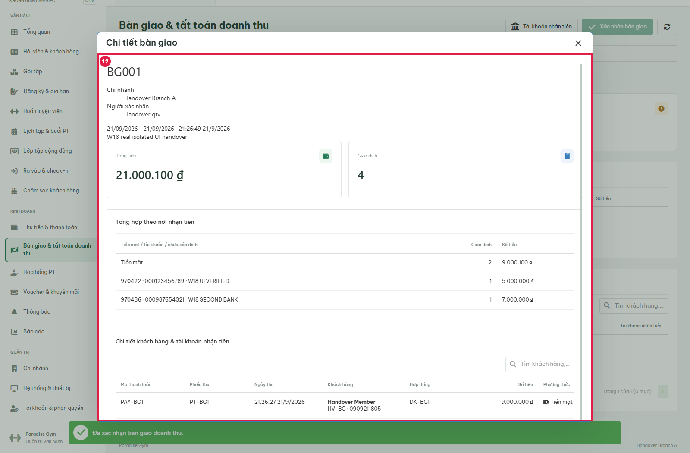

### pending-empty

- Action/Input: Close completed handover detail
- Expected: Confirmed payments removed from pending; empty confirmation disabled
- Actual: Bàn giao & tất toán doanh thu  Tài khoản nhận tiền Xác nhận bàn giao Chưa bàn giao Lịch sử bàn giao Từ ngày Đến ngày Tổng tiền 0 ₫ Giao dịch 0 Chưa xác định 0 Tổng hợp theo nơi nhận tiền Tiền mặt / tài khoản / chưa xác định	Giao dịch	Số tiền 		 Không có dữ liệu phù hợp Giao dịch chưa bàn giao Mã thanh toán	Phiếu thu	Ngày thu	Khách hàng	Hợp đồng	Số tiền	Phương thức	Tài khoản nhận tiền 							 Không có dữ liệu phù hợp 153050 Trang 1 của 1 (0 mục)1
- Status: PASS

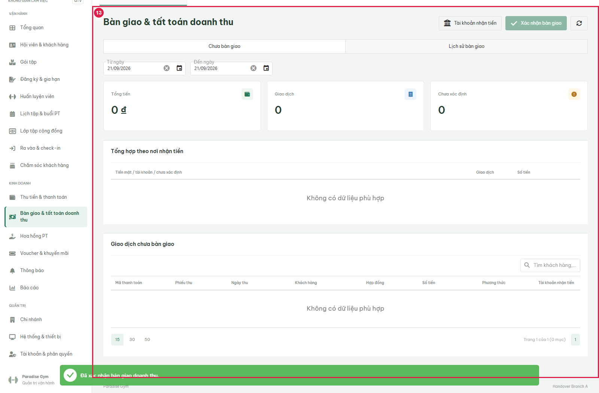

## Cross-Role / Downstream Verification

Cross-role verification for this same handover is recorded in [US03](../QTV-W18-US03/QTV-W18-US03-test.md): authenticated LT has no W18, retains the same receipts; QTV branch B is isolated; ALL history is visible.

## Issues Found

No assertion failures in executed scope.

## Final Result

PASS for executed scope; see results.json for migration/source manifests and network destinations.

Evidence: [results.json](2026-09-21T14-26-27-424Z/results.json).
