# QTV-W18-US03 - Real isolated UI verification

Database: paradise_handover_test_15064_1790000786085. Run: 2026-09-21T14-26-27-424Z.

Sources: QTV-W18 Epic BR01-BR10, US01/US02/US03 and explicit user API/UI contract. Main owns docs; per-row account selection follows the explicit contract.

Related reports: [US01](../QTV-W18-US01/QTV-W18-US01-test.md), [US02](../QTV-W18-US02/QTV-W18-US02-test.md), [US03](../QTV-W18-US03/QTV-W18-US03-test.md).

## Source Action Verification

### history-code

- Action/Input: Open handover history
- Expected: BR09 and user correction: visible handover_code from API
- Actual: Bàn giao & tất toán doanh thu  Tài khoản nhận tiền Chưa bàn giao Lịch sử bàn giao Từ ngày Đến ngày Lịch sử bàn giao Mã bàn giao	Chi nhánh	Từ ngày	Đến ngày	Tổng tiền	Người xác nhận	Ngày bàn giao	Chi tiết BG001	Handover Branch A	21/09/2026	21/09/2026	21.000.100 ₫	Handover qtv	21:26:49 21/9/2026	 153050 Trang 1 của 1 (1 mục)1
- Status: PASS

### history-confirmer

- Action/Input: Inspect confirmer snapshot column
- Expected: User correction: Nguoi xac nhan uses confirmed_by_name
- Actual: Bàn giao & tất toán doanh thu  Tài khoản nhận tiền Chưa bàn giao Lịch sử bàn giao Từ ngày Đến ngày Lịch sử bàn giao Mã bàn giao	Chi nhánh	Từ ngày	Đến ngày	Tổng tiền	Người xác nhận	Ngày bàn giao	Chi tiết BG001	Handover Branch A	21/09/2026	21/09/2026	21.000.100 ₫	Handover qtv	21:26:49 21/9/2026	 153050 Trang 1 của 1 (1 mục)1
- Status: PASS

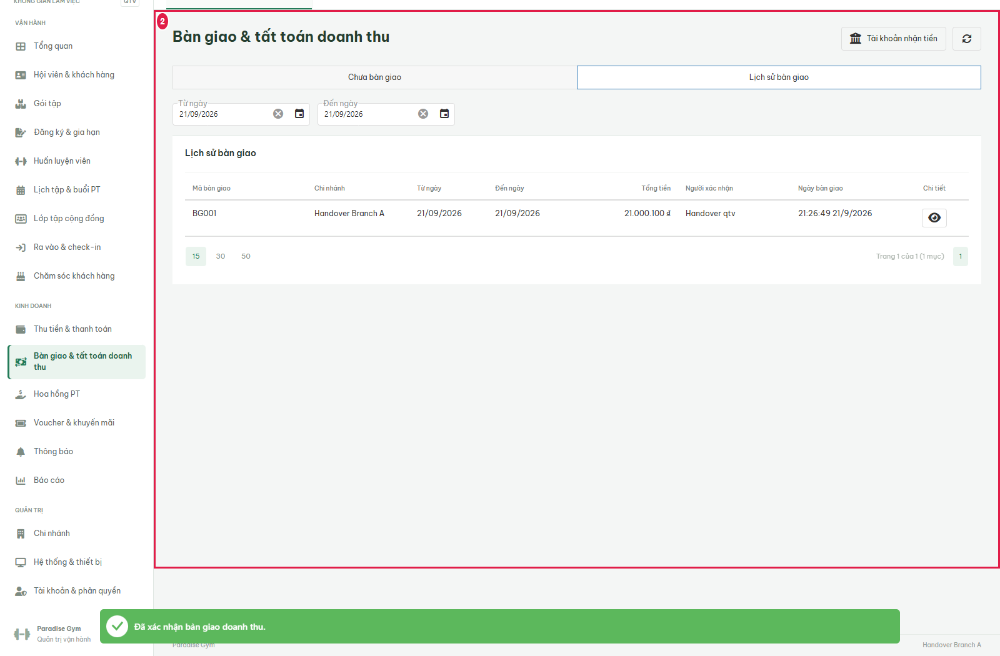

### history-timezone-dateonly

- Action/Input: Inspect history period and timestamp in Los Angeles browser
- Expected: Calendar date is unchanged; confirmation timestamp uses the row snapshot timezone
- Actual: BG001	Handover Branch A	21/09/2026	21/09/2026	21.000.100 ₫	Handover qtv	21:26:49 21/9/2026	
- Status: PASS

## State Verification

### immutable-detail

- Action/Input: Double-click history detail after member-name change
- Expected: BR09: one read-only popup retains snapshotted account/customer/payment values
- Actual: BG001 Chi nhánh Handover Branch A Người xác nhận Handover qtv  21/09/2026 - 21/09/2026 · 21:26:49 21/9/2026  W18 real isolated UI handover  Tổng tiền 21.000.100 ₫ Giao dịch 4 Tổng hợp theo nơi nhận tiền Tiền mặt / tài khoản / chưa xác định	Giao dịch	Số tiền Tiền mặt	2	9.000.100 ₫ 970422 · 000123456789 · W18 UI VERIFIED	1	5.000.000 ₫ 970436 · 000987654321 · W18 SECOND BANK	1	7.000.000 ₫ Chi tiết khách hàng & tài khoản nhận tiền Mã thanh toán	Phiếu thu	Ngày thu	Khách hàng	Hợp đồng	Số tiền	Phương thức	Tài khoản nhận tiền PAY-BG1	PT-BG1	21:26:27 21/9/2026	Handover Member HV-BG · 0909211805 	DK-BG1	9.000.000 ₫	 Tiền mặt	Tiền mặt PAY-BG2	PT-BG2	21:26:27 21/9/2026	Handover Member HV-BG · 0909211805 	DK-BG2	5.000.000 ₫	 Chuyển khoản	970422 · 000123456789 · W18 UI VERIFIED PAY-BG3	PT-BG3	21:26:27 21/9/2026	Handover Member HV-BG · 0909211805 	DK-BG3	7.000.000 ₫	 Chuyển khoản	970436 · 000987654321 · W18 SECOND BANK PAY-BG5	PT-BG5	21:26:44 21/9/2026	Handover Member HV-BG · 0909211805 	DK-BG5	100 ₫	 Tiền mặt	Tiền mặt 153050 Trang 1 của 1 (4 mục)1
- Status: PASS

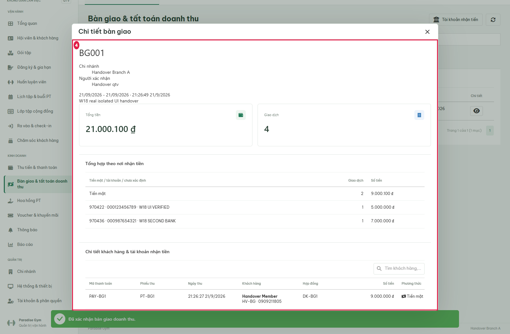

### detail-bank-columns-scrolled

- Action/Input: Scroll detail grid horizontally to receiving-account column
- Expected: Snapshot bank accounts visible in the same customer/payment rows; no loading overlay
- Actual: Chi tiết khách hàng & tài khoản nhận tiền Mã thanh toán	Phiếu thu	Ngày thu	Khách hàng	Hợp đồng	Số tiền	Phương thức	Tài khoản nhận tiền PAY-BG1	PT-BG1	21:26:27 21/9/2026	Handover Member HV-BG · 0909211805 	DK-BG1	9.000.000 ₫	 Tiền mặt	Tiền mặt PAY-BG2	PT-BG2	21:26:27 21/9/2026	Handover Member HV-BG · 0909211805 	DK-BG2	5.000.000 ₫	 Chuyển khoản	970422 · 000123456789 · W18 UI VERIFIED PAY-BG3	PT-BG3	21:26:27 21/9/2026	Handover Member HV-BG · 0909211805 	DK-BG3	7.000.000 ₫	 Chuyển khoản	970436 · 000987654321 · W18 SECOND BANK PAY-BG5	PT-BG5	21:26:44 21/9/2026	Handover Member HV-BG · 0909211805 	DK-BG5	100 ₫	 Tiền mặt	Tiền mặt 153050 Trang 1 của 1 (4 mục)1
- Status: PASS

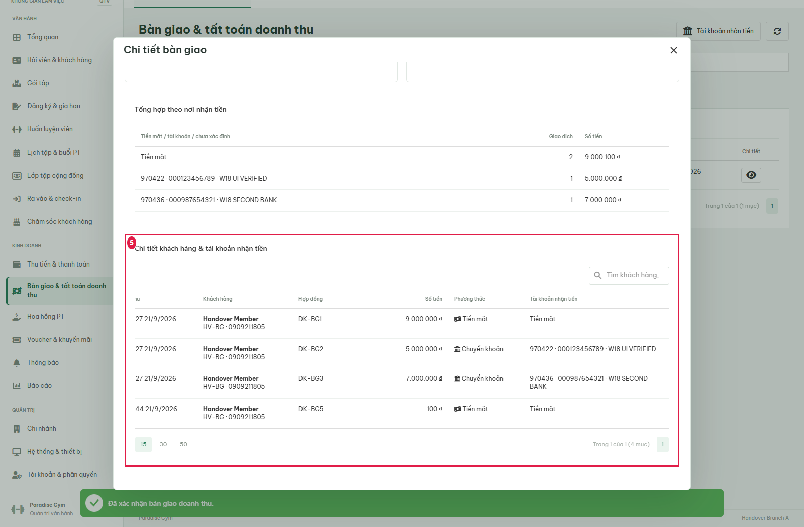

## Cross-Role / Downstream Verification

### lt-no-w18

- Action/Input: Open authenticated receptionist UI
- Expected: BR01: receptionist has no W18 menu/shortcut
- Actual: VẬN HÀNH Tổng quan Hội viên & khách hàng Đăng ký & gia hạn Huấn luyện viên Lịch tập & buổi PT Lớp tập cộng đồng Ra vào & check-in Chăm sóc khách hàng KINH DOANH Thu tiền & thanh toán Thông báo
- Status: PASS

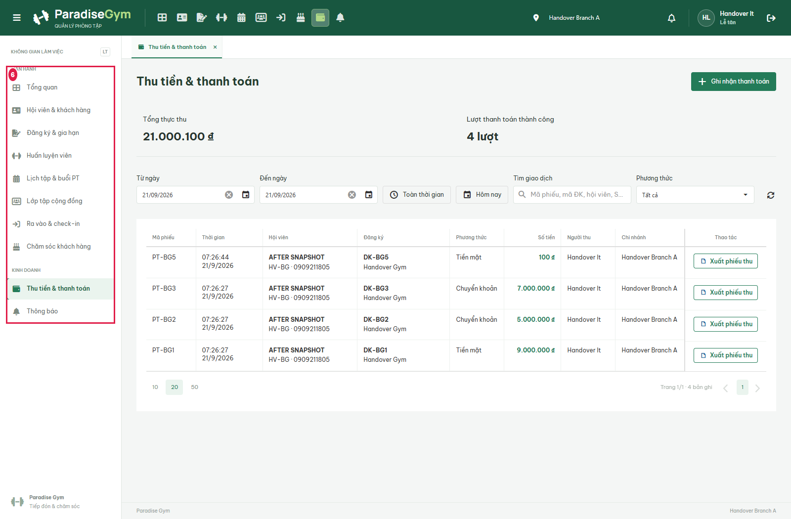

### lt-direct-route-denied

- Action/Input: Receptionist attempts direct W18 navigation
- Expected: BR01: access denied; authenticated payment screen retained
- Actual: Thu tiền & thanh toán Ghi nhận thanh toán Tổng thực thu 21.000.100 ₫ Lượt thanh toán thành công 4 lượt Từ ngày Đến ngày Toàn thời gian Hôm nay Tìm giao dịch Phương thức Thao tác Mã phiếu	 Thời gian	 Hội viên	 Đăng ký	Phương thức	 Số tiền	 Người thu	 Chi nhánh	 PT-BG5	07:26:44 21/9/2026	AFTER SNAPSHOT HV-BG · 0909211805 	DK-BG5 Handover Gym 	Tiền mặt	100 ₫	Handover lt	Handover Branch A	 PT-BG3	07:26:27 21/9/2026	AFTER SNAPSHOT HV-BG · 0909211805 	DK-BG3 Handover Gym 	Chuyển khoản	7.000.000 ₫	Handover lt	Handover Branch A	 PT-BG2	07:26:27 21/9/2026	AFTER SNAPSHOT HV-BG · 0909211805 	DK-BG2 Handover Gym 	Chuyển khoản	5.000.000 ₫	Handover lt	Handover Branch A	 PT-BG1	07:26:27 21/9/2026	AFTER SNAPSHOT HV-BG · 0909211805 	DK-BG1 Handover Gym 	Tiền mặt	9.000.000 ₫	Handover lt	Handover Branch A	 Xuất phiếu thu   Xuất phiếu thu   Xuất phiếu thu   Xuất phiếu thu 102050 Trang 1/1 · 4 bản ghi1
- Status: PASS

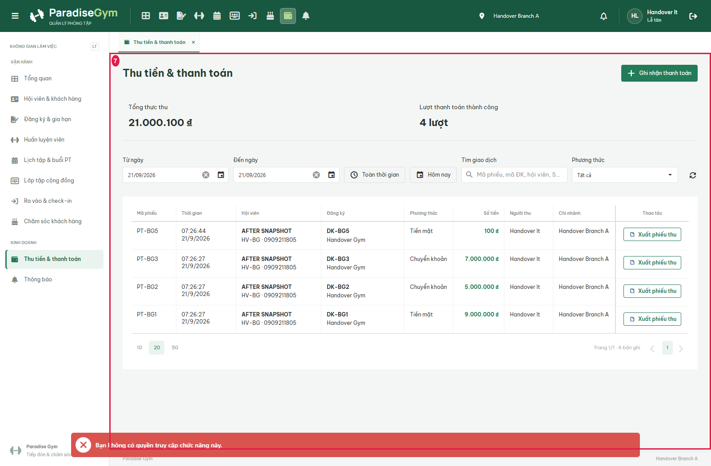

### lt-payment-history-preserved

- Action/Input: Inspect same payments after handover
- Expected: BR10: original payment history remains visible to LT
- Actual: Thu tiền & thanh toán Ghi nhận thanh toán Tổng thực thu 21.000.100 ₫ Lượt thanh toán thành công 4 lượt Từ ngày Đến ngày Toàn thời gian Hôm nay Tìm giao dịch Phương thức Thao tác Mã phiếu	 Thời gian	 Hội viên	 Đăng ký	Phương thức	 Số tiền	 Người thu	 Chi nhánh	 PT-BG5	07:26:44 21/9/2026	AFTER SNAPSHOT HV-BG · 0909211805 	DK-BG5 Handover Gym 	Tiền mặt	100 ₫	Handover lt	Handover Branch A	 PT-BG3	07:26:27 21/9/2026	AFTER SNAPSHOT HV-BG · 0909211805 	DK-BG3 Handover Gym 	Chuyển khoản	7.000.000 ₫	Handover lt	Handover Branch A	 PT-BG2	07:26:27 21/9/2026	AFTER SNAPSHOT HV-BG · 0909211805 	DK-BG2 Handover Gym 	Chuyển khoản	5.000.000 ₫	Handover lt	Handover Branch A	 PT-BG1	07:26:27 21/9/2026	AFTER SNAPSHOT HV-BG · 0909211805 	DK-BG1 Handover Gym 	Tiền mặt	9.000.000 ₫	Handover lt	Handover Branch A	 Xuất phiếu thu   Xuất phiếu thu   Xuất phiếu thu   Xuất phiếu thu 102050 Trang 1/1 · 4 bản ghi1
- Status: PASS

### qtv-branch-b-pending

- Action/Input: Open QTV branch B
- Expected: BR01: branch B contains none of branch A payments
- Actual: Bàn giao & tất toán doanh thu  Tài khoản nhận tiền Xác nhận bàn giao Chưa bàn giao Lịch sử bàn giao Từ ngày Đến ngày Tổng tiền 1.000.000 ₫ Giao dịch 1 Chưa xác định 0 Tổng hợp theo nơi nhận tiền Tiền mặt / tài khoản / chưa xác định	Giao dịch	Số tiền Tiền mặt	1	1.000.000 ₫ Giao dịch chưa bàn giao Mã thanh toán	Phiếu thu	Ngày thu	Khách hàng	Hợp đồng	Số tiền	Phương thức	Tài khoản nhận tiền PAY-BG4	PT-BG4	21:26:27 21/9/2026	AFTER SNAPSHOT HV-BG · 0909211805 	DK-BG4	1.000.000 ₫	 Tiền mặt	Tiền mặt 153050 Trang 1 của 1 (1 mục)1
- Status: PASS

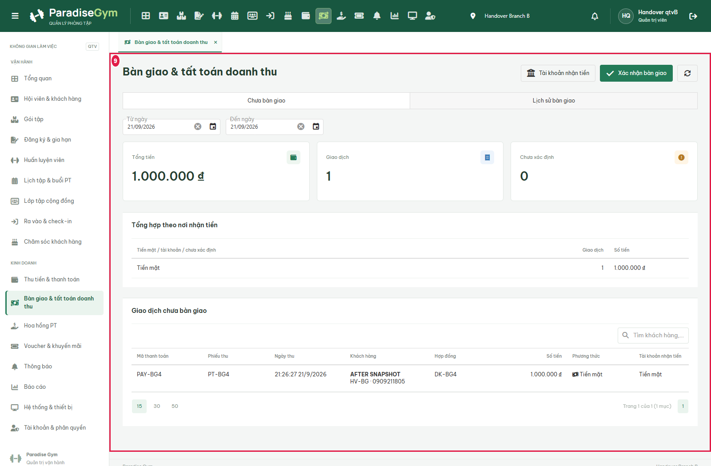

### qtv-branch-b-history

- Action/Input: Open branch B history
- Expected: BR01: branch A batch is absent
- Actual: Bàn giao & tất toán doanh thu  Tài khoản nhận tiền Chưa bàn giao Lịch sử bàn giao Từ ngày Đến ngày Lịch sử bàn giao Mã bàn giao	Chi nhánh	Từ ngày	Đến ngày	Tổng tiền	Người xác nhận	Ngày bàn giao	Chi tiết 							 Không có dữ liệu phù hợp 153050 Trang 1 của 1 (0 mục)1
- Status: PASS

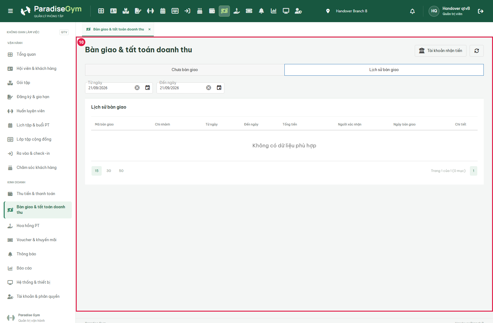

### all-preview-blocked

- Action/Input: Open QTV ALL scope
- Expected: BR01: no preview/create in ALL
- Actual: Bàn giao & tất toán doanh thu  Tài khoản nhận tiền Xác nhận bàn giao Chưa bàn giao Lịch sử bàn giao Từ ngày Đến ngày  Chọn một chi nhánh để xem giao dịch chưa bàn giao.
- Status: PASS

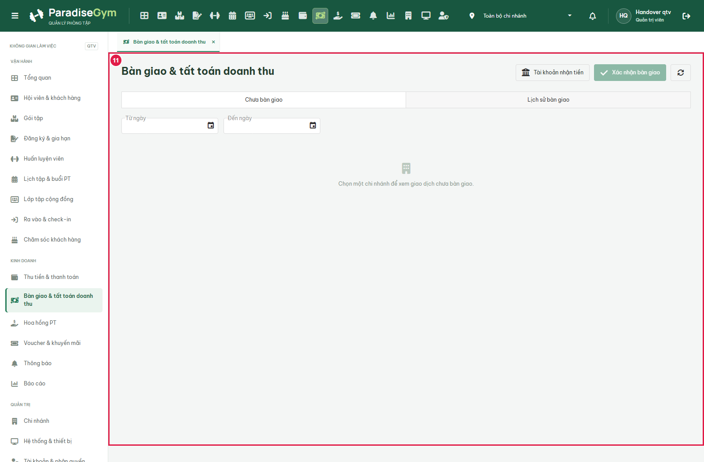

### all-empty-calendar-filters

- Action/Input: Inspect ALL default filters
- Expected: No guessed timezone at ALL; both calendar filters empty
- Actual: Both date filters empty
- Status: PASS

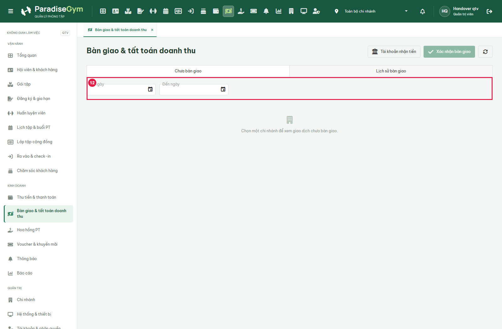

### all-history-visible

- Action/Input: Open ALL history
- Expected: BR01: lists allowed in ALL; branch A batch visible
- Actual: Bàn giao & tất toán doanh thu  Tài khoản nhận tiền Chưa bàn giao Lịch sử bàn giao Từ ngày Đến ngày Lịch sử bàn giao Mã bàn giao	Chi nhánh	Từ ngày	Đến ngày	Tổng tiền	Người xác nhận	Ngày bàn giao	Chi tiết BG001	Handover Branch A	21/09/2026	21/09/2026	21.000.100 ₫	Handover qtv	21:26:49 21/9/2026	 153050 Trang 1 của 1 (1 mục)1
- Status: PASS

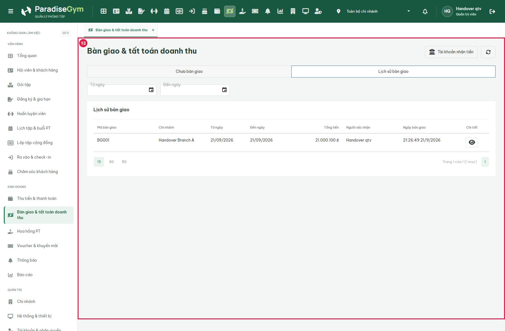

### all-detail-snapshot-timezone

- Action/Input: Open branch A batch detail from ALL in Los Angeles browser
- Expected: Detail uses batch.timezone despite no selected branch timezone; date-only period stays unchanged
- Actual: BG001 Chi nhánh Handover Branch A Người xác nhận Handover qtv  21/09/2026 - 21/09/2026 · 21:26:49 21/9/2026  W18 real isolated UI handover  Tổng tiền 21.000.100 ₫ Giao dịch 4 Tổng hợp theo nơi nhận tiền Tiền mặt / tài khoản / chưa xác định	Giao dịch	Số tiền Tiền mặt	2	9.000.100 ₫ 970422 · 000123456789 · W18 UI VERIFIED	1	5.000.000 ₫ 970436 · 000987654321 · W18 SECOND BANK	1	7.000.000 ₫ Chi tiết khách hàng & tài khoản nhận tiền Mã thanh toán	Phiếu thu	Ngày thu	Khách hàng	Hợp đồng	Số tiền	Phương thức	Tài khoản nhận tiền PAY-BG1	PT-BG1	21:26:27 21/9/2026	Handover Member HV-BG · 0909211805 	DK-BG1	9.000.000 ₫	 Tiền mặt	Tiền mặt PAY-BG2	PT-BG2	21:26:27 21/9/2026	Handover Member HV-BG · 0909211805 	DK-BG2	5.000.000 ₫	 Chuyển khoản	970422 · 000123456789 · W18 UI VERIFIED PAY-BG3	PT-BG3	21:26:27 21/9/2026	Handover Member HV-BG · 0909211805 	DK-BG3	7.000.000 ₫	 Chuyển khoản	970436 · 000987654321 · W18 SECOND BANK PAY-BG5	PT-BG5	21:26:44 21/9/2026	Handover Member HV-BG · 0909211805 	DK-BG5	100 ₫	 Tiền mặt	Tiền mặt 153050 Trang 1 của 1 (4 mục)1
- Status: PASS

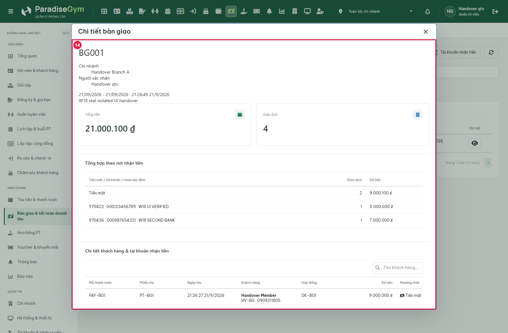

## Issues Found

No assertion failures in executed scope.

## Final Result

PASS for executed scope; see results.json for migration/source manifests and network destinations.

Evidence: [results.json](2026-09-21T14-26-27-424Z/results.json).
